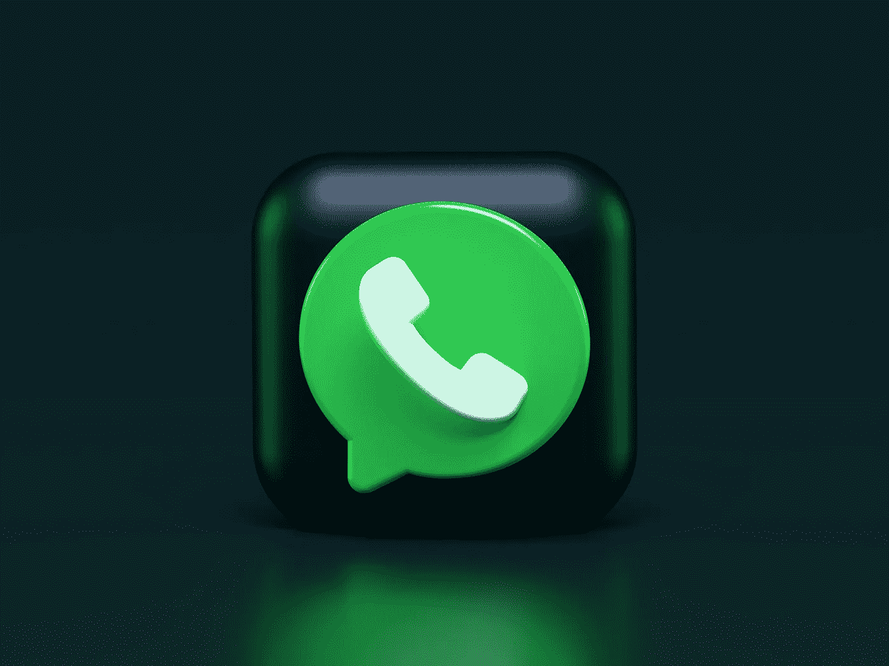
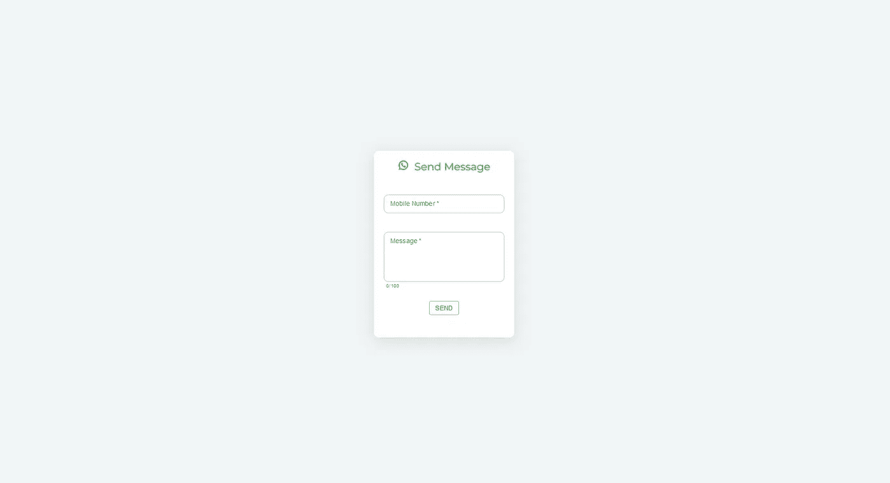
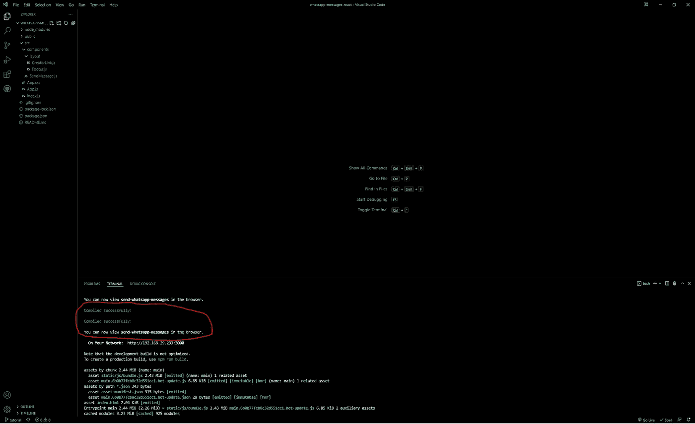
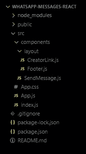
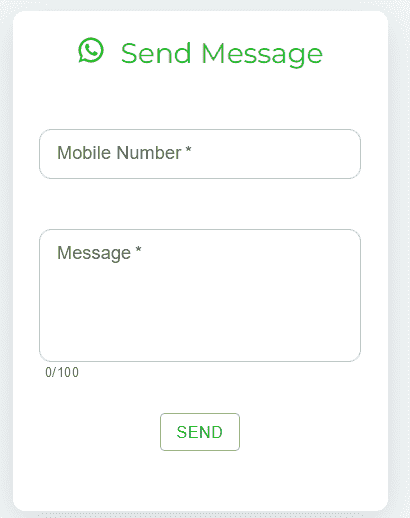

# 如何从 React 应用程序轻松发送 WhatsApp 消息

> 原文：<https://javascript.plainenglish.io/send-whatsapp-web-messages-in-react-easily-3bf2a82a2eb2?source=collection_archive---------0----------------------->

## React 中在 WhatsApp web 上发送消息的一个非常简单的方法。

Photo by [Alexander Shatov](https://unsplash.com/@alexbemore?utm_source=unsplash&utm_medium=referral&utm_content=creditCopyText) on [Unsplash](https://unsplash.com/s/photos/messages?utm_source=unsplash&utm_medium=referral&utm_content=creditCopyText)

# 简介:

想知道如何在不使用 Whatsapp API 的情况下从 React 应用程序发送 WhatsApp 消息吗？

在这篇文章中，我们将探索一种非常简单的在 WhatsApp web 上用 React 发送消息的方法。

*发送 WhatsApp 消息的应用:*

1.  与客户沟通。
2.  自动短信。

*要求:初级*

1.  JavaScript 基础知识
2.  Node.js 基础知识

查看应用程序:

 [## 发送 Whatsapp 消息

### 从 React 向 Whatsapp 发送消息的简单网络应用

whatsapp-react-messages.herokuapp.com](https://whatsapp-react-messages.herokuapp.com/) 

手续办完了，我们开始吧！

## 启动程序:

克隆这个 [***repo***](https://github.com/aunshx/whatsapp-messages-react.git) 得到基本代码。克隆后，在终端中使用`npm i`命令安装所需的依赖项。

克隆安装后，使用`npm run start` 启动 app。

这是你打开 *localhost:3000 后看到的。*

*注意:项目的设计、验证和样式已经完成，因为本文的重点只是学习如何发送消息。*

## 相互了解:

以下是运行 React 脚本后屏幕的外观。

这些文件如下:

1.  *index.js:* 用于将“ *App* 组件加载到*index.html*文件中 id 为*‘root’*的 HTML 元素中。
2.  *app . CSS:*app 的样式表。
3.  *app . js:*React 中的主容器组件。
4.  *组件*文件夹:包含用户将与之交互的所有组件的文件夹。
5.  ***sendmessage . js****:****我们将要与之交互的主文件。***
6.  **布局*文件夹:创建者凭证和页脚(无需更改)。*

**

*Folder Structure*

**SendMessage.js* 组件的详细信息:*

*通过 WhatsApp web 发送消息的 API 如下:*

*"*https://web.whatsapp.com/send?phone=****编号*** *&正文=* ***消息****&app _ absent = 0*"*

*因此，我们使用文本字段来捕获数字和消息，我们将把它们附加到 URL 上。输入手机号码时，请务必输入国家代码。*

**

*点击'*发送'*按钮，我们调用' *onSubmit'* 功能，该功能验证消息长度和手机号码长度是否大于 1，以便不发送空文本。*

*如果一切正常，那么我们调用带有 URL 的 *window.open()* 方法，在一个新标签中打开 Whatsapp，这将打开我们输入的号码所属的人的聊天。*

## *正在生成 URL:*

*在 *onSubmit* 函数的 *else* 部分，我们将使用 regex 删除号码中所有非字母数字的字符，然后将手机号码附加到 URL 上。*

*类似地，在对消息进行编码后，将其附加到 URL。*

*最后，浏览器中会打开一个新标签页，该标签页会重定向到 WhatsApp web 并打开该人的聊天记录，其中包含输入的电话号码和要发送的消息。*

*就是这样！*

## *结论:*

*在本文中，我们看到了如何从 React 应用程序向 Whatsapp 发送消息*

*链接到一个工作示例:*

 *[## 发送 Whatsapp 消息

### 从 React 向 Whatsapp 发送消息的简单网络应用

whatsapp-react-messages.herokuapp.com](https://whatsapp-react-messages.herokuapp.com/)* 

*干杯！*

**更多内容请看**[***说白了。报名参加我们的***](https://plainenglish.io/) **[***免费周报***](http://newsletter.plainenglish.io/) *。关注我们关于*[***Twitter***](https://twitter.com/inPlainEngHQ)*和*[***LinkedIn***](https://www.linkedin.com/company/inplainenglish/)*。加入我们的* [***社区不和谐***](https://discord.gg/GtDtUAvyhW) *。*****