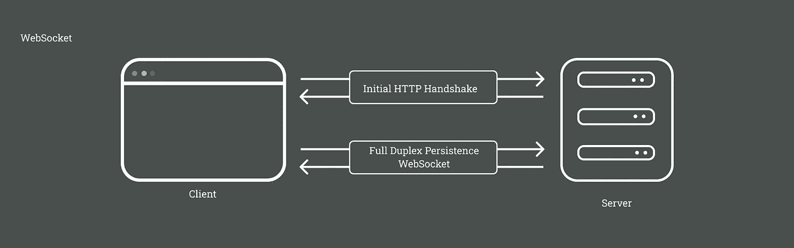

# 引入服务器发送事件(SSE):一个开放的、轻量级的、无连接的推送

> 原文：<https://javascript.plainenglish.io/server-sent-event-sse-an-open-lightweight-connection-less-push-b5407cce71e2?source=collection_archive---------14----------------------->

## 了解什么是服务器发送的事件，它们的工作原理、特性和局限性。

Photo by [Prateek Katyal](https://unsplash.com/@prateekkatyal?utm_source=medium&utm_medium=referral) on [Unsplash](https://unsplash.com?utm_source=medium&utm_medium=referral)

通常，客户端和服务器使用请求-响应模型进行通信。

客户端根据需要向服务器发送请求。服务器处理请求并响应客户端。大多数情况下，这很有效。

现在让我们假设客户机不需要请求就想从服务器获得信息或通知。例如，客户端需要知道服务器上生成的实时更新。

当我们考虑将数据从服务器实时推送到客户端时，首先想到的是长轮询或 WebSocket。Websockets 支持多路双向通信。

在这里，您可以看到在初始握手之后，一个全双工持久性套接字连接被建立。如果我们需要的只是单向通信(从服务器到客户端)会怎样？在这种情况下，使用 WebSocket 将是大材小用

这就是 SSE(服务器发送的事件)发挥作用的地方。

# 什么是服务器发送的事件(SSE)？

SSE 使服务器能够通过 HTTP 或使用专用的服务器推送协议将数据推送到网页。因此，使用 SSE，来自基于文本的事件的数据可以有效地从服务器传输到客户端。

## 上交所工作

[**SSE**](https://developer.mozilla.org/en-US/docs/Web/API/Server-sent_events) 支持 XHR 流的实现，使其可以跨浏览器高效工作。当消息被传递时，它们通过单一的、持久的 HTTP 连接被发送。浏览器负责所有的连接管理和消息解析，让应用程序专注于其业务逻辑，而不是自己处理 XHR 流。SSE 使实时数据管理变得简单。让我们仔细看看。

1.  作者在[事件源](https://developer.mozilla.org/en-US/docs/Web/API/EventSource)构造函数中指定一个资源，浏览器连接到远程 HTTP 服务器请求它。
2.  来自服务器的消息时有发生。
3.  在接收和发送消息时，浏览器检测到它处于空闲状态，除非是维持 TCP 连接所必需的，并切换到睡眠模式，以便消耗更少的功率。
4.  浏览器与服务器断开连接。
5.  浏览器不是直接保持连接，而是联系网络上的推送代理服务。
6.  在推送代理服务中，客户联系远程服务器，并请求由用户在事件源的构造器中指定的资源(可能包括“最后事件 id”HTTP 报头等)。).
7.  浏览器允许移动设备进入睡眠状态。
8.  从服务器发送新消息。
9.  使用“推送代理”，移动设备通过 OMA push 等技术接收事件，OMA push 仅短暂唤醒以处理事件，然后重新休眠。

## 上交所的特点

*   低延迟交付
*   高效的浏览器消息解析
*   自动跟踪最后看到的消息
*   作为 DOM 事件的客户端消息通知

## SSE 的局限性

*   通信仅从服务器到客户端
*   只能传输 UTF-8 数据

*感谢您通读🙌🏼。如果您觉得这篇文章有用，请使用👏按钮，并通过您的圈子分享。*

*更多内容看* [***说白了。报名参加我们的***](https://plainenglish.io/) **[***免费周报***](http://newsletter.plainenglish.io/) *。关注我们关于*[***Twitter***](https://twitter.com/inPlainEngHQ)*和*[***LinkedIn***](https://www.linkedin.com/company/inplainenglish/)*。加入我们的* [***社区***](https://discord.gg/GtDtUAvyhW) *。***