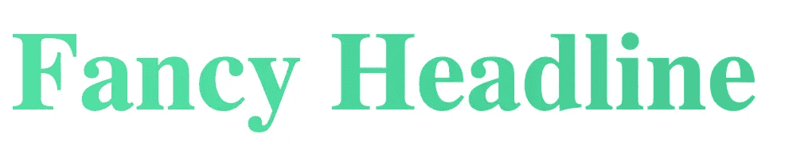
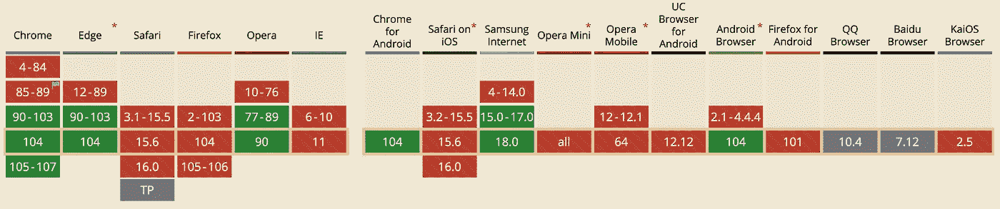

# 使用 Web 组件和木偶师进行服务器端渲染

> 原文：<https://javascript.plainenglish.io/server-side-rendering-with-web-components-and-puppeteer-d55b0fe00b68?source=collection_archive---------2----------------------->

## 声明式 Shadow DOM 使我们能够使用 Puppeteer 在服务器端呈现 Web 组件


Photo by [SpaceX](https://unsplash.com/@spacex?utm_source=medium&utm_medium=referral) on [Unsplash](https://unsplash.com?utm_source=medium&utm_medium=referral)

将 **SSR** 与 Web 组件结合使用实际上很难**。** Web 组件依赖于服务器上不可用的特定于浏览器的 DOM APIs，许多人甚至说这是不可能的。因此许多开发者把缺乏 SSR 作为完全避免 Web 组件的理由。

然而，通过在服务器上预先呈现您的 web 组件并使用声明性 Shadow DOM，有可能实现 SSR。在本文中，我们将创建一个简单的 **Web 组件**，并使用 **Express.js** 在服务器端呈现我们的组件。

[](http://web-highlights.com/) [## Web 亮点— PDF 和 Web 荧光笔

### Web Highlights 是一个在 Web 上突出显示文本的工具，可以更有效地组织您的研究。提升你的…

web-highlights.com](http://web-highlights.com/) 

# 什么是 Web 组件？

Web 组件是基于官方 web 标准的可重用客户端组件，受所有主流浏览器支持。它们是将**功能**与我们代码的其余部分封装在一起的极好方式。不仅如此，你还可以在每个网络应用程序和网页中重用它们。

他们的目的是编写在任何地方都可以使用的封装强大的定制元素。Web 组件使我们能够完全独立于前端框架进行开发。

> Web 组件的主要好处是我们可以在任何地方使用它们。有任何框架，甚至没有框架。—[vuejs.org](https://v3.vuejs.org/guide/web-components.html)

***它们是如何工作的？***

下面是一个如何定义**自治 web 组件**的例子:

```
class MyWebComponent extends HTMLElement {...}window.customElements.define('my-web-component', MyWebComponent);
```

您可以将元素传递给任何 HTML 页面，如下所示:

`<my-web-component value="something"></my-web-component>`

有关 web 组件的更多详细信息，请查看我的其他文章:

*   [**Web 组件会取代前端框架吗？**](https://medium.com/@mariusbongarts/will-web-components-replace-frontend-frameworks-535891d779ba)
*   [**Web 组件死了吗？**](https://levelup.gitconnected.com/are-web-components-dead-12e404e0f4b0)
*   [**完整的 Web 组件指南**](https://medium.com/@mariusbongarts/the-complete-web-component-guide-part-1-custom-elements-a627af805df8)
*   [**用 Web 组件构建自己的博客组合:基础知识**](https://medium.com/@mariusbongarts/showcase-your-medium-articles-with-web-components-part-1-basics-d2c6618e9482)

[](/web-components-at-big-tech-companies-salesforce-89a8a4c97d04) [## 大型科技公司的 Web 组件:Salesforce

### 如果企业可以部署 web 组件，那么您也可以！

javascript.plainenglish.io](/web-components-at-big-tech-companies-salesforce-89a8a4c97d04) 

# 什么是服务器端渲染？

服务器端渲染(SSR)是一种允许我们在服务器上而不是在客户端浏览器中生成 HTML 和 CSS 的技术。这样做的结果是，您的 web 应用程序将加载得更快，因为它不必在呈现页面之前等待 JS / CSS 文件下载。

许多现代框架提供了一种在服务器端呈现组件的方式。比如 Angular 提供**角度通用**，React a **ReactDOMServer** ，Vue.js 提供`renderToString`功能。

对于 Web 组件来说，实现 SSR 非常困难，但是即使是像 **Lit** 或 **Stencil** 这样的库也为我们提供了支持 Web 组件 SSR 的特性。Stencil 已经提供了他们的 [Hydrate App-Bundle](https://stenciljs.com/docs/hydrate-app) 来完成 SSR，并且 [Lit](https://medium.com/@mariusbongarts/build-your-own-blog-portfolio-with-web-components-lit-library-2701dffc735f) 也正在为服务器端渲染开发一个`@lit-lab/ssr`包。

在本文中，我们将不使用任何前端库，并将尝试使用普通的 JavaScript 自定义元素来实现 SSR。

# 创建 Web 组件

对于我们的例子，我们将创建一个非常简单的[定制元素](https://medium.com/@mariusbongarts/the-complete-web-component-guide-shadow-dom-2e40921eb77)，它附加了一个[阴影 DOM](https://medium.com/@mariusbongarts/the-complete-web-component-guide-shadow-dom-2e40921eb77) 并包含一些样式。

[**Shadow DOM API**](https://medium.com/@mariusbongarts/the-complete-web-component-guide-shadow-dom-2e40921eb77) 是使 Web 组件的封装易于实现的关键部分。影子树(影子 DOM 中的 DOM 树)使我们能够将组件的标记和样式与页面上的其他代码分开，以防止混淆网站不同部分的样式。

特别是影子 DOM 经常会导致关于 Web 组件的 SSR 的问题。让我们看看我们是否能让它工作。

下面是我们的自定义元素的代码，它将呈现一个漂亮的标题，看起来像:

首先，我们通过调用`this.attachShadow({ mode: "open" });`给自定义元素附加一个开放阴影 DOM。之后，我们向我们的`template`元素添加一些 HTML，包含一些封装的样式。HTML 中还包含一个`h1`标签和一个`slot`标签。

***Slots*** *是在每个元素中显示不同文本或标记的极好的声明性方式。*

最后，我们克隆我们的`template`的内容，并将其附加到元素的附属`shadowRoot`中。将上面的代码加载到我们的 HTML 中，我们可以像这样使用我们的`fancy-headline`自定义元素:

这将呈现以下标题:



Fancy Headline

这里有一个[代码笔](https://codepen.io/marius2502/pen/XWELKoV)上面的例子:

现在设置已经完成，我们可以投身于激动人心的事情。让我们尝试在服务器端用一个小的 Express.js 应用程序来呈现创建的 Web 组件。

# **创建 Express.js 服务器**

我们将使用一个简单的 Express.js 应用程序来保持简单，该应用程序将从上面返回我们的 HTML。我将指导您一步一步地创建应用程序。这里是 [Github 库](https://github.com/MariusBongarts/medium-webcomponents-ssr)，以防你直接想要检查代码。

以下是让您开始的步骤:

**1。创建一个新目录:**

`mkdir medium-webcomponents-ssr`

**2。创建一个 package.json**

`npm init --yes`

**3。安装快捷**

`npm install express --save`

**4。在**项目的根目录下创建 `**app.js**` **条目文件**

`touch app.js`

**6。在** `**app.js**` **文件中配置 Express.js 来服务我们的 HTML**

app.js

基本上，我们完成了。剩下唯一要做的事情就是通过运行`node app`来启动我们的服务器，并访问 [http://localhost:3000](http://localhost:3000/) 上的应用程序。

我们包括了我们在 [CodePen](https://codepen.io/marius2502/pen/XWELKoV) 示例中提供的所有代码。让我们加载页面并**在浏览器中禁用 Javascript** (查看 [Chrome 开发者文档](https://developer.chrome.com/docs/devtools/javascript/disable/)了解如何禁用 Javascript)。

下面是我们的 ***不那么花哨的标题*** 在客户端禁用 JavaScript 时在服务器上呈现的样子:


Screenshot of localhost:3000

**发生了什么？**

当查看源代码时，我们可以看到我们的文本被呈现在`<fancy-headline>`标签中。


HTML Source Code

但是，我们可以看到没有影子 DOM 附加到元素上。它通常应该是这样的:


HTML Source Code

看不到应用于元素的任何样式的原因是，从服务器端提供的 Javascript 从未被执行过。

但 SSR 就是这么回事。我们希望返回预先呈现的 HTML 字符串，这样客户端就不需要用 JavaScript 来呈现它。这可以提高你的性能，也优化搜索引擎优化。

因此，我们需要以某种方式让 JavaScript 预先在服务器上执行。幸运的是，有两个解决方案可以帮助我们从服务器获取定制元素:

1.  **声明性阴影 DOMs**
2.  **木偶师**

## 1.声明性阴影 DOMs

声明性影子 DOM (DSD)是一个新的 web 平台 API，它使我们能够在不使用 JavaScript 的情况下声明一个影子根。

直到最近，使用影子 DOM 的唯一方法是使用 JavaScript 调用`Element.attachShadow(...)`。我们在自定义元素中做到了这一点，只要客户端启用了 JavaScript，它就能工作。

这种限制使得过去无法从服务器发送带有阴影 DOM 的预渲染定制元素。

一个**声明性的影子根**现在使这成为可能。需要注意的是，这个浏览器 API 仍然非常新，并且只在新的浏览器中受支持。

> 声明式阴影 DOM 在 Chrome 90 和 Edge 91 中可用。它也可以使用 Chrome 85 中的**实验网络平台特性**标志来启用。导航到`about://flags/#enable-experimental-web-platform-features`找到该设置。——[web.dev/declarative-shadow-dom](https://web.dev/declarative-shadow-dom/)

定义 DSD 可以通过使用带有`shadowroot`属性的`<template>`元素来实现。该属性将被 HTML 解析器检测到，并被转换成其父元素的影子根。

例如，以下标记:

将产生这个 DOM 树:

> 声明性影子 DOM (DSD)消除了这个限制，**将影子 DOM 带到了服务器**。—[web.dev/declarative-shadow-dom](https://web.dev/declarative-shadow-dom/)

现在，让我们继续使用 DSD 来转换我们的模板:

Template using DSD

你可以看到我们移除了构造函数中最初的`this.attachShadow( {mode: "open" })`调用。相反，我们通过将`<template>`标签的`shadowroot`属性设置为`open`来使用声明性阴影 DOM。

> `open`简单地说就是可以使用 JavaScript 访问影子 DOM。将它设置为`closed`意味着您不能从外部访问影子 DOM。

你可以看到我们再次在模板中放了一个`<slot>`。值得注意的是，我们现在不再简单地将文本放在`<fancy-headline>`标签中，而是使用一个`text`属性将其放在元素中。

***重要提示*** *:我必须说，我在这个问题上卡住了相当一段时间，但没有成功。这就是为什么我使用了* `*text*` *属性而不是* ***槽*** *来显示相应的标题文本。有人知道如何使用 DSD 和 SSR 来实现这一点吗？*

因此，我们成功地将我们的影子 DOM 转换成了声明性的。现在，剩下的唯一事情就是在服务器上预先呈现 JavaScript。

## 2.操纵木偶的人

我们已经看到，一旦我们在客户机上禁用了 JavaScript，我们的定制元素就不能正确呈现了。因此，我们需要找到一种方法来预先呈现我们的 JavaScript，并且只将 HTML 作为字符串发送给客户端。

接下来，我们将使用**木偶师**库在服务器上预渲染我们的自定义元素。为此，我们需要安装库:

`npm install puppeteer --save`

现在，我们启动一个新的浏览器并创建一个新的木偶页面，如下所示:

最后，我们将页面的内容设置为我们的`html`模板，并等待`"domcontentloaded"`事件来确保页面被完全加载。

之后，我们解析`fullHTML`字符串并将其发送回客户端:

让我们再次**禁用 JavaScript** 并访问 [http://localhost:3000](http://localhost:3000/) :


Fancy Headline

我们做到了！我们成功地在服务器端呈现了包含阴影 DOM 的自定义元素。我们可以通过查看从服务器返回的源代码来进行复查(*右键点击页面- >查看页面源代码*):


Page Source

我们可以看到，服务器的预呈现字符串不仅包括简单的定制元素标记，还包括它的所有内容，包括声明性的 Shadow DOM。

在 DOM 中，我们可以看到 HTML 解析器成功地将 DSD 解析为一个开放的影子根，并将其附加到其父元素`fancy-headline`上:


DOM

## **浏览器支持**

我已经提到声明式阴影 DOM 在 Chrome 90 和 Edge 91 上可用。许多浏览器还不支持它。我们可以通过从 Firefox 浏览器访问我们的应用程序来验证这一点:


Firefox Browser

你可以看到我们返回了带有`shadowroot`属性的正确模板，但是 Firefox 的 HTML 解析器无法正确解释它。

在 caniuse.com，我们可以看到许多浏览器不支持 DSD 提案:



[https://caniuse.com/declarative-shadow-dom](https://caniuse.com/declarative-shadow-dom)

然而，根据 caniuse.com 的调查，这一比例仍达到 71.72%(2022 年 8 月 30 日)。我们可以预期，所有主流浏览器迟早都会适应这个新提议，因为它是 SSR 和 Web 组件的一个里程碑。此外，polyfills 已经存在，可以支持较旧的浏览器。

# 最后的想法

Web 组件和 SSR 多年来一直是一个非常矛盾的话题。许多人继续避免 Web 组件，因为它们似乎与 SSR 不兼容。在这篇文章中，我们看到这仍然不容易，但却是可能的。声明性阴影 DOMs 最终允许我们享受封装的阴影 DOMs 在服务器端呈现的好处。

感谢阅读！我总是乐于回答问题，并乐于接受批评。随时欢迎联系我！通过**[**LinkedIn**](https://www.linkedin.com/in/marius-bongarts-6b3638171/)**，**关注我**[**Twitter**](https://twitter.com/MariusBongarts)或 [**订阅**](https://medium.com/subscribe/@mariusbongarts) 通过电子邮件获取我的故事。****

****[**这里是无限制访问媒体上每一个内容的链接**](https://medium.com/@mariusbongarts/membership) **。如果你使用这个链接注册，我会赚一小笔钱，不需要你额外付费。******

****[](https://medium.com/@mariusbongarts/membership) [## 通过我的推荐链接加入 Medium-Marius bong arts

### 阅读马里乌斯·邦加茨(以及媒体上成千上万的其他作家)的每一个故事。您的会员费直接支持…

medium.com](https://medium.com/@mariusbongarts/membership)**** 

# ****关于作者****

****我是埃森哲软件工程分析师宋。最驱动我的是我想创造一些可能对他人有帮助并改变他人生活的东西的冲动。****

****比如你是否厌倦了浏览自己的历史来寻找前几天看到的信息？我的 [**网站重点介绍 Chrome 扩展**](https://chrome.google.com/webstore/detail/web-highlights-%20-bookmark/hldjnlbobkdkghfidgoecgmklcemanhm) 覆盖了你，并将通过以结构化和高效的方式组织你的研究来提高你的生产力。就像你在书和文章上做的那样，突出显示任何网页或 PDF 上的文本。你的精彩片段会直接同步到 web-highlights.com 的网络应用上，你可以在任何地方找到它们。****

# ****进一步阅读****

****[](https://medium.com/@mariusbongarts/will-web-components-replace-frontend-frameworks-535891d779ba) [## Web 组件会取代前端框架吗？

### 它们是为解决不同的问题而构建的。

medium.com](https://medium.com/@mariusbongarts/will-web-components-replace-frontend-frameworks-535891d779ba) [](https://levelup.gitconnected.com/are-web-components-dead-12e404e0f4b0) [## Web 组件死了吗？

### 最近，我发表了一篇关于类似主题的不同问题的文章:Web 组件会取代前端吗…

levelup.gitconnected.com](https://levelup.gitconnected.com/are-web-components-dead-12e404e0f4b0) [](https://medium.com/@mariusbongarts/the-complete-web-component-guide-part-1-custom-elements-a627af805df8) [## 完整的 Web 组件指南:自定义元素

### 成为 Web 开发未来的专家(第 1 部分)

medium.com](https://medium.com/@mariusbongarts/the-complete-web-component-guide-part-1-custom-elements-a627af805df8) 

*更多内容请看*[***plain English . io***](https://plainenglish.io/)*。报名参加我们的* [***免费周报***](http://newsletter.plainenglish.io/) *。关注我们关于*[***Twitter***](https://twitter.com/inPlainEngHQ)[***LinkedIn***](https://www.linkedin.com/company/inplainenglish/)*[***YouTube***](https://www.youtube.com/channel/UCtipWUghju290NWcn8jhyAw)*[***不和***](https://discord.gg/GtDtUAvyhW) *。*******