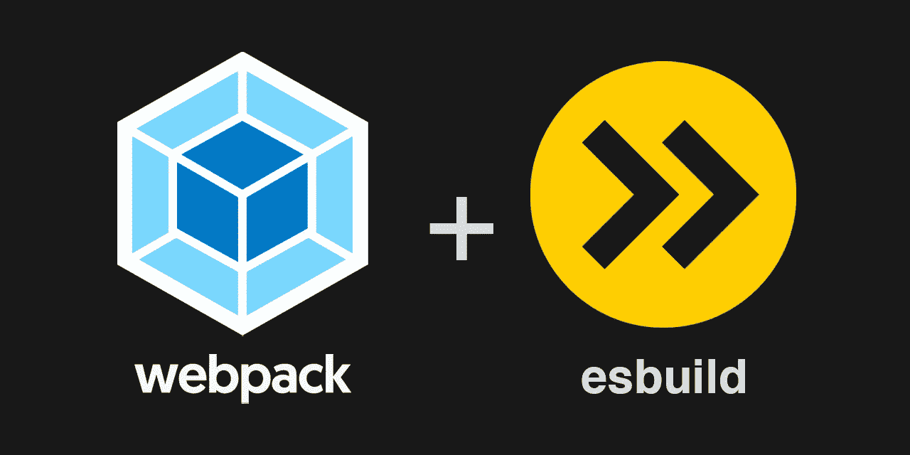
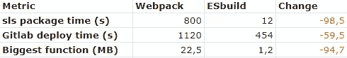

# 无服务器捆绑—数字说话！

> 原文：<https://javascript.plainenglish.io/serverless-bundling-numbers-talk-7826f762a29e?source=collection_archive---------10----------------------->

## 这将是对 webpack 和 esbuild 的经典测试

Webpack and esbuild

## 语境

随着我们的一项无服务器服务开始增长，构建和部署时间也在增长。这是一项我们需要经常部署的服务，所以 20 分钟左右的部署时间是不可接受的。我们正在使用[无服务器框架](https://www.serverless.com/)，它为我们提供了很好的服务。除了框架之外，我们使用 webpack 和 Gitlab 将服务部署到 AWS。

下面你会看到一个小表格，显示了从 webpack 切换到 esbuild 的结果:

# 速度下降

Some key numbers

如上所述，切换到 esbuild 的变化是巨大的！
我最感兴趣的两个指标是部署时间和功能大小。
在这种情况下，我们的部署时间减少了近 60%,最大的功能减少了近 95%。

## esbuild 真的那么好吗？

简而言之，是的！

Esbuild 在用最少的配置捆绑您的项目方面非常出色。这才是真正的关键。配置！许多项目可能需要非常专业的设置，因此 Webpack 可能更好。但是 Webpack 也因为有一个非常陡峭的学习曲线而出名。

我确信我可以大大改进 Webpack 的构建。首先，我在排除`aws-sdk`时遇到了麻烦，它最终被打包在每个函数中(而且非常大)。
因此，webpack 设置中的功能大小远远大于它们需要的大小。
我 100%确定 Webpack 有能力排除`aws-sdk`包，但是我花了很长时间才弄明白，以至于我在沮丧中开始关注 esbuild。

简单绝对是一个关键特性，我相信这会吸引更多的人使用 esbuild。速度是另一个！

## 一个简单的例子

如上所述，webpack 确实有它擅长的领域。但是对我来说，这对于我们的设置来说太复杂了。

我们的 webpack 设置需要:

*   `webpack`和`serverless-webpack`套餐(外加一些额外费用)。
*   一个有很多配置的`webpack.config.js`文件。这里会有关于构建的大部分细节。这个文件可能会变得相当复杂，缺省值不能解决这个问题。
*   `serverless.yaml`文件中的一些配置。

我们的 esbuild 设置需要:

*   `esbuild`和`serverless-esbuild`包(加上一些额外的)
*   `serverless.yaml`中的一个配置看起来是这样的:

Serverless.yaml

剩下的都是 esbuild 设置的默认值。

## 结论

从 webpack 迁移到 esbuild 大约需要 3-4 个小时，现在我们的部署时间和功能规模都大大缩短了。这将有助于加快反馈循环，并改善 AWS 的冷启动。将来，其他项目可能仍然需要 webpack，但现在，esbuild 将是我的默认选择！

> -补水是关键！

*更多内容尽在* [***说白了. io***](https://plainenglish.io/) *。报名参加我们的* [***免费周报***](http://newsletter.plainenglish.io/) *。关注我们关于* [***推特***](https://twitter.com/inPlainEngHQ) *和*[***LinkedIn***](https://www.linkedin.com/company/inplainenglish/)*。加入我们的* [***社区不和谐***](https://discord.gg/GtDtUAvyhW) *。*