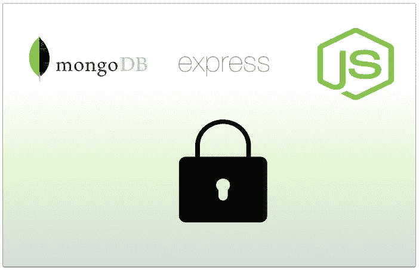
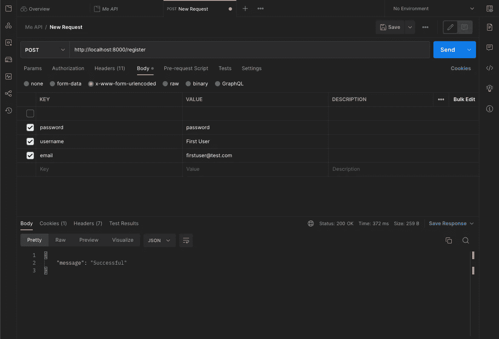
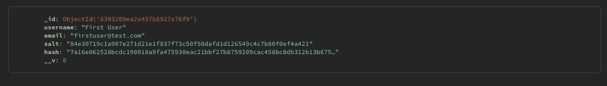
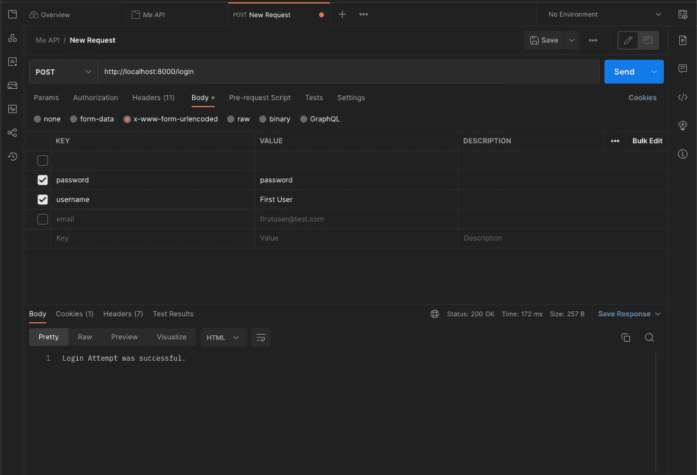
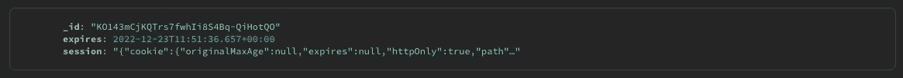
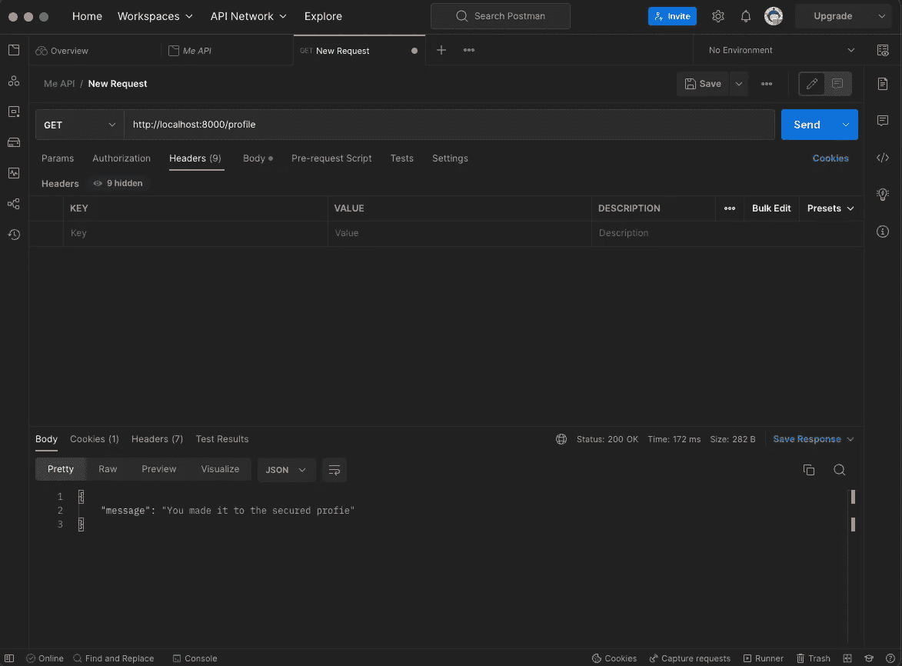
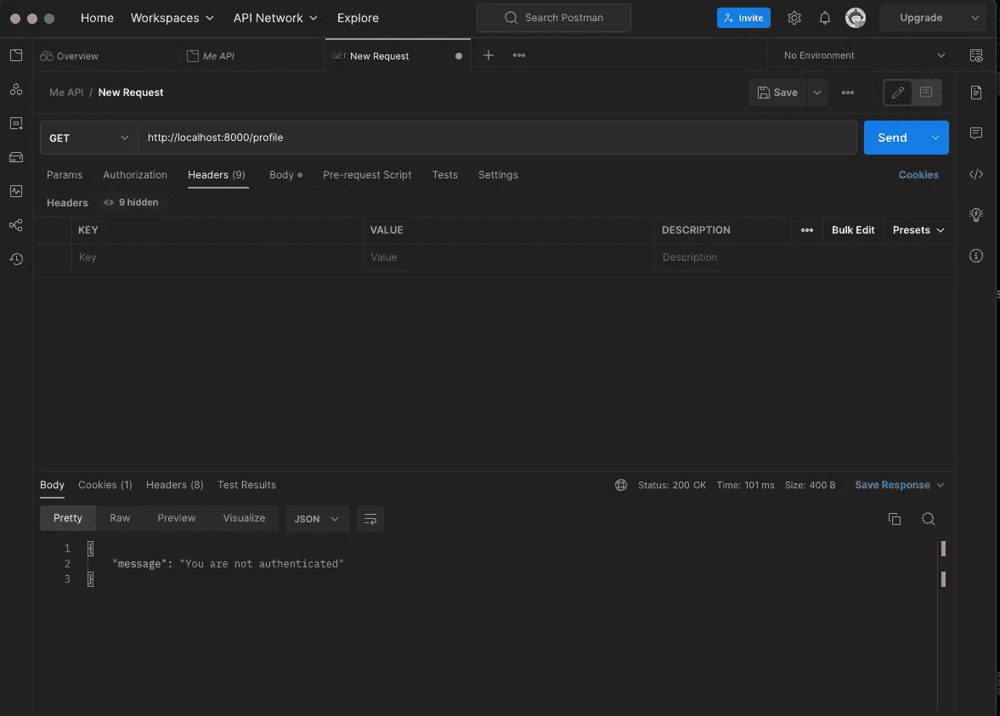

# Node.js、Express、Passport 和 MongoDB 的会话认证

> 原文：<https://javascript.plainenglish.io/session-authentication-with-node-js-express-passport-and-mongodb-ffd1eea4521c?source=collection_archive---------1----------------------->

## 基于会话的认证的简单指南。



## 快速说明—

*我最近发表了一篇文章，介绍了 jwt 的一个认证解决方案。我在帖子的顶部做了一个免责声明，建议人们不要将帖子用于生产软件。相反，我承诺我将完成基于会话的认证，我终于开始着手做了。*

*下面是 JWT 认证教程的链接:* [*JWT 认证*](https://medium.com/@cambass/jwt-authentication-with-node-express-passport-and-mongodb-445a7fca5893)

本会话认证教程演示了在 Node.js 应用程序中实现基于会话的认证的最少步骤。

## 步骤概述:

首先，我们将创建一个 app.js 文件，其中包含创建会话所需的包。然后，我们将该会话添加到 MongoDB 存储中(我们在本教程中使用的数据库)。它还将包括 passport 设置，这对于我们的案例来说非常简单。最后，我们将包括所有特定于项目的路线。我将代码保持得尽可能的少，以便有最好的机会理解并为您的目的构建代码。

其次，我们将创建一个模型，创建用户并通过 mongoose 将其保存到 MongoDB 数据库。这将包括简化用户名和密码验证的“[passport-local-mongose](https://www.npmjs.com/package/passport-local-mongoose)”。我建议看看这个软件包是如何工作的，以便更深入地理解 Passport。

最后，我们将使用 Postman 来验证会话配置是否设置正确，以及端点是否按预期工作。这一步将包括一个屏幕截图。

完成所有步骤后，您应该已经为基于会话的身份验证准备好了节点应用程序。

## 技术假设:

1.  可以连接的正在运行的 MongoDB 集群。我们将使用`mongoose` — `passport-local-mongoose` — `connect-mongo`作为我们的数据存储。
2.  已安装节点和 NPM 的最新版本
3.  [邮递员](https://www.postman.com/)已安装

# 步骤 1:创建应用程序并添加依赖项

首先，让我们创建一个新的 Node.js 应用程序，并检查我们将在本教程中使用的包。

## 创建一个新的项目目录并创建节点应用程序:

```
> mkdir user-session-tutorial
> cd user-session-tutorial

> npm init
```

***注意:我把我的入口点设置为*** `***app.js***`

## 现在让我们添加必要的包:

```
npm install --save connect-mongo express express-session mongoose passport passport-local passport-local-mongoose
```

# 什么是 PassportJS？什么是中间件？

## 护照

[Passport](https://www.passportjs.org/) 是 [Node.js](https://nodejs.org/) 的认证中间件。极其灵活和模块化，Passport 可以不引人注目地放入任何基于 [Express](https://expressjs.com/) 的 web 应用程序中。Passport 支持许多不同的身份验证策略，可用于简单的实现。本教程使用“ [passport-local](https://www.passportjs.org/packages/passport-local/) ”策略进行用户名和密码验证。Passport 支持其他策略，如 Google OAuth、Twitter、AuthO 等等。这里是[完整列表](https://www.passportjs.org/packages/)的链接。

还值得注意的是，Passport 是数据库不可知的，我们在本教程中使用 MongoDB，但是任何其他数据库类型都可以轻松使用。

## 中间件

中间件是一种过滤进入应用程序的请求的方式。中间件组件位于客户机和服务器之间，处理入站请求和出站响应。换句话说，它可以在数据到达客户机或服务器之前处理来自请求和响应的数据。

中间件便于身份验证和授权，这就是 Passport 在基于 Express 的应用程序中被广泛采用的原因。下面的 app.js 文件将演示我们如何在 Node.js 应用程序中实现 Passport。

# 第二步:创建一个 *app.js* 文件

在为您的目的进行开发时，将这些组件移动到它们自己的文件中是一个好的做法，但是在这里将所有的东西都展开会更容易理解。

# 步骤 3:创建用户模型

同样，这个用户模型利用 passport-local-mongose 包来消除在我们的应用程序中处理密码散列的需要。

在这个模型实现之后，所有必要的代码都应该设置好了，我们就可以测试我们的端点了。我们开始吧！

# 步骤 4:通过邮递员提出请求:

## 注册路线:创建用户

测试端点的第一步是创建一个用户。让我们使用正确的请求体点击`/register`路线来完成这个任务。



我们已经成功创建了用户。让我们看一下我们的 MongoDB 实例，以确保我们已经创建了文档:



我们的应用程序创建了用户，下一步是登录。

## 登录路径:创建会话

如果我们想要访问受保护的路由，我们需要创建一个有效的会话来证明我们是我们所说的那个人。让我们现在就开始吧:



现在让我们检查 MongoDB，并检查将用于验证请求的已创建会话。



就在那里。我们有一个会话可以用来访问受保护的路线。让我们试一试。

## 配置文件路由:受保护。只有你能看到这个。



我们已经到达了受保护的路线。

## 配置文件路由:测试失败

我将从我的 MongoDB 存储中删除该会话，以确保一切配置正确。删除会话后，该请求现在应该会失败。



删除会话后，我无法再登录和查看受保护的配置文件路由。

# 总结:

希望这有助于演示向 Node.js 应用程序添加基于会话的身份验证所需的最少步骤。编码快乐！

*报名参加我们的* [***免费周报***](http://newsletter.plainenglish.io/) *。关注我们关于*[***Twitter***](https://twitter.com/inPlainEngHQ)，[***LinkedIn***](https://www.linkedin.com/company/inplainenglish/)*，*[***YouTube***](https://www.youtube.com/channel/UCtipWUghju290NWcn8jhyAw)*，以及* [***不和***](https://discord.gg/GtDtUAvyhW) ***。***

***有兴趣缩放你的软件启动*** *？检查* [***电路***](https://circuit.ooo?utm=publication-post-cta) *。*