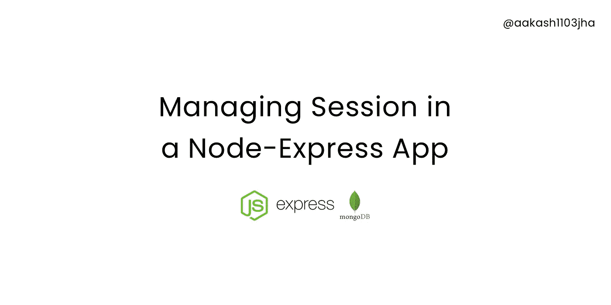
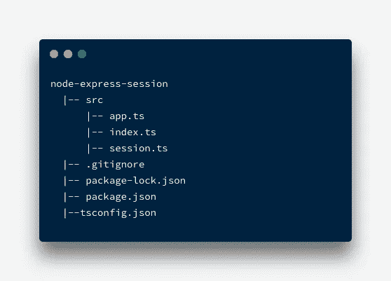
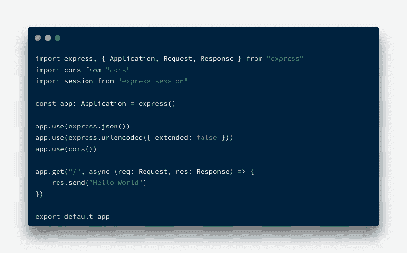
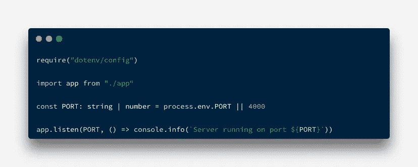
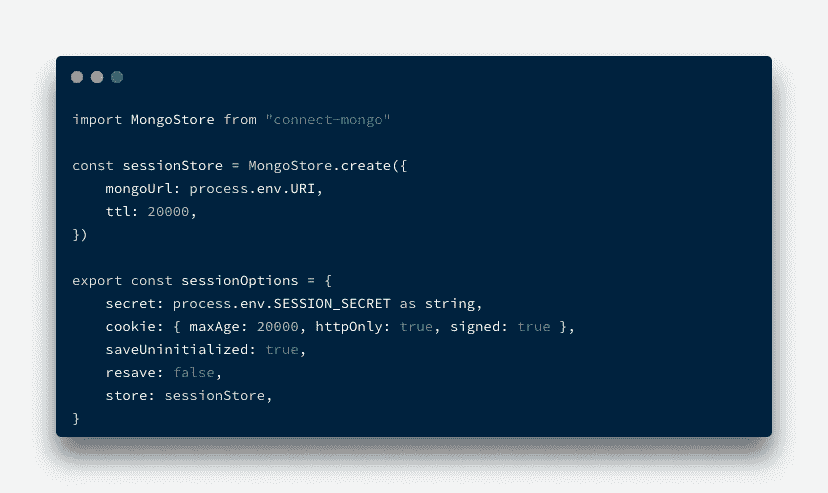
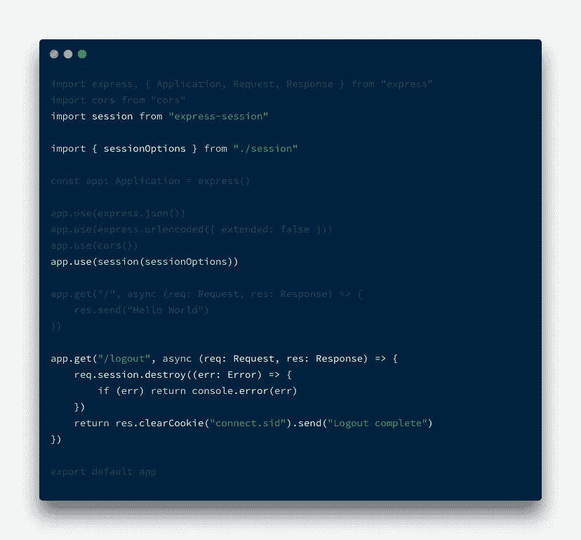

# 使用 MongoDB 在 Node.js & Express 应用程序中进行会话管理

> 原文：<https://javascript.plainenglish.io/session-management-in-a-nodejs-express-app-with-mongodb-19f52c392dad?source=collection_archive---------0----------------------->

## 使用 express-session 和 MongoDB 在下一个 Node.js-Express 应用程序中设置、使用和管理会话的简单指南

对于任何后端开发人员来说，仅仅了解概念层面的东西可能并不总是足够的。有时候，你不得不弄脏你的手。

和往常一样，本文的完整代码可以在我的 GitHub 上找到👇

 [## GitHub—aa kash 1103 jha/node-express-session

### 这是一个简单的项目，演示了如何在 node-express 应用程序中设置和使用会话。这个应用程序使用 MongoDB…

github.com](https://github.com/Aakash1103Jha/node-express-session.git) 

# 饼干🍪vs 会话🔗

说到 cookies 或会话，现在，我们只能说，它们是同一个硬币的两面。cookie 和会话的主要区别在于数据最终存储的位置。虽然 cookie 由浏览器存储在客户端，这意味着数据也存储在浏览器中，但另一方面，会话将数据存储在服务器端，可以在应用程序内存中(这不是一个很好或可伸缩的想法)或使用某种形式的数据库(SQL 或无 SQL)来实现数据持久性。

# 入门指南🚀

在我们开始有趣的东西，例如代码之前，让我们先弄清楚一些事情。

1.  此应用程序使用 TypeScript。我希望你和我一样喜欢 TS😅但是如果你不习惯或者不了解它，不要担心——你需要做的就是忽略与 TS 相关的东西(比如定义类型),假装它是 JS。
2.  因为本文也是关于在 Express 应用程序中使用 Mongo DB 和 Session 的，所以您要么需要在本地系统上运行一个 MongoDB 实例，要么需要一个 Atlas 集群供您使用。
3.  请务必通读自述文件。我已经详细描述了在环境变量方面需要做出改变的地方，如何让应用程序运行…诸如此类的东西。

# 目录结构📚

浏览项目目录并浏览每个文件可能做的/相关的内容总是一个好主意。`app.ts`拥有所有与 Express 相关的逻辑。`session.ts`包含所有与会话相关的代码，比如中间件和商店的配置。而`index.ts`是最简单的，充当应用程序的入口点。

Project directory structure

# 给我看看代码！💻

行...好了…是时候看代码了…让我们看看每个文件看起来是什么样子，做了什么。此外，如果您选择在自己的项目中放弃 TypeScript，您将不再需要任何那些`@types/`相关的 devDependencies。

## 步骤 1:设置基本的 express 应用程序

## src/app.ts

这一步不要太花哨。我们在这里拥有的是一个服务器，它在`PORT 4000`运行并监听请求，并且只有一个`/`路由发送回`Hello World`作为响应。简单的东西！

## src/索引. ts

就像我之前说过的，我们的`index.ts`文件非常简单，充当应用程序的入口点。仅此而已。我们所做的就是导入 express `app`并在我们想要的任何端口启动一个服务器——在本例中是 4000。此时，如果您继续运行`npm run dev`，您应该会在控制台中看到运行在端口 4000 上的 ***服务器。***

## 第二步:使用`[express-session](https://www.npmjs.com/package/express-session)`包

如果您正在使用附加的存储库，那么您在开始时就已经获得了所有的依赖项。但是如果您正在跟进，运行`npm install --save express-session; npm install-D @types/express-session`来安装这个依赖项。我们要做的是，使用`express-session`包作为中间件，为我们的应用程序完成所有与创建和管理会话相关的繁重工作。另外，如果您计划使用 MongoDB 作为您的会话存储，请在您的 npm 命令中包含`connect-mongo`。如果你想使用其他数据库，你可以在这里找到兼容选项的列表。关于 connect-mongo 包，[官方文档在此](https://www.npmjs.com/package/connect-mongo)。

我们在这里做的是，首先，使用`connect-mongo`包创建一个`sessionStore`，它将被我们的会话使用(老实说，一句话中有太多的会话😅)来存储数据。*如果你选择不为你的应用添加会话存储，就不会有任何数据持久性*。除此之外，你的应用程序仍然可以工作，只要服务器不重启，数据就会存储在内存中。

## 步骤 3:在 app.ts 文件中包含会话

告诉我们的应用程序使用会话非常简单，只需导入`express-session`包、`sessionOptions`(在`session.ts`中创建)，在`session middleware`中传递这些选项，并告诉哪个路由应该对会话做什么。轻松点。😂

`req.session`还附带了一些方法，当涉及到管理基于一些用户动作的会话时，这些方法非常有用——在本例中是注销。注销时，或者当浏览器关闭时，我们知道应该终止会话，并且必须删除会话 id cookie。`destroy`方法正是这样做的。

如果你还记得，在 sessionStore 中有一个`ttl`属性。这就是告诉数据库会话数据多长时间有效，之后可以自动安全地删除它。

## 第四步:发动引擎！

如果一切顺利，并且您已经将 Mongo DB(本地或 Atlas，无所谓)或您选择的任何其他 DB 连接为您的会话存储，那么访问`/`端点将创建一个**新会话**，并在您的浏览器中保存一个新的 **connect.sid cookie** ，并且**在**数据库**中添加该会话 id 的会话数据**。现在，一旦您访问了`/logout`端点，会话 cookie 将从您的浏览器和会话数据中删除。分别来自数据库。

我们完事了。我们有一个 Node.js-Express 应用程序，它实现了一个会话，还有一个会话存储来保存会话数据，直到会话被删除或无效。

感谢你的来访和阅读这篇文章。我希望你喜欢它，并发现它很有帮助🙂。

请务必查看我在 Node.js 旁边讨论 React 和 TypeScript 的其他文章。

结束！🚀

*更多内容请看* [***说白了。报名参加我们的***](https://plainenglish.io/) **[***免费周报***](http://newsletter.plainenglish.io/) *。关注我们*[***Twitter***](https://twitter.com/inPlainEngHQ)*和*[***LinkedIn***](https://www.linkedin.com/company/inplainenglish/)*。查看我们的* [***社区不和谐***](https://discord.gg/GtDtUAvyhW) *加入我们的* [***人才集体***](https://inplainenglish.pallet.com/talent/welcome) *。***