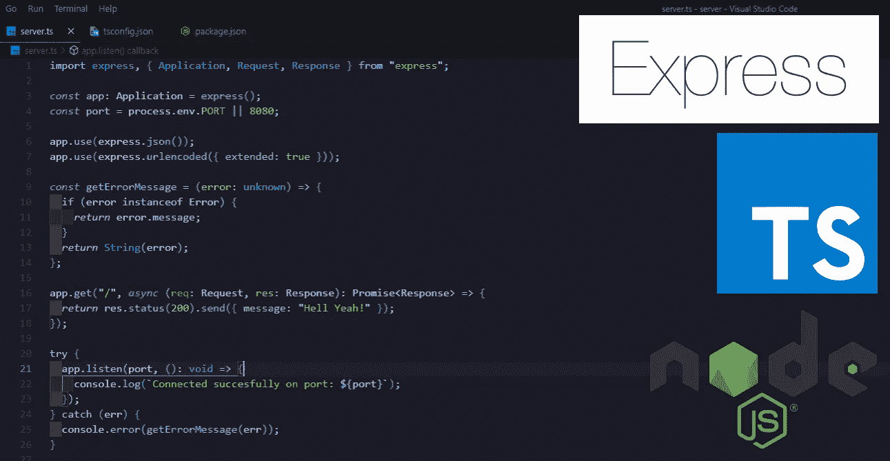

# 使用 TypeScript 设置 node . js Express Web 服务器 API

> 原文：<https://javascript.plainenglish.io/set-up-a-node-js-express-web-server-api-using-typescript-e2737b34157f?source=collection_archive---------10----------------------->

## 使用 TypeScript 设置 node . js Express Web 服务器的完美指南。

我知道时间对于我们开发人员来说是多么宝贵，所以我不会用任何不必要的细节来烦你，但是我会告诉你一些我在 try/catch 块中发现的关于错误类型的有趣的事情。



# 初始设置

首先，让我们在您最喜欢的 IDE(我的 VS 代码)中打开一个新文件夹(我会给它一个非常原始的名字，比如“ **server** ”)，打开终端，确保路径指向您的文件夹，最后:

```
$ yarn init --yes
```

没有 Express 就没有派对，所以让我们安装它:

```
yarn add express
```

现在让我们安装我们需要的**开发**依赖项:

```
$ yarn add ts-node-dev nodemon typescript -D
```

还有**的打字稿类型:**

```
$ yarn add @types/express @types/node -D
```

> 为什么 Typescript 是一种开发依赖？
> 
> 基本上，typescript 是一个包，它通过一个叫做 transpiling 的奇特过程将 TypeScript 代码转换成 Javascript。由于任何节点环境都不理解 Javascript，因此需要在应用程序运行之前将 TypeScript 代码转换为 Javascript。因此，任何使用你的应用程序的人都不需要依赖安装 typescript，因为他/她只会使用你的应用程序的运行时版本。

我们还需要添加 **tsconfig** 文件来告诉 typescript 它应该如何将我们的 TypeScript 代码转换成 javascript:

```
$ npx tsc --init
```

最后但同样重要的是(我保证),让我们创建一个新文件，所有神奇的事情都会在这里发生:

```
$ touch server.ts
```

## 好吧，我撒谎了，还有一件事。

我们需要创建一个脚本来实际运行我们的代码。所以让我们把它添加到我们的**包中**

```
{...,
 "scripts": {
  "start": "nodemon server.ts"
 }
}
```

Pfew！我知道有很多准备工作，相信我，那是最难的部分。从现在开始，它将在魔法代码的光辉之风中航行。

# **服务器。TS**

我们将从导入开始(是的，你没看错，我们不是‘要求’而是‘导入’,因为我们在 es 模块中使用 typescript 很酷吧？)并实例化我们的 express 应用程序。

```
import express from 'express';*const* app = express();
*const* port = process.env.PORT || 8080;
```

现在让我们添加类型:

```
import express, { Application } from "express";*const* app: Application = express();
*const* port = process.env.PORT || 8080;
```

中间件:

```
import express, { Application } from "express";*const* app: Application = express();
*const* port = process.env.PORT || 8080;app.use(express.json());
app.use(express.urlencoded({ extended: true })); 
```

现在让我们开始监听所提供的端口:

```
import express, { Application } from "express";*const* app: Application = express();
*const* port = process.env.PORT || 8080;app.use(express.json());
app.use(express.urlencoded({ extended: true })); try {
app.listen(port, (): void => {
   console.log(`Connected succesfully on port: ${port}`);
});
} catch (err) {
   console.error(`Error: ${err.message}`);
}
```

现在，我们终于可以到终端运行:

```
yarn run start
```

然后嘣！我们做到了，我们得到了一个编译错误。似乎 err 属于未知类型。

现在，第一反应是将 err 的类型设置为 Error。

```
...
}catch(err:Error){...}
```

但这是不可行的，因为:

"*Catch 子句变量类型注释必须是' any '或' unknown '(如果指定的话)*。"

简而言之，这意味着“err”基本上可以是任何东西，从字符串到承诺，到数字，以及介于两者之间的任何东西。

你可能会说，让我们给它一个“任何”类型，然后就到此为止。

```
...
}catch(err:any){...} 
```

但那不太像现在的打字稿，不是吗？

所以还是找个变通办法吧。

如果我们定义一个函数，姑且称之为 ***getError*** ，它将一个类型为**未知**的**错误**作为参数:

```
const getError = (error:unknown)=>{...}
```

它检查**错误*是否是错误的**实例，并返回**错误。消息**如果是或不是，它只是以字符串形式返回错误:***

```
*const getError = (error:unknown)=>{
 if (error instanceof Error) {
 *return* error.message;
  }
 *return* String(error);
}*
```

*您的 server.js 文件现在应该如下所示:*

```
*import express, { Application } from "express";*const* app: Application = express();
*const* port = process.env.PORT || 8080;app.use(express.json());
app.use(express.urlencoded({ extended: true }));*const* getErrorMessage = (error: unknown) => {
  if (error instanceof Error) {
    *return* error.message;
  }
 *return* String(error);
};try {
  app.listen(port, (): void => {
    console.log(`Connected succesfully on port: ${port}`);
});} catch (err) {
    console.error(getErrorMessage(err));
}*
```

*现在，让我们再次尝试运行启动脚本:*

```
*$ yarn run start*
```

*检查终端，你瞧，你有一个正在运行的 web 服务器。*

# ***第一个端点***

*现在让我们的网络服务器给我们发送一张漂亮的。每当我们向 json 发送请求并让它获得 API 标签时。*

*首先，让我们导入*请求*和*响应*类型:*

```
*import express, { Application, Request, Response } from "express";*
```

*现在，让我们创建端点:*

```
*app.get("/", 
  *async* (req: Request, res: Response): Promise<Response> => {
     *return* res.status(200).send({ message: "Hell Yeah!" });
  }
);*
```

*最终的代码应该是这样的:*

```
*import express, { Application, Request, Response } from "express";*const* app: Application = express();
*const* port = process.env.PORT || 8080;app.use(express.json());
app.use(express.urlencoded({ extended: true }));*const* getErrorMessage = (error: unknown) => {
  if (error instanceof Error) {
    *return* error.message;
  }
 *return* String(error);
};app.get("/", 
  *async* (req: Request, res: Response): Promise<Response> => {
     *return* res.status(200).send({ message: "Hell Yeah!" });
  }
);try {
  app.listen(port, (): void => {
    console.log(`Connected succesfully on port: ${port}`);
});} catch (err) {
    console.error(getErrorMessage(err));
}*
```

*现在只要打开你的浏览器，进入 *localhost:8080* (或者你使用的任何端口)，你就会收到你想要的信息。*

*太好了。多酷啊！*

*当然，这只是冰山一角，但是你知道那个教人如何钓鱼的家伙的谚语。*

*你猜怎么着？你现在知道如何钓鱼了！*

*所以，去钓鱼吧！*

*感谢您的阅读！*

**更多内容看* [*说白了. io*](http://plainenglish.io/) *。报名参加我们的* [*免费每周简讯*](http://newsletter.plainenglish.io/) *。在我们的* [*社区不和谐*](https://discord.gg/GtDtUAvyhW) *获得独家获得写作机会和建议。**