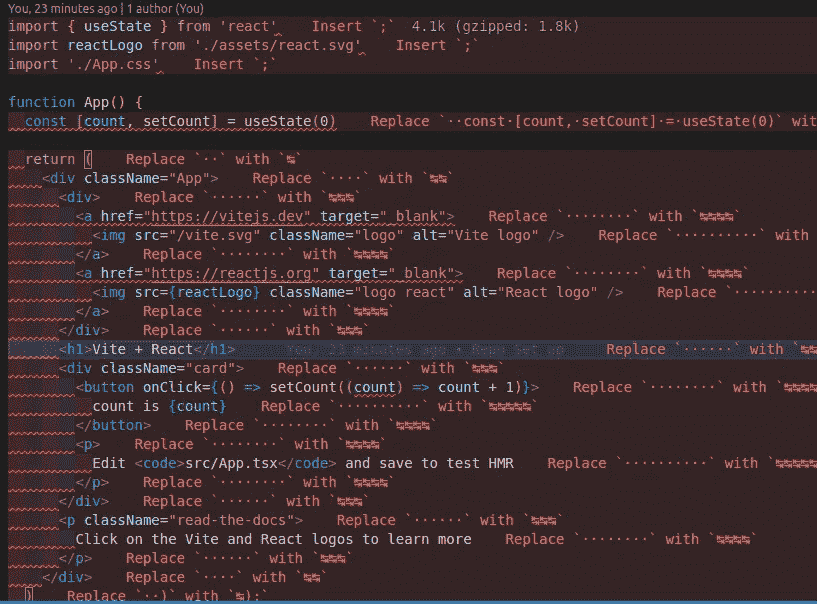

# 在 React TypeScript 应用程序中设置 ESLint 和更漂亮(2023)

> 原文：<https://javascript.plainenglish.io/set-up-eslint-and-prettier-in-a-react-typescript-app-2022-7d9a5f40b634?source=collection_archive---------0----------------------->


Prettier & ESLint

一旦开始使用带有 React 的 TypeScript，就没有回头路了。你会爱上它提供的便利。但是要为您的团队建立一个如何格式化代码库的标准，重要的是要有适当的 linter 和 formatter 来确保代码的一致性，而不管编写代码的开发人员是谁。当涉及到林挺和格式化代码时，ESLint 和 appearlier 是开发人员社区的最爱。如果你想为基于 JavaScript 的 React 应用程序设置 ESLint 和 Prettier，我建议你看看我的文章。

[](/setup-eslint-and-prettier-in-a-react-app-2022-ec09be9f0407) [## 使用绝对导入在 React 应用程序中设置 ESLint 和更漂亮(2022)

### 使用绝对导入为 React 应用程序设置 Eslint 和更漂亮。

javascript.plainenglish.io](/setup-eslint-and-prettier-in-a-react-app-2022-ec09be9f0407) 

让我们看看如何为 React TypeScript 项目设置 ESLint 和 Prettier。请注意，在本文的过程中，我使用 [Vite](https://vitejs.dev/guide/#scaffolding-your-first-vite-project) 来搭建 react 项目。

# 1.安装依赖项

要设置 ESLint 和 Prettier，我们需要使用下面给出的命令在应用程序中添加一堆依赖项，如`eslint`、`eslint-config-airbnb`、`prettier`。

```
yarn add -D @typescript-eslint/eslint-plugin@^5.13.0 @typescript-eslint/parser@^5.0.0 eslint@^8.24.0 eslint-config-airbnb@^19.0.4 eslint-config-airbnb-typescript@^17.0.0 eslint-config-prettier@^8.5.0 eslint-import-resolver-typescript@^3.5.1 eslint-plugin-import@^2.26.0 eslint-plugin-jsx-a11y@^6.6.1 eslint-plugin-prettier@^4.2.1 eslint-plugin-react@^7.31.8 eslint-plugin-react-hooks@^4.6.0 prettier@^2.7.1
```

提到了用于特定依赖项的确切版本，因为它们相互依赖才能正常工作，但是如果您想使用最新版本，可以使用以下命令安装最新版本:

```
yarn add -D @typescript-eslint/eslint-plugin  @typescript-eslint/parser eslint eslint-config-airbnb eslint-config-airbnb-typescript eslint-config-prettier eslint-import-resolver-typescript eslint-plugin-import eslint-plugin-jsx-a11y eslint-plugin-prettier eslint-plugin-react eslint-plugin-react-hooks prettier
```

# 2.添加 ESLint 配置文件

ESLint 配置可以通过命令行使用命令`eslint --init`生成，并回答一些关于要遵循的代码约定的问题，或者使用一些现有的配置，如下所示。这个配置已经解决了 prettier 和 ESLint 之间的引用和缩进规则冲突的问题。要使用这个配置，您需要在项目的根目录下创建一个新文件`**.eslintrc.json**`。

Configuration file for ESLint

**随意使用上面定义的规则或扩展一些其他配置，如**[**eslint-config-Google**](https://www.npmjs.com/package/eslint-config-google)**来找出最适合您项目的配置。**

# **3.更新脚本**

**现在，为了测试林挺命令，让我们通过添加下面给出的命令来更新我们的`package.json`文件中的`scripts`:**

```
"lint": "tsc --noEmit && eslint src/**/*.ts{,x} --cache --max-warnings=0",
"lint:fix": "eslint src/**/*.ts{,x} --fix"
```

**`--max-warnings`标志有助于确保在使用提交前检查提交代码之前开发的代码是 lint，而没有任何警告，而`--fix`标志可自动修复错误/警告。一旦完成，我们就可以通过运行下面的命令来测试 ESLint 配置，该命令将扫描项目中的所有 JavaScript 文件。**

```
yarn run lint
```

# **4.更新 VSCode 的设置**

**或者，我们可以更新 VSCode 配置，使其显示林挺和格式错误，并在保存文件时修复可自动修复的错误。为了实现这一点，我们需要安装一些扩展: [**ESLint**](https://marketplace.visualstudio.com/items?itemName=dbaeumer.vscode-eslint) 和[](https://marketplace.visualstudio.com/items?itemName=esbenp.prettier-vscode)**。我还建议安装[错误透镜](https://marketplace.visualstudio.com/items?itemName=usernamehw.errorlens)，它有助于在编写代码时突出显示文件本身的错误/警告。一旦完成，我们需要添加一个新的`.vscode/settings.json`文件到项目的根目录，如下所示:****

****User settings for VSCode****

# ****5.补充。eslintignore 文件****

****一旦设置完成，ESLint 和 Prettier 可能会尝试将构建文件也放在`dist/`文件夹中。为了避免这种情况，我们可以创建一个`.eslintignore`文件，并在其中添加`dist`。它通知 ESLint 跳过查看`dist`文件夹。****

****Sample .eslintignore file****

# ****结论****

****一旦所有这些配置都完成了，ESLint 和 appellister 应该可以运行林挺了，并格式化你的项目，如附件截图所示:****

********

****Linting and formatting errors are displayed using Error Lens****

****和往常一样，下面是 Github 上完整设置的链接:****

****[](https://github.com/eshankvaish/react-ts-linting) [## GitHub-eshankvaish/React-ts-林挺:为 React TyepeScript 项目设置了 ESLint 和更漂亮的

### 此时您不能执行该操作。您已使用另一个标签页或窗口登录。您已在另一个选项卡中注销，或者…

github.com](https://github.com/eshankvaish/react-ts-linting)**** 

> *****感谢阅读。一定要让我知道你对用 React 应用程序设置 ESLint 和 Prettier 的想法。*****

```
**Want to connect?
Reach out on [Twitter](https://twitter.com/eshankvaish), [LinkedIn](https://www.linkedin.com/in/eshankvaish/) or in the comments below!**
```

*****更多内容请看*[***plain English . io***](https://plainenglish.io/)*。报名参加我们的* [***免费周报***](http://newsletter.plainenglish.io/) *。关注我们关于*[***Twitter***](https://twitter.com/inPlainEngHQ)[***LinkedIn***](https://www.linkedin.com/company/inplainenglish/)*[***YouTube***](https://www.youtube.com/channel/UCtipWUghju290NWcn8jhyAw)*[***不和***](https://discord.gg/GtDtUAvyhW) *。对增长黑客感兴趣？检查* [***电路***](https://circuit.ooo/) *。*******