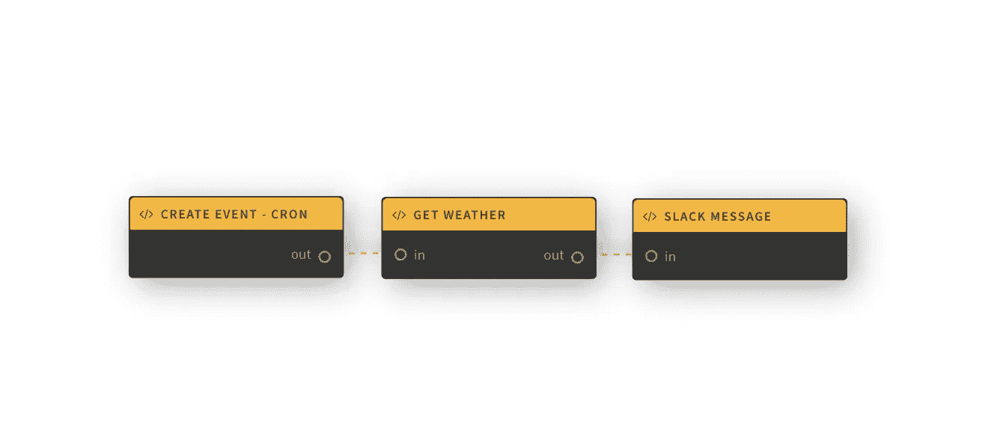

# 用 Lolo 设置预定事件(又名 CRON Jobs ),向自己发送空闲时间的更新

> 原文：<https://javascript.plainenglish.io/set-up-scheduled-events-aka-cron-jobs-with-serverless-to-send-yourself-weather-updates-to-slack-11f54b4ef12e?source=collection_archive---------13----------------------->

## …每天早上 8 点，CEST 使用松弛的网钩。

Photo by [Stephen Phillips - Hostreviews.co.uk](https://unsplash.com/@hostreviews?utm_source=medium&utm_medium=referral) on [Unsplash](https://unsplash.com?utm_source=medium&utm_medium=referral)

在本指南中，我们将演示如何通过使用任务调度器 [node-cron](https://www.npmjs.com/package/node-cron) 来生成您自己的无服务器事件，该任务调度器将在每天早上运行，并将本地天气作为私有消息发送给您 Slack。

虽然，我们可以为这个创建一个库函数，这将允许你学习如何自己产生事件。

见下面这个演示的 Lolo 图。节点中有自定义的 Node.js 代码，但是通过使用几个节点，我们可以更好地可视化它在做什么。我们的事件是触发 Get Weather 节点的 CRON 作业，Get Weather 节点又触发 Slack 消息节点。

Our Lolo workflow. All of the nodes are custom Node.js code and we’re routing data from one node to the other when the event happens.

赞美诗您需要对 Slack 工作区的管理员访问权限来设置您的 Slack 应用程序。关于如何设置 Slack 应用程序的更多信息，请参阅本文后面的内容。

# 创建自定义触发器

在 [Lolo](https://developer.lolo.company/) 中创建一个新的应用程序。如果你没有账户，[注册](https://developer.lolo.company/)，这很简单。

您可以访问图形左上角的库函数(即预构建的触发器和函数),但这里我们将创建一个自定义触发器，因此在图形右下角添加一个新函数。您可以重命名它，并删除输入端口。这将是一个触发器，因此不会有任何数据流入其中。

Create a new function in the bottom right corner of the graph, double click it to configure it. Remove the input port and rename it.

我们需要为此编写一些代码，所以请继续，看看下面的代码。这是使用 [node-cron](https://www.npmjs.com/package/node-cron) 按时间表创建事件。我们的 cron 时间表设置为每一分钟，但是一旦您完成了对事件的测试，您可能想要更改它。复制这段代码并将其插入其处理程序。

这段代码根据我们的 CRON 时间表设置事件并运行它们，这个时间表是为每一分钟设置的。为了解释为什么我们在“恢复”和“暂停”中使用引擎生命周期事件，我们需要确保在引擎请求时停止任务。否则，结果可能是更慢的重新部署时间，因为 K8s 需要在超时后强制杀死 pod。这不是必须的，但这是很好的练习。然后，我们通过 exports.handler 将事件路由到下一个节点。

记得将 [node-cron](https://www.npmjs.com/package/node-cron) 添加到 Lolo 应用中的**模块**中，这样它就会被安装。转到应用程序的**设置**，然后导航到**模块。**

How to add dependencies to your Lolo App. Simply add them via your Modules and have them installed for you when you Save and Run your Lolo app.

# 测试事件

既然我们已经设置了事件节点，我们需要确保对它做一些事情。

再次在图形的右下角创建一个**新函数**。我们将通过在日志中记录一些东西来测试事件(例如，你的 Lolo 控制台)。为此，将下面的代码添加到新函数的处理程序中。

为了在节点之间路由数据，我们将它们连接起来。当事件发生时，它将触发另一个节点/函数中的 export.handler 内的代码(如果它们是连接的)。你也可以**保存**和**运行**应用程序。

添加依赖项可能会降低部署时间，因此这可能需要一分钟。如果成功，您将在日志中看到确认信息，其中**监听端口 4000** 。等着看这个吧。

部署控制台后，需要一分钟才能开始看到记录到控制台的事件，因为我们已经为每分钟设置了 cron 时间表。所以继续查看你的日志，直到你看到这个。一旦你看到它们慢慢流入，如果你不想每分钟都有连续的“事件发生”日志流，你可以停止应用程序。

至此，您已经学会了如何在 Lolo 中创建自己的事件触发器。如果您希望在事件发生时看到天气数据消息，请继续。

# 添加天气数据

我们将获取斯德哥尔摩的当前天气数据，然后将其添加到 event 对象中，这样我们就可以在另一个节点中使用这些信息。

首先，你需要一个来自 **Open Weather** 的 API 密匙，只需[注册](https://home.openweathermap.org/users/sign_up)就能轻松获得。我已经将它添加到应用程序设置中的**变量**中。把你的**变量**想象成你的。环境文件。

打开您创建的新函数来测试事件，并将其重命名为获取天气数据。保留输入端口和输出端口。但是从下面的代码片段中完全修改其处理程序中的代码。

如果您想要另一个城市的天气数据，请获取这些坐标，并将其交换为您在此代码中看到的坐标。这些坐标会给你斯德哥尔摩的天气数据。

至于解释代码做什么，我们通过发出 GET 请求从开放天气 API 获取 json 对象。然后我们将天气数组和主对象添加到我们的**事件(ev)对象中。**这允许我们访问另一个节点中的数据，因为我们通过 route()将该对象重新路由到下一个函数，方法是将其设置为 **route(ev)。**

**记住，你还需要像使用 node-cron 一样，将**[**node-fetch @ 2.0**](https://www.npmjs.com/package/node-fetch)**添加到应用程序设置中的模块中。**我们在这段代码中使用了旧版本的节点获取，因此使用了@2.0。

为了测试这是否有效，创建另一个第三函数，然后做同样的事情，将事件从另一个节点记录到控制台。这将记录你从 API 获得的天气数据。请记住保存并再次部署，以便在日志中查看您的事件。

# 向时差发送消息

这最后一部分，每当事件发生时，您将向您的时差发送一条消息。

要做到这一点，你必须在 Slack 中创建一个新的应用程序，启用 Webhooks，然后在你希望显示消息的地方添加一个新的 Webhook。您可以决定将其添加到频道或作为私人消息。我已经将 Slack 应用程序集成到我自己的私人消息中。

完成后，复制 Webhook URL，因为我们将使用它。

回到你的 Lolo 应用程序，然后打开你的第三个函数，将代码交换到它的处理程序中。

我们只是在这里用 node-fetch 发送一个 POST 请求。主体是用 [Slack Block Kit Builder](https://app.slack.com/block-kit-builder) 构建的，我们使用的是 Slack 提供给我们的 Webhook URL。

您也可以将该功能重命名为 **Slack Message** 并移除输出。我们的工作流将在这里结束，因此我们不再进一步重新路由事件数据。

完成后，您可以返回图表。**保存**并**运行**您的应用程序。你可能也要在这里等一会儿。回到你的空闲时间，然后等待你的消息开始出现。

请记住停止应用程序，然后将 cron 计划重置为特定时间，这样您就不会在空闲时每分钟都收到一条消息。我把它设置为“0 6 * * *”，我想是斯德哥尔摩时间早上 8 点。

# Youtube 视频教程

如果你想看完整的教程，查看下面的视频。我也为这个加入了[励志名言](https://www.npmjs.com/package/inspirational-quotes)来增加趣味。

祝你好运！在这里可以看到用户在 Lolo [中内置的其他东西。](https://www.youtube.com/playlist?list=PLhy3hWyiPUE_au4-z_WKV5NOiWbIqCVYv)

❤️·洛洛

*更多内容请看*[***plain English . io***](https://plainenglish.io/)*。报名参加我们的* [***免费周报***](http://newsletter.plainenglish.io/) *。关注我们关于*[***Twitter***](https://twitter.com/inPlainEngHQ)[***LinkedIn***](https://www.linkedin.com/company/inplainenglish/)*[***YouTube***](https://www.youtube.com/channel/UCtipWUghju290NWcn8jhyAw)***，以及****[***不和***](https://discord.gg/GtDtUAvyhW) *对成长黑客感兴趣？检查* [***电路***](https://circuit.ooo/) ***。*****