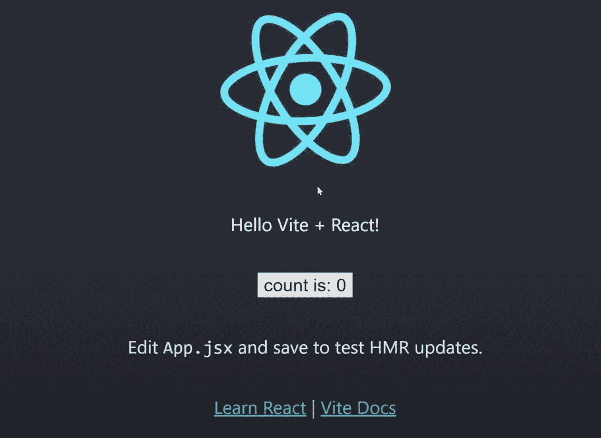
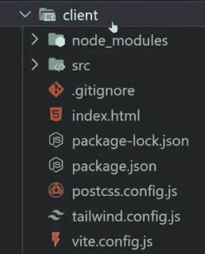
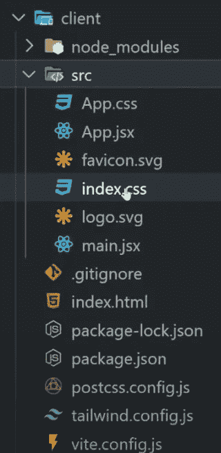

# 为 Vite、React 和 Tailwind CSS 设置环境

> 原文：<https://javascript.plainenglish.io/set-up-your-environment-for-vite-react-and-tailwind-css-1cac0e3fbf96?source=collection_archive---------1----------------------->


Photo by [Christopher Gower](https://unsplash.com/@cgower?utm_source=medium&utm_medium=referral) on [Unsplash](https://unsplash.com?utm_source=medium&utm_medium=referral)

本文旨在成为您使用 Vite + React 和 Tailwind CSS 创建新 web 项目的起点。每当你觉得不确定是否在你的设置中遗漏了什么，这是你可以依靠的指南。

# 说够了——建立你的工作环境

进入您创建 web 开发项目的文件夹。创建一个新文件夹。在这个文件夹中，创建一个名为 client 的文件夹。你现在已经:`dev/<projectName>/client`

在 VS Code(或者你最喜欢的编辑器)中打开项目文件夹，用`cd client`(终端命令)进入客户端文件夹。

## 我们将与 React，Vite 和 Tailwind CSS 一起工作。

# 邀请+反应

我们从[开始。在您的终端中键入:](https://vitejs.dev/guide/why.html)

```
npm init vite@latest
```

你会被要求具体说明一些事情

(这里有一些关于你应该和可以写什么的指导)

✔项目名称:……`./`(即客户)

✔套餐名称:……`<projectName>`

✔选择一个框架:反应

✔选择一个变体:反应

然后在你的终端里写上`npm install`。如果一切正常，编写`npm run dev`来启动您的开发服务器(localhost)。

您将看到 React 应用程序示例:



此外，我们可以利用 Tailwind CSS，它可以帮助我们添加 CSS 来更容易地对组件做出反应。以下是安装指南:[https://tailwindcss.com/docs/installation/using-postcss](https://tailwindcss.com/docs/installation/using-postcss)

# 顺风 CSS

**第一步:**

为了完成步骤 1，您需要在终端中一个接一个地编写这两个命令:

```
npm install -D tailwindcss postcss autoprefixernpx tailwindcss init
```

让我们检查一下我们的文件夹结构，请和你的比较一下。:)



**第二步:**

如果您缺少一个`postcss.config.js`文件，手动创建一个并添加以下行:

**第三步:**

转到`tailwind.config.js`文件，用安装指南中的代码替换您在那里看到的代码，并在内容中添加结尾`.jsx`，因为我们正在使用 React。

**第四步:**

将每个 tailwind 层的@tailwind 指令添加到主 CSS 文件中。我们的主 CSS 文件叫做`index.css`，不要让这个迷惑你。删除那里的所有内容，复制三个顺风指令

再次为你的定位文件夹结构。



folder structure

你的`index.css`应该是这样的:

**最后一步:**

这一步应该有助于我们验证 Vite 和 Tailwind CSS 能够很好地协同工作。转到 App.jsx 文件并编写以下代码:

然后用你的终端在你的客户端文件夹里面运行`npm run dev`；您将收到一个到 **localhost 的链接。**点击链接，评估结果。

如果你的页面左上角有 Hello world 下划线和粗体，你就可以开始编写你的网站了。编码快乐！:)))

# 结论

通过跟随并自己输入这些内容，您已经在记忆基本设置以开始您的 web 项目方面迈出了第一步。如果你被要求用 Vite 创建一个项目，并用 Tailwind CSS 作出反应，你可以把它作为一个清单。如果你有什么不清楚的地方，请写在评论区。谢谢你抽出时间。

*更多内容尽在* [***说白了. io***](http://plainenglish.io/) *。报名参加我们的* [***免费周报***](http://newsletter.plainenglish.io/) *。在我们的* [***社区获得独家访问写作机会和建议***](https://discord.gg/GtDtUAvyhW) *。*