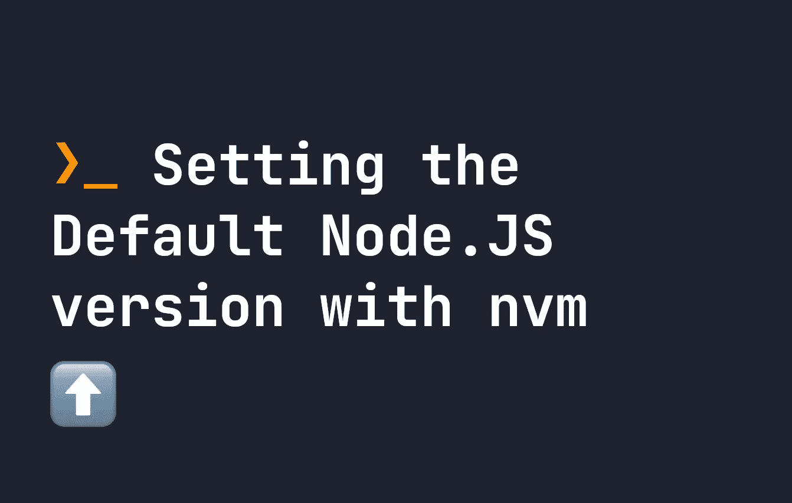

# 使用 nvm 设置默认 Node.js 版本

> 原文：<https://javascript.plainenglish.io/setting-the-default-node-js-version-with-nvm-523e7f8a00a0?source=collection_archive---------5----------------------->

## 使用 nvm 别名默认[版本]让我们设置节点的默认版本—了解 nvm 如何工作。



在 Node.js 中开发项目和产品时，设置您的计算机上正在使用的 Node.js 版本变得非常重要。`nvm`是一个非常有用的工具，可以随时改变 Node.js 的版本。如果你需要安装 nvm，你可以在这里学习如何安装。

`nvm`还允许您设置 Node.js 的默认版本，这样您就不必经常更改它。为此，您可以像这样使用`nvm`命令:

```
nvm alias default 18.10.0
```

不过，在此之前，请确保您已经安装了想要使用的版本。您可以使用`nvm install`来完成:

```
nvm install 18.10.0
```

如果您想知道有哪些版本可以设置为 Node.js 的默认版本，请尝试使用`nvm ls`，它将返回如下所示的列表。在`default -> node`行旁边，它还说明了哪个版本被设置为默认版本。

```
❯ nvm ls
       v14.15.1
        v16.4.0
       v16.13.2
       v16.14.0
->      v18.3.0
         system
default -> node (-> v18.3.0)
iojs -> N/A (default)
unstable -> N/A (default)
node -> stable (-> v18.3.0) (default)
stable -> 18.3 (-> v18.3.0) (default)
lts/* -> lts/gallium (-> N/A)
lts/argon -> v4.9.1 (-> N/A)
lts/boron -> v6.17.1 (-> N/A)
lts/carbon -> v8.17.0 (-> N/A)
lts/dubnium -> v10.24.1 (-> N/A)
lts/erbium -> v12.22.12 (-> N/A)
lts/fermium -> v14.20.0 (-> N/A)
lts/gallium -> v16.17.0 (-> N/A)
```

此外，运行`node -v`将显示您当前使用的版本。如果不是您想要的，您可以使用`nvm use default`将其设置回默认值:

```
❯ node -v
v16.18.0
❯ nvm use default
Now using node v18.3.0 (npm v8.11.0)
```

这个题目到此为止。感谢您的阅读。

*更多内容看* [***说白了。报名参加我们的***](https://plainenglish.io/) **[***免费周报***](http://newsletter.plainenglish.io/) *。关注我们关于* [***推特***](https://twitter.com/inPlainEngHQ) ，[***LinkedIn***](https://www.linkedin.com/company/inplainenglish/)*，*[***YouTube***](https://www.youtube.com/channel/UCtipWUghju290NWcn8jhyAw)*，以及* [***不和***](https://discord.gg/GtDtUAvyhW) *。对增长黑客感兴趣？检查* [***电路***](https://circuit.ooo/) *。***