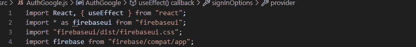
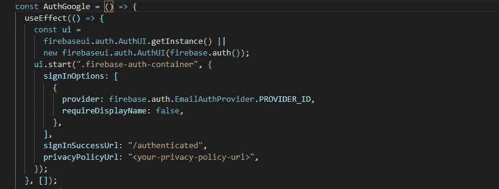
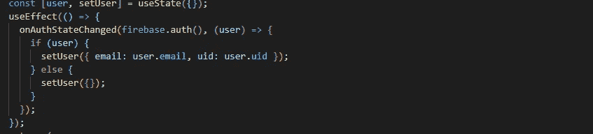
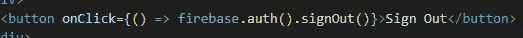

# 如何使用 React 应用程序设置 FirebaseUI

> 原文：<https://javascript.plainenglish.io/setting-up-firebase-ui-with-your-react-application-49ffa20f8168?source=collection_archive---------3----------------------->

## 使用 React 应用程序设置 FirebaseUI 的教程。


FirebaseUI+React

如果你不熟悉的话，Firebase 是谷歌提供的一项服务，它可以让你更容易地处理后端，甚至完全消除对后端的需求(无服务器)。现在，由于 Firebase UI，您甚至不需要为身份验证创建 UI 组件。到处都有几行代码，您不必管理表单、用户数据库等。

首先要做的是创建一个 react 项目，你当然可以在安装完成后移除所有不必要的脚手架。接下来，在 Firebase 控制台中创建一个 Firebase 项目，然后导航到该项目的设置页面，并通过单击 add a new web app 向 Firebase 项目添加一个 web 应用程序，这将为我们提供必要的身份验证凭据，您可以使用这些凭据将 Firebase 连接到 react 应用程序。复制凭证并简单地将它们粘贴到应用程序的 *App.js* 文件中。

建议尽早初始化 Firebase。然后在 Firebase 项目中导航到 authentication，然后单击 sign-in method 选项并启用一个提供者，您可以看到不同的选项。我们会去一个简单的电子邮件/密码认证。下面你可以添加授权域重定向，这主要是当你想使用第三方重定向。

接下来是软件包的安装:

```
npm install firebaseui firebase
```

您需要的两个包是 Firebase 和 FirebaseUI。出于代码分割和更好管理的目的，创建一个新文件，并将其命名为 AuthGoogle.js(当然，您可以随意命名)。

在这个文件中，我们需要一些导入。我们从“firebase/compat/app”导入 Firebase。接下来，我们需要从 FirebaseUI 导入所有内容，因为没有默认导出。最后，我们引入了表单的 CSS 样式，这是由 google 通过从“firebaseui/dist/firebaseui.css”导入自动提供的。



How Imports in AuthGoogle.js file should look like

我们需要在 useEffect 钩子内部设置 Firebase UI。这是因为 Firebase 会将屏幕上的一个元素作为安装 Google 身份验证 UI 的目标(您可能知道，这是一个副作用，因为它会导致 DOM 发生变化)。下图显示了用户界面应该如何设置:



Firebase ui set-up

我们首先通过调用`firebase.auth.AuthUI.getInstance()`来查看我们是否有一个现有的 UI 实例，如果它不存在，我们通过调用 new `firebase.auth. AuthUI(firebase.auth())`来创建一个新的 Firebase 实例。然后我们调用`ui.start()`来实际安装 UI。作为第一个参数，我们传递页面上目标元素的类，也就是页面上要安装表单的元素。确保您已经在页面上创建了具有该类名(通常作为 div)的元素。

注意:`Firebase.auth()`初始化 SDK 的认证。

作为第二个参数，我们传递一个对象，该对象包含 UI 的一些配置。我们在这里设置的第一个选项是“登录选项”。这是一个数组，包含我们希望添加到应用程序中的不同身份验证方法的对象。我们只需要电子邮件认证，因此，我们将提供者设置为`firebase.auth.EmailAuthProvider.PROVIDER_ID`。第二，我们不显示注册时要求的姓名，因此，我们将`requireDisplayName`设置为`false`。主选项属性上的第二个属性是`signInsuccessUrl`。这是成功认证后用户将被重定向到的 URL。最后是隐私政策网址。还有许多其他选项可以探索，你可以在这里探索 [Github 链接到 Firebase UI](https://github.com/firebase/firebaseui-web/blob/master/README.md#overwriting-the-sign-in-success-url) 。不要忘记将依赖数组添加到 useEffect 钩子中。

现在回到 App.js 文件，我们引入了'<authgoogle>'组件。</authgoogle>

现在出现的一个重要问题是，我们的应用程序如何知道用户是否被正确认证，以及我们如何获得用户的详细信息。嗯，我们可以用 Google 提供的方法`onAuthStateChanged()`来实现，我们可以从`import {onAuthStateChanged} from ‘firebase/auth`中得到这个方法。我们还在 useEffect 钩子中调用这个方法。作为第一个参数，它接受`firebase.auth()`。作为第二个参数，接受一个回调函数，该函数接收一个用户对象，该对象包含关于用户的所有必要信息；如电子邮件、uid、电话号码等。您可以设置某种状态管理来存储您想要的信息，您还可以利用该状态来检查用户是否经过身份验证并进行适当的重定向。



onAuthStateChanged

最后，我们如何实现注销？。所以我们可以简单地在认证页面中创建一个按钮，并传递给 onClick 一个调用`firebase.auth().signOut()`的函数。



Implementation on Sign Out.

如果你觉得这有帮助，你可以给我留点掌声。；)

我也有一个 YouTube 视频解释了这一点。

*更多内容请看*[***plain English . io***](https://plainenglish.io/)*。报名参加我们的* [***免费周报***](http://newsletter.plainenglish.io/) *。关注我们关于*[***Twitter***](https://twitter.com/inPlainEngHQ)*和*[***LinkedIn***](https://www.linkedin.com/company/inplainenglish/)*。查看我们的* [***社区不和谐***](https://discord.gg/GtDtUAvyhW) *加入我们的* [***人才集体***](https://inplainenglish.pallet.com/talent/welcome) *。*