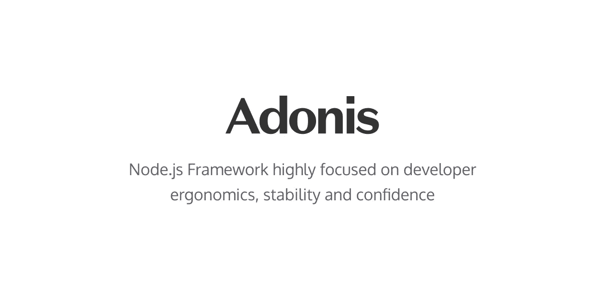
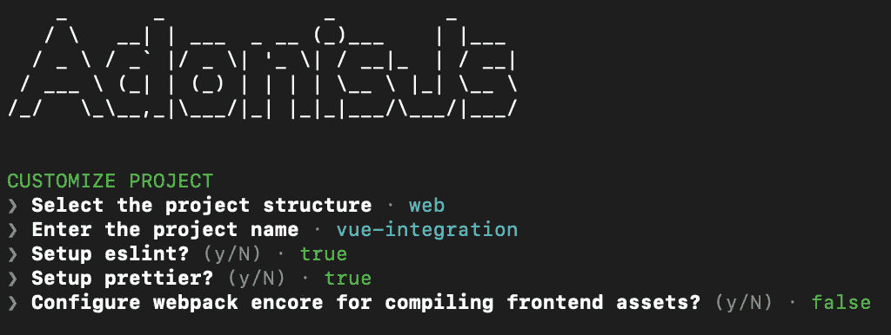
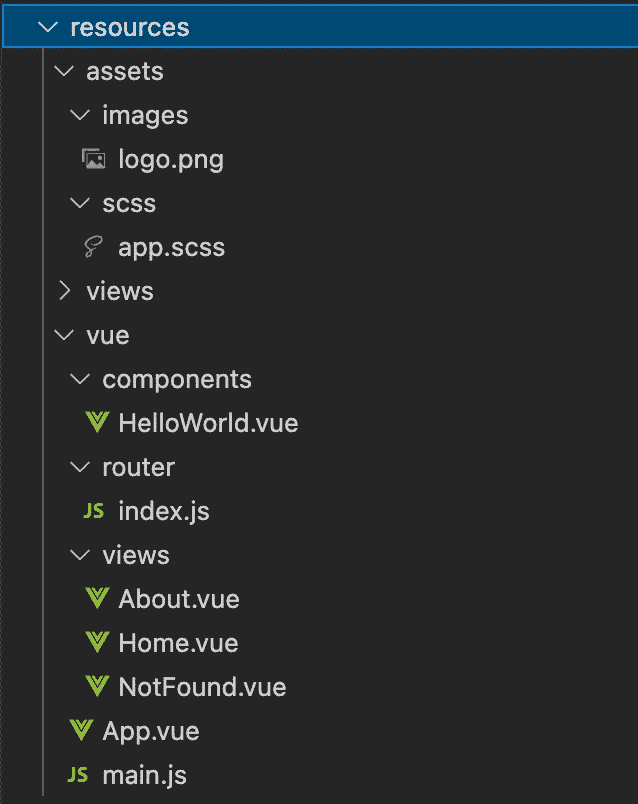
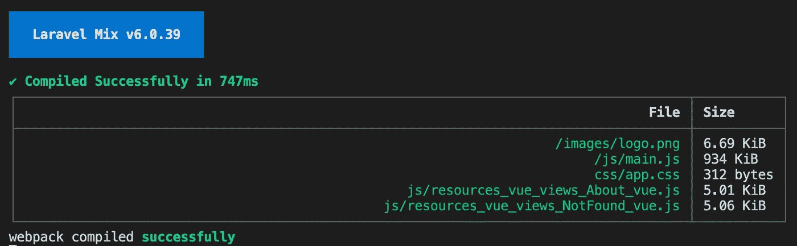
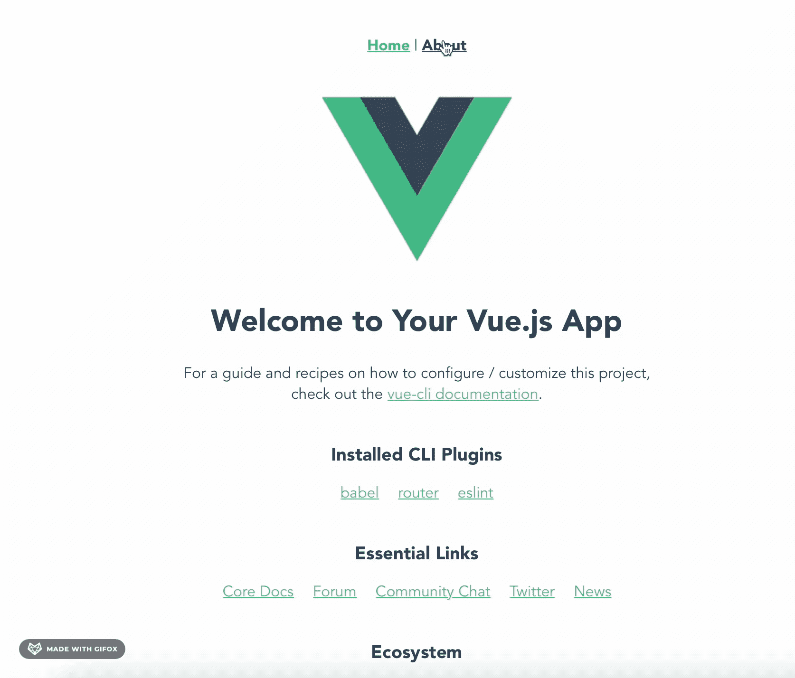

# 如何使用 Laravel Mix 设置 Vue 3 & AdonisJS

> 原文：<https://javascript.plainenglish.io/setting-up-vue-3-adonis-js-using-laravel-mix-d0107cffd9df?source=collection_archive---------8----------------------->

## 使用 Laravel Mix 轻松设置 Vue 3 & AdonisJS 的详细指南。



[https://github.com/adonisjs](https://github.com/adonisjs)

AdonisJS 是类似 Laravel 的全栈 Node.js 框架之一，与 Laravel 相比有一些好处。我使用 AdonisJS 的原因之一是因为一些区块链项目(Eth/Algo)只提供 JavaScript SDKs。当然，我们可以在我们的全栈项目中使用我们的前端(Vue.js/React)处理所有与区块链开发相关的事情，但是如果我们的后端根本不支持那些 SDK，这可能不是很灵活。

> AdonisJS 包含了创建全功能 web 应用程序或 API 服务器所需的一切。[https://adonisjs.com](https://adonisjs.com)

我们知道 AdonisJS 有一个前端的边缘模板引擎。但是有时候，使用&集成另一个前端比如 Vue.js 也是选项之一。Vue.js 很受欢迎，我猜很多开发人员已经知道 Vue.js 比 Edge 好。但是可以肯定的是，如果我们知道如何使用 Edge 进行开发，将会更加方便快捷。但是今天，我要向大家展示如何使用 Laravel Mix 来集成 Vue 3 和 AdonisJS。

# 内容概述

*   Adonis & Laravel 混合设置
*   Vue 3 设置

## #1 Adonis & Laravel 混合设置

首先，让我们从安装 Adonis 项目开始。在这个例子中，我将创建一个名为 *vue-integration 的新项目文件夹。*

```
npm init adonis-ts-app@latest vue-integration
```

第一次安装会问你几个问题，你可以选择任何你喜欢的选项。



AdonisJS Installation

然后，我们需要为 Laravel mix 安装一些必需的包。稍后，Laravel mix 将帮助我们编译我们的 Vue 项目。

```
npm i adonis-mix-asset && npm i --save-dev laravel-mix
```

安装完成后，我们需要为 Adonis 项目配置 *webpack* 。

```
node ace invoke adonis-mix-asset
```

在上面的命令之后， *webpack.mix.js* 将被创建在根文件夹上。我们打开修改一下吧。

*webpack.mix.js*

我们的 *webpack* 所做的是，它稍后会将 *resources/vue/main.js* 视为我们 vue 项目的起点。然后，当然，它检索一些额外的选项，比如帮助我们稍后编译 sass。

然后，我们需要在边缘文件下放一个脚本。让我们在*resources/views/index . edge*下创建一个新的 edge 文件

*resources/views/index.edge*

让我们更新 *start/routes.ts* 下的 Adonis 路线。因此，任何终端用户稍后访问都将被重定向到我们的 Vue 应用。

start/routes.ts

一切都好！现在是时候设置我们的 Vue 3 JS 了。

## #2 Vue 3 设置

让我们从我们的 Vue 项目所需的包开始。

```
npm i vue@3.0.0 vue-router@next && npm i -D @vue/compiler-sfc sass sass-loader vue-loader@^16.8.3 autoprefixer postcss
```

> 注意 Vue 3 的安装有点棘手。如果您使用不同的软件包版本，编译可能会失败。请看看你正在使用的软件包版本。

在这个例子中，我将把所有与 Vue 应用程序相关的东西放在 *resources/vue* 目录下。最终，我们将拥有一个 Vue 路由器、组件和用于我们的 Vue 的页面。



Put “Vue App” related under *resources/vue* directory

我将向您展示 Vue 3 设置的两个重要组件:*路由器*和 *main.js* 文件。其余的 Vue 组件将不会被涵盖，因为它将是更多的前端代码，但你可以在我的 Github 中看到这篇文章下面的例子。

让我们打开(或创建) *resources/vue/main.js* 文件，作为我们开发 vue 应用程序的起点。

resources/vue/main.js

然后对于*resources/vue/router/index . js*下的路由

resources/vue/router/index.js

就是这样！为了编译我们的 Vue 应用程序，我们需要 Laravel mix 来帮助我们。

```
node ace mix:watch # Development
node ace mix:build # Production Build
```



Mix compiling Vue 3

然后，让我们启动 Adonis 服务器来查看我们的 web 应用程序。

```
node ace serve --watch # Development
node ace build --production # Production Build
```



AdonisJS + Vue 3 using Laravel Mix

瞧，现在我们的 AdonisJS 在 Laravel mix 的帮助下，将 Vue 3 作为我们的前端。

Vue 3 相比 Vue 2 有很大的性能提升，这也是我在本文中使用 Vue 3 的原因。此外，设置 Vue 3 有点棘手，如果我们安装了不同的软件包版本，可能会导致编译失败。看看下面我的 Github 里我的 *package.json* 吧，如果你不能成功编译你的 Vue 3，供你参考。

# 资源

[](https://dev.to/amirhoseinsalimi/integrate-vue-js-and-adonis-js-v5-using-laravel-mix-p0i) [## 使用 Laravel Mix 集成 Vue.js 和 Adonis.js v5

### 在这篇文章中，我们将在新创建的 Adonis.js v5 项目中设置 Vue.js。我们也要写单曲…

开发到](https://dev.to/amirhoseinsalimi/integrate-vue-js-and-adonis-js-v5-using-laravel-mix-p0i) [](https://github.com/Cerwyn/AdonisJS-Vue3-Integration/) [## GitHub-cer wyn/AdonisJS-vue 3-集成

### 此时您不能执行该操作。您已使用另一个标签页或窗口登录。您已在另一个选项卡中注销，或者…

github.com](https://github.com/Cerwyn/AdonisJS-Vue3-Integration/) 

*更多内容请看*[*plain English . io*](http://plainenglish.io/)*。报名参加我们的* [*免费每周简讯*](http://newsletter.plainenglish.io/) *。在我们的* [*社区不和谐*](https://discord.gg/GtDtUAvyhW) *获取独家写作机会和建议。*