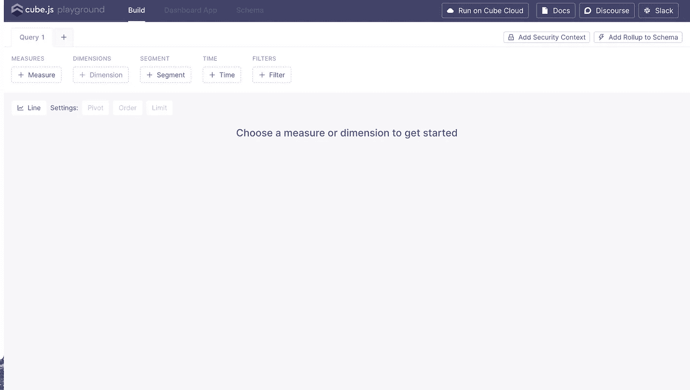
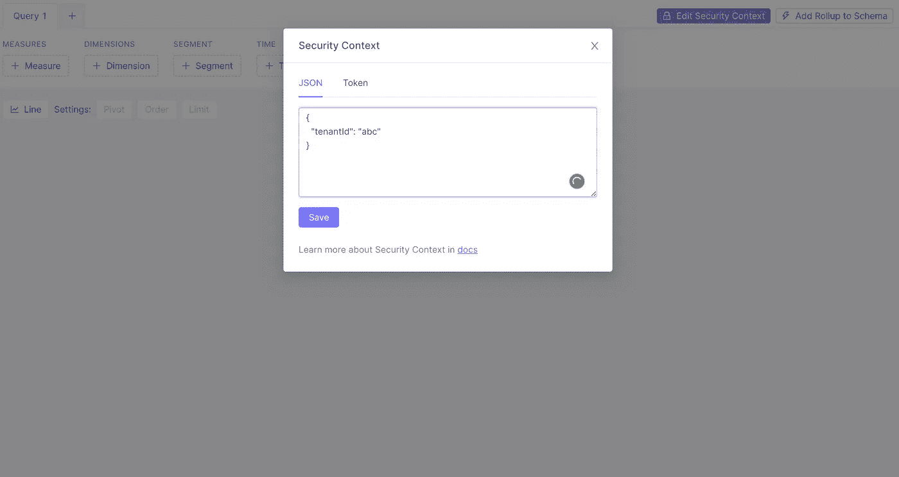

# 使用 MongoDB 设置 Cube.js(以及多租户配置)

> 原文：<https://javascript.plainenglish.io/setup-cubejs-with-mongodb-along-with-multi-tenant-configuration-d760258b5bbf?source=collection_archive---------0----------------------->

## 关于如何为多租户配置和 MongoDB 数据库设置 Cube.js 的教程

我已经使用 Cube.js 一年了，这个库提供的优势是值得称赞的。随着越来越多的活跃社区，这个图书馆向它的用户承诺了一个伟大的特性。


Cube js documentation — [https://cube.dev/docs/](https://cube.dev/docs/)

在本教程中，我们将学习如何为多租户配置和 MongoDB 数据库设置 Cube.js，是的，这次我们为您介绍了 Mac M1 芯片。

在开始之前，请记住安装 MongoDB 并运行 mongod 实例。


# **设置 Cube.js 项目:**

因为 MongoDB 是一个非关系数据库，所以它需要被采样到一个关系数据库中，比如 MySQL 数据库。mongoBI 连接器通过让您在 MongoDB 上运行 MySQL 查询来智能地完成这项工作。然而，MongoDB 按照特定的规则展平你的集合，更多关于这个[**这里**](https://www.mongodb.com/blog/post/bi-connector-mapping-document-structures-to-relational-schema-part-1) 。

1.  根据您的操作系统版本
    [https://www.mongodb.com/try/download/bi-connecto](https://www.mongodb.com/try/download/bi-connector)r 下载 mongoBI 连接器的 tar 或 zip 文件

```
Mac users will OpenSSL , which can be installed via the following commands
/usr/bin/ruby -e “$(curl -fsSL https://raw.githubusercontent.com/Homebrew/install/master/install)"brew updatebrew install openssl
```

2.据观察，Mac M1 芯片会导致 OpenSSL 安装出现问题。请参考以下资源中的步骤，让您的设置正常工作
[https://noahpeeters.de/posts/apple-silicon/homebrew-setup/](https://noahpeeters.de/posts/apple-silicon/homebrew-setup/)

3.解压缩您的 mongoBI 下载文件并导航到 bin 目录。使用以下命令安装 mongoBI 连接器:

```
> sudo install -m755 bin/mongo* /usr/local/bin/
```

4.从终端运行以下命令来启动 mongoBI 连接器并对数据库进行采样:

```
> mongosqld
```

5.如果一切正常，您应该在您的 shell 中看到一条关于`mongosqld`进程的成功日志消息:
`[initandlisten] waiting for connections at 127.0.0.1:3307`

6.要启动您的应用程序，请使用以下命令以及您的项目名称:

```
> npx cubejs-cli create <name of the application> -d mongobi
```

7.设置各自的环境变量:

```
CUBEJS_API_URL = “[http://localhost:4000](http://localhost:4000)"
CUBEJS_API_SECRET = “e863ce0c26e4aaacc44b4cdef3abfaefe4ad3b488908cf89a256aaa9c3876e51cdd29abbc85115e75a510e4fda4c0857b706272e3faeffbf5e7b58efbd27d707”
CUBEJS_DB_HOST=localhost
CUBEJS_DB_NAME=Test
CUBEJS_DB_PORT=3307
CUBEJS_WEB_SOCKETS=true
CUBEJS_DEV_MODE=true
CUBEJS_DB_TYPE=mongobi
CUBEJS_CACHE_AND_QUEUE_DRIVER=memory
CUBEJS_SCHEDULED_REFRESH_TIMER=60
CUBEJS_EXTERNAL_DEFAULT=true
DEBUG_LOG=true
CUBEJS_REFRESH_WORKER=true
```

请根据您感兴趣的数据库名称和端口名称设置 CUBEJS_DB_NAME 和 CUBEJS_DB_PORT。我们将在开发人员模式下运行 Cube.js，并使用 refresh worker 进行无头缓存(这不是必需的，但将取决于您的用例)。有关上述环境变量的更多信息，请参见[这里的](https://cube.dev/docs/reference/environment-variables#environment-variables)。

8.使用以下内容启动应用程序:

```
>  npm run dev
```

您可以从“localhost:4000”开始获取 Cube.js playground



# **设置多租户配置:**

1.  我们可以为您的每个集合包含多个租户的数据。为了过滤每个租户的数据，我们将参考“租户”集合中的 *tenantId* 字段创建一个租户多维数据集。

2.我们需要通过连接操作在感兴趣的多维数据集和租户集合之间创建适当的连接，例如:

3.将查询重写过滤器添加到 Cube.js 配置文件中的“module.exports”对象，以根据安全上下文的请求获取特定 tenantId 的数据。

4.现在，我们已经在租户多维数据集和各自的过滤器之间建立了连接，我们可以通过安全上下文从请求特定租户 Id 的数据。

5.转到 Cube.js playground，单击“Add security Context”选项卡添加一个特定的安全上下文，然后单击“Save”按钮。



Add security context via the “Add security tab” in Cube.js playground

6.Tada！您应该能够获得所请求的租户 Id 的数据。

感谢您的参与，请在下面的评论区留下您的意见和建议。

*更多内容看* [***说白了就是***](https://plainenglish.io/) *。报名参加我们的* [***免费周报***](http://newsletter.plainenglish.io/) *。关注我们关于* [***推特***](https://twitter.com/inPlainEngHQ)**和*[***LinkedIn***](https://www.linkedin.com/company/inplainenglish/)*。查看我们的* [***社区不和谐***](https://discord.gg/GtDtUAvyhW) *加入我们的* [***人才集体***](https://inplainenglish.pallet.com/talent/welcome) *。**