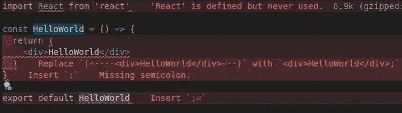

# 使用绝对导入在 React 应用程序中设置 ESLint 和更漂亮(2023)

> 原文：<https://javascript.plainenglish.io/setup-eslint-and-prettier-in-a-react-app-2022-ec09be9f0407?source=collection_archive---------3----------------------->


Prettier & ESLint

在开发 React 应用程序时，如果在开发应用程序时处理不当，小的打字错误和错误可能会导致大问题。当涉及到林挺和格式化基于 JavaScript 的 React 应用程序时， **ESlint** 和**beautiful**是开发人员的首选。所以在这篇文章中，我们将为 React 应用程序设置 Eslint 和 Prettier。

# 1.设置绝对进口

相对路径是在 React 中添加导入的默认行为，一旦项目变得复杂，这将使项目看起来杂乱无章。相反，我们可以使用**绝对路径**来添加导入，只需在项目的根级别添加一个新的`**jsconfig.json**` 文件，如下所示:

Adding support for absolute imports in React

添加文件后，可以重新组织导入，如下所示:

```
// Absolute Import
import HelloWorld from 'components/HelloWorld';// Relative Import
import HelloWorld from '../../components/HelloWorld';
```

# 2.安装依赖项

继续设置 eslint 和 Prettier，我们需要使用下面给出的命令在应用程序中添加一系列依赖项，如 babel、eslint、eslint-config、import resolver 和 ESLint 插件。

```
npm install --save-dev @babel/core@7.18.6 @babel/eslint-parser@7.18.2 @babel/preset-react@7.18.6 eslint@8.1.0 eslint-config-prettier@8.5.0 eslint-import-resolver-jsconfig@1.1.0 eslint-plugin-import@2.26.0 eslint-plugin-prettier@4.2.1 eslint-plugin-react@7.30.1 prettier@2.7.1
```

提到了用于特定依赖项的确切版本，因为它们相互依赖才能正常工作，但是如果您想使用最新版本，可以使用以下命令安装最新版本:

```
npm install --save-dev @babel/core @babel/eslint-parser @babel/preset-react eslint eslint-config-prettier eslint-import-resolver-jsconfig eslint-plugin-import eslint-plugin-prettier eslint-plugin-react prettier
```

# 3.添加 ESLint 配置文件

ESLint 配置可以通过命令行使用命令`eslint --init`生成，并回答一些关于要遵循的代码约定的问题，或者使用一些现有的配置，如下所示。这个配置已经解决了 prettier 和 eslint 之间的引用和缩进规则冲突的问题。为了使用这个配置，您需要在项目的根目录下创建一个新文件`**.eslintrc.json**`。

ESLint Configuration

**随意使用上面定义的规则或扩展一些常用的配置，如**[**eslint-config-Airbnb**](https://www.npmjs.com/package/eslint-config-airbnb)**，**[**eslint-config-Google**](https://www.npmjs.com/package/eslint-config-google)**等**，以便找出最适合您项目的配置。

# 4.更新脚本

现在为了测试林挺命令，让我们通过添加下面给出的命令来更新我们的`package.json`文件中的`scripts`:

```
"lint": "eslint . --max-warnings=0",
"lint:fix": "eslint . --max-warnings=0 --fix"
```

`--max-warnings`标志有助于确保在使用提交前检查提交代码之前开发的代码是 lint，而没有任何警告，而`--fix`标志可自动修复错误/警告。一旦完成，我们就可以通过运行下面的命令来测试 ESLint 配置，该命令将扫描项目中的所有 JavaScript 文件。

```
npm run lint
```

# 5.更新 VSCode 的设置

我们可以更新 VSCode 配置，使其显示林挺和格式错误，并在保存文件时修复可自动修复的错误。为了实现这一点，我们需要安装一些扩展: [**ESLint**](https://marketplace.visualstudio.com/items?itemName=dbaeumer.vscode-eslint) 和[](https://marketplace.visualstudio.com/items?itemName=esbenp.prettier-vscode)**。我还建议安装[错误透镜](https://marketplace.visualstudio.com/items?itemName=usernamehw.errorlens)，它有助于在编写代码时突出显示文件本身的错误/警告。一旦完成，我们需要添加一个新的`.vscode/settings.json`文件到项目的根目录，如下所示:**

**VSCode Setting file**

# **结论**

**一旦所有这些配置都完成了，ESLint 和 appellister 应该可以运行林挺了，并格式化你的项目，如附件截图所示:**

****

**Linting and formatting errors displayed using Error Lens**

**以下是 Github 上完整设置的链接:**

**[](https://github.com/eshankvaish/react-linting) [## GitHub-eshankvaish/react-林挺:React 应用支持 ESLint 和更漂亮

### 这个项目是用 Create React App 引导的。在项目目录中，您可以运行:在…中运行应用程序

github.com](https://github.com/eshankvaish/react-linting) 

> *感谢阅读。一定要让我知道你对用 React 应用程序设置 ESLint 和 Prettier 的想法。*

```
Want to connect?
React out on [Twitter](https://twitter.com/eshankvaish), [LinkedIn](https://www.linkedin.com/in/eshankvaish/) or in the comments below!
```

*更多内容请看*[***plain English . io***](https://plainenglish.io/)*。报名参加我们的* [***免费周报***](http://newsletter.plainenglish.io/) *。关注我们关于*[***Twitter***](https://twitter.com/inPlainEngHQ)*和*[***LinkedIn***](https://www.linkedin.com/company/inplainenglish/)*。查看我们的* [***社区不和谐***](https://discord.gg/GtDtUAvyhW) *加入我们的* [***人才集体***](https://inplainenglish.pallet.com/talent/welcome) *。***