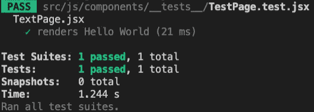

# 为单元测试建立 Jest 和 React 测试库

> 原文：<https://javascript.plainenglish.io/setup-jest-and-react-testing-library-for-unit-testing-9be43df32fd5?source=collection_archive---------3----------------------->


自从`create-react-app`成为一个流行的工具，许多关于 React 的教程都把它作为入门。但是我决定自己建立环境来学习`create-react-app`为我们做了什么，并确保我们也可以建立测试环境而不依赖于工具。

我观察了流行的 starter 项目，并获取了我需要的代码，以确保我以最佳实践编写这些设置。因此，你会看到一些来自`create-react-app`的代码。

# **演示**储存库

如果你想看一个完整的例子，我创建了一个样板用于演示:[https://github.com/tabsteveyang/react-jest-rtl-boilerplate](https://github.com/tabsteveyang/react-jest-rtl-boilerplate)

# **设置配置**

## **依赖关系**

这些是你需要的包裹。您可以单独安装它，或者将下面的代码添加到 package.json 文件的 devDependencies 块中，然后一起安装它们:

```
"babel-preset-react-app": "^10.0.0",
"react-app-polyfill": "^2.0.0",
"react-test-renderer": "^17.0.2",   // (optional) for snapshot test
"redux-mock-store": "^1.5.4",       // (optional) for mocking redux
"babel-jest": "^26.6.0",
"@testing-library/jest-dom": "^5.14.1",
"@testing-library/react": "^11.2.7",
"@testing-library/user-event": "^12.8.3",
"jest": "26.6.0",
"jest-circus": "26.6.0",
"jest-resolve": "26.6.0",
"jest-watch-typeahead": "0.6.1"
```

## **入口点**

## **1。入口点的文件**

这是 JS 文件，用于设置 env 变量，从命令中接收参数，并要求 Jest 开始运行测试

```
// jest/scripts/test.jsprocess.env.BABEL_ENV = 'test'
process.env.NODE_ENV = 'test'
process.env.PUBLIC_URL = ''const jest = require('jest')
const argv = process.argv.slice(2)
jest.run(argv)
```

## 2.更新脚本

更新 package.json 文件中脚本块的 test 属性，这样我们就可以简单地运行`【T3 ]'来开始测试:

```
"scripts": {
  "test": "node jest/scripts/test.js",
}
```

## **3。用于转换的 JS 文件**

这些是将特定扩展名的文件转换成 Jest 可以使用的格式的 JS 文件:

*   babelTransform.js

```
'use strict'const babelJest = require('babel-jest')
const hasJsxRuntime = (() => {
  if (process.env.DISABLE_NEW_JSX_TRANSFORM === 'true') {
    return false
  } try {
    require.resolve('react/jsx-runtime')
    return true
  } catch (e) {
    return false
  }
})()module.exports = babelJest.createTransformer({
  presets: [
    [
      require.resolve('babel-preset-react-app'),
      {
        runtime: hasJsxRuntime ? 'automatic' : 'classic'
      }
    ]
  ],
  babelrc: false,
  configFile: false
})
```

*   cssTransform.js

```
'use strict'// This is a custom Jest transformer turning style imports into empty objects.
// [http://facebook.github.io/jest/docs/en/webpack.html](http://facebook.github.io/jest/docs/en/webpack.html)module.exports = {
  process() {
    return 'module.exports = {};'
  },
  getCacheKey() {
    // The output is always the same.
    return 'cssTransform'
  }
}
```

*   文件转换. js

```
'use strict'const path = require('path')
const camelcase = require('camelcase')// This is a custom Jest transformer turning file imports into filenames.
// [http://facebook.github.io/jest/docs/en/webpack.html](http://facebook.github.io/jest/docs/en/webpack.html)module.exports = {
  process(src, filename) {
    const assetFilename = JSON.stringify(path.basename(filename))if (filename.match(/\.svg$/)) {
      // Based on how SVGR generates a component name:
      // [https://github.com/smooth-code/svgr/blob/01b194cf967347d43d4cbe6b434404731b87cf27/packages/core/src/state.js#L6](https://github.com/smooth-code/svgr/blob/01b194cf967347d43d4cbe6b434404731b87cf27/packages/core/src/state.js#L6)
      const pascalCaseFilename = camelcase(path.parse(filename).name, {
        pascalCase: true
      })
      const componentName = `Svg${pascalCaseFilename}`
      return `const React = require('react');
      module.exports = {
        __esModule: true,
        default: ${assetFilename},
        ReactComponent: React.forwardRef(function ${componentName}(props, ref) {
          return {
            $$typeof: Symbol.for('react.element'),
            type: 'svg',
            ref: ref,
            key: null,
            props: Object.assign({}, props, {
              children: ${assetFilename}
            })
          };
        }),
      };`
    }return `module.exports = ${assetFilename};`
  }
}
```

## **4。在运行任何测试之前运行的 JS 文件**

创建一个文件来存放在运行测试之前应该运行的所有逻辑。它通常被称为 setupTests.js，文件中的代码应该是这样的:

```
// import the modules that most tests will need
import '[@testing](http://twitter.com/testing)-library/jest-dom'
import React from 'react'
import ReactDom from 'react-dom'
import PropTypes from 'prop-types'// if there are some settings like below in your webpack.config.js, you can mock it in this way:
// new webpack.ProvidePlugin({
//   React: 'react',
//   ReactDom: 'react-dom',
//   PropTypes: 'prop-types'
// })
global.React = React
global.ReactDom = ReactDom
global.PropTypes = PropTypes
```

## **5。笑话配置**

完成上述步骤后，我们终于可以编写 Jest 的配置并将所有这些设置链接在一起了！

根据文档，您可以将 Jest 的配置放在 package.json 文件或 jest.config.js 文件中。我决定将设置放在 jest.config.js 文件中，以防我需要在配置中使用一些变量，并保持 package.json 文件整洁。

```
module.exports = {
  roots: [
    '<rootDir>/src'
  ],
  collectCoverageFrom: [
    'src/**/*.{js,jsx,ts,tsx}',
    '!src/**/*.d.ts'
  ],
  setupFiles: [
    'react-app-polyfill/jsdom'
  ],
  setupFilesAfterEnv: [
    '<rootDir>/jest/scripts/setupTests.js'
  ],
  testMatch: [
    '<rootDir>/src/**/__tests__/**/*.{js,jsx,ts,tsx}',
    '<rootDir>/src/**/*.{spec,test}.{js,jsx,ts,tsx}'
  ],
  testEnvironment: 'jsdom',
  transform: {
    '^.+\\.(js|jsx|mjs|cjs|ts|tsx)$': '<rootDir>/jest/transforms/babelTransform.js',
    '^.+\\.css$': '<rootDir>/jest/transforms/cssTransform.js',
    '^(?!.*\\.(js|jsx|mjs|cjs|ts|tsx|css|json)$)': '<rootDir>/jest/transforms/fileTransform.js'
  },
  transformIgnorePatterns: [
    '[/\\\\]node_modules[/\\\\].+\\.(js|jsx|mjs|cjs|ts|tsx)$',
    '^.+\\.module\\.(css|sass|scss)$'
  ],
  modulePaths: [],
  moduleFileExtensions: [
    'web.js',
    'js',
    'web.ts',
    'ts',
    'web.tsx',
    'tsx',
    'json',
    'web.jsx',
    'jsx',
    'node'
  ],
  watchPlugins: [
    'jest-watch-typeahead/filename',
    'jest-watch-typeahead/testname'
  ],
  resetMocks: true
}
```

假设您在 webpack.config.js 文件中声明了某个别名。在这种情况下，您可能还需要添加 moduleNameMapper 的设置，以使别名在运行测试时起作用:

```
moduleNameMapper: {
  '^[@js](http://twitter.com/js)(.*)$': '<rootDir>/src/js$1',
  '^[@scss](http://twitter.com/scss)(.*)$': '<rootDir>/src/scss$1',
  '^[@img](http://twitter.com/img)(.*)$': '<rootDir>/img$1'
},
```

# **用于**检查设置的第一个测试文件

最后，在完成所有设置后，我们现在可以创建一个简单的测试文件来确保它按预期工作。

```
// src/js/components/_tests_/TestPage.test.jsx,
// for testing: src/js/components/TestPage.jsx file.import { render, screen } from '[@testing](http://twitter.com/testing)-library/react'
import TestPage from '../TestPage'test('renders Hello World', () => {
  render(<TestPage />)
  const linkElement = screen.getByText(/Hello World/i)
  expect(linkElement).toBeInTheDocument()
})
```

并在命令行中运行命令开始测试:

```
cd <project_path>
npm run test
```

要与 Jest 交互，您可以运行以下代码:

测试后该过程不会终止；它将等待您的命令，直到您关闭它。

```
node run test -- --watchornode jest/scripts/test.js --watch
```

如果您得到下面的回复，一切都准备好了！



PASS!

# **结束**

为 React 组件的单元测试建立环境不是一件简单的任务，所以当我最终想出如何让它工作时，我决定写下步骤。

不幸的是，编写测试也很棘手。尽管试着弄清楚如何处理它很有趣，但我仍然希望我能得到更多的例子来说明我实际上可以为测试特定场景做些什么。因此，我将写另一篇文章来分享我在与它斗争中获得的经验😆


*更内容于* [***通俗地说就是***](http://plainenglish.io/) *。报名参加我们的* [***免费周报***](http://newsletter.plainenglish.io/) *。在我们的* [***社区纠纷***](https://discord.gg/GtDtUAvyhW) *中获得独家写作机会和建议。*