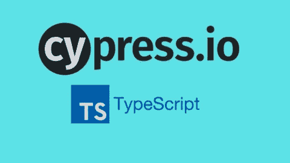
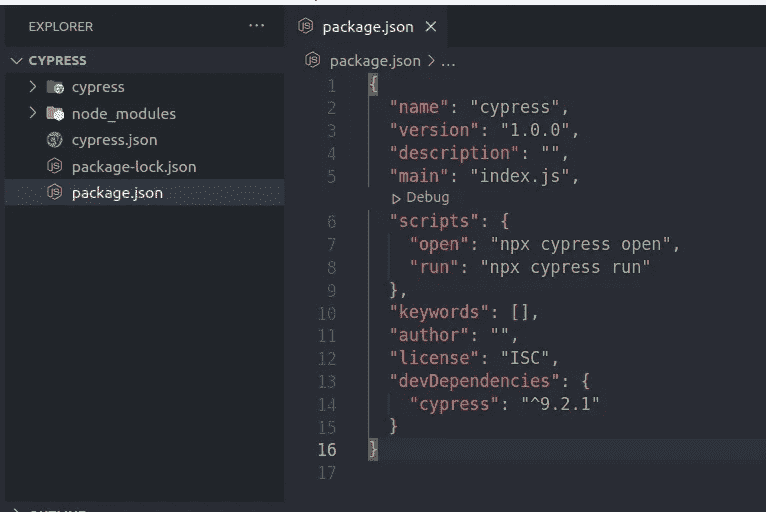
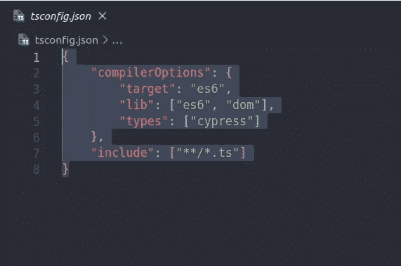
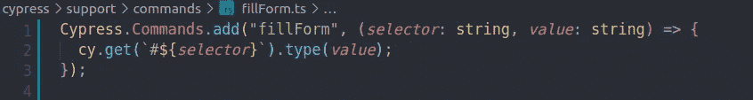
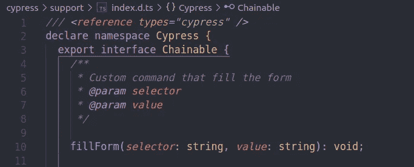
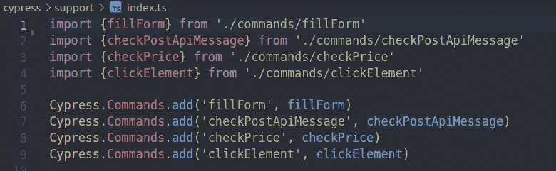
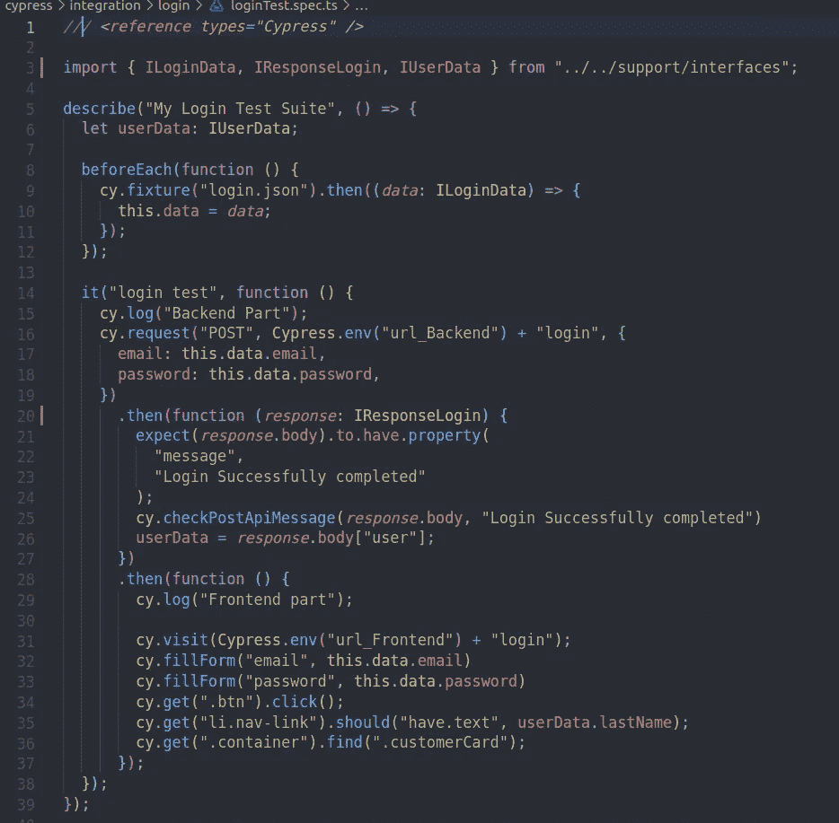

# 在 Cypress 上轻松设置打字稿只需 4 个步骤

> 原文：<https://javascript.plainenglish.io/setup-typescript-in-cypress-in-4-steps-easily-78a6a8f60860?source=collection_archive---------1----------------------->



Setup TypeScript in Cypress

本文包括将 js-cypress 测试套件升级到 TypeScript。如您所知，TypeScript 在最近几年仍然非常受欢迎。此外，选择它是因为它为您提供了类型定义、静态类型检查，并且如果您已经在项目中使用了 TypeScript，您可以轻松地在它们之间建立无缝连接。它们通常是不需要的，但是如果你需要 webpack 或 bubble 设置，它们是为你准备的。

***第一步:下载打字稿***

如果你是新手，可以去[打字稿网页](https://www.typescriptlang.org/)那里有游乐场。你可以在浏览器里摆弄它，而不必下载任何东西。

当你`init`。您的 Cypress your package.json 文件将如下所示。在您的依赖项中，只有 Cypress 或您需要的东西，如 mochawesome、cypress-iframe。这里我们需要做的是将 TypeScript 添加到您的依赖项中。

> 用 npm 或纱线，`npm install typescript --save-dev`



After initializing of cypress

***第二步:创建一个 tsconfig.json***



您可以轻松地从[文档](https://docs.cypress.io/guides/tooling/typescript-support#Set-up-your-dev-environment)中复制粘贴。我已经把 target 和 lib 这样的东西从“es5”改成了“es6”。目标是 JS 特性将被降级，并且大多数现代浏览器支持“es6”。Lib 是内置 JavaScript API 的默认类型脚本或类型定义集。这里有“dom ”,因为我们选择的是 DOM 元素。我们在类型中声明“cypress ”,因为我们从 Cypress 而不是 Chai、jQuery 或 Mocha 中获得类型定义。如你所知，你不需要下载那些来在 Cypress 中使用，它们已经是内置的了。我们在这里包括了一个部分。两个星号，一个前闪，一个星号。这意味着带有 ts 扩展名的文件名或模式将包含在这个项目中。您可以根据您的项目设置您的包含模式。

***第三步:index.d.ts***

这是我创建 index.d.ts 最简单易懂的方法。命令有助于为 Cypress 创建自定义命令。它使你的代码更容易重用和理解。

在/ <your_project_name>/cypress/support 中删除命令和 index.js 文件。命令有助于为 Cypress 创建自定义命令。并创建一个 commands 文件夹，在其中编写您的自定义命令。您的项目目录将如下所示:cypress > support >commands> *。分时（同 timesharing）</your_project_name>

***创建自定义命令***



creating a custom command



index.d.ts

这非常容易，但不幸的是，在我们的测试用例中使用这个命令来运行一个没有错误的测试是不够的。为此，我们需要扩展 cy 对象。你可以检查上述文件来完成它。我们需要在支持目录中创建一个扩展名为. d.ts 的定义文件，并在这里声明我们的命令。简单地说，我们将 fillForm 命令添加到 Cypress 接口中。函数最后的“Void”表示函数不会传递任何东西。它是可选的。如果我们愿意，它可以返回某物。比如来自 API 调用的元素或响应。


declaring types in custom command file

另一种实现方式是在自定义命令中声明您的定义。看起来是这样。在这里，我不使用. Add。我在 index.ts 文件中使用。我在互联网上看到了这种用法，我喜欢将所有的导入放在一个文件中。



support > index.ts

在测试用例中使用定制命令，而不需要导入命令，如下所示。



example of a test suite with ts and custom commands

***第四步:外挂***

你可以查看[文档](https://docs.cypress.io/guides/tooling/typescript-support#Types-for-custom-assertions)——如何给你的 Cypress 项目添加插件。我可以在这里说，这和用 JavaScript 做加法没什么不同。但是最佳实践是不同地处理每个插件，因为有些插件需要“@ types/<NPM-package-name>”，有些插件不需要。它们中的一些需要不同于 JavaScript 的另一种依赖。举个例子你就会明白我的意思了。例如，你想使用“cypress-cumber-preprocessor”作为一个插件。在 JavaScript 中:

```
npm install --save-dev cypress-cucumber-preprocessor// cypress/plugins/index.jsconst cucumber = require('cypress-cucumber-preprocessor').default

module.exports = (on, config) => {
  on('file:preprocessor', cucumber())
}after configuration you can use plugin in your project.
```

但是在 TypeScript 中，您需要额外下载“@ types/cypress-cucumber-preprocessor”和“@ cypress/browser ify-preprocessor”作为依赖项，它将如下所示:

```
// plugins/index.js
const browserify = require('@cypress/browserify-preprocessor');
const cucumber = require('cypress-cucumber-preprocessor').default;
const resolve = require('resolve');module.exports = (on, config) => {
  const options = {
    ...browserify.defaultOptions,
    typescript: resolve.sync('typescript', { baseDir: config.projectRoot }),
  }; on('file:preprocessor', cucumber(options));
};
```

为了用 TypeScript 更改 JavaScript 文件，您只需要知道这些。我希望我是可以理解的。感谢阅读。

*更多内容看* [***说白了就是 io***](http://plainenglish.io/) *。报名参加我们的* [***免费周报***](http://newsletter.plainenglish.io/) *。在我们的* [***社区获得独家访问写作机会和建议***](https://discord.gg/GtDtUAvyhW) *。*