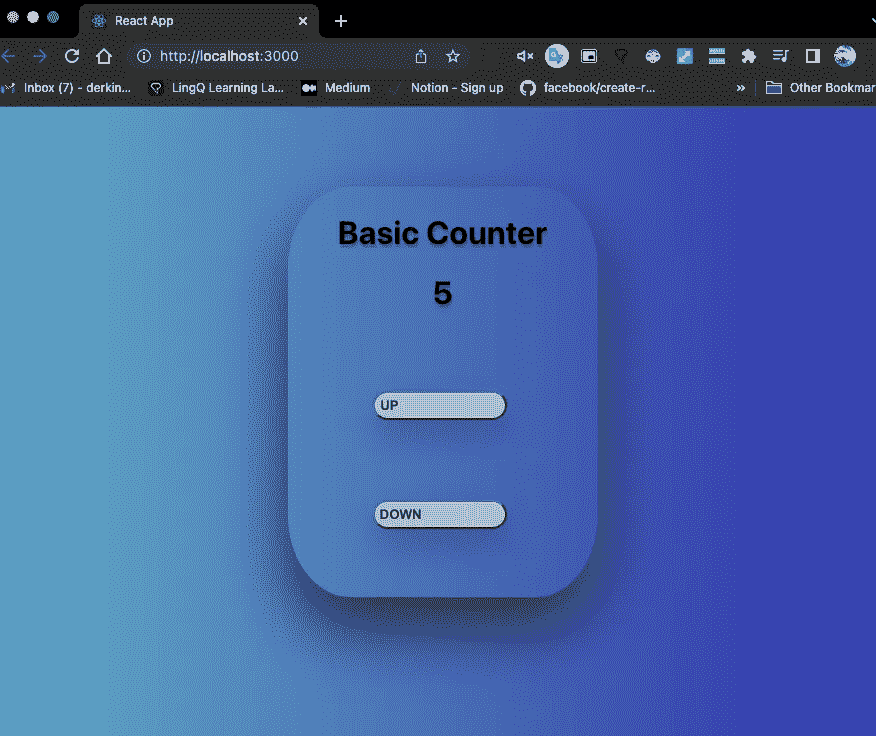

# 从零开始的基本“反应项目”

> 原文：<https://javascript.plainenglish.io/shall-we-create-a-basic-project-from-scratch-via-react-a49a65ac1767?source=collection_archive---------18----------------------->

你一定注意到了 JavaScript，编程界不可或缺的摇滚明星，喜欢有孩子！React 绝对是它钟爱的后代之一。

列奥纳多·达·芬奇曾经说过，*“简单是最复杂的”*现在，React 似乎在追随这位独一无二的天才艺术家的脚步，也许，这就是它成功的原因。自 2013 年第一次发布以来，已经过去了将近十年，随着时间的推移，React 凭借其速度和可扩展性变得越来越受欢迎。

Illustration by Envato

从网飞到 Twitter，React 让开发者有机会创造超级酷的用户界面。它的特别之处在于，如果 React 以其魅力和光彩登上舞台，用户甚至不需要重新加载页面。

我的目的是带您完成一个基本的 React 项目，这样您就可以进行编码，然后您可能会有兴趣在以后的阶段更深入地研究其细节。

尽管 React 很实用，但我不建议您从 React 开始编码之旅。你必须对 HTML、CSS 和 naturally React 的母公司 JavaScript 有所了解。也就是说，你绝对不需要成为 JS 中的巫师。你所需要的只是一些经验，这样你就可以弄清楚 React 是如何运行的。

在下面，你会看到一个一步一步的指南和一堆截图，希望这能让你在处理你的第一个 React 项目时更容易些。通过截图，我相信你可以根据你以前对某些概念的了解，在半个小时甚至更早的时间内编码并完成这个项目(没什么特别的，只是一个基本的计数器),所以不再多说，让我们开始吧！

**第一步:**

单击以下链接安装所有 React 依赖项。React 附带了一些第三方代码，使事情变得实用，是的，它首先是由脸书团队创建的。

【https://github.com/facebook/create-react-app 

**第二步:**

打开您的终端，按照下面的说明简单地安装所有这些依赖项。只是提醒一下！您应该首先在您的计算机中创建一个特定的文件夹，并确保在安装过程之前您在该文件夹中。如果不知道怎么去，这里[的](https://www.freecodecamp.org/news/command-line-for-beginners/)是关于 commandline 的详细教程。下面，这个文件的名字是我的应用程序，但是你当然可以随意命名。

**第三步:**

一旦安装过程完成，只需在您的终端上键入 **npm start** ，然后您将看到一个窗口(http://localhost:3000)会自动弹出。右键点击它，选择检查，然后到控制台，以便在需要时查看您的动作。

**第四步:**

在你的代码编辑器中(我建议 VS 代码)，点击“文件”并选择你刚刚通过终端安装的 React 文件夹。然后，您将在屏幕上看到以下视图。我知道乍一看这看起来太复杂了，但是相信我，这并不复杂，尤其是如果你喜欢整理东西的话。

在您做任何其他事情之前，只需看一看左侧，并将注意力集中在源文件(src)上。如你所见，基于 React 的定制包附带了一堆文件和每个 ***。js*** 文件中有一个函数和一些 HTML 代码。这就是 React 的工作方式，这也是为什么你需要对这两方面都有所了解，并对 CSS 有所了解的原因。你会立即注意到在 HTML 部分，我们使用 ***className*** 而不是 ***class*** 。该基础结构与我们从以前的编程经验中了解到的非常相似，但是一些名称在这一点上有所不同。 ***className*** 将帮助我们稍后对 CSS 文件进行样式化。

第五步:

让我们现在开始我们自己的项目。你会听到很多 React 通过小组件帮助程序员更好地组织他们的文件。这在某种程度上非常类似于 CSS 的扩展 SASS。

在这一阶段，我们需要做的是创建一个名为“组件”的文件夹，并在其中创建我们的项目文件。我把它们分别命名为 ***Counter.js*** 和 ***Counter.css*** ，不过如果你愿意，你也可以选择不同的名字。但是，请记住，这些文件在 React 中以大写字母开头。

**第六步:**

只需打开你的 ***Counter.js 文件*** 并在其中创建期望的函数即可。如前所述，您应该在每个 ***中创建一个函数。js*文件。你可以在你的函数中创建你的 HTML 标签，这不同于 JavaScript。在 React 中，JS 和 HTML 实际上是齐头并进的。我创建了一个 div 标签，并将其命名为“Counter”。结果应该在[***http://localhost:3000***](http://localhost:3000)上可见，通过它可以检测到项目的 UI。**

接下来你需要做的是办理进出口手续。在 React 中，文件通过导出和导入相互通信。首先，我们从“react”导入 React，这是一个标准过程，它使我们能够到达 React 的相关部分。然后，我们必须导出我们的 ***Counter.js*** ，如下图所示。

**第七步:**

导出我们的 ***Counter.js*** 文件后，现在是时候在中心部分导入相同的文件了。你可以通过 ***App.js*** 或 ***index.js*** 来完成，在某种程度上，它们是 React 团队在你安装整个包时给出的核心/本质，所以应该通知其中一个文件我们将开始新项目。

基本上，我们在这些文件之间创建一个链接，以便它们可以相互了解，并在时机成熟时采取相应的行动。我在 index.js 文件中完成了这个过程。只需进入 ***index.js*** 文件，简单导入计数器文件，如下图所示。

**第八步:**

我们仍然在 ***index.js*** 文件内，因为还有几件事情要处理。首先，静音 ***从‘导入 App。/App'*** 因为 React 的中心焦点应该在我们的柜台上，你也知道，我们已经在那边导入了。

你需要做的第二件事是看一看同一个文件中的 ***root.render*** 部分。只需删除***<App/>***，改为写 **< Counter/ >** 。这样，我们切断了 App.js 和 index.js 之间的通信，并在 index.js(心脏)和计数器项目之间创建了一个纽带。

同时，你的终端应该一直开着。如果你不小心关闭了它，失去了与 UI 窗口的连接，只需重新打开终端并键入 ***npm start。*** 这将帮助您再次访问[***http://localhost:3000***](http://localhost:3000)*，您将能够查看用户界面。*

**

***第九步:***

*我们还是回到我们的 ***Counter.js*** 文件吧。现在，我们需要从“React”导入一个 React 钩子 ***{ useState }，因为这将帮助我们轻松地改变状态。在函数内部，我们创建一个 const 和 destructure 两个组件； ***count(初始状态)*** 和 ***setCount(预期状态)*** 。****

*正如在快照中看到的，这被设置为***useState***hook，并带有一个开始编号。我写了 1，但是你可以改。现在，您可以在计数器中创建增加和减少箭头函数，并使用析构变量来增加和减少预设的数字。*

*另一件需要知道的重要事情是在我们的按钮上添加 ***onClick*** 。在 React 中，这是我们触发相关动作的方式。在 JavaScript 中，我们使用***addevent listener***，但这里不是这样。完成这一步后，您应该看到计数器项目在相关窗口中正常运行。*

**

***第十步:***

*在这个阶段，我们完成了这个项目；然而，如果你想的话，你可以添加一些样式。你需要做的是导入你的 ***Counter.css*** 文件，如下图所示，然后放入你的 ***中。css*** 文件，你可以编写 css 代码和改变用户界面。一旦 ***Counter.file*** 和 ***Counter.css*** 文件连接后，所有的造型程序与 css 相同。*

******

*下面是最终产品。如果你有兴趣深入研究 React 的核心，我强烈推荐 Maximilian Schwarzüller 的 [React 完全指南](https://www.udemy.com/course/react-the-complete-guide-incl-redux/)和/或 John Smilga 的 [React 项目课程](https://www.udemy.com/course/react-tutorial-and-projects-course/)。虽然前者有点难，但对于那些长期打算成为 React 开发人员的人来说，这两者都是非常好的资源。*

****“知识就是力量。”——弗朗西斯·培根****

**

**更多内容请看*[***plain English . io***](https://plainenglish.io/)*。**

**报名参加我们的* [***免费周报***](http://newsletter.plainenglish.io/) *。关注我们关于*[***Twitter***](https://twitter.com/inPlainEngHQ)，[***LinkedIn***](https://www.linkedin.com/company/inplainenglish/)*，*[***YouTube***](https://www.youtube.com/channel/UCtipWUghju290NWcn8jhyAw)*，以及* [***不和***](https://discord.gg/GtDtUAvyhW) ***。****

****有兴趣缩放你的软件启动*** *？检查* [***电路***](https://circuit.ooo?utm=publication-post-cta) *。**