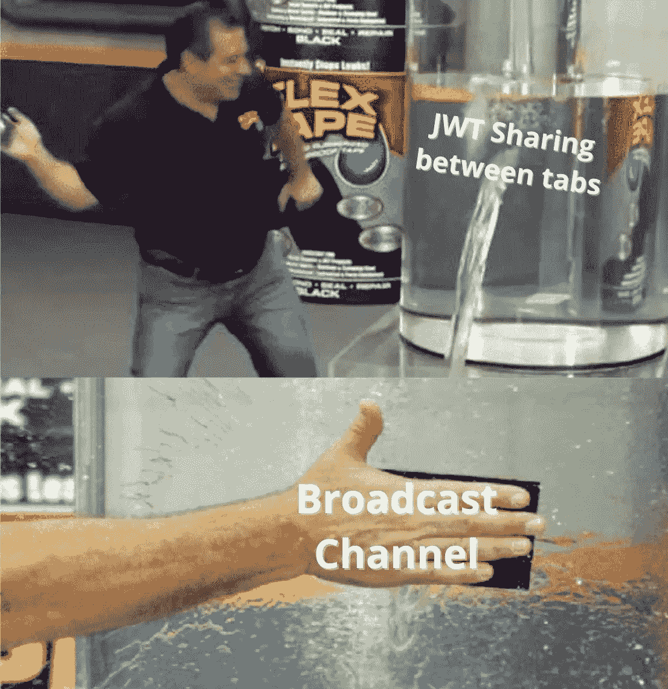
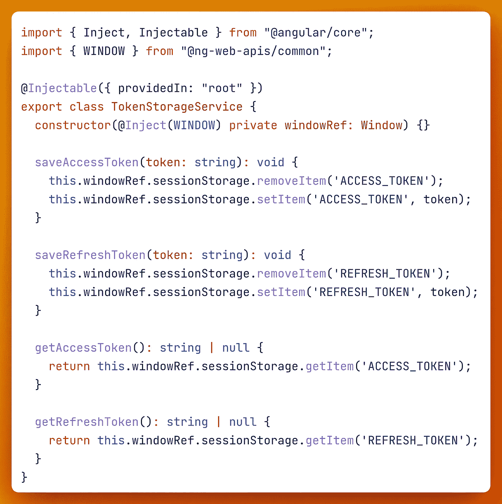
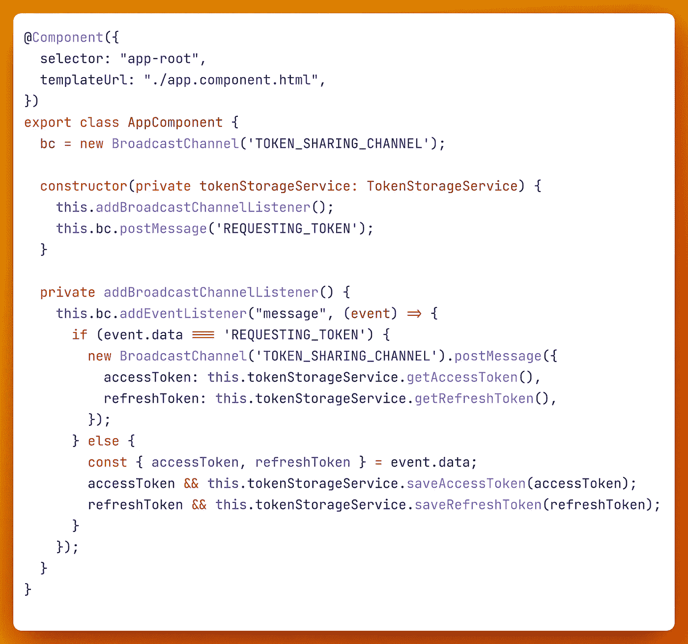

# 在 Angular 中跨多个标签安全地共享秘密令牌

> 原文：<https://javascript.plainenglish.io/share-secret-tokens-across-multiple-tabs-securely-in-angular-f9014f66dbc4?source=collection_archive---------5----------------------->

## *在新标签页打开时，如何在 Angular 应用程序中共享 JWT 令牌。*



在会话存储(非本地存储)中存储 JWT 令牌(如访问令牌和刷新令牌)的 Angular 应用程序通常需要一种在新选项卡中共享它们的方法，以便用户不必再次登录即可访问应用程序。

但是由于其安全设计的本质，会话存储并不在单独的窗口中共享。那么，如何将令牌传输到新窗口呢？嗯，我们可以利用`BroadcastChannel` web API 来实现这一点。各大浏览器(IE 除外💩)支持这个标准的 web API。

根据 MDN 网络文档:

> 广播通道 API 允许浏览上下文(即窗口、选项卡、框架或 iframes)和相同来源的工作器之间的基本通信。

如果您创建了一个同名的广播频道，无论 web 应用程序在不同的选项卡或窗口中运行，它们都将始终订阅同一个频道，从而允许双向通信。

```
// Connection to a broadcast channel
const bc = new BroadcastChannel('unreadcounts_channel');// sending a message to the channel
bc.postMessage('6 unread messages');// message handler
bc.onmessage = event => { doSomething(event.data); }
```

既然已经接触了基础知识，让我们看看如何利用它。

# 步骤 1 —令牌存储服务

首先，我们需要与会话存储进行交互。因此，创建一个简单的 TokenStorageService。



Token Storage Service

# 步骤 2-添加事件监听器

当加载 angular 应用程序时，实例化根组件是最初始的引导过程之一。因此，这是一个编写代码的完美地方。



App Component

# 发生什么事了？

*   `AppComponent`声明了一个名为`TOKEN_SHARING_CHANNEL`的`BroadcastChannel`的新实例。
*   这里我们还添加了一个 EventLister 来订阅 BroadcastChannel 消息。这个处理程序只处理两种类型的消息——1。一个字符串值`REQUESTING_TOKENS`和 2。一个物体`{ accessToken: string, refreshToken: string }.`
*   第一个选项卡包含令牌。假设我们通过 Ctrl+click 访问一个应用内链接，在一个新标签中打开 angular 应用。
*   现在第二个选项卡打开了，它还没有令牌。应用程序在引导阶段到达根组件，并再次实例化名为`TOKEN_SHARING_CHANNEL`的`BroadcastChannel`。但是由于具有相同名称的信道将连接在一起，现在在第一和第二标签之间建立了通信媒介。
*   第二个选项卡发布`REQUESTING_TOKENS`消息。这被第一个选项卡截获。由于第一个选项卡有标记，现在它触发另一个带有标记的消息。
*   第二个选项卡不再接收`REQUESTING_TOKENS`消息，因此它进入 else 块并通过令牌存储服务将令牌存储在第二个选项卡的会话存储中。

*(注意:这只是正在发生的事情的简化图。)*

## 完整代码

# 结论

在 MDN 阅读有关 BroadcastChannel API 的更多信息:

[](https://developer.mozilla.org/en-US/docs/Web/API/Broadcast_Channel_API#browser_compatibility) [## 广播频道 API-Web API | MDN

### 广播通道 API 允许浏览上下文(即窗口、标签、框架或…)之间的基本通信

developer.mozilla.org](https://developer.mozilla.org/en-US/docs/Web/API/Broadcast_Channel_API#browser_compatibility) 

感谢您的阅读！

*更多内容看* [***说白了。报名参加我们的***](https://plainenglish.io/) **[***免费周报***](http://newsletter.plainenglish.io/) *。关注我们关于*[***Twitter***](https://twitter.com/inPlainEngHQ)*和*[***LinkedIn***](https://www.linkedin.com/company/inplainenglish/)*。加入我们的* [***社区***](https://discord.gg/GtDtUAvyhW) *。***