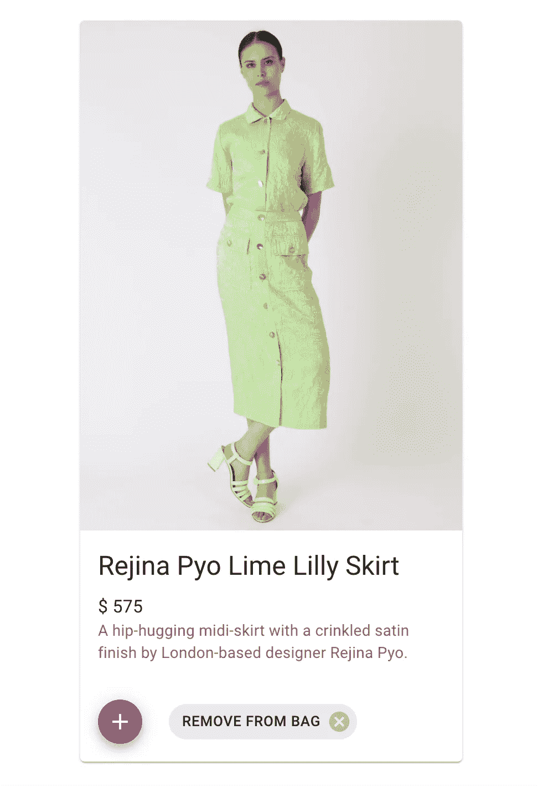
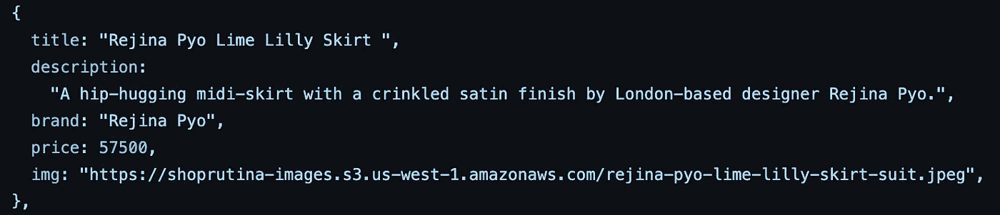

# 前端概述'商店鲁蒂娜':一个简单的反应电子商务商店

> 原文：<https://javascript.plainenglish.io/shop-rutina-a-simple-react-e-commerce-store-9360db2cbbc4?source=collection_archive---------20----------------------->

## 前端概述的第 1 部分:深入了解 React 中内置的全栈电子商务商店。

Shop Rutina product — modeled Rejina Pyo set in 2019

这些年来，我已经参与了很多事情——构建软件是我参与的又一个事情。在这篇文章中，我将分享一个更全面的观点来解释我的意思。首先，要知道这篇文章是一篇多部分的文章，在设计和开发的交叉点上工作。

在这里，我将重点介绍商店的前端，也就是客户端，也就是用户在他们的数字屏幕上看到的和交互的内容。虽然我也构建了后端来将这个全栈项目结合在一起，但这篇文章致力于分享我是如何构建前端的，从一无所有到创建用户可以看到并与之交互的东西。这个多部分系列*不会*是如何创建电子商务网上购物体验的一步一步，而是*将*是我的分解方法，分享&展示我如何建立鲁蒂娜商店。

# 我将涉及的概述领域:

**1。简单功能**

**2。产品模型构建**

**3。AWS S3 数据托管**

从通过`[npx create-react-app](https://reactjs.org/docs/create-a-new-react-app.html) ecomm-shop`终端命令创建一个基于 React 的应用程序→为设计和功能编写代码→计算产品模型并使用我在过去几年中建模的列出产品的图片→整合 AWS S3 用于产品数据托管→构思主页上的在线购物交互→构建并连接客户端(前端)到服务器端(后端)以及中间的一切，这个简单的构建是我将我在编程锅里学到的技能(并努力继续学习)结合起来的一种方式。

## **1。简单功能**

→浏览页面(主页和购物袋)
→浏览产品(图片、名称、价格、描述)
→购买产品
→添加到购物袋按钮
→填充购物袋
→导航到购物袋页面
→查看袋子中的产品
→从袋子中取出按钮
→根据购物袋中的产品计算价格
→继续购物按钮返回用户主页
→清空袋子按钮清除物品
→立即结账按钮今天的通知

## **2。产品模型构建**

设计:从视觉上来说，每个电子商务商店都有一个相似的主题，包括确定要销售的产品，并以一种方便购物者购买的方式列出它们。我选择使用 [Material UI](https://mui.com/) ，它是 React 的开源组件库，帮助我以一种有组织的格式布局产品。MUI 采用了[谷歌的材料设计系统](https://material.io/design)，提供可定制的现成组件。

**开发:**至于构建产品模型，我选择在一个对象数组中列出商店商品，以 key: value 的形式存储产品数据。我为每个对象创建了 5 个属性，包括*标题*，*描述*，*品牌*，*价格，*和*图片，*然后将每个属性与其对应的值进行匹配。为了混合过去和现在的技能，我包含了我在过去的生活中建模的产品的图像，以个性化商店并为构建提供所有内容。

## 3. **AWS S3 数据托管**

**AWS S3:** [亚马逊的 S3(简单存储服务)](https://aws.amazon.com/s3/)使开发人员能够通过生成“对象 URL”来创建存储、检索和稍后实现对象的存储桶，这些“对象 URL”本质上是上传到云中的数据文件的直接链接。 [AWS in Plain English](https://aws.plainenglish.io/) 发布了我的 [AWS S3 视觉指南](https://aws.plainenglish.io/storing-retrieving-implementing-objects-using-aws-s3-e2b206e98623)，这是我创建并浏览的，用于存储我在商店 Rutina 的产品模型数据。在那篇文章中，您将了解从本地机器上传数据文件并将它们存储在云中的具体步骤，以便通过一步一步的截图进行检索。

This object is programmed for the main image on this article ~ Each of the products on Shop Rutina are formatted like this using S3 Object URLs — more into this in the Part 2 dive later.

有几个有用的资源可供学习，我个人很喜欢利用它们，并在需要时参考它们。下面是我推荐的一些探索:

*   **中等:**通过 [Kumar Shubham 的](https://shubhamstudent5.medium.com/)个人资料进行阅读和消化，以获得深度指南。他分享了许多实践性的构建分步指南，引导您完成许多技术主题。
*   像 [Stack Overflow](https://stackoverflow.com/) 这样的网站也是一个很好的资源，在那里你可以在搜索栏中提问，加入特定的小组，收集你的特定用例中突出的内容。
*   **Github:**Github——一个开源软件社区——是一个工具性的工具，你可以通过代码、提交、讨论和用户(仅举几例)过滤和缩小搜索范围，从公共存储库中学习。
*   **文档:**多亏了技术作家，许多框架和库也有专门的文档来帮助设计者和开发者理解如何使用代码，可视化用例，有些甚至为开发者提供在项目中实现它的源代码。

** *记住这一点，做好记录，并积极寻找和实施提供详细文档的框架；从长远来看，这将有助于每个人使用它。***

第 1-3 部分将**前端切入**本**前端概述**中涵盖的与设计和开发流程相关的领域。

[第 1 部分:特性分解](https://medium.com/@daisydocuments/shop-rutina-front-end-dive-65cd9a47b00d)
[第 2 部分:产品模型构建](https://medium.com/@daisydocuments/shop-rutina-front-end-dive-d030912af9f3)
[第 3 部分:AWS S3 数据托管](https://medium.com/aws-in-plain-english/shop-rutina-front-end-dive-3f66ec31d57d)

*更多内容看* [***说白了就是***](https://plainenglish.io/) *。报名参加我们的* [***免费每周简讯***](http://newsletter.plainenglish.io/) *。关注我们* [***推特***](https://twitter.com/inPlainEngHQ) *和*[***LinkedIn***](https://www.linkedin.com/company/inplainenglish/)*。查看我们的* [***社区不和谐***](https://discord.gg/GtDtUAvyhW) *加入我们的* [***人才集体***](https://inplainenglish.pallet.com/talent/welcome) *。*