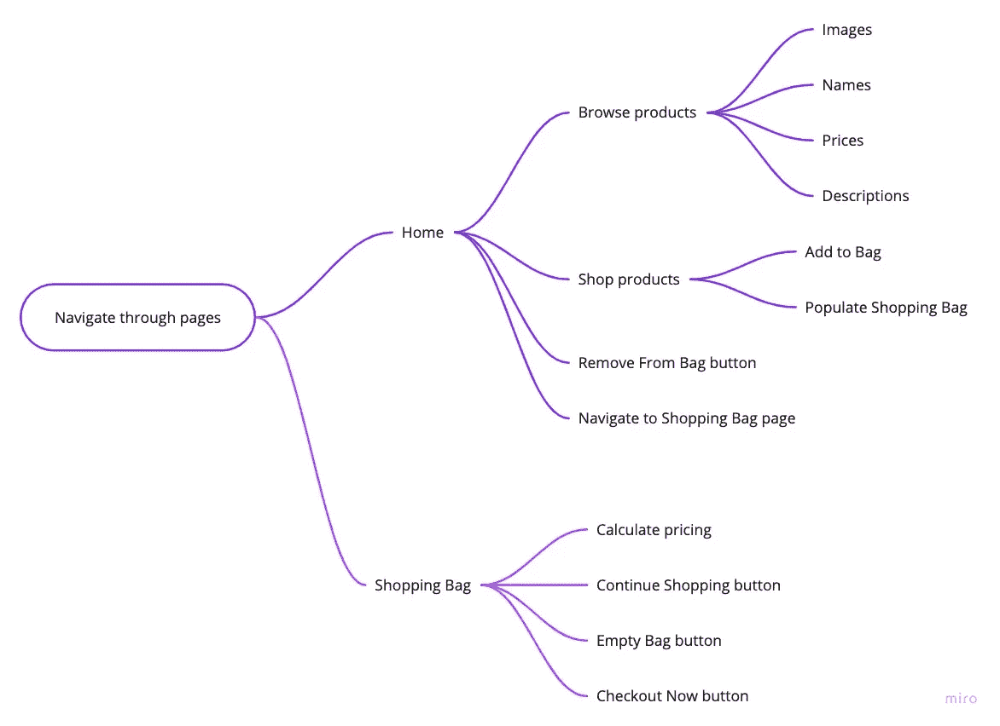

# 购物 Rutina(React 电子商务应用程序):前端潜水

> 原文：<https://javascript.plainenglish.io/shop-rutina-front-end-dive-65cd9a47b00d?source=collection_archive---------16----------------------->

## 第 1 部分:特性分解

Part 1 Deep Dive: Simple Features

如上图所示，导航中有两个主要页面:主页和购物袋。这两个页面包含一系列简单但动态的功能，支持用户交互。

我在→ [这个概述](https://medium.com/javascript-in-plain-english/shop-rutina-a-simple-react-e-commerce-store-9360db2cbbc4)中为商店写了一篇介绍文章。如果你喜欢介绍的话，看看这个。

# 在主页中，用户能够:

## 浏览产品
购买产品
从袋子中取出
导航至购物袋

# 在购物袋页面中，用户可以:

## 计算定价
继续购物
空袋子
结账

接下来阅读:
[第二部分:产品模型构建](https://medium.com/@daisydocuments/shop-rutina-front-end-dive-d030912af9f3)
[第三部分:AWS S3 数据托管](https://medium.com/@daisydocuments/shop-rutina-front-end-dive-3f66ec31d57d)

*更多内容看* [***说白了就是***](https://plainenglish.io/) *。报名参加我们的* [***免费周报***](http://newsletter.plainenglish.io/) *。关注我们关于* [***推特***](https://twitter.com/inPlainEngHQ) ，[***LinkedIn***](https://www.linkedin.com/company/inplainenglish/)***，***[***YouTube***](https://www.youtube.com/channel/UCtipWUghju290NWcn8jhyAw)***，****[***不和*** *对成长黑客感兴趣？检查出*](https://discord.gg/GtDtUAvyhW) [***电路***](https://circuit.ooo/) ***。****