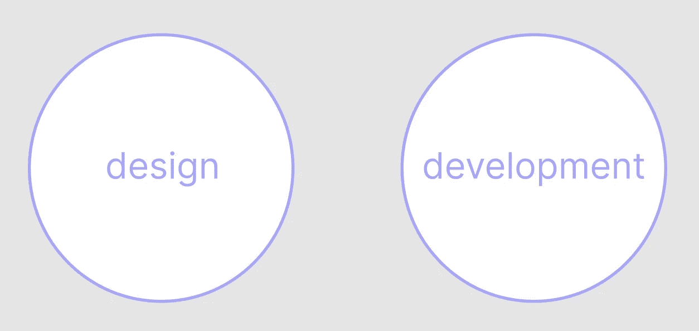
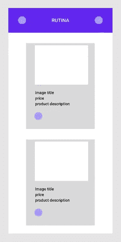
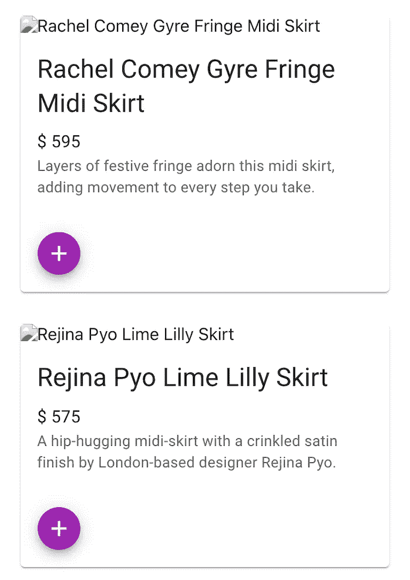
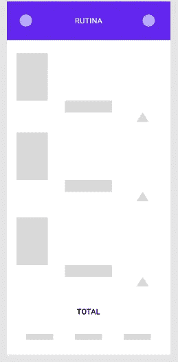
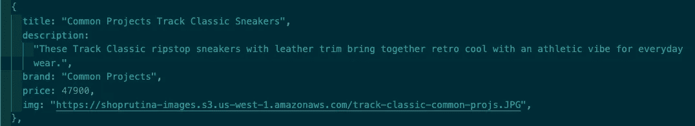
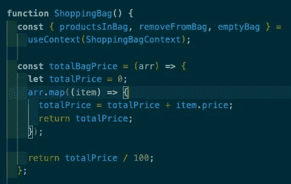
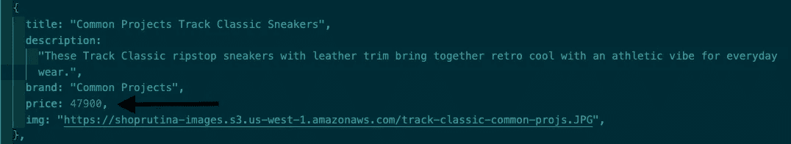
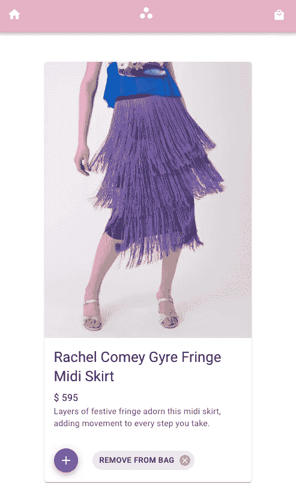
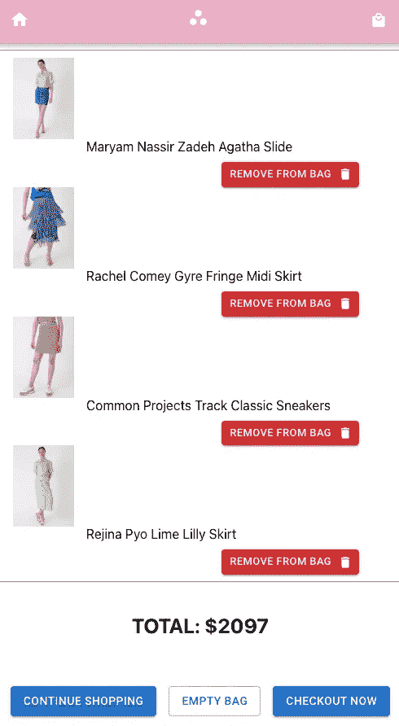

# 基于 React 的电子商务商店:前端潜水

> 原文：<https://javascript.plainenglish.io/shop-rutina-front-end-dive-d030912af9f3?source=collection_archive---------15----------------------->

## 第 2 部分:产品模型构建



这篇文章的中心是我创建产品模型的方法。正如我在[概述](/shop-rutina-a-simple-react-e-commerce-store-9360db2cbbc4)中提到的，从视觉上讲，每个商业商店都有一个展示产品的总主题。我选择使用 Material UI，它是 React 的开源组件库。在技术方面，我将产品数据以 key: value 的形式存储在一个对象数组中。这是一个简单的方法来结合谷歌的材料设计和 AWS 的 S3 反应版本，同时完全可定制。

## 设计→开发

## 设计

构思的早期阶段始于 Figma。我对可以合并的组件库做了一些研究。梅脱颖而出有几个原因:

1.  React 程序的易用性
2.  与谷歌的设计系统相似
3.  获取详细的文件
4.  定制能力

下面这张图片是我创建 Home.js 页面的第一个低保真度视觉效果。简单功能 Deep Dive 在 Home.js 和 ShoppingBag.js 之间分解了商店的功能，考虑一下每个页面上的功能。

**Home.js**



lo-fi starter wireframe

从这一点开始，我简单地重复上面的设计，以达到终点。我发现当我有一个能把我和行动联系起来的计划时，我工作得最好。至少在我看来，视觉上看到(或想象)什么是可能的是行动的温床。幸运的是，梅的媒体卡最能反映我想要的风格。


MUI’s media card from card components

为了将媒体卡添加到我的主页，我导航到 Home.js，并使用以下命令将每个元素直接导入到文件的顶部:

```
import * as React from 'react';
import Card from "@mui/material/Card";
import CardActions from "@mui/material/CardActions";
import CardContent from "@mui/material/CardContent";
import CardMedia from “@mui/material/CardMedia”;
import Typography from "@mui/material/Typography";
import Button from "@mui/material/Button";
```

这确保了稍后在函数 Home( ) return 中调用时，产品数据将根据所选的卡显示。因为 Home.js 页面是保存产品项目的页面，所以确定数据显示非常重要。通常，电子商务商店遵循一个相似的主题，包括:产品图片、描述、价格、尺寸、“添加”按钮等。有了这张媒体卡，我就可以随心所欲地进行定制了。



Customized Media Card

在插入和使用显示器之后，我定制了原始的卡片，添加了:
——一个可点击的“+”按钮来添加购物
——一个“+”图标到按钮
——一个盒子来封装产品卡片
——一个堆栈组件来分隔产品卡片

为了添加这些组件，我在上面的导入中添加了:

```
import Fab from "@mui/material/Fab"; 
import AddIcon from "@mui/icons-material/Add";
import Box from “@mui/material/Box”;
import Stack from "@mui/material/Stack";
```

查看源代码，了解每个组件是如何编程的，以及我在返回函数中调整了哪些定制特性。现在，让我们把重点放在视觉设计上。

**ShoppingBag.js**

购物袋页面是另一个主页面，反映了一些添加到主页中的内容，但具有更多功能，包括:查看购物袋中的产品，移除一个项目或清空袋子，计算总价格，替代结账选项和继续购物的能力。

这是我想象的起点:



ShoppingBag.js lo-fi starter

为了给上面的特性添加功能，我确保从它的相对路径导入 Home。

```
import React from "react";
import Home from “./Home”;
```

之后，我添加了 ShoppingBag()来保存动作:
1。查看袋子
2 中的产品。从袋子中取出
3。空袋
4。总价
5。订单确认通知

```
**function** ShoppingBag() {**const** { productsInBag, removeFromBag, emptyBag } =useContext(ShoppingBagContext);**const** totalBagPrice = (arr) **=>** {**let** totalPrice = 0;arr.map((item) **=>** {totalPrice = totalPrice + item.price;return totalPrice;});return totalPrice / 100;};
```

然后添加“订单确认”通知，我使用了 [Toast](https://www.npmjs.com/package/react-toastify) 通知。

```
import { ToastContainer, toast } from “react-toastify”;
import "react-toastify/dist/ReactToastify.css";
```

然后创建了一个 notify 变量，在单击“Checkout Now”按钮时推送 toast 通知。

```
**const** notify = () **=>** toast(“Order confirmed!”);
```

该设置背后的想法是显示从主页添加到包中的产品，带有图像和标题，以及“从包中移除”选项。总数将在底部居中显示，其下的三个组件将作为
1 的选项。继续购物
2。空袋子
3。检验

总价设置为随着箱包的更新或清算而更新。每个选项都将引导购物者浏览购物功能。“继续购物”按钮引导用户返回到主页产品页面，“空包”按钮清空包中的所有产品并将总价更新为$0.00，“立即结账”向用户发送“订单确认”通知。由于这不是一个活跃的商店，我不担心添加 Stripe 的支付处理 API 或任何其他更动态的大小调整功能。

## 发展

在设计阶段之后，更容易投入到功能中，因为我对什么将去哪里以及它将如何运行有一个大致的想法。这给了我一个任务，构建一个包含产品卡片图像的产品模型。我有所有可用的数据，只需简单地插入，我只需要找到一种方法来组织和显示它。我首先将 ProductData.js 文件添加到根 Src 文件夹中。

**ProductData.js**

在这个文件中，我创建了一个对象数组，并将数据存储到一个产品列表中，该列表以 key: value 的形式包含 5 个属性。像这样:

```
const productList = [
{
title: "",
description: "",
brand: "",
price: num,
img: "",
},
```

ProductData.js 文件上的 productList 由 4 个对象(产品)组成，这些对象具有由键和相应值定义的 5 个属性。对于这个特定的用例，有四个标记为产品信息的字符串和一个反映美元价格的数字值。以下是通用项目运动鞋产品卡的代码:



1/4 objects from the productList

其他项目的关键命名约定是相同的，但是它们的值是不同的，以反映多样性。正如您将在 VS 代码截图中看到的，有 5 个属性:
1。标题
2。描述
3。品牌
4。价格
5。image
您还可以看到，有 4 个字符串值由引号“”表示，还有 1 个数字值反映价格。字符串非常简单，但是计算价格可能会令人困惑。来看看我是怎么算出来的。



Function for calculating total price of shopping — ShoppingBag.js

让我们用简单的英语来解释一下:

在 ShoppingBag()函数中，我添加了一个变量来定义总数，并将其命名为 totalBagPrice。然后，我使用对象数组(来自 productList)作为参数来传递函数。然后，我定义了另一个名为 totalPrice 的变量，并将其设置为零($0.00)。*随着购物者向购物袋中添加物品，总数会根据袋子中的物品主动更新。*我用了。map 方法，并通过 item 组件来跟踪选择了哪个项目/产品，以便程序可以识别选择了数组(arr)中的哪个项目。totalPrice 等于 totalPrice 加上 item.price(每种产品的单个价格数值)，得出 total 除以 100。



return totalPrice / 100 || so if the price is $479, 47900 / 100 = 479

在 ProductData.js 文件的底部，添加了一个导出来使用 fetchProducts 获取 productList 的项目，但是本文不会涉及我使用 Express 或任何后端材料创建的端点。在这里，我将展示产品模型的前端视图是如何构建的。

**首页**



Visual for Home.js

**购物袋页面**



Visual for ShoppingBag.js

接下来阅读:
[第 3 部分:AWS S3 数据托管](https://medium.com/aws-in-plain-english/shop-rutina-front-end-dive-3f66ec31d57d)
[第 1 部分:功能分解](https://medium.com/@daisydocuments/shop-rutina-front-end-dive-65cd9a47b00d)

*更多内容请看*[***plain English . io***](https://plainenglish.io/)*。报名参加我们的* [***免费周报***](http://newsletter.plainenglish.io/) *。关注我们关于*[***Twitter***](https://twitter.com/inPlainEngHQ)[***LinkedIn***](https://www.linkedin.com/company/inplainenglish/)*[***YouTube***](https://www.youtube.com/channel/UCtipWUghju290NWcn8jhyAw)***，以及****[***不和***](https://discord.gg/GtDtUAvyhW) *对成长黑客感兴趣？检查* [***电路***](https://circuit.ooo/) ***。*****