# 带反应和条纹的购物车

> 原文：<https://javascript.plainenglish.io/shopping-cart-with-react-and-stripe-fbbd6ec8d448?source=collection_archive---------3----------------------->

## 现实世界电子商务项目的优秀教程

Photo by [Blake Wisz](https://unsplash.com/@blakewisz?utm_source=medium&utm_medium=referral) on [Unsplash](https://unsplash.com?utm_source=medium&utm_medium=referral)

做一个电商网站最重要的部分就是如何连接前端和后端。**库珀代码教程**刷新了我对这个话题的看法。

链接到他的[教程](https://www.youtube.com/watch?v=_8M-YVY76O8&t=61s&ab_channel=TraversyMedia)

GitHub [代码](https://github.com/coopercodes/ReactEcommerceStoreWithStripeAPI)

第一部分是构建购物页面的**前端**。

文件夹结构:

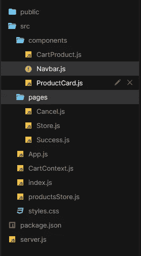

要安装哪些依赖项:

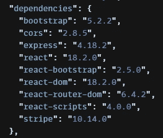

对于前端， *react-bootstrap* 用于样式化，而 *react-router-dom* 用于路由页面。

对于后端来说， *express js* 是针对 node js web 应用框架， *cors* 是针对 express 的中间件(或者有个替代品叫 body-parser)，而 *Stripe* 是在线支付 API。

从 **App.js** 可以看出，整个项目包括三个页面，主*商店页面*，支付成功时的*成功页面*，取消支付时的*取消页面*。

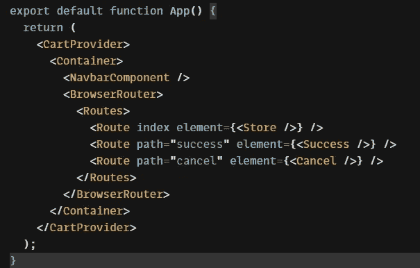

Navbar 包括使用 React-bootstrap 的 Navbar。

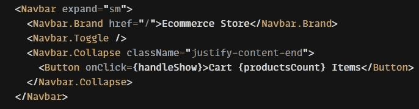

点击按钮时，显示*显示*

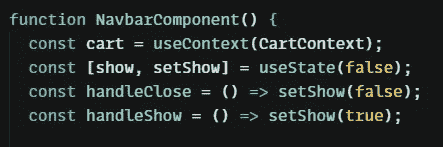

在导航栏之后， **Modal** 是显示购物车商品的框。

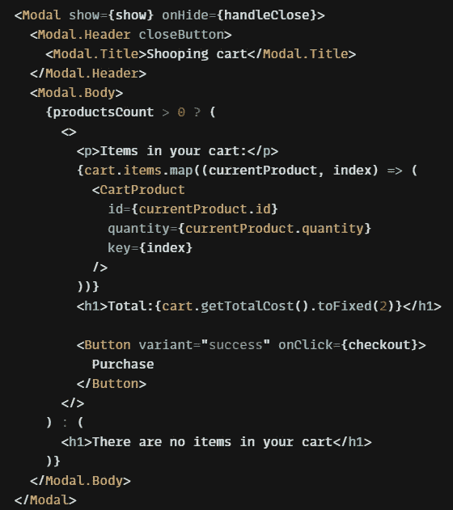

显示购物车中的所有商品。

所有产品数据都在 *productsStore.js.* 中

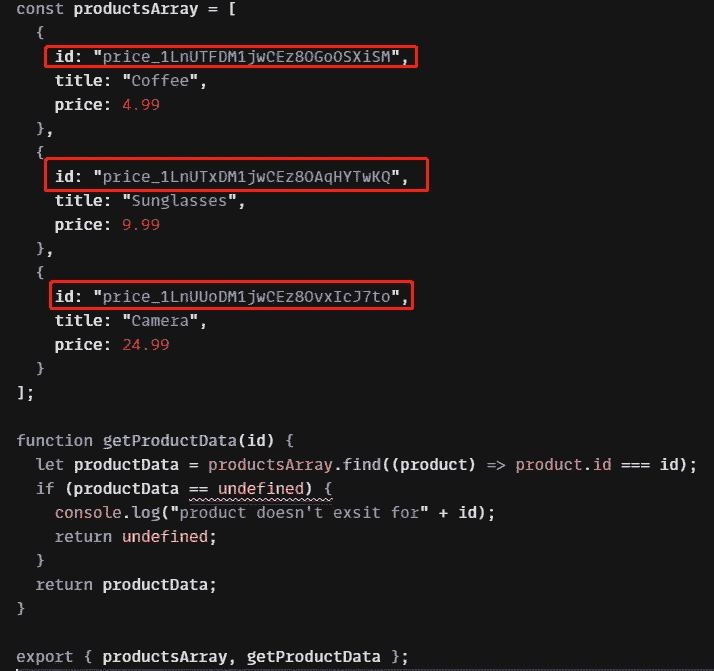

产品列表是一个用 Stripe 连接的 id 为的数组(后面我会解释)。 *getProductData* 按 id 为所有上下文使用。

所有购物车逻辑代码都在 *cartContext.js* 中

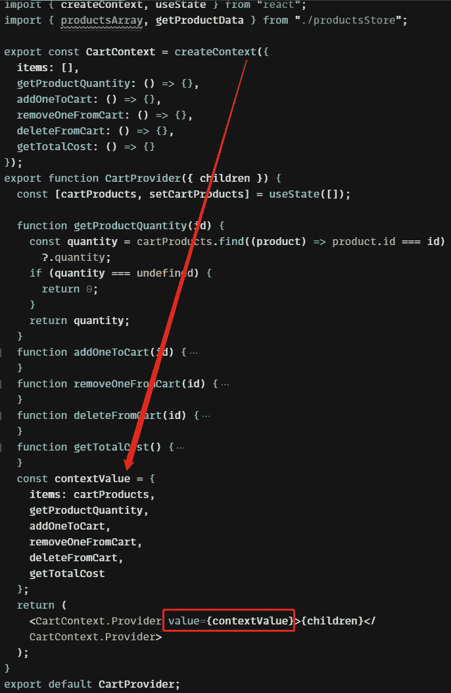

用`createContext()` 创建 cartContext，并用 Provider 传递值。

购物车有**四个功能:添加商品、移除商品、删除商品和获取总价。**

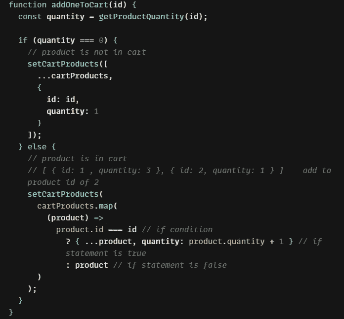

addOneToCart

如果数量为 0，则在 cartProducts 数组中添加新项目，或者将数量加 1。和从购物车中减少一个是一样的。

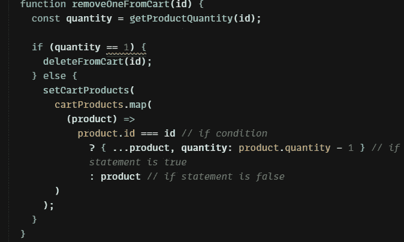

removeOneFromCart

然后从购物车中删除商品:

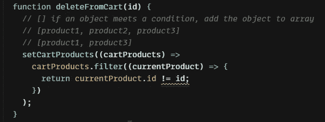

deleteFromCart

过滤不同 id 的 cartProduct

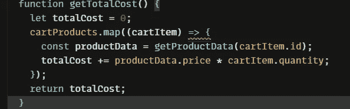

getTotalCost

用`reduce()`按单价和数量计算总价

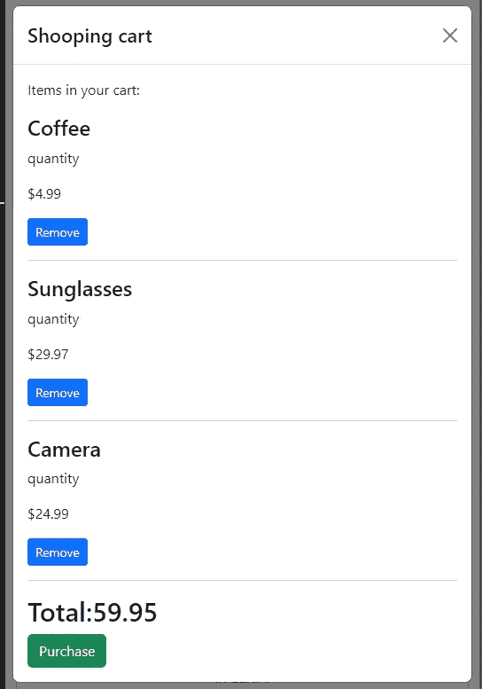

商店页面包括产品卡:

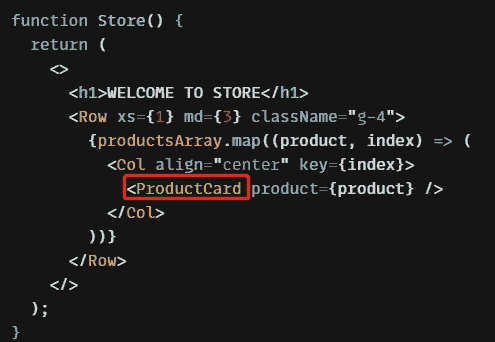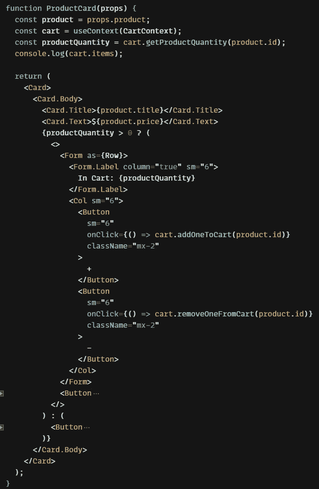

productCard

每张卡片都包含标题、价格和控制数量的按钮。当没有产品时，按钮显示添加到购物车，或者用`…?..:..`从购物车中删除

**后端，server.js.**

首先，注册[条带](https://stripe.com/)以获得秘密 API 密钥。并添加每个产品以获得下面的密钥

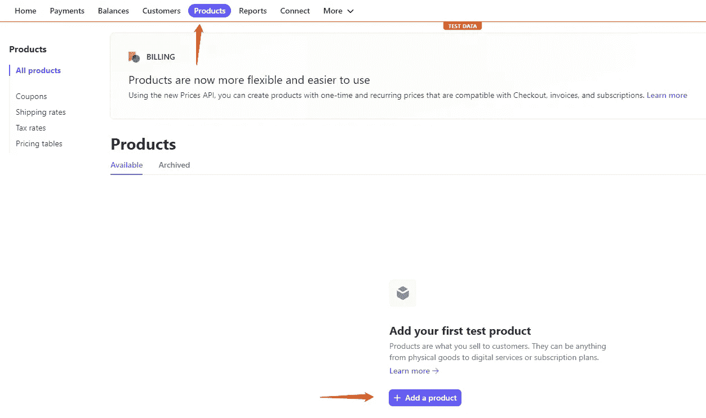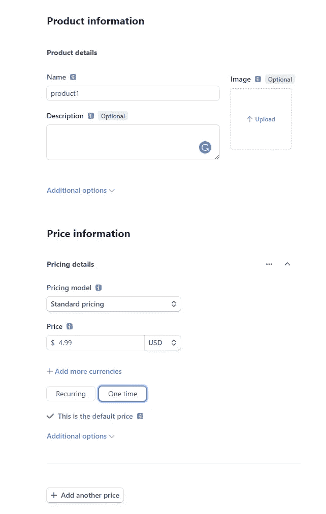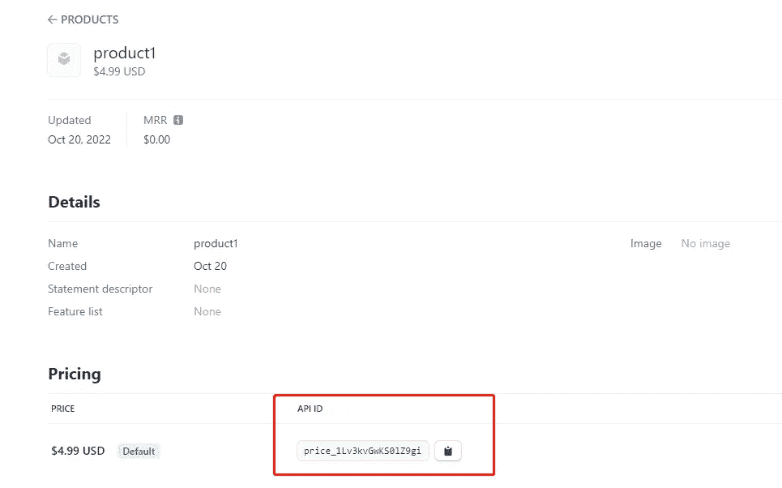

当您获得 API ID 时，按照我之前所说的，在 products 数组 ID 中替换它。

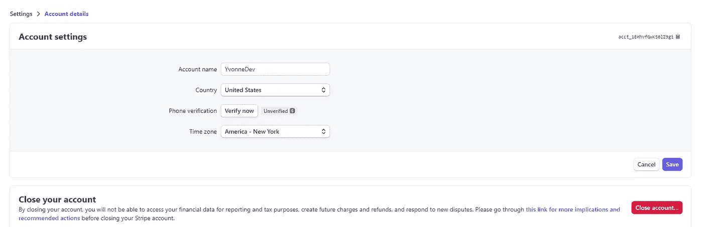

并且记得设置账户处理支付功能。

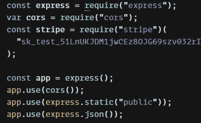

用`app.use()`运行每个库

并在结账时发布获取购物车中的商品，如果支付成功，重定向到成功 URL，要么取消 URL。并将响应发送回用户。

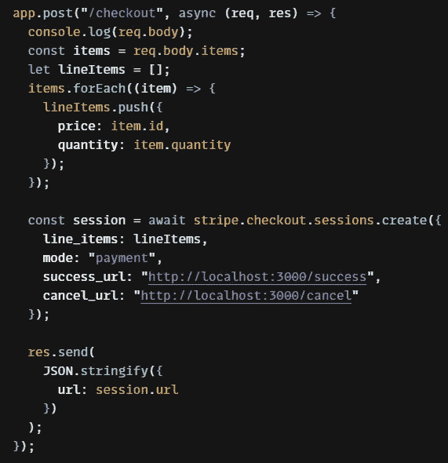

并在端口 4000 上监听它。

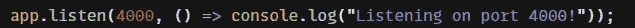

更多的[条带文档](https://stripe.com/docs/checkout/quickstart?client=react&lang=node)用于创建结帐会话。

*更多内容看* [***说白了就是 io***](https://plainenglish.io/) *。报名参加我们的* [***免费周报***](http://newsletter.plainenglish.io/) *。关注我们关于*[***Twitter***](https://twitter.com/inPlainEngHQ)，[***LinkedIn***](https://www.linkedin.com/company/inplainenglish/)*，*[***YouTube***](https://www.youtube.com/channel/UCtipWUghju290NWcn8jhyAw)*，* [***不和***](https://discord.gg/GtDtUAvyhW) *。对增长黑客感兴趣？检查* [***电路***](https://circuit.ooo/) *。*