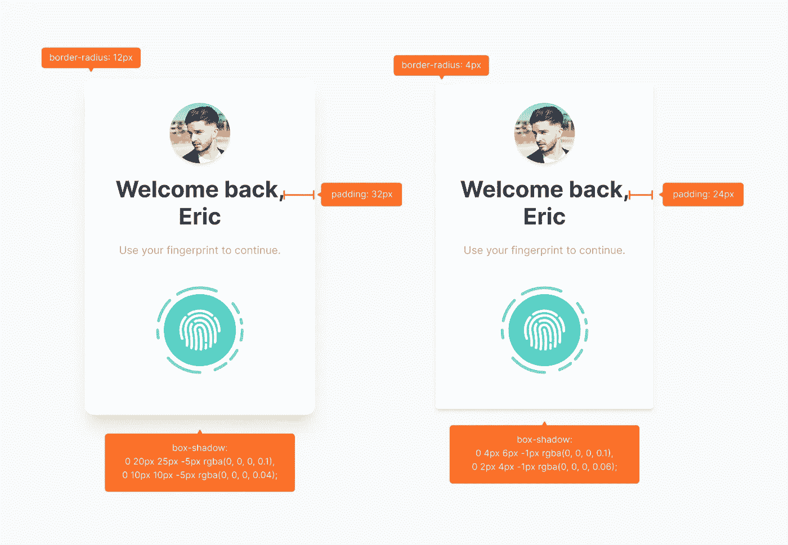

# 如何将开发时间缩短一半？

> 原文：<https://javascript.plainenglish.io/shortcuts-and-tips-that-cut-my-development-time-in-half-ab2bcd9ae644?source=collection_archive---------5----------------------->

## 我重写了我的 SaaS 3 次，每一次我都变得更快

Photo by [Charlotte Coneybeer](https://unsplash.com/@she_sees?utm_source=medium&utm_medium=referral) on [Unsplash](https://unsplash.com?utm_source=medium&utm_medium=referral)

如果说经历过山车般的一年还有一线希望的话，那就是你作为一个人&一个专业人士在学习和成长。

2021 年，我不得不重建一个巨大的项目 3 次，每一次，我都变得更快更好。

如果你在推特上关注我，你可能知道我在说什么 SaaS。

这是一个为内容创作者打造的平台，名为 [Leansence](https://leansence.com/) ，对我来说这是一个巨大的项目，因为它应该是内容创作者的一体化解决方案。

承担如此大的项目的问题是，你经常会在过程中发现更好的东西，最终改变技术栈或应用程序的主要部分。

在我的情况下，我在开发阶段从少数测试用户那里得到了反馈，不得不从头开始重写应用程序 3 次。

但是我注意到第三次的时候，我变得越来越快。不仅因为我变得更有经验，还因为我变得更聪明、更懒惰。

我用了一半的时间(3 个月多一点的时间)就完成了整个项目，并增加了更多的功能，下面是我学到的将开发时间减半的方法:

## 1.研究正确的框架和工具

我不得不重写这个应用程序的一个主要原因是因为我试图做一些不适合技术堆栈的事情。

无论是使用关系查询还是在服务器端加载数据，有时您使用的框架并不是为此而构建的。

例如，React 是一个非常棒的前端框架，但是无论你做多少努力，你都不能在它上面运行后端代码。

这同样适用于数据库和其他第三方库。

我的开发减少的一个核心原因是上次我使用了正确的工具。

> **“给我六个小时砍树，我会用前四个小时磨斧子。”-** 亚伯拉罕·林肯

从正确的工具开始可以节省您几周甚至几个月的开发时间。

解决这个问题的最好方法之一是列出你的项目的所有核心特性，并分析它们是否可以用你心目中的技术栈来实现。

另一种方法是查看一个类似的项目，并找出他们正在使用什么技术。Wappalyzer 是一个非常适合这个目的的扩展。

## 2.使用样板文件

我使用像`next-auth` & [Magic](https://magic.link/) SDK 这样的包来处理认证和 cookies。

我早些时候为我使用的另一个项目制作了一个样板文件，这给了我一个巨大的开端，让我可以专注于应用程序的核心功能和 UI。

然而，现在市场上有一些很好的样板文件，可以节省你几周的时间，而且非常简单。

虽然他们中的许多人可以相当昂贵，开始 500 美元(一次性)的费用。然而，有很多好的开源软件，你可以在 Github 上找到它们。

重要的是，无论您最终使用哪种样板文件，您都对项目中使用的底层核心技术感到满意。

例如，如果您正在使用使用 Auth0 和 Prisma 等库的 Next.js 技术栈，那么在您付费并开始使用这个样板文件之前，请确保您对 React 很熟悉，并且至少对 Next.js 有很好的理解。

其他的库，比如这个例子中的 Prisma，你可以通过官方文档& YouTube 来学习。

## 3.用户界面库

[Source](https://chakra-ui.com/docs/styled-system/theming/component-style).

我听到了许多反对使用任何 UI 库的论点，例如 [Chakra UI](https://chakra-ui.com) ，他们中的大多数在技术上是正确的，但同时，实际上是不正确的。

使用 UI 库确实增加了你的整体包大小，也限制了你的 CSS 知识，但是，**我强烈支持使用 UI 库，因为在我看来，利大于弊。**

像 Chakra UI 这样的 UI 库提供了你在整个前端应用程序中需要的所有主要组件，从表单到按钮到模态。

您还可以获得开箱即用的黑暗模式支持，这是一个巨大的节省，因为每个 SaaS 都需要黑暗模式才能成功(开玩笑)。

使用 Chakra UI 的主要优势是我能够在整个应用程序中有一个统一的设计，并且我不需要专注于设计我的按钮、提醒、弹出窗口和菜单。

此外，它们非常灵活，还支持自定义 CSS 属性。

我可以专注于 UX 和核心功能，而不用担心 UI 的本质细节。

## 4.设定时间限制

设定时间限制和使用像 [Pomodone](https://pomodoneapp.com/) 这样的时间管理工具为我节省了很多时间，但在下一点会有更多的介绍。

设定时间限制是至关重要的。

就像作家有作家的瓶颈一样，程序员也有程序员的瓶颈。

> 有时候解决问题的最好方法是第二天用一种全新的眼光去看它。

我在构建我的项目时一直遇到奇怪的错误和问题，但是当我开始为问题设置时间限制时，我最终在更短的时间内构建了更多的功能并解决了更多的问题。

方法很简单:如果你遇到一个问题或一个 bug，你尝试用 45 分钟解决它(不管你的情况如何)，如果到那时你还不能解决它，你就休息一会儿。

在那段休息时间，做一些让你血液流动的事情，比如快速散步、洗澡或做饭——基本上是远离笔记本电脑屏幕的任何事情。

休息结束后，你试图再次修复 bug，但这次你只花了 30 分钟(比以前少)，如果到那时你仍然不能解决它，那么专注于其他功能并在第二天重新访问 bug。

我最近一直在使用这种方法，而且不仅仅是在编程方面，到目前为止，它的效果非常好。

## 5.分解任务

正如我在上面所说的，在开发阶段使用番茄工作法对我的身体和精神健康有着不可思议的好处，这反过来提高了我的生产力。

不要一口气用合适的后端代码构建一个登录页面，这是一项密集的任务，如果遇到愚蠢的问题，会让你精疲力尽。

我的方法是将上面的任务分成三个部分——登录页面 UI，理解文档，最后编写后端代码。

我给每项任务分配了大约 25 分钟的时间，然后有 5 分钟的休息时间。

这使我能够在不到 1.5 小时内完成整个登录流程，包括限制只能由登录用户访问的页面。

不仅如此，番茄工作法通过减少每项任务给你带来的精神负担，让你完成更多的工作。

## 最后的想法…

我讨厌每次不得不重写我的 SaaS 经验，但事后看来，我在重用代码和管理时间方面做得更好了。

我上面讨论的所有内容都来自于我自己的亲身经历以及一些实验，这些实验使我能够将大约 5 个多月的开发时间缩短到 3 个月。

促成这种急剧减少的最显著的因素是 UI 框架和正确的工具，它们使我能够相当容易地实现复杂的逻辑。

如果你喜欢读这篇文章，考虑使用[我的推荐链接](https://medium.com/@anuragkanoria/membership)，这样你就可以通过点击[这里](https://medium.com/@anuragkanoria/membership)无限制地访问我的博客以及其他作者的博客。

我定期发布与 web 开发相关的主题，下面是我最近讨论 React 受欢迎程度的博客:

 [## 为什么不用其他框架代替 React 呢？

### React 到底为什么这么受欢迎？

javascript.plainenglish.io](/why-dont-we-use-other-frameworks-instead-of-react-3fcfaec5604b) 

*更多内容请看*[***plain English . io***](https://plainenglish.io/)*。报名参加我们的* [***免费周报***](http://newsletter.plainenglish.io/) *。关注我们关于*[***Twitter***](https://twitter.com/inPlainEngHQ)*和*[***LinkedIn***](https://www.linkedin.com/company/inplainenglish/)*。加入我们的* [***社区不和谐***](https://discord.gg/GtDtUAvyhW) *。*