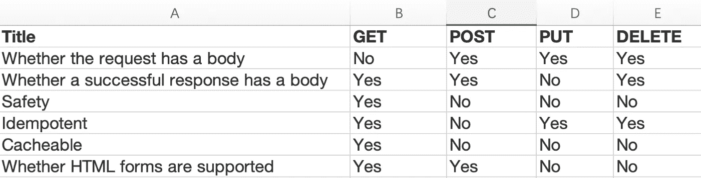
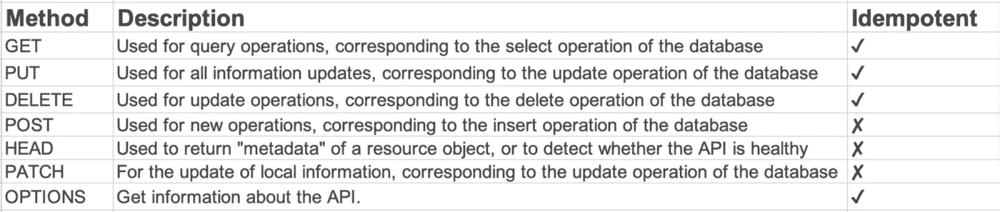

# 所有的 Rest APIs 都应该使用 POST 请求吗？

> 原文：<https://javascript.plainenglish.io/should-all-rest-apis-use-post-requests-3d59eefc39f7?source=collection_archive---------2----------------------->

一个朋友对我说:“要连接一个同事的接口，他定义的接口都是 POST 请求。原因是`HTTPS`与 POST 请求一起使用更安全。我以前用过 RESTful API。如果只有 POST 请求对`HTTPS`来说是安全的，那么为什么还需要其他请求——GET、PUT、DELETE？我该怎么反驳他？”

# 你能一直使用 POST 吗？

我们都知道`GET`请求一般用于获取服务器信息，`POST`一般用于更新信息。一个`GET`请求能做的，一个`POST`能做，一个`GET`请求不能做的，一个`POST`能做。

如果你的团队有很好的团队纪律，每个人都在平均水平以上，有很好的纠错机制，就没有这样的规则。

但如果团队成员水平参差不齐，尤其是小团队、创业团队，往往一上来就动手，没有规范，代码的好坏完全由开发人员的个人素质决定。这样的团队要制定这样的规范。

毕竟可以减少很多问题，`POST`不用担心`URL`长度限制，也不会误用缓存。通过一个规则来降低出错的可能性，使得这个决策非常划算。

**结果:**公司有新人受到这样的要求。你可能会想，什么样的公司会有这样的要求？

是有原因的。一些外包公司或者提供第三方接口的公司为了方便也会选择只使用`POST`。

# 怎么反驳他？

# 首先来说说 GET，POST，PUT，DELETE

# 得到

`GET`方法用于从服务器检索数据。这是一个只读方法，因此没有更改或破坏数据的风险，使用`GET`的请求应该只用于获取数据。

`GET API`是等幂的。多个相同的请求每次都必须产生相同的结果，直到另一个`API (POST or PUT)`改变服务器上的资源状态。

# 邮政

`POST`方法用于将实体提交给指定的资源，通常会导致服务器上的状态改变或新资源的创建。`POST`既不安全也不幂等，调用两个相同的`POST`请求将导致两个不同的资源包含相同的信息(除了资源 ID)。

# 放

主要使用`PUT API`更新已有的资源(如果资源不存在，`API`可以决定是否创建新的资源)。

# 删除

方法删除指定的资源。`DELETE`运算是幂等的。如果删除资源，它将从资源集合中移除。

# 邮政更安全吗？

答案是**否**。

很多人认为`GET`的请求数据在 URL 中，而`POST`没有，所以认为`POST`更安全。事实并非如此，整个请求的`HTTP URL PATH`将被封装在`HTTP`协议头中。只要是`HTTPS`，就是安全的。当然有些网关比如`NGINX`会把`URL`放在日志里或者放在浏览器的历史里，所以有人会说`GET`请求不安全，但是`POST`也好不到哪里去。`CSRF`是最常见的安全问题，它完全是针对`POST`的。安全是复杂的，无论你使用什么方法或动词都不意味着你更安全。

# 最后

**感谢阅读。我期待着您的关注和阅读更多高质量的文章。**

*更多内容请看*[***plain English . io***](https://plainenglish.io/)*。报名参加我们的* [***免费周报***](http://newsletter.plainenglish.io/) *。关注我们关于*[***Twitter***](https://twitter.com/inPlainEngHQ)[***LinkedIn***](https://www.linkedin.com/company/inplainenglish/)*[***YouTube***](https://www.youtube.com/channel/UCtipWUghju290NWcn8jhyAw)*[***不和***](https://discord.gg/GtDtUAvyhW) *。***