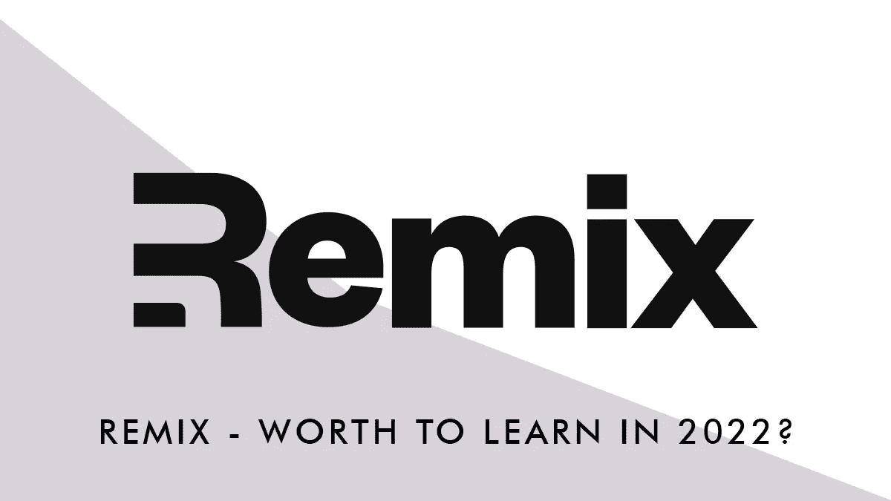

# 2022 年该不该学混音？

> 原文：<https://javascript.plainenglish.io/should-you-learn-remix-js-in-2022-spoiler-yes-4ee76fb5c003?source=collection_archive---------3----------------------->

## 了解一下 2022 年 Remix 是否值得学习。

Remix 是 React 框架中的最新热门，除了自 2020 年以来一直存在之外，它在 2022 年上半年获得了关注(基本上当它们变得免费时！)，在他们的回购上达到了 15K 多颗星。

 [## GitHub - remix-run/remix:建立更好的网站。使用 web 创建现代、灵活的用户体验…

### 我们很高兴你在这里！Remix 是一个全栈网络框架，让你专注于用户界面和工作回来…

github.com](https://github.com/remix-run/remix) 

## 到底什么是混音？

[**Remix**](https://remix.run/)**是一个全栈的 web 框架，它会让你用 JavaScript 代码为你的前端应用和后端逻辑做出反应。是 [React 路由器](https://reactrouter.com/)背后的人创造的。**

# **Remix 的主要特点应该会引发你学习它的欲望**

## **路由和嵌套路由**

**正如我们之前所说，Remix 是建立在 React Router 之上的，因此 React Router 上的所有工作都可以在 Remix 中工作(如`**Outlet**` 和`**Links**`)，Remix 还实现了一个简洁的[嵌套路由策略](https://remix.run/docs/en/v1/guides/routing#what-is-nested-routing)，允许您的应用程序只加载和更新页面或用户交互所需的嵌套组件。**

## **获取远程数据**

**Remix 将主要与服务器端渲染一起工作，它不支持静态生成，但它实现数据获取的方式(在组件级发出请求并缓存)使页面加载非常快。
组件使用`**loader**` (获取数据的函数)和`**useLoaderData**` (将数据‘注入’页面的钩子)请求数据。**

## **发布到远程服务器**

**与`**loader**`相反，我们发现`**action**`，一个将处理 post 请求(POST，PUT，DELETE…)的函数；搭配`**<Form>**`(处理表单的 Remix 组件)将使表单处理和变异变得容易(不需要处理`**onClick**` `**onChange**`，不需要`**useState**`)。**

**`action`和`loader`可以存在于同一个组件中，所以您可以在一个文件中处理 GET 和 POST 逻辑。**

## ****乐观 UI****

**Remix 实现了一系列策略和功能，让你的应用程序即使在数据没有完全获取(或发布)的情况下也能即时响应，这真是一个很酷的功能！在这里阅读更多关于乐观用户界面的信息:**

 **[## 乐观 UI

### 乐观用户界面是一种模式，可以避免在用户界面中显示繁忙的微调器，让你的应用程序感觉像是…

混音. run](https://remix.run/docs/en/v1.4.1/guides/optimistic-ui)** 

## **错误处理**

**Remix 实现了一种处理错误的新方法，它会自动捕捉错误并呈现一个`**ErrorBoundary**` ，以便只有“损坏”的部分/组件会显示错误，而应用程序的其余部分可以正常工作——例如，如果多个组件中只有一个获取数据失败，错误只会在失败的组件中呈现。**

## **标题、元、链接、脚本**

**Remix 支持自定义标题，带有 meta 和链接(以及脚本)，因此可以很容易地进行 SEO 优化。一切都可以在应用程序级别或单个页面级别注入 HTML。**

## **。服务器和。客户**

**在 Remix 中，您可以添加仅在服务器请求或客户端请求上执行的特殊文件(filename.server.ts 和 filename.client.ts ),以便您可以完全控制哪些内容可以到达客户端或应该留在服务器上(例如 db 连接、HttpOnly cookies、会话等)。).**

## **证明文件**

**Remix 确实是有据可查的，在官方回购中，有大量的例子涵盖了你能想象到的大多数现实世界的功能(从认证到条纹支付，再到 CMS 集成)。**

## **固体打字稿**

**这不是一个真正的特性，这是你从每一个坚实的框架中所期望的。无论如何，在 Remix 中这是很好实现的。**

## **模板**

**Remix 提供了各种初始模板，包括预配置的 DB、CSS 框架、部署服务等等。他们声称它们都是生产和可扩展的配置。**

## **易于部署**

**Remix 应用程序可以部署到最常见的服务，使用预先配置的脚本和模板，在任何情况下，一如既往，Remix 应用程序可以轻松地部署到任何无服务器服务。**

# **混音少了什么**

**Remix 真正关注的是它的客户端/服务器架构，但所有的逻辑都取决于您，所以它缺少内置的服务连接器(例如 Gatsby)，所以您需要自己连接所有的连接(无论如何，有大量的库可以连接到 API、数据库、GraphQL 等等)。它还缺少一些前端模块，如图像优化组件(如 Next.js)。**

# **这样够不够学混音？**

**即使其中至少有 3 个是真正有前途的，单有特性是不够的，而且对我来说缺少的特性看起来没什么大不了的，但是这里有更多的理由去学习它:**

*   **如果你(像我一样)有 Next.js 背景，用 Remix 开始制作一个应用原型需要几个小时。**
*   **学习一门新的编程语言总是一个好主意，学习新事物总是一个好主意。它会教你新的模式，释放解决问题的新方法，以及许多你可以在其他语言或其他领域学习和使用的其他东西。**
*   **在开始开发时有更多的框架可供选择确实可以提高开发时间和代码质量，选择某种框架确实可以对一些 app 有益。**

**在一天结束的时候，在我看来，学习 Remix，特别是在一个更结构化的 React 框架旁边，真的值得花时间。它将为您的开发工具库添加一个开发快速响应的 web 应用程序的工具。**

***更多内容请看*[***plain English . io***](https://plainenglish.io/)*。报名参加我们的* [***免费周报***](http://newsletter.plainenglish.io/) *。关注我们关于*[***Twitter***](https://twitter.com/inPlainEngHQ)*和*[***LinkedIn***](https://www.linkedin.com/company/inplainenglish/)*。加入我们的* [***社区不和谐***](https://discord.gg/GtDtUAvyhW) *。***