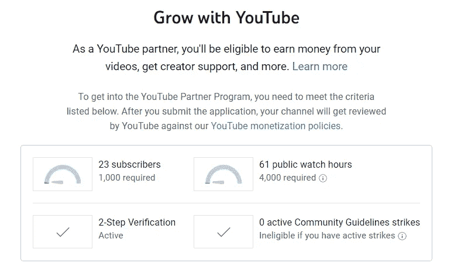
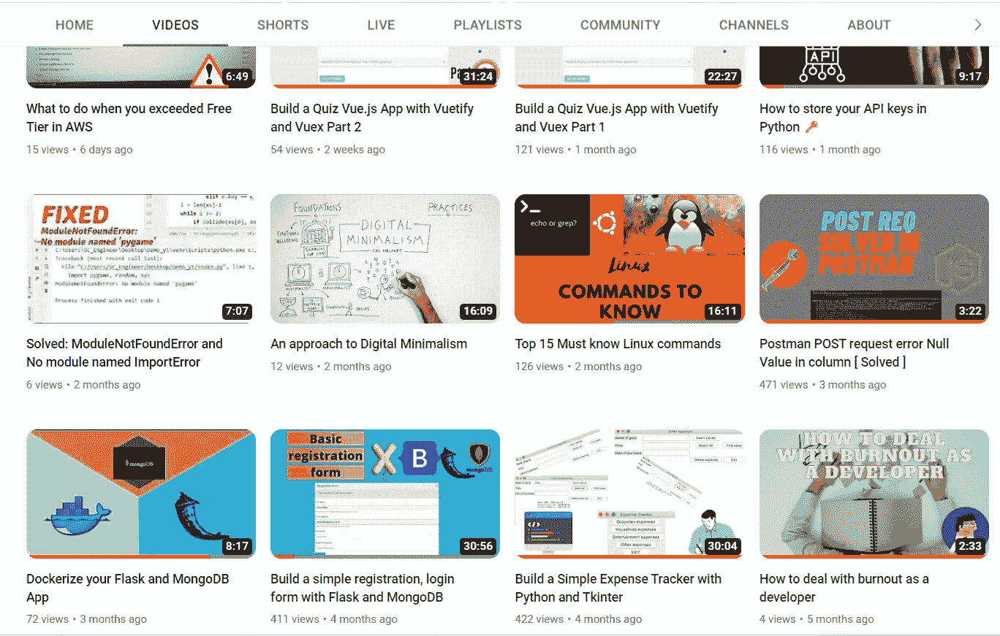

# 作为一名开发者，你应该创建一个 YouTube 频道吗

> 原文：<https://javascript.plainenglish.io/should-you-start-a-youtube-channel-as-a-developer-61627f698f5a?source=collection_archive---------4----------------------->

> 半年前，我开始了我自己的 YouTube 频道，这里有一些障碍和建议，我想告诉大家。

## 伙伴计划💰

让我们弄清楚一件事，如果你开频道的唯一原因是赚钱(就像左上角的缩略图😉)那就算了。这需要大量的时间和一致性来达到能够开始货币化你的内容所必需的数量(比媒体多 10 倍)。

与 10-15 年前相比，获得 1k 订户+ 4k 小时观看时间要困难得多，因为更多的创作者出现，因此竞争加剧。但是如果你像我一样想尝试一些新的东西或者做视频剪辑(我觉得最快乐的事)，那就另当别论了。

我有 20 个视频，外加满手的 **YouTube 短片**，在 7 个多月的时间里就有了 23 个订户。

正如你所看到的，很少有人有 400 次浏览，甚至少得可怜的 4 次，即使投入了大量的时间来创建、编辑。

*Psst 请在我的* ***YouTube*** *频道* [*这里*](https://www.youtube.com/@mozescodes6618) *点一个赞并订阅，这样我的工作就不会白费，就能给出更多这样的内容。*😜

## 投资与时间⌛

当我谈到投资时，我指的是设备和软件。

*   用于视频编辑和格式化的 RAM、GPU 等硬件
*   麦克风，其他小工具
*   OBS 工作室&视频编辑器

如果你有一台像样的电脑和一个麦克风，开始录音相对容易。然而，分配时间来制作高质量的内容可能是昂贵的，而且你的章节的开头很可能是糟糕的。随着时间推移，你的质量会提高。不过，如果你喜欢这个过程，想要建立你正在创造的社会形象，这是值得的。但如果你的唯一目的是从这个平台上获得名声和高收入，那就不是了。

## 视频编辑

我开始 **YouTube** 的主要原因是我迷上了视频编辑，作为一名开发人员(主要是后端)，我缺乏创造力。录音+剪辑给了我这样做的机会，在这个竞争越来越激烈的行业中磨练我的其他技能，这让我很满意。

*用什么视频编辑器？*

除了用于屏幕录制的 OBS 工作室，我强烈建议从一些简单的东西开始，如****或**[**shot cut**](https://shotcut.org/)**你觉得舒服的 [**达芬奇解决**](https://www.blackmagicdesign.com/products/davinciresolve) **。**********

****随着我开始使用 **Resolve** ，我制作 **YouTube** 视频的热情越来越大，因为做一件事有太多的方式，选择也是无穷无尽的。作为一名开发者，你必须更有创造力，因为我认为你会记录你的屏幕，不像食物内容创作者那样。但是你总是可以把它混在一起！****

********

****The complexity of certain video editors is really luring and ignites you to try more!****

## ****享受这个过程****

****正如每件事一样，享受这个过程，即使它很耗时，你也不会得到你期望的观点或成长(这是常有的事)，应该会带来它本身的快乐。太多的创造者正带着$$$的唯一目的前进，所有的诚实都是短暂的。****

> ****幸福存在于过程中，而不是最终的结果。****

****我期望有比 23 个更多的订阅者来录制、剪辑、编辑我的心。尤其是在 VueJS 上重新创建/录制现有项目(如测验应用程序)时，您可以在此处找到链接。现在，我很欣赏越来越多在 YouTube 上开发全尺寸应用程序的人理解这个障碍。****

## ****我应该发表什么？****

****作为一个只有 23 岁的订户，也许不要相信我的话，但我会建议你决定是否拥有一个匿名频道。尽管如此，据说录制自己的声音可以更好地赢得听众的信任。****

****对我来说，制作我的 GitHub 项目的视频带来了最多的点击量，但同时也带来了最多的工作量。****

****只是涉猎一下，不要期望太多，看看它是否适合你，因为我认为最大的好处不是在货币领域，而是增加你在这个饱和市场的竞争力和社会存在。****

****总之，我认为“试水”是值得的，看看这是否是你感兴趣的事情。频道的发展很慢，开始时上传的内容不尽人意，令人生厌，但你会及时好转。我相信，一致性、激情和真实的内容会让你走向成功并获得巨大的回报，只是我不知道这需要 1 个月、半年甚至 5 年。****

# ****相关故事****

**** [## 我从在克罗蒂和 NFT 的损失中学到了什么

### NFT 在《加密》杂志(crypto)承诺的高回报(以及进军 web3)与事实相去甚远，我是通过艰难的方式才了解到这一点的。

blog.cryptostars.is](https://blog.cryptostars.is/what-ive-learned-from-loosing-money-in-crypto-and-nft-s-bf93f3b1943b)  [## 写博客是一个好的被动收入来源吗？

### 博客如何赚钱，你也应该写博客吗？

medium.com](https://medium.com/nerd-for-tech/is-blogging-a-good-passive-income-source-f8a87b83988)  [## 作为开发人员，我学习 DevOps 的 3 个原因

### 作为一名开发人员，随着需求的增加，编程不应该是你唯一的关注点，了解…

medium.com](https://medium.com/geekculture/3-reasons-i-am-learning-devops-as-a-developer-ee72bdd6d806) 

*更多内容请看*[***plain English . io***](https://plainenglish.io/)*。报名参加我们的* [***免费周报***](http://newsletter.plainenglish.io/) *。关注我们关于*[***Twitter***](https://twitter.com/inPlainEngHQ)[***LinkedIn***](https://www.linkedin.com/company/inplainenglish/)*[***YouTube***](https://www.youtube.com/channel/UCtipWUghju290NWcn8jhyAw)*[***不和***](https://discord.gg/GtDtUAvyhW) *。对增长黑客感兴趣？检查* [***电路***](https://circuit.ooo/) *。*******