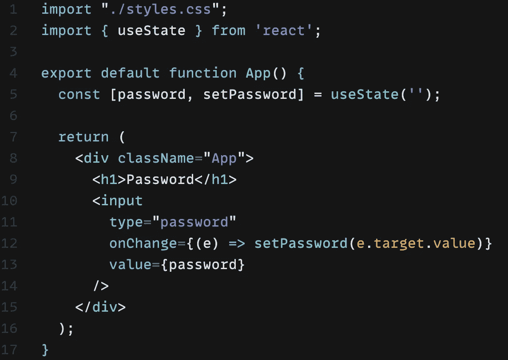
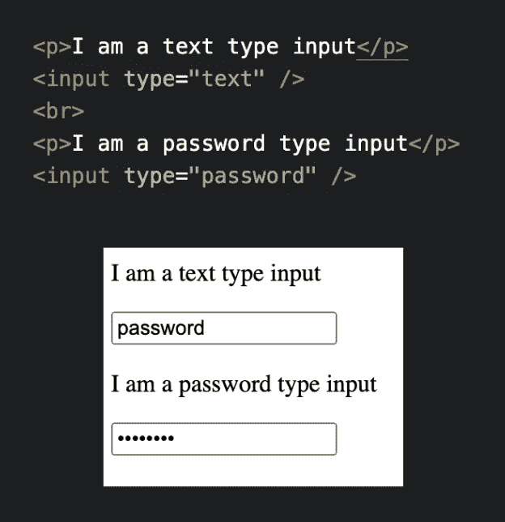
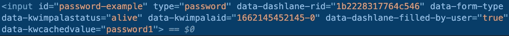

# 在 React 中应该使用受控组件来处理密码吗？

> 原文：<https://javascript.plainenglish.io/should-you-use-controlled-components-to-handle-passwords-in-react-b816be47ebf6?source=collection_archive---------11----------------------->

Photo by [Dan Nelson](https://unsplash.com/@danny144?utm_source=medium&utm_medium=referral) on [Unsplash](https://unsplash.com?utm_source=medium&utm_medium=referral)

我最近在为一个客户做一个项目，这个项目包括认证和登录页面。当我去设置用户名和密码的文本输入时，一个我以前没有想到的问题出现了。对带有密码类型的输入使用受控组件是一种好的安全做法吗？

在我们深入回答这个问题之前，我们应该先看看什么是受控组件，以及输入的“password”属性如何实际影响屏幕上的输入文本以及存储在 DOM 中的数据。

**什么是受控组件？**

对于传统的输入，输入的值作为属性存储在元素中。为了访问这些值，我们必须使用 JavaScript 来挂接元素，否则就要等待提交表单才能访问这些值。

React 通过使用受控组件提供了一种处理输入值的新方法。我们没有让输入元素控制它们的状态，而是混合使用状态变量和 onChange 挂钩将输入值的所有权从输入元素转移到 React 组件。

我们使用下图中的模式:

Figure 1\. Basic password input managed by React controlled components.

这里我们设置了一个 useState 钩子来存储和更新密码的值。我们将输入的值设置为密码变量，并设置一个 onChange 事件处理程序，以便在每次输入发生变化时更新密码变量的值。这就形成了一个循环过程，在这个过程中，用户与 input 元素进行交互，从而触发一个 onChange 调用来更新 password 变量，这个变量又会改变 input 元素中的 value 属性。

这样做的好处是可以更集中、更直接地访问这些输入值，因为它们存储在组件的状态中，但是这也提出了一个问题，即这种集中状态和将输入的责任推迟到反应组件是否会将我们的输入值置于更大的风险中。

**输入密码时会发生什么？**

默认情况下，输入 HTML 元素具有文本类型。这意味着任何放置在 HTML 文件中没有指定类型的标签将默认为纯文本。当然，我们可能希望向用户询问许多不同类型的数据，我们希望避免为每种类型的数据重写验证和元素功能。正是因为这种需要，HTML 增加了输入类型，包括密码、电子邮件和电话等等。

这些不同的类型提供了默认文本类型所不具备的表层验证或额外功能。当我们想要帮助保持用户的密码不被窥探时，我们可以创建一个带有密码类型的输入标签。使用该属性，输入到输入中的所有字符将显示为统一的点，而不是特定的字符。

我们可以在下面的代码片段中看到这一点:

Figure 2\. Comparison of text and password input elements.

这对于防止离你很近的其他人看到你屏幕上的字符很有用，但是它对存储在 DOM 中的内容有什么影响呢？要回答这个问题，我们需要研究值属性。除了类型属性，输入 HTML 标签还有一个值属性。这可以预先设置，但是一旦用户与输入交互，这个值属性将存储结果值。

虽然我们的密码值在屏幕上看起来像点，但在 DOM 中它看起来像这样:

Figure 3\. Example of password showed in plain text in input’s value attribute.

这里我们看到输入属性的值是我们的密码“password1”。密码类型输入提供的点和安全性仅扩展到屏幕上的视觉效果，并不保护存储在 DOM 中的密码。换句话说，任何输入值对于有权访问 DOM 的人来说都是完全可见的，不管它们在 UI 中是如何显示的。

我们是否应该让密码输入成为一个受控组件？

我们已经讨论了什么是受控组件，如何使用它们，以及不同的输入元素类型，特别是密码类型。我们问题的答案——我们应该在 React 中使用受控组件来管理密码吗？—是肯定的。虽然带有密码类型的 input 元素会使物理用户看不到屏幕上的内容，但它不会改变 DOM 中值的可见性。

受控组件不会使情况变得更糟，因为它们所做的只是将密码状态的控制权从输入元素本身转移到 JSX 元素中的状态变量。因此，无论是采用传统的输入方法来获取和提交密码，还是采用有状态组件来处理密码状态，您都应该感觉良好。两种方式都有效，并且具有相同的安全性。

*更多内容请看*[***plain English . io***](https://plainenglish.io/)*。报名参加我们的* [***免费周报***](http://newsletter.plainenglish.io/) *。关注我们关于*[***Twitter***](https://twitter.com/inPlainEngHQ)[***LinkedIn***](https://www.linkedin.com/company/inplainenglish/)*[***YouTube***](https://www.youtube.com/channel/UCtipWUghju290NWcn8jhyAw)***，以及****[***不和***](https://discord.gg/GtDtUAvyhW) *对成长黑客感兴趣？检查* [***电路***](https://circuit.ooo/) ***。*****