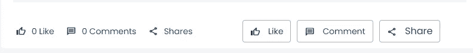
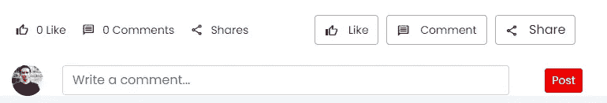

# 使用 JavaScript 显示和隐藏

> 原文：<https://javascript.plainenglish.io/show-and-hide-using-javascript-abc48938b53?source=collection_archive---------13----------------------->

## 如何在 JavaScript 中显示和移除 div 的指南。


你好，朋友们，你们好吗？我希望你健康和成功。今天，我们将讨论如何在 JavaScript 中显示和移除 div

好吧，我们这次将讨论教程，希望它会有用。

1.  创建一个用于命令一个功能的按钮。

```
<button type="button" onclick="comment('<?php echo $value->id;?>',this)" class="btn btn-outline-monik fs-14">
<span class="material-icons-outlined md-16 me-2 align-middle">message</span>Comment
</button>
```

我们将稍微解释一下我们创建的按钮。这里我们添加了函数 onclick = " comment(' id；？>‘，这个)”。我们将使用这个函数来命令 JavaScript 函数。

2.创建一个 div 来显示我们想要的表单。

```
<div id="<?php echo 'comment_field_'.$value->id ?>" data-postId="<?php echo $value->id?>" class="js-comment-field d-none status-foot row align-items-center">
						<div class="col-md-1 col-sm-2 user-comments">
							<?php if(empty($users->file_name_original)) { ?>
							public/themes/user/images/placehold/user-1x1.png" class="rounded-circle feed-user-img" alt="">
							<?php }else{ ?>
							file_path . $users->file_name_original?>" class="rounded-circle feed-user-img" alt="">
							<?php } ?>
						</div>
						<div class="col align-items-center pl-sm-0">
							<?php echo "<input type='text' name='comment' id='comment_".$value->id."' class='comment form-control' placeholder='Write a comment...'>"; ?>
						</div>
						<div class="col-2 d-grid">
						<button class="js-publisher btn btn-sm btn-danger mx-auto">
							<span id="" class="js-publisher-stats">Post</span>
							<span id="js-spinner-pub" class="d-none spinner-border spinner-border-sm" role="status" aria-hidden="true"></span>
							<span id="js-spinner-load" class="d-none">Loading...</span>
						</button>
						</div>
					</div>
```

这里我们使用 div 创建了一个 HTML 表单。我在这里为主题使用了 bootstrap 框架。

*   我们添加一个 id，在我们创建的选项卡 div 上有一个数字。
*   为我们创建的 div 的标识添加类 js-comment-field。
*   不要忘记添加引导类 d-none。

3.接下来，我们将 JavaScript 函数添加到我们创建的应用程序中。

```
*function* comment(post_id, x) {
	$comment_show = $('#'+post_id).find('.js-comment-field-show');
	$comment.toggleClass('d-none');
}
```

该函数将从先前存储数据的按钮函数中检索数据。并将根据已获取的 id 发布数据。

那么结果将如下:



显示表单:



感谢您的阅读。希望你觉得这有用，如果你有，请参考你所有的朋友。

*更多内容请看*[***plain English . io***](https://plainenglish.io/)*。报名参加我们的* [***免费周报***](http://newsletter.plainenglish.io/) *。关注我们关于*[***Twitter***](https://twitter.com/inPlainEngHQ)*和*[***LinkedIn***](https://www.linkedin.com/company/inplainenglish/)*。查看我们的* [***社区不和谐***](https://discord.gg/GtDtUAvyhW) *加入我们的* [***人才集体***](https://inplainenglish.pallet.com/talent/welcome) *。*