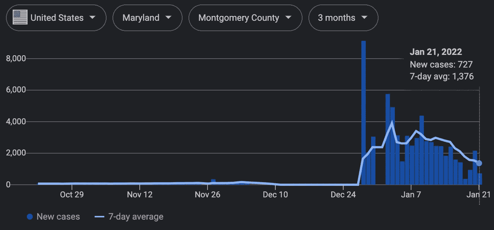
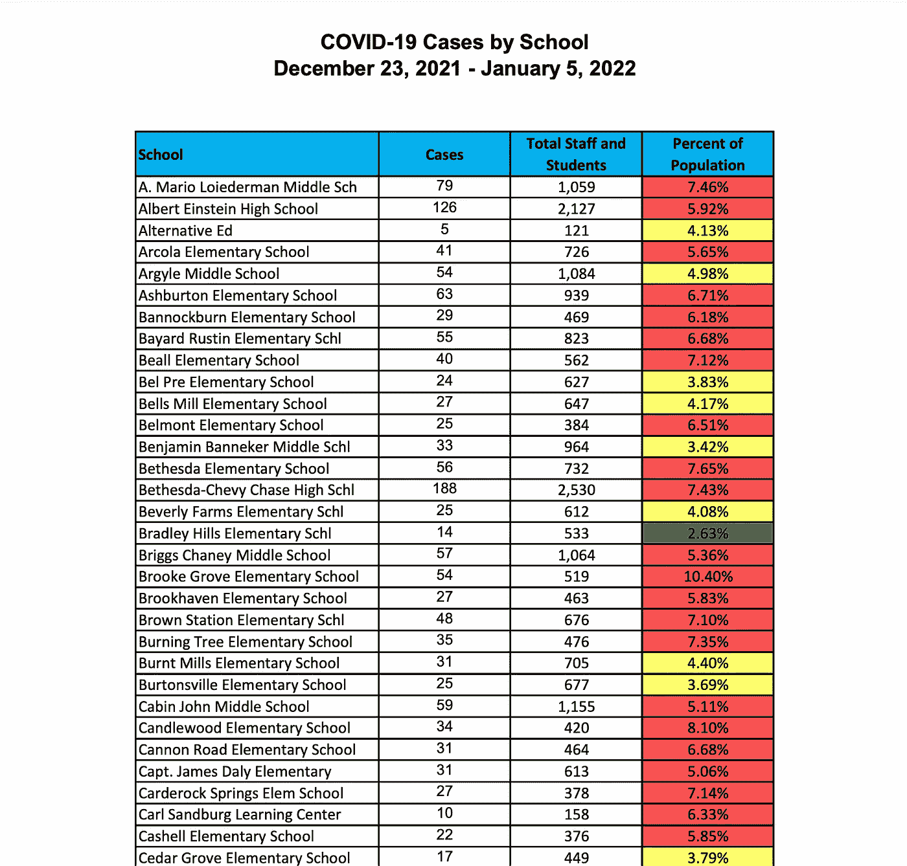
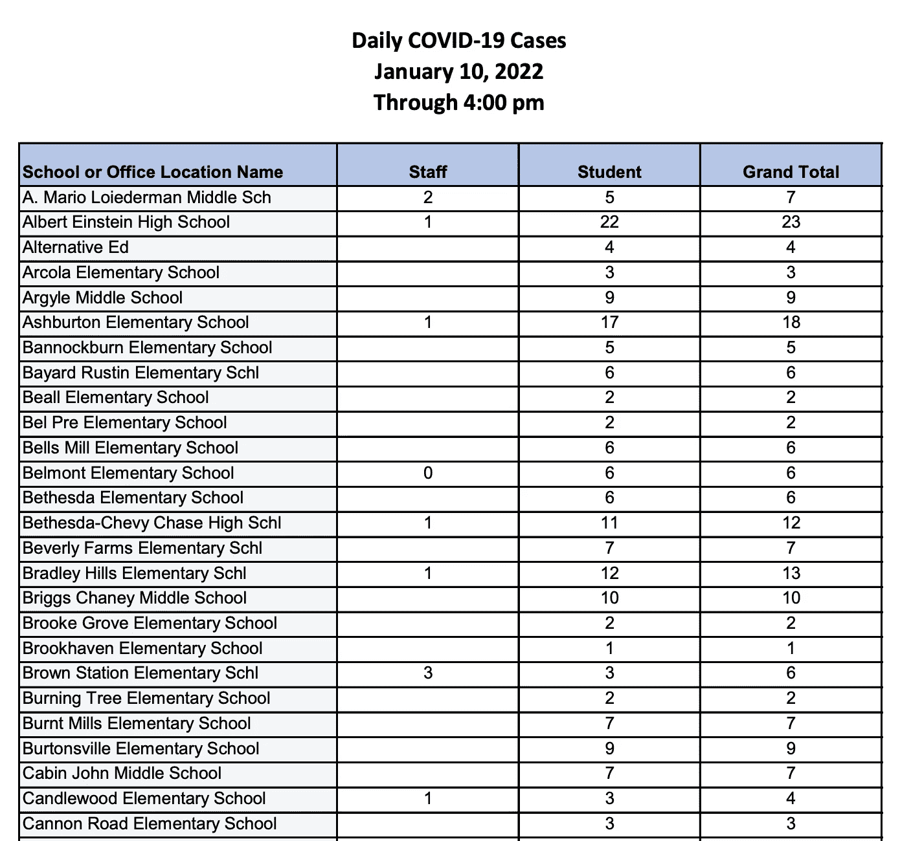
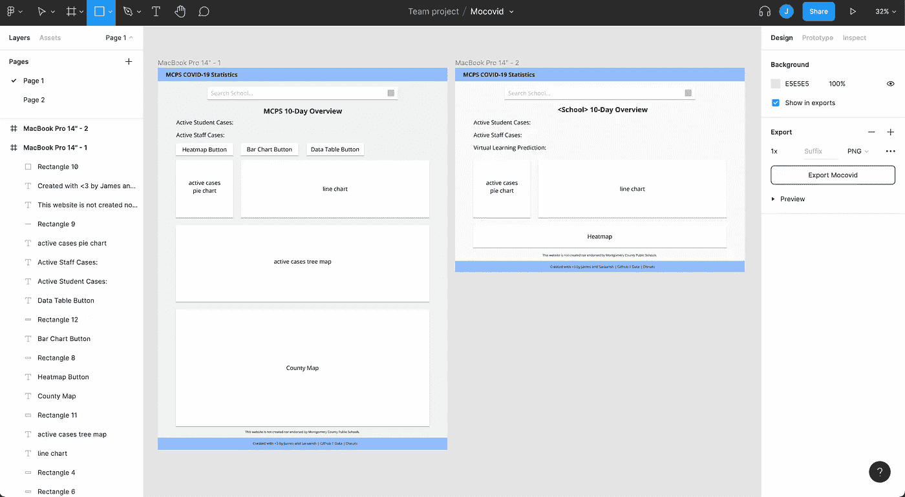
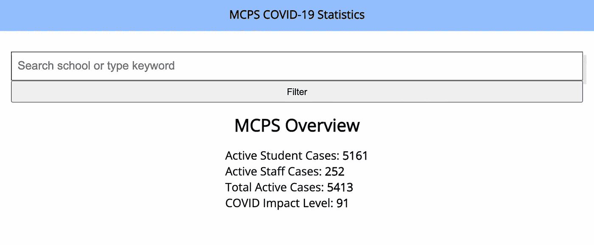
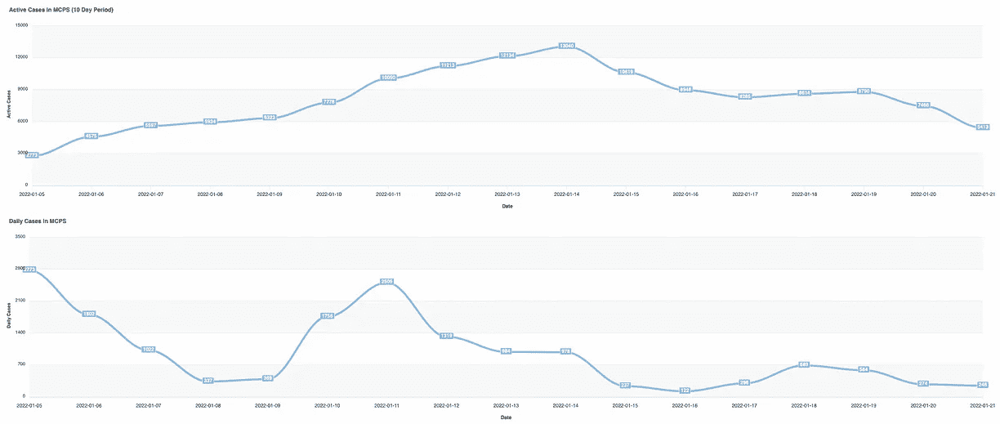
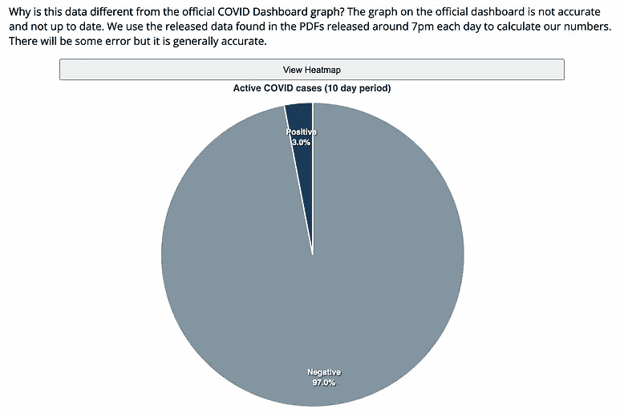

# 马里兰州一个 Covid 尖峰背后的全貌

> 原文：<https://javascript.plainenglish.io/showing-the-whole-picture-cc7fa266d993?source=collection_archive---------26----------------------->

## 分析和提供隐藏在独立数字背后的数据。

2021 年 12 月下旬，随着新的 omicron 变种的引入，covid spike 袭击了马里兰州的蒙哥马利县。

A massive spike from only a few cases to thousands in the span of a month. Source: [The New York Times](https://www.nytimes.com/interactive/2020/us/maryland-coronavirus-cases.html)

A table of cases to total population at schools in MCPS.

我所在的蒙哥马利县公立学校(MCPS)通过一种基于学校感染人数百分比的颜色编码系统来应对这种新的冠状病毒威胁。许多学生和家长依靠该系统来了解他们学校的总体 covid 情况，以及过渡到虚拟环境的可能性。

超过 5%的“红色级别”学校将考虑转向虚拟，但该县几乎每所学校都在几天内越过了这一门槛。紧接着，该县取消了 5%的门槛，并停止提供每所学校 covid 阳性人口的总百分比数据。

每个人——家长、老师、学生——都被激怒了。看起来好像国家不再关心社区的健康和安全，把虚拟化的决定留给了武断的“指导方针”。

我很好奇我们不知道的我们县 covid 的真实统计数据。该县创建的官方仪表板从来都不准确或不及时，所以我决定和我的一个好朋友 Saraansh 一起制作自己的仪表板。

我知道我在 web 开发方面有自己的优势，所以我想和能够帮助我进行数据解析和分析的人一起工作。借助 Python 和 *pandas* 库的力量，我们开始了。

What the PDF would look like.

这些数据是从每天发布在官方仪表板上的每日 PDF 中收集的 PDF 是一个表格，其中包含每个学校按员工和学生划分的总案例。这个 PDF 然后被转换成一个 Excel 电子表格，可以很容易地解析然后分析。

Saraansh 创建了一个包含每所学校及其总人口的数据库。该脚本将学校名称与新案例相匹配，并能够创建大量有用的新数据。我们的数据基于县指导方针，即如果无症状，员工可以在测试阳性 5 天后返回，学生可以在测试阳性 10 天后返回。

Example of data that was outputted.

是我开始创建前端的时候了，它最终会被托管在一个网站上供人们使用。因为我是创建数据可视化的新手，所以我想使用一个简单且易于启动的库。我决定使用 ApexCharts，它有一个非常简单的 API。

在我过去几年的开发经历中，我学到了很多关于代码组织的知识。我的第一个项目都是在没有任何面向对象原则的情况下创建的，它们很乱，通常都合并到一个文件中。我知道，如果我想快速创建这个项目并在未来维持下去，我必须保持有组织性。

A simple object-oriented structure for each module.

我知道我会有很多不同的模块，所以我为每个模块创建了一个单独的文件，为每个模块创建了一个单独的类。在主驱动程序脚本中，我希望它很简单:只需为每个类创建一个新实例，并在需要时调用适当的函数。

在我可以使用我的数据可视化之前，我需要一种方法来始终访问正在生成的数据。我们决定采用一种简单的方法来实现这一点，那就是使用 Github actions 并直接向生成的 JSON 文件发出请求。

GitHub 动作检查`server/data`目录中的更新，并在更新后创建一个 Github 托管的 Ubuntu 容器。在为 Python 脚本安装了`requirements.txt`中指定的依赖项之后，容器运行脚本，GitHub Actions 推送对 JSON 文件所做的所有更改。

接下来，我加载了我创建的所有不同的可视化类。

在我开始创建前端之前，我用 [Figma](https://www.figma.com/) 创建了一个我可能希望它看起来像什么的原型设计。我还计划好了如何编写一个过滤特性。

Prototyping with Figma.

我知道正确使用搜索功能很重要，所以我决定创建一个动态更新的页面。我希望主驱动程序脚本检查 URL 查询，如果有，它将根据需要更新页面。拥有这个 URL 查询是很重要的，因为它允许人们共享特定学校的 URL，而不需要增加额外的步骤来要求用户学习如何使用该网站。

Applying filters to a chart.

我想添加的另一个特性是一个数字指示器，它可以预测学校虚拟化的可能性。我知道能够有这样的东西将是一个引人注目的功能，会让用户重新访问我们的网站，并与他们的同行分享。

我创建了一个简单的加权因子算法，该算法将产生一个数字，该数字可以给出 COVID 影响级别的概述。

我根据某些虚拟学校的先例，以及对 MCPS 所面临的问题的总体理解来考虑这些因素。了解到总体的教职员工和代课教师短缺意味着教职员工的流失和教职员工测试呈阳性的趋势将对学校产生极大的影响。

没有 HTML 的网站就不是网站。没什么特别的，如果你愿意，你可以在这里[看一看。我在设计它的时候充分考虑了移动 UI，在创建它的时候使用 Chromium 的 Devtools 在桌面和移动视图之间切换。](https://github.com/jamxu88/mocovid/blob/main/website/index.html)

经过大约一周的计划、原型制作、开发和测试，我们终于准备好部署并让每个人使用我们的网站。

我只花了几美元就买下了我们的域名，并用 Netlify 来托管它。我有很多由 [Netlify](https://www.netlify.com/) 主持的网站，这个过程总是又快又容易。我还选择了使用 [Cloudflare](https://cloudflare.com/) ，不是因为我担心我们的网站宕机，而是我希望能够查看分析并提高整体性能。

终于，人们可以在 MCPS 看到 COVID 的全貌。

一些发布后的统计数据:在发布后的 24 小时内，在 Instagram、Discord 和脸书上推广后，有超过 700 个独立访客。COVID 峰值是暂时的，随着活动案例总数的日益下降，它已不再成为大多数人的担忧。我们网站的访客总数每天都在下降。

这是一次宝贵的经历，我终于能够将我在过去几年中学到的概念应用到一个人们可以使用的项目中，并与其他人合作，以如此快速地推出这一项目。它的速度快得让人感觉像是一场黑客马拉松，尤其是因为我们必须平衡学校和这项工作。

你可以在这里查看我们的 Github 回购[，在这里](https://github.com/jamxu88/mocovid)亲自访问网站[。](https://mcpscovid.co)

感谢您的阅读。

*更多内容看* [***说白了。报名参加我们的***](http://plainenglish.io/) **[***免费周报***](http://newsletter.plainenglish.io/) *。在我们的* [***社区不和谐***](https://discord.gg/GtDtUAvyhW) *获得独家获取写作机会和建议。***