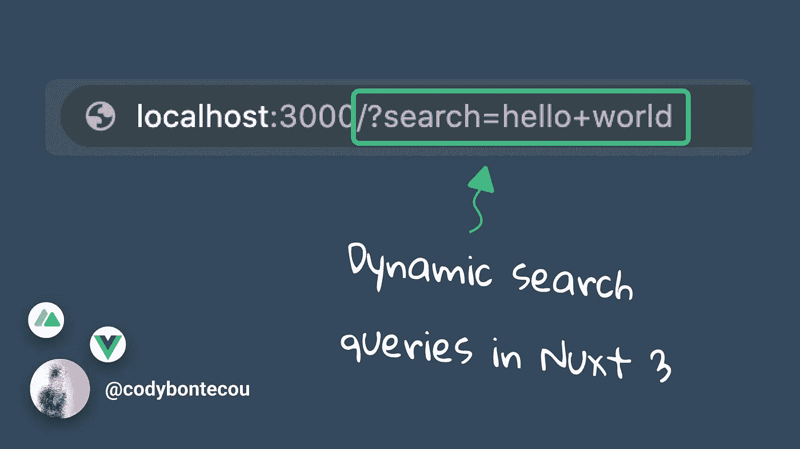
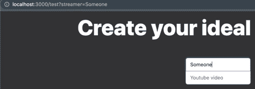

# 如何在 Nuxt 3 中静默更新 URL

> 原文：<https://javascript.plainenglish.io/silently-update-url-in-nuxt-3-a280762f4ba?source=collection_archive---------14----------------------->



> 我们经常需要在不刷新页面的情况下更新 URL 中的查询参数，如`?search=hello`。我将快速向您展示如何使用 Nuxt 3 来实现这一点。



## 收集用户输入

对于本教程，我将使用一个简单的带有`v-model`的`<input>`字段来收集查询参数。

```
<!-- pages/example.vue -->
<template>
  <input v-model="twitchStreamer" />
</template>
```

`twitchStreamer`现在是一个[反应变量](https://vuejs.org/guide/extras/reactivity-in-depth.html)，我们可以在`setup()`中使用它。

```
// pages/example.vue
<script>
  setup() {
    const twitchStreamer = ref('')

    return { twitchStreamer }
</script>
```

## Nuxt 3 的 useRouter()

> 我不确定 Nuxt 2 和 Nuxt 3 有什么不同，但是到目前为止还没有。

在`setup()`内，调用自动导入的函数`useRouter()`来访问`router`对象。

```
// pages/example.vue
<script>
  setup() {
    const router = useRouter()
    const twitchStreamer = ref('')

    return { twitchStreamer }
</script>
```

## 将 v 模型输入连接到我们的 URL

现在，设置一个观察器来观察我们的`twitchStreamer` v-model 值，这样每次更新它的值时，都会运行一点代码。

```
// pages/example.vue
<script>
  setup() {
    const router = useRouter()
    const twitchStreamer = ref('')

    watch(twitchStreamer, (twitchStreamer, previous) => {
      router.push({
        path: '/test',
        query: { streamer: twitchStreamer },
      })
    })

    return { twitchStreamer }
</script>
```

每次 twitchStreamer 值发生变化时，我们使用带有更新查询的 [vue-router](https://router.vuejs.org/guide/essentials/navigation.html) 推送至我们的 URL。

`.push`的查询参数接受一个键和值。本例中的键是`streamer`。

因此，更新后的 url 将看起来像是在=符号后带有值`twitchStreamer`的`/test?streamer=`。

## 最终代码片段

```
<!-- pages/example.vue -->
<template>
  <input v-model="twitchStreamer" />
</template>

<script>
  setup() {
    const router = useRouter()
    const twitchStreamer = ref('')

    watch(twitchStreamer, (twitchStreamer, previous) => {
      router.push({
        path: '/test',
        query: { streamer: twitchStreamer },
      })
    })

    return { twitchStreamer }
</script>
```

*更多内容看* [***说白了就是***](http://plainenglish.io/) *。报名参加我们的* [***免费每周简讯***](http://newsletter.plainenglish.io/) *。在我们的* [***社区不和谐***](https://discord.gg/GtDtUAvyhW) *获得独家获取写作机会和建议。*