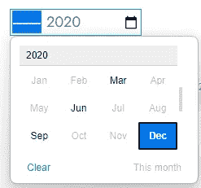

# 简单的代码—有效的用户界面—月份选择器

> 原文：<https://javascript.plainenglish.io/simple-code-effective-ui-month-picker-4b410a4d0dce?source=collection_archive---------5----------------------->

## 如果你想让用户在一年中选择一个特定的月份，最简单有效的 UI 是什么？

# 选项 1:单独的月份和年份下拉列表


Separate month and year dropdowns

它可能很冗长，但是您可以完全控制它们的位置、标签和格式

```
<select>
    <option>January</option>
    <option>February</option>
    <option>March</option>
    <option>April</option>
    <option>May</option>
    <option>June</option>
    <option>July</option>
    <option>August</option>
    <option>September</option>
    <option>October</option>
    <option>November</option>
    <option>December</option>
</select> Month

<select>
    <option>2021</option>
    <option>2022</option>
    <option>2023</option>
</select> Year
```

# 选项 2:使用浏览器内置的月份选择器


Built-in month picker

您对选取器外观的控制更少，但代码更干净。本地化支持是免费的。

```
<input type='month'> Month
```

您可以进行一些定制。例如，限制用户仅选择 2020 年季度的月末



2020 quarters only

```
<input type='month' min='2020-03' max='2020-12' step='3'>
```

根据 [MDN](https://developer.mozilla.org/en-US/docs/Web/HTML/Element/input/month) :

> 控件的用户界面通常因浏览器而异；目前支持是不完整的，只有 Chrome/Opera 和 Edge 在桌面上——以及大多数现代移动浏览器版本——有可用的实现。在不支持月份输入的浏览器中，控件优雅地退化为简单的`<input type=”text”>`，尽管可能会自动验证输入的文本以确保其格式符合预期。

截至【2022 年 12 月，Firefox 和 Safari(桌面)尚未支持该功能，而基于 Chrome 的浏览器(包括微软的新 Edge)和大多数移动浏览器(包括 iOS 上的 Safari)都支持该功能。


[https://caniuse.com/mdn-html_elements_input_type_month](https://caniuse.com/mdn-html_elements_input_type_month) (screenshot)

如果你喜欢这篇文章，请[关注我](https://medium.com/@geraldnguyen)获取更多优质内容。谢谢你。

*更多内容看* [***说白了。报名参加我们的***](https://plainenglish.io/) **[***免费周报***](http://newsletter.plainenglish.io/) *。关注我们关于* [***推特***](https://twitter.com/inPlainEngHQ) ，[***LinkedIn***](https://www.linkedin.com/company/inplainenglish/)*，*[***YouTube***](https://www.youtube.com/channel/UCtipWUghju290NWcn8jhyAw)*，* [***不和***](https://discord.gg/GtDtUAvyhW) ***。*****

***有兴趣规模化你的软件创业*** *？检查* [***电路***](https://circuit.ooo?utm=publication-post-cta) *。*