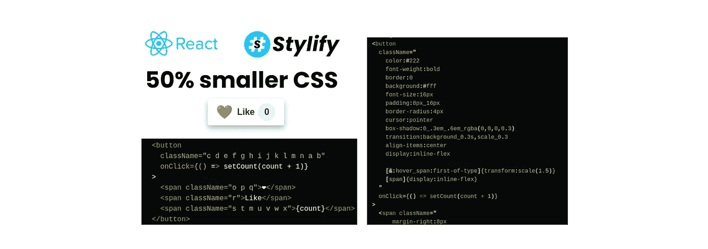
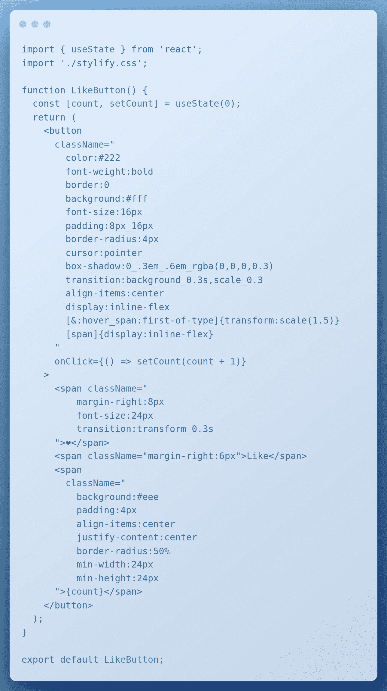
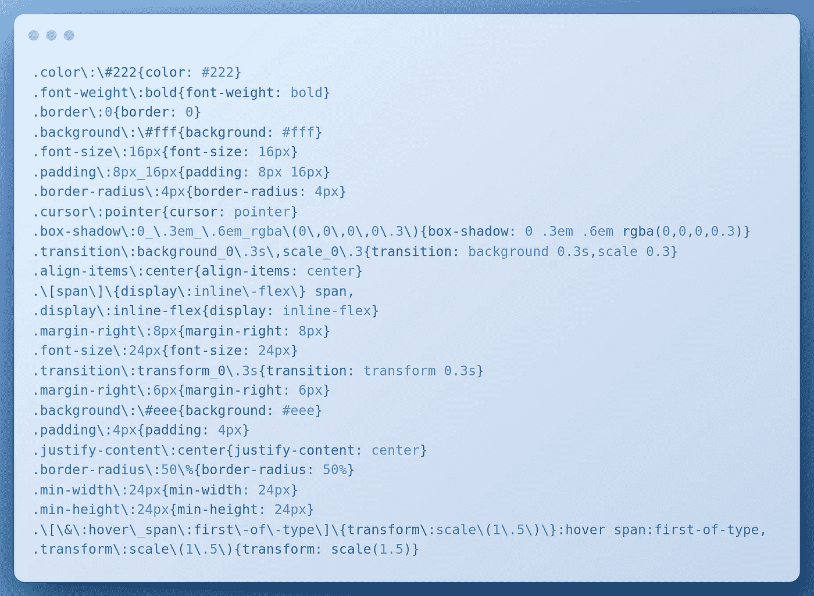
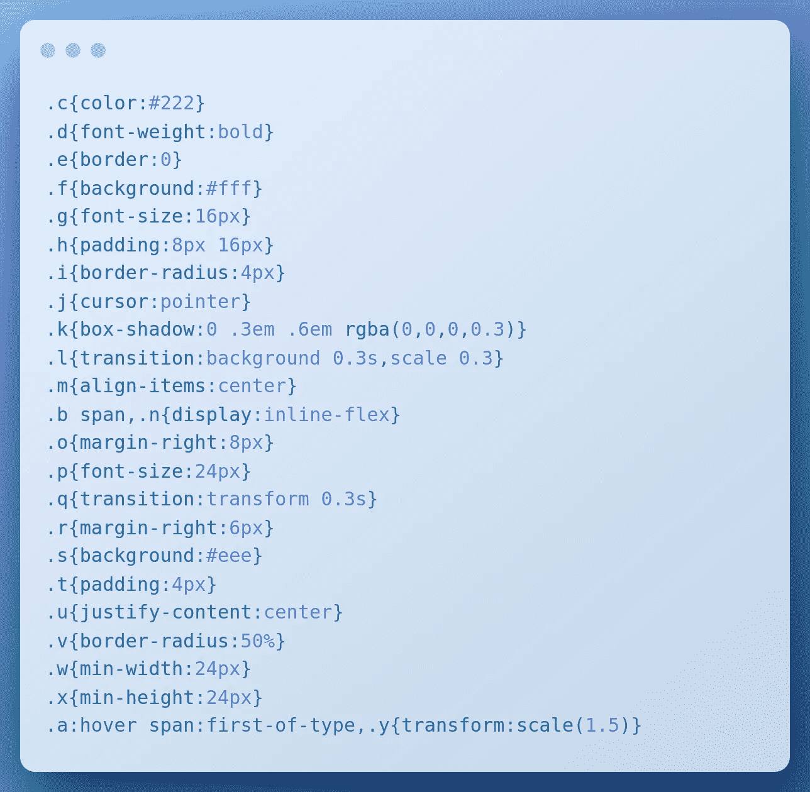
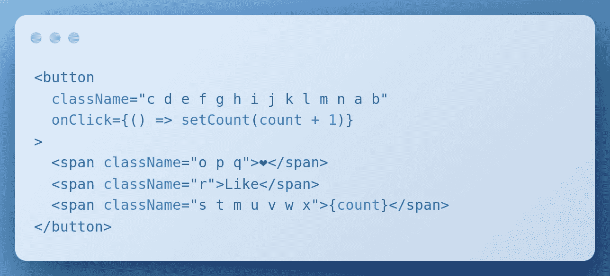
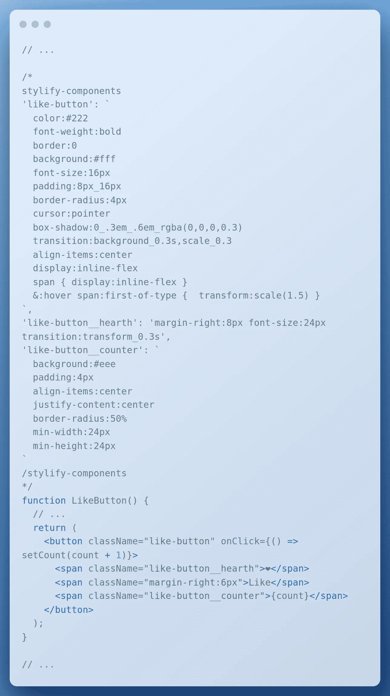

# 带有风格化 CSS 的简单反应式按钮

> 原文：<https://javascript.plainenglish.io/simple-react-like-button-with-stylify-css-17b75916b3ba?source=collection_archive---------5----------------------->

## 将类似 CSS 的选择器直接写入模板，并使用 Stylify CSS 快速设计您的 React 应用程序。



将类似 CSS 的选择器直接写入模板，并使用 [Stylify CSS](https://stylifycss.com/) 快速设计你的 React 应用。

学习如何使用[风格化 CSS](https://stylifycss.com/) 。仅使用实用程序快速设计按钮样式，然后使用[组件](https://stylifycss.com/docs/get-started#defining-a-component)清洁模板。了解为什么生产中的产量可以是 **50%** 或更小🔥。

# 目录

*   [代码](#b2d5)
*   [生产规模—缩小 50%](#b28e)
*   [模板清理](#991f)
*   [语法解释](#6eb3)
*   收银台 Stackblitz 游乐场

# 代码

下面是按钮背后的代码:



以上图为例生成的 CSS:



# 生产规模—缩小 50%

当您允许[样式化](https://stylifycss.com/)改变选择器时，输出如下:



JSX 的选择器也缩小了:



CSS 大小:

*   Dev: **1101 字节**
*   生产: **556 字节**

大小节省约为 **50%** (在 gzipped 模式下大小相似)。如果我们采用破损的 HTML，差别会更大。

# 模板清理

如果我们有很多实用程序，想把它们移出模板，该怎么办？通过 [Stylify](https://stylifycss.com/) 你可以使用可重复使用的组件来实现。它们可以在使用它们的文件或全局配置中的注释内定义(需要不带括号的 js 对象)。



在生产中，组件也会被损坏。

# 语法解释

在上面的例子中，你可以看到使用类 CSS 选择器的 Stylify。有一些不同。

*   `_`选择器是用来代替空格的
*   `[span]{display:inline-flex}`是一个内嵌的自定义选择器。这允许您定制选择器的样式。
*   `&`内部`[&:hover_span:first-of-type]`总是指像在 SCSS 那样的上层
*   组件中的缩进语法也类似于 SCSS。为了简单起见，它只支持嵌套和链接

```
span { 
  display:inline-flex 
}
&:hover span:first-of-type {  
  transform:scale(1.5) 
}
```

# 收银台 Stackblitz 游乐场

你可以试试 Stackblitz 的游乐场。

# 让我知道你的想法！

我会很高兴得到任何反馈！[风格化](https://stylifycss.com/)仍然是一个新的图书馆，有很大的改进空间🙂。

保持联系:
👉 [@8machy](https://twitter.com/8machy)
👉 [@stylifycss](https://twitter.com/stylifycss)
👉[stylifycss.com](https://stylifycss.com/)👉[dev.to/machy8](https://dev.to/machy8)👉[medium.com/@8machy](https://medium.com/@8machy)

*更多内容看* [***说白了就是***](https://plainenglish.io/) *。报名参加我们的* [***免费每周简讯***](http://newsletter.plainenglish.io/) *。关注我们* [***推特***](https://twitter.com/inPlainEngHQ) ，[***LinkedIn***](https://www.linkedin.com/company/inplainenglish/)*，*[***YouTube***](https://www.youtube.com/channel/UCtipWUghju290NWcn8jhyAw)*，* [***不和***](https://discord.gg/GtDtUAvyhW) *。对增长黑客感兴趣？检查出* [***电路***](https://circuit.ooo/) *。*