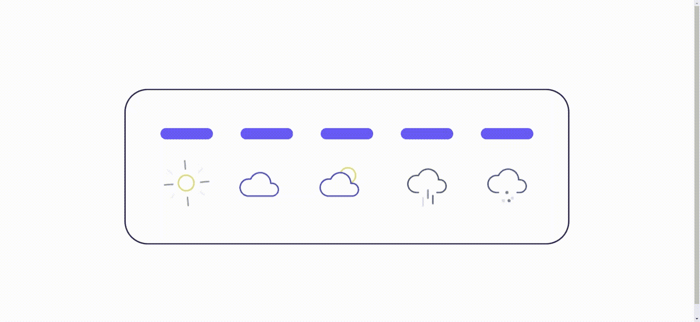
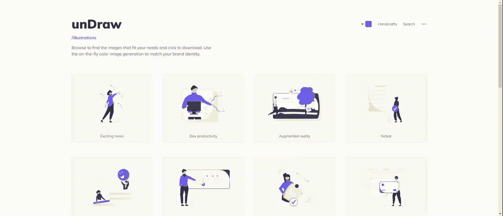
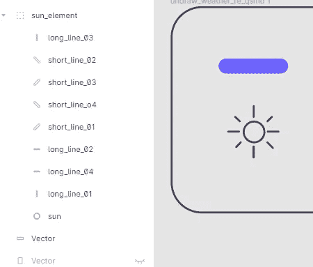
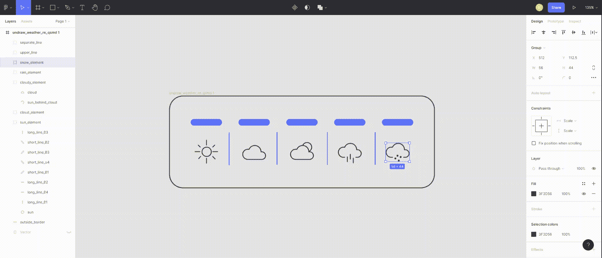
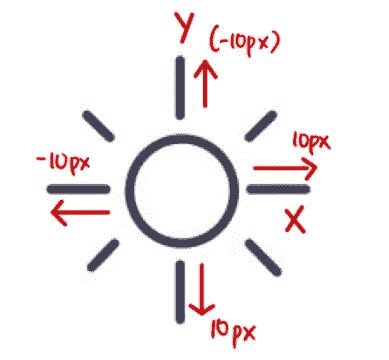
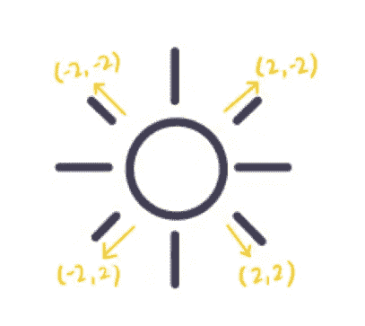
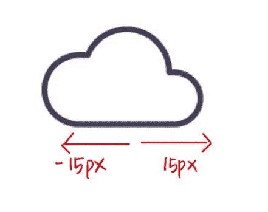

# 创建一个简单的 SVG 动画

> 原文：<https://javascript.plainenglish.io/simple-svg-animation-2d80e1188f13?source=collection_archive---------19----------------------->

## 如何创建一个简单的 SVG 动画的指南。



SVG Weather Animation

今天我想分享我制作一个简单的 SVG 动画的方法。首先，从 https://undraw.co/illustrations 的[获得一个免费的 SVG 模板。](https://undraw.co/illustrations)



weather from [https://undraw.co/illustrations](https://undraw.co/illustrations)

其次，将 SVG 导入到 **Figma** 工具中。您可以调整任何矢量颜色或移除任何不想要的矢量。

在这里，你需要 ***为你想要动画的矢量定义一个名字*** 。比方说，如果你想动画化整个元素，你可以把所有的向量组成一个组。



Define vector name

一旦定义完名称，就可以导出 SVG 模板供以后使用。

注意:勾选导出选项**包括‘id’属性**，点击导出按钮。这样您的 SVG 文件将包含向量的 id(您定义的名称)。



现在，您可以创建一些很棒的动画 SVG。将 SVG 文件导入到你的项目中，你会看到一些矢量是由 ids 定义的。让我们为第一个元素创建一些。

我将第一个元素定义为“太阳元素”。所以，我打算

*   使围绕太阳的所有线条远离太阳，慢慢消失。



Use translateX(), translateY() and skew()

```
#long_line_01 {
   animation: sun_1 4s infinite linear;
}@keyframes sun_1 {
  0% {
      transform: **translateY**(0);
      opacity: 1;
   }
  100% { 
      transform: **translateY**(-10px); 
      opacity: 0; 
   }
} 
/*****this code work for one line only*******/
```

```
#short_line_01 {
  animation: sun_01 4s 2s infinite linear;
}@keyframes sun_01 {
  0% { 
     transform: **skew**(0deg);
     opacity: 1;
   }100% {
   transform: **skew**(2deg, -2deg);
   opacity: 0;
  }
}
```

对其余部分重复相同的步骤，并更改不同方式/角度的值。接下来，围绕太阳旋转 360 度。

```
#sun_element {
 animation: sun 20s infinite linear;
 transform-origin: center;
 transform-box: fill-box;
}@keyframes sun {
  from { 
      transform: rotateZ(0deg);
  }
  to {
      transform: rotateZ(360deg);
  }
}
```

对于第二和第三个元素，其工作方式相同。



Move-in X-axis

```
#cloud_element {
   animation: cloud 4s infinite alternate;
}@keyframes cloud {
  0% {
   transform: translateX(15px);
 }100% {
   transform: translateX(-15px);
 }
}
```

接下来，对于雨雪动画，我只是用 Y 轴(向下)的方式制作雨滴和雪的动画。所有的雨滴和雪都以同样的方式工作。你只需要调整不同秒的动画延迟。

注意:CSS 中有很多代码冗余，所以我以 SCSS 的形式重构代码。

SVG Weather Animation

## 结论

一开始我觉得 SVG 动画挺难做的。然而，我从我最喜欢的 [Youtuber](https://www.youtube.com/watch?v=gWai7fYp9PY) 中获得了灵感。一些令人敬畏的 SVG 动画可以让你的网站令人惊叹和兴奋。有许多创造性的方法来制作 SVG 动画。如果你认为自己是一个富有想象力的人，为什么不试试呢？

想象力是创造力的关键！

感谢阅读。

*更多内容请看*[***plain English . io***](https://plainenglish.io/)*。报名参加我们的* [***免费周报***](http://newsletter.plainenglish.io/) *。关注我们关于*[***Twitter***](https://twitter.com/inPlainEngHQ)*和*[***LinkedIn***](https://www.linkedin.com/company/inplainenglish/)*。加入我们的* [***社区不和谐***](https://discord.gg/GtDtUAvyhW) *。*