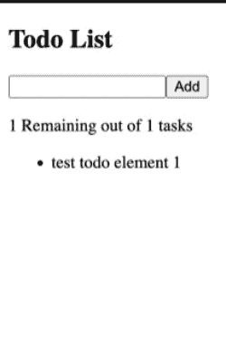

# React 中简单的 Todo 应用程序，90 行代码

> 原文：<https://javascript.plainenglish.io/simple-todo-app-in-react-in-90-lines-of-code-a213e199a30d?source=collection_archive---------3----------------------->

## 了解如何用 React 创建一个简单的 todo 应用程序—React 中的 Todo 应用程序用 90 行代码解释了类组件。


React todo app

了解如何使用 React 创建一个简单的 Todo 应用程序。Todo 应用程序与 90 行代码中解释的类组件发生反应。

# 介绍

在本教程中，我们将探索如何创建一个 React 应用程序和一个简单的带有 React 状态的 Todo 列表。

您将学到的内容:

1.如何使用 create-react-app 创建应用程序？

2.如何创建你的第一个组件？

3.如何在组件中使用状态？

4.如何在 React 中定义函数？

5.如何在 React 应用中动态改变样式？

一个很小的锻炼应用会教会你很多东西。
准确地说，我已经用 90 **行**做了这个应用程序，包括应用程序中所有的评论和样式。

让我们看看我们的应用程序最终会是什么样子。



Todo app React

令人兴奋不是吗？🙂现在我们开始吧。

# 创建 React 应用

我们需要做的第一件事是创建我们的 React 应用程序。最简单的方法之一是使用`create-react-app`包。

```
npm install -g create-react-app
```

```
create-react-app todo-list
```

```
cd todo-list
```

为了在 React 应用程序中动态更改类名，我们还需要安装一个包。您可以使用以下命令安装该软件包:

```
npm install classnames
```

[**Classnames**](https://www.npmjs.com/package/classnames) 是一个非常流行的根据变量改变样式的包。

就这样，现在您已经创建了 React 应用程序，我们可以开始对 App.js 文件进行更改了。

# 正在创建待办事项应用程序

首先，我们需要更改 App.js 文件。

```
const App = () => {    
  return (
    <>
      <div>
       <h2>Todo List</h2>
     </div>
   </>
  );
}
export default App;
```

这里，我们已经在开始时创建了应用程序的结构。

render 函数会返回需要返回的元素。

该页面将把 **h2** 元素显示为待办事项列表。

下一步我们需要添加的是一个**输入**和**添加**按钮来保存输入到我们的 todo 应用程序中的内容。

在那里，我们可以使用 app 状态将元素保存到 React 状态。

我们可以用 useState 钩子在组件中添加初始状态，如下所示:

```
const [todoValue, setTodoValue] = useState("");
const [todos, setTodos] = useState([
  {
    id: 0,
    value: "test todo element 1",
    isDone: false
  }
]);
```

添加初始状态后，我们可以开始在应用程序中使用它:)

## 将 Todo 元素添加到组件状态

添加状态后的下一部分是将 todo 元素添加到组件状态。我们可以向状态中添加新的 todo 元素，如下所示。

```
const handleChange = (e) => {
  //Updating local component state
  setTodoValue(e.target.value);
};
const clearInput = () => {
  //Clear existing value in input
  document.getElementById("todoValueInput").value = "";
  //Updating local component state
  setTodoValue("");
};
const addTodo = () => {
  setTodos([
    ...todos,
    {
      id: this.state.todos.length,
      value: this.state.addTodoValue,
      isDone: false
    }
  ]);
  clearInput();
};
```

让我们分解一下刚刚编写的代码块。

## 1.遥控

我们添加的第一个函数是 **handleChange。**我们单独来看看这个功能。

```
const handleChange = (e) => {
  //Updating local component state
  setTodoValue(e.target.value);
};
```

handleChange 函数用于获取 input 元素的值，并使用第一个 useState 钩子上定义的`setTodoValue`更新组件的本地状态。

在`setTodoValue`函数中，我们用`e.target.value`更新 **todoValue**

在 input 元素中使用这个函数将如下所示:

```
<input 
  id="todoValueInput" 
  onChange={(e) => handleChange(e)}>
</input>
```

因此，只要输入值发生变化，就会触发`handleChange`功能。

## 2.清除输入

这里使用的第二个函数是 clearInput。当用户单击 add 按钮时，我们需要清除输入值本身和本地状态中的值。这一点已经做了如下。

```
const clearInput = () => {
    //Clear existing value in input
    document.getElementById("todoValueInput").value = "";
    //Updating local component state
    setTodoValue("");
  };
```

正如你在这里看到的，首先我们用`getElementById`访问元素，并使用`setTodoValue("")`将 todoValue 清除为空字符串。

## 3.addTodo

我们需要使用的最后一个函数是向本地状态添加 todo 元素。可以看到下面的 addTodo 函数:

```
const addTodo = () => {
 setTodos([
    ...todos,
    {
      id: todos.length,
      value: todoValue,
      isDone: false
    }
  ]);
  clearInput();
};
```

addTodo 函数使用`setTodos`来设置组件的本地状态。它获取所有现有的`todos`状态，并将一个新对象添加到该数组中。

id 值由`todos.length`自动生成

数值取自我们在`handleChange`中设置的`addTodoValue`状态

isDone 将默认值设置为 false。

作为这个函数的最后一步，我们调用`clearInput()`来清除`todoValue`状态和输入值本身。

让我们结合到目前为止我们所学的所有元素，更新我们的输入和 todo 元素的状态，如下所示:

```
const App = () => {
  const [todoValue, setTodoValue] = useState("");
  const [todos, setTodos] = useState([
    {
      id: 0,
      value: "test todo element 1",
      isDone: false
    }
  ]);
```

```
 const handleChange = (e) => {
    //Updating local component state
    setTodoValue(e.target.value);
  }; const clearInput = () => {
    //Clear existing value in input
    document.getElementById("todoValueInput").value = "";
    //Updating local component state
    setTodoValue("");
  }; const addTodo = () => {
    setTodos([
       ...todos,
       {
         id: todos.length,
         value: todoValue,
         isDone: false
       }
     ]);
     clearInput();
   }; return (
    <>
      <div>
        <h2>Todo List</h2>
      </div>
      <input
        id="todoValueInput"
        onChange={(e) => handleChange(e)}
      ></input>
      <button onClick={() => addTodo()}>Add</button>
    </>
  );
};export default App;
```

正如您在这个组件中看到的，我们还没有在组件中呈现添加的 todo 元素。

在呈现元素的同时，我们还想通过单击元素来更改 Todo elements `isDone`属性。

## 如何在组件内呈现 Todo 元素

```
<ul>
  {todos.map((todo) => {
    return (
      <li
        key={todo.id}
        className={cx({ "is-done": todo.isDone })}
        onClick={() => setTodoAsDone(todo.id)}
      >
        {todo.value}
      </li>
    );
  })}
</ul>
```

这里我们已经映射了 todos 状态并呈现了 todo 元素，我们还添加了一个 onClick 事件处理程序来将 todo 元素`isDone`属性更改为 true 或 false。

## 更改 Todo 元素的 isDone 属性

在这个函数中，我们将使用元素的 id 来更改 todo 元素的 isDone 属性。我们需要在这里添加 id 作为参数来改变元素的状态。

```
const setTodoAsDone = (id) => {
  const todosNew = [...todos];
  todosNew.map((t) => {
    if (t.id === id) {
      t.isDone = !t.isDone;
    }
    return t;
  });
  setTodos(todosNew)
};
```

就是这样！现在我们解释了创建一个简单的 Todo 应用程序所需的所有函数。

下面是可以直接查看的完整代码:)

这就是 React 中简单的 Todo 应用程序的全部内容。总之，我们已经编写了 90 行代码来创建我们的 Todo 应用程序:)

*如果你觉得这篇文章很有帮助，你* [***可以通过使用我的推荐链接***](https://melihyumak.medium.com/) ***注册一个* [***中等会员来访问类似的***](https://melihyumak.medium.com/membership) 。**

***跟我上*** [**推特**](https://twitter.com/hadnazzar)

[](https://www.youtube.com/c/TechnologyandSoftware?sub_confirmation=1)

***Subscribe for more on*** [**Youtube**](https://www.youtube.com/c/TechnologyandSoftware?sub_confirmation=1)

# 编码快乐！

梅利赫

*更多内容请看*[***plain English . io***](https://plainenglish.io/)*。报名参加我们的* [***免费每周简讯***](http://newsletter.plainenglish.io/) *。关注我们关于*[***Twitter***](https://twitter.com/inPlainEngHQ)[***LinkedIn***](https://www.linkedin.com/company/inplainenglish/)*[***YouTube***](https://www.youtube.com/channel/UCtipWUghju290NWcn8jhyAw)*和* [***不和***](https://discord.gg/GtDtUAvyhW) *****

****有兴趣缩放你的软件启动*** *？检查* [***电路***](https://circuit.ooo/?utm=publication-post-cta) *。**