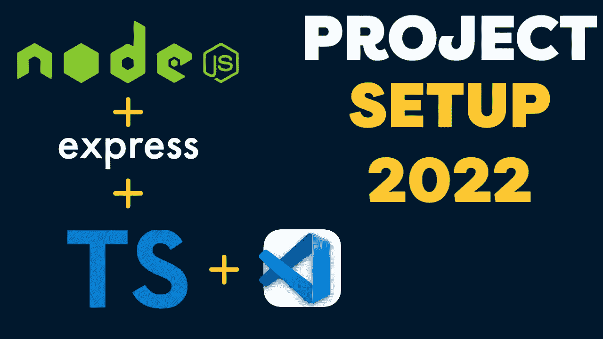
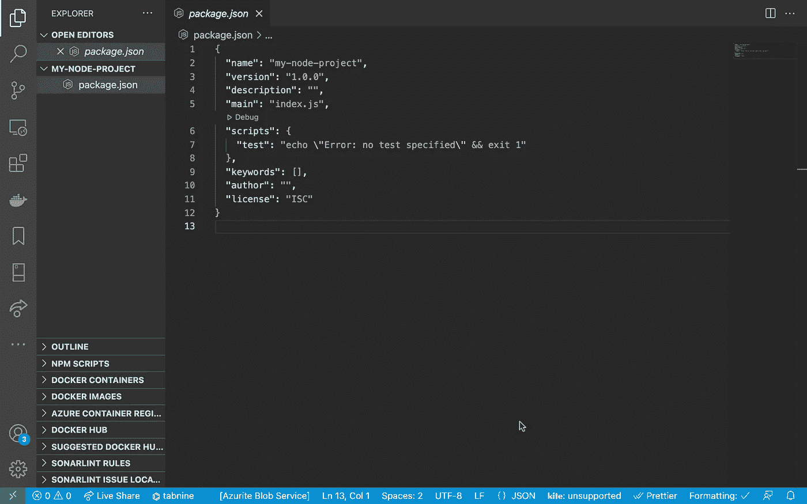
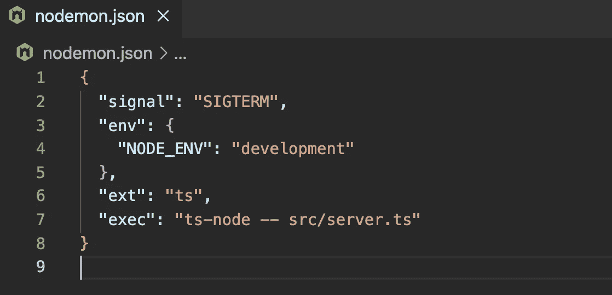
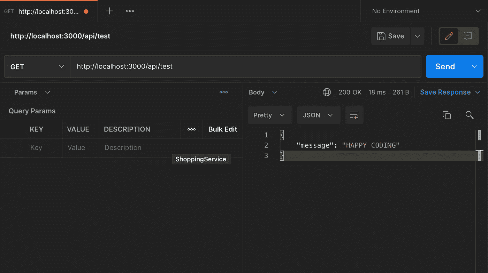

# 使用 Node.js、Express 和 nodemon 的简单类型脚本项目

> 原文：<https://javascript.plainenglish.io/simple-typescript-project-with-node-express-nodemon-b4ed18197c03?source=collection_archive---------7----------------------->

## 使用 Node.js、Express 和 nodemon 创建 TypeScript 项目的指南。



# 要求

*   邮递员[https://www.postman.com/downloads/](https://www.postman.com/downloads/)
*   VS 代码【https://code.visualstudio.com/download 
*   node . js https://nodejs.org/en/download/
*   端子[https://iterm2.com/](https://iterm2.com/)或普通端子

# 创建项目目录

```
mkdir my-node-projectcd my-node-project
```

**通过运行**来初始化您的项目

```
npm init -y
```

*   Package.json 文件已创建
*   在上面的命令中使用-y 标志会生成带有默认值的 package.json 文件。npm 不是自己添加项目名称和描述之类的信息，而是用默认值初始化文件，这些值可以在以后更新



visual studio code package.json file created

**安装所有依赖项**

```
npm install expressnpm install typescript ts-node nodemon @types/node @types/express — save-dev
```

**创建**[**ts config . JSON**](https://www.typescriptlang.org/docs/handbook/tsconfig-json.html)**文件**

```
npx tsc — init
```


tsconfig.json file specifies various compiler options to compile the project

**创建文件 nodemon.json**

将以下内容添加到 nodemon 文件中:

```
{“signal”: “SIGTERM”,“env”: {“NODE_ENV”: “development”},“ext”: “ts”,“exec”: “ts-node — src/server.ts”}
```



**更新 package.json**

在脚本部分添加以下脚本:

```
“scripts”: {“start”: “nodemon”}
```

**整理完毕**

```
Create a folder “src” then create file “server.ts” inside the folderInside server.ts file add some codeimport express, { Application, Request, Response } from “express”;const app: Application = express();**//OUT FIRST API CALL**app.get(“/api/test”, (req: Request, res: Response) => {res.status(200).json({ message: “HAPPY CODING” });});const port = 3000;const host = “http://localhost";app.listen(port, () =>{console.log(`\nServer listening on ${host}:${port}\n`);})
```

**运行并测试**

```
Run **npm start**Server listening on [http://localhost:3000](http://localhost:3000)
```



First API call testing in [Postman](https://www.postman.com/downloads/)

现在我们有了一个运行 Node.js 和 Express 的 TypeScript 项目的起点。你可以从 [Github](https://github.com/code-is-gold/my-node-project) 下载这段代码。

如果您觉得这篇文章有用，请点击👏按钮。

*更多内容请看*[***plain English . io***](https://plainenglish.io/)*。报名参加我们的* [***免费周报***](http://newsletter.plainenglish.io/) *。关注我们关于*[***Twitter***](https://twitter.com/inPlainEngHQ)*和*[***LinkedIn***](https://www.linkedin.com/company/inplainenglish/)*。加入我们的* [***社区不和谐***](https://discord.gg/GtDtUAvyhW) *。*