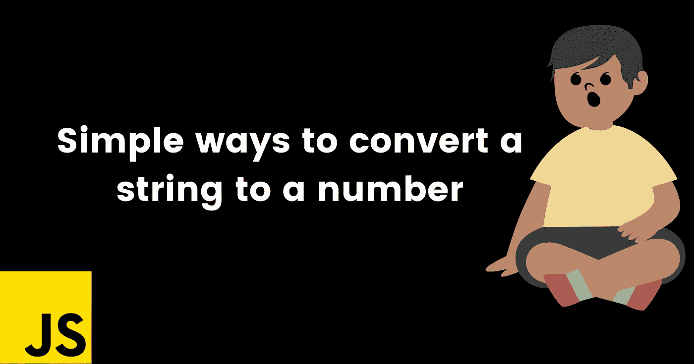

# 将字符串转换成数字的简单方法

> 原文：<https://javascript.plainenglish.io/simple-ways-to-convert-a-string-into-a-number-99a0c4300d87?source=collection_archive---------23----------------------->

## 简单易行的方法，并解释了字符串到数字的转换。



# 大家好👋

怎么了，朋友们，这是雪球。我是一名年轻热情、自学成才的前端 web 开发人员，并打算成为一名成功的开发人员。

今天，我在这里为我的初学者朋友和 JavaScript 修订者提供一个基本主题。快乐阅读！

在本文中，我将讨论几种将字符串转换成数字的方法。

# parseInt()

```
const x = "5"parseInt(x) // 5
```

用`parseInt()`可以很容易的把一个字符串转换成一个数字。如果你在`parseInt()`中传递任何单词或字母，那么它将返回`Nan`——而不是一个数字

# 数字()

在 JavaScript 中，`Number()`方法将值转换为数字，如果值转换失败，它将返回`NaN`。

```
const x = "5"Number(x)
```

# 加号(+)一元运算符

```
const x = "5"const num = +x
```

在一个元素前单独使用`+`运算符表示一个数学运算，并试图将该元素转换为一个数字，如果失败，它将返回`NaN`

感谢您的阅读，祝您愉快！你的欣赏是我的动力😊

*   在 Twitter 上关注我— [@codewithsnowbit](https://twitter.com/codewithsnowbit)
*   在 YouTube 上订阅我— [用雪球编码](https://www.youtube.com/channel/UCNTKqF1vhFYX_v0ERnUa1RQ?view_as=subscriber&sub_confirmation=1)

*更多内容看* [***说白了。报名参加我们的***](http://plainenglish.io/) **[***免费周报***](http://newsletter.plainenglish.io/) *。在我们的* [***社区不和谐***](https://discord.gg/GtDtUAvyhW) *获得独家获取写作机会和建议。***