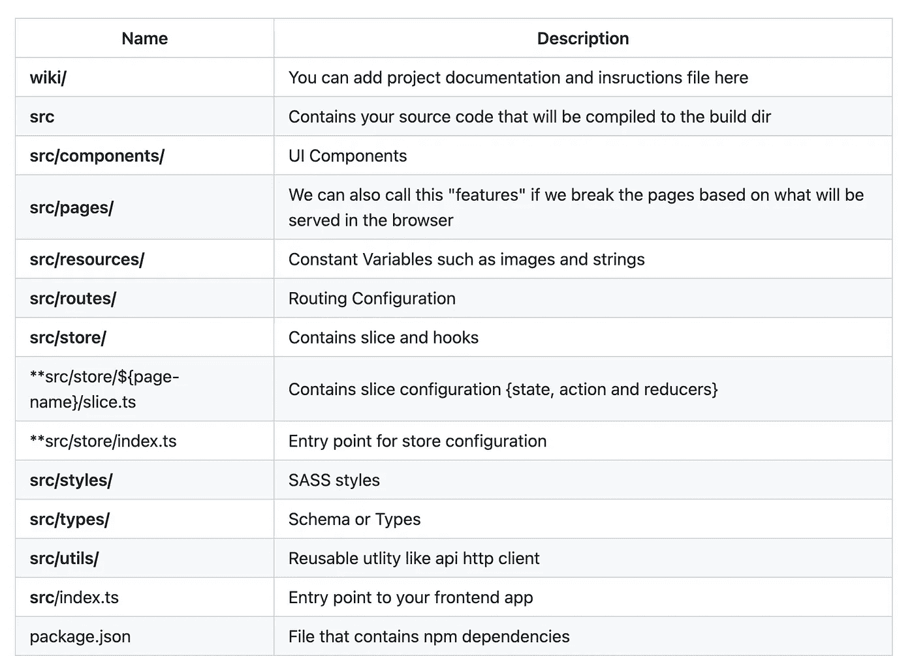
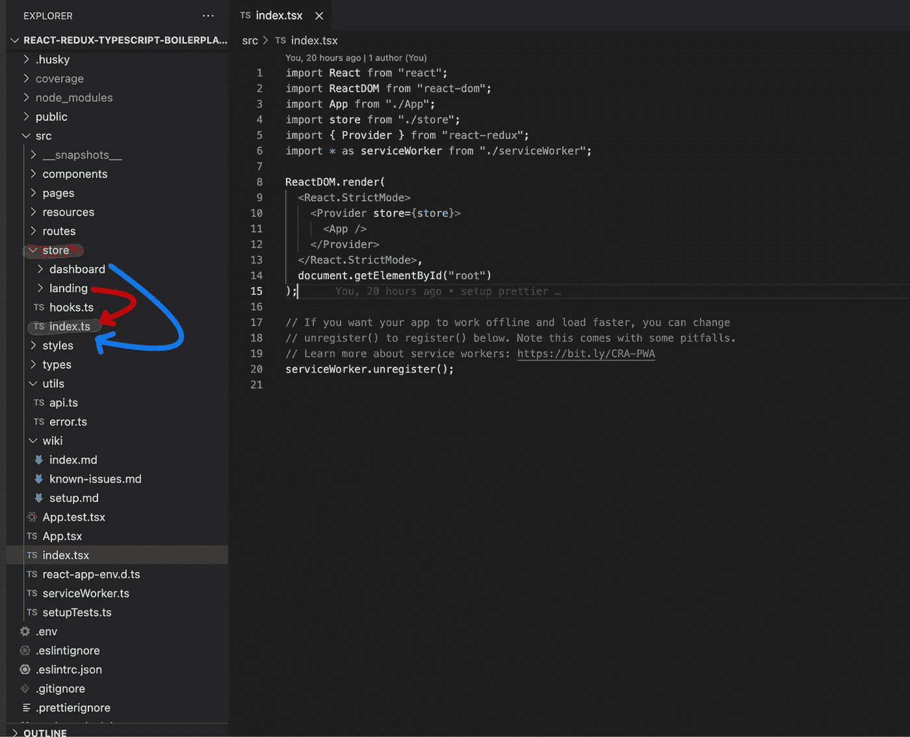
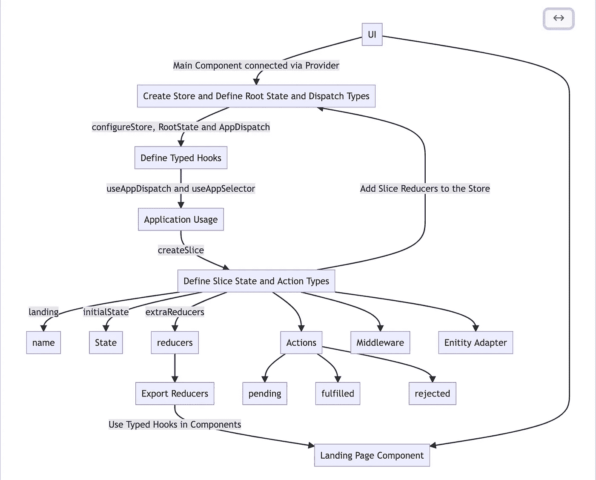
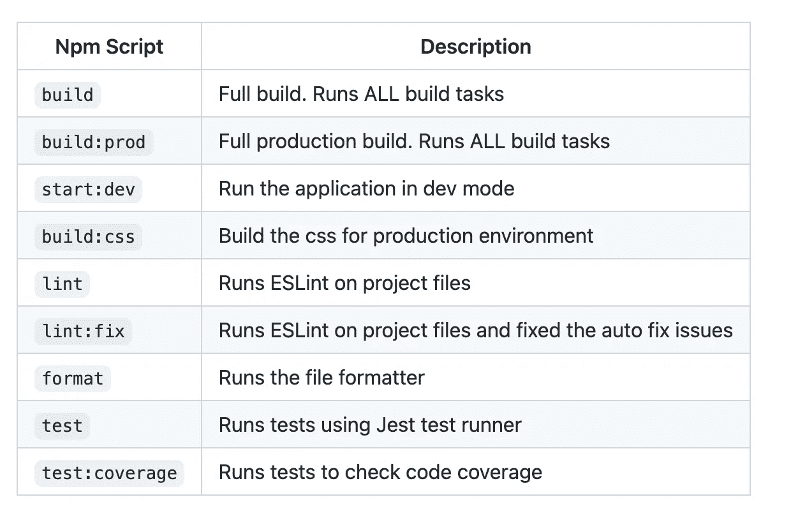
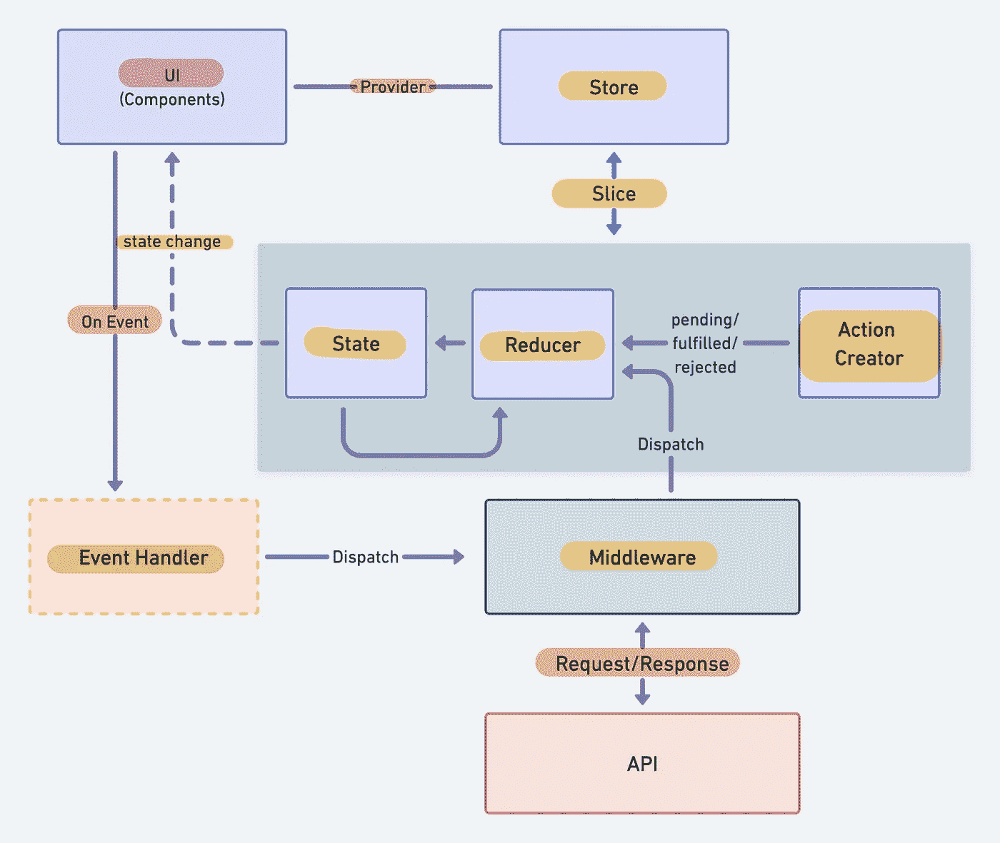

# 用 TypeScript 编写的 React 与 Redux 前端应用程序的框架

> 原文：<https://javascript.plainenglish.io/skeleton-for-react-with-redux-frontend-apps-written-in-typescript-9f5490e94e6d?source=collection_archive---------3----------------------->

## 关于如何使用 React with Redux Toolkit 启动一个项目的指南，用 TypeScript 编写(集成了 SASS、ESLint、Prettier 和 Husky)。

Photo by [Mohammad Rahmani](https://unsplash.com/@afgprogrammer?utm_source=medium&utm_medium=referral) on [Unsplash](https://unsplash.com?utm_source=medium&utm_medium=referral)

## 介绍

我们每次写东西，都不用从头开始。我们的项目可以设置得更快，并且我们可以使用样板文件和初学者工具包立即开始工作。通过这篇文章，您将了解如何使用 React 和用 TypeScript 编写的 Redux Toolkit 启动一个项目。

以下是用 TypeScript 编写的前端应用程序的样板源代码。

这个项目由 [Create React App](https://github.com/facebook/create-react-app) 引导，使用 [Redux](https://redux.js.org/) 和 [Redux Toolkit](https://redux-toolkit.js.org/) 模板。

 [## GitHub-Santosh shinde 2012/React-Redux-typescript-boilerplate:React & Redux 应用程序的框架…

### 用 TypeScript 编写的 React & Redux 应用程序的框架(带有 ESLint、Prettier 和 Husky 的设置说明)…

github.com](https://github.com/santoshshinde2012/react-redux-typescript-boilerplate) 

## 目的

我们使用这个框架的主要目的是用 Redux toolkit 和 TypeScript 启动一个前端应用程序。

试试看！我很高兴听到你的反馈或任何种类的新功能。

## 共同特征

1.  快速启动
2.  集成的 ESLint，更漂亮、更沙哑
3.  集成 Redux 工具包
4.  集成 SASS
5.  基于 Typescript 语法
6.  生产就绪的框架
7.  具有 GitHub 操作的 CI/CD 管道

## 项目结构

Project Structure

source code

## **样板工作流程**

Boilerplate Workflow

## 运行构建

所有不同的构建步骤都通过 [npm 脚本](https://docs.npmjs.com/misc/scripts)进行编排。Npm 脚本基本上允许我们通过 npm 调用(和链接)终端命令。这很好，因为大多数 JavaScript 工具都有易于使用的命令行实用程序，允许我们不需要咕哝或吞咽来管理我们的构建。如果你打开`package.json`，你会看到一个`scripts`部分，里面有你可以调用的所有不同的脚本。要调用脚本，只需从命令行运行`npm run <script-name>`。您会注意到 npm 脚本可以相互调用，这使得用简单的单独构建脚本来构建复杂的构建变得很容易。以下是该模板中所有可用脚本的列表:

## **为什么选择 Redux Toolkit**

在这一点上，Redux 已经被证明是状态管理的一个流行选项。它的模式使得状态是可预测的，因为 reducers 是纯函数，不管传递的状态或动作如何，它总是产生相同的输出。

Redux 流也易于维护和扩展，因为它对每个组件的行为和工作方式有严格的编码规则。

Redux Toolkit 最初是为了帮助解决 Redux 的三个常见问题而创建的:

1.  配置 Redux 存储太复杂了
2.  我必须添加许多包来让 Redux 做任何有用的事情
3.  Redux 需要太多样板代码

Redux Data Workflow

 [## Redux Essentials，第 1 部分:Redux 概述和概念

### 欢迎来到 Redux Essentials 教程！本教程将向您介绍 Redux，并教您如何使用它…

redux.js.org](https://redux.js.org/tutorials/essentials/part-1-overview-concepts) 

如果这个博客为你的学习增加了价值，请分享你的评论并鼓掌。

*更多内容请看*[***plain English . io***](https://plainenglish.io/)*。报名参加我们的* [***免费周报***](http://newsletter.plainenglish.io/) *。关注我们关于*[***Twitter***](https://twitter.com/inPlainEngHQ)*和*[***LinkedIn***](https://www.linkedin.com/company/inplainenglish/)*。加入我们的* [***社区不和谐***](https://discord.gg/GtDtUAvyhW) *。*