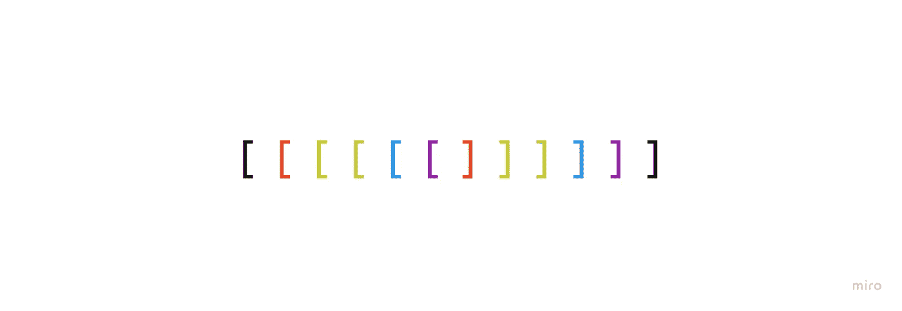

# 推拉窗

> 原文：<https://javascript.plainenglish.io/sliding-window-821263917688?source=collection_archive---------12----------------------->

## JavaScript 问题解决模式

这将是一个超级快速的帖子(我试图在这里创造一个个人博客帖子记录)。

我们的问题是:

我们需要接受一个数组和一个数字 n 作为参数。我们将从 n 长度的子数组中返回最大和。

因此，maxSubarraySum([1，2，3]，2)返回 5，因为潜在子数组的长度为 2，2 + 3 = 5，并且大于 1 + 2。

仔细想想:

因此，手头子数组的每个和将与我们的最大和进行比较，如果超过，我们将保留它。

编码出来:

我讨论了如何最好地表达这个解决方案，并决定使用有趣的三元赋值和链式操作，而不是全长条件语句。

首先，为了澄清，我定义了从负无穷大开始的 greatestSum，这样我们可以处理负数。

然后，**第 11 行**设置我们的子数组(或‘滑动窗口’)并得到它的和。

**第 12 行**然后基于与 subarraySum 的比较重新评估 greatestSum。

希望这是有帮助的…完成和*完成*！

*更多内容看* [***说白了就是 io***](https://plainenglish.io/) *。报名参加我们的* [***免费周报***](http://newsletter.plainenglish.io/) *。关注我们关于*[***Twitter***](https://twitter.com/inPlainEngHQ)*和*[***LinkedIn***](https://www.linkedin.com/company/inplainenglish/)*。查看我们的* [***社区不和谐***](https://discord.gg/GtDtUAvyhW) *加入我们的* [***人才集体***](https://inplainenglish.pallet.com/talent/welcome) *。*