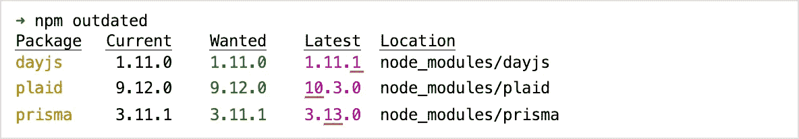
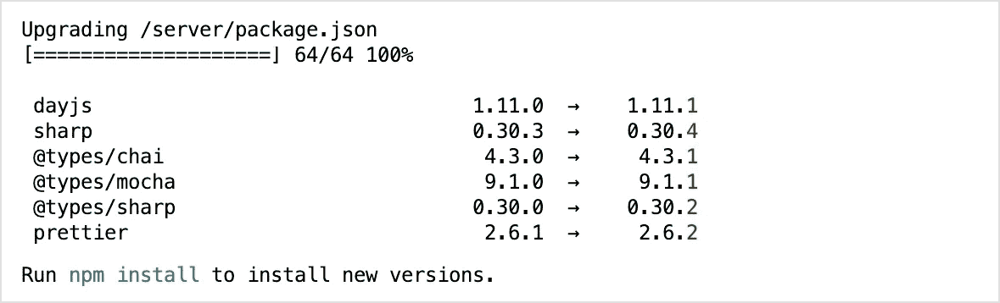
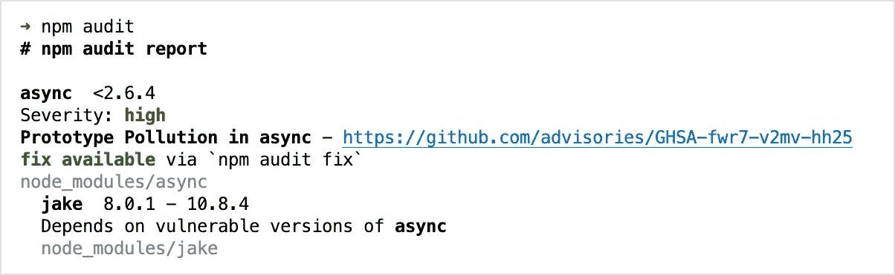
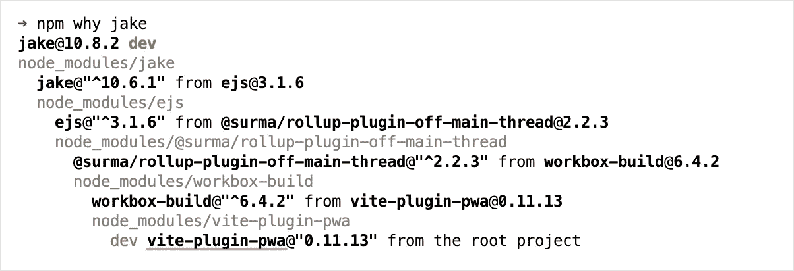
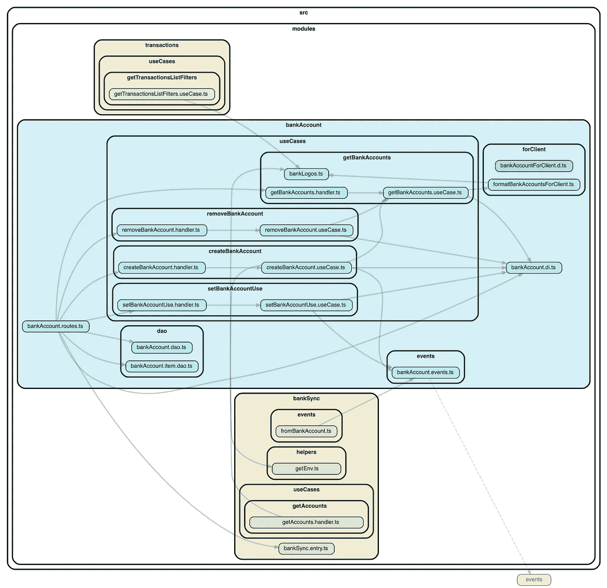
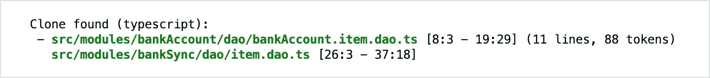
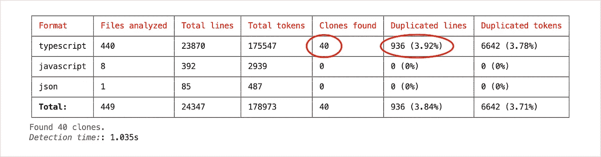
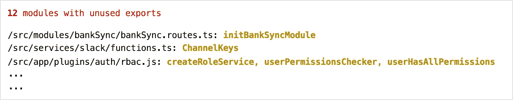

# 维护 Node.js 应用程序的小而有用的习惯

> 原文：<https://javascript.plainenglish.io/small-but-useful-habits-on-a-node-js-app-9c87d37786c0?source=collection_archive---------10----------------------->

找到好的资源从头创建一个应用程序相对容易，但如何随着时间的推移维护它则完全是另一回事。我觉得它需要两样东西:一个这样做的真诚愿望，和一些帮助我们的工具。

过时的依赖和意大利面条陷阱是我将要提到的两个例子。


Photo by [Nuno Silva](https://unsplash.com/@nmsilva)

# npm 已过时

(或`yarn outdated`或`pnpm outdated`)

👉找出你过时的依赖。

可能是我用的最多的一个。

> *我确信保持依赖关系最新是我们工作* *的一部分。没有人会要求你这么做，但是作为一个开发者，这属于“你签署的隐含的东西”。*



Exemple of output, with all three possibilities: new major / minor / patch versions.

现在你可以转到你的`package.json`文件，删除任何你想要的依赖项，然后重新运行`npm install`。或者:

# NPM-检查-更新

👉轻松删除依赖组。

Github 回购:[https://github.com/raineorshine/npm-check-updates](https://github.com/raineorshine/npm-check-updates)

我有一个脚本示例:

```
// package.json{
  "name": "my-node-api",
  "scripts": {
    "bump-to-patch-versions": "npx npm-check-updates -u --target patch"
  }
}
```

以上面的截图为例，假设我可以将`dayjs`升级到新的补丁版本(`v1.1.11`)，运行下面的命令会自动为你完成:

```
> npm run bump-to-patch-versions
```

还有其他一些依赖关系:



Packages still at a 0.x version are marked in red.

还是关于保持最新的话题，值得看看像[依赖机器人](https://github.blog/2022-02-08-improving-developer-experience-dependabot-alerts/)或[翻新](https://github.com/renovatebot/renovate)这样的机器人。

# npm 审计

👉意识到可能的安全漏洞。

这是一个很好的实践，不时运行。当您对该命令有信心时，您甚至可以将其作为 CI 工作流中的一个新步骤。

输出示例:



这个易受攻击的“jake”包是什么，为什么我的 node_modules 中有它？快速`npm why jake`可以有所帮助。

这里的“jake”似乎是我实际使用的“vite-plugin-pwa”的依赖项:



我们很幸运，对于这一个，我们可以运行`npm audit fix`让 npm 在你的 package-lock.json 中增加一些版本。(这并不妨碍我们检查已经做了什么，并寻找可能的回归！)

# 从属巡洋舰

👉可视化模块之间的依赖关系。

Github 回购:[https://github.com/sverweij/dependency-cruiser](https://github.com/sverweij/dependency-cruiser)

将你的代码分成不同的模块通常被认为是一个好的实践，并且**保持模块之间相对独立**。

我将选择一个模块(蓝色)并查看它的依赖项(黄色和橙色):



现在，我可以问自己，这个“bankAccount”模块取决于另外两个模块:“transactions”和“bankSync”。嗯，可能不是，所以我可能想清除这些依赖，组织不同的代码，等等。

我用来生成此图的完整脚本:

```
depcruise \
  -x "(^node_modules|__tests__|logger.ts|errors.ts)" \
  --focus "^src/modules/bankAccount" \
  --ts-config ./tsconfig.json \
  --output-type dot \
  'src/modules' | dot -T svg > dependencygraph.svg
```

为了更进一步，我知道可以根据你所在的文件设置一些特定的 **ESLint 规则**来限制导入模式，也许用[https://eslint.org/docs/rules/no-restricted-imports](https://eslint.org/docs/rules/no-restricted-imports)(我还没试过)。

# jscpd

👉找到重复的代码片段。

Github 回购:[https://github.com/kucherenko/jscpd](https://github.com/kucherenko/jscpd)

```
npm install -D jscpd
```

我有一个脚本示例:

```
// package.json
{
  "name": "my-node-api",
  "scripts": {
    "jscpd": "jscpd --ignore \"src/testUtils/*,**/__tests__/*.ts\" src"
  }
}
```

如果你没有我这么幸运，你可能会得到一些结果，形式是:



结尾有一个总结:



我并不是暗示所有的重复都是不好的，事实上，他们中的一些被团队认可和接受。然而，有时它们是无意的，是由于编码或审查过程中的疏忽造成的。这就是`jscpd`发挥作用的地方👍

# ts-未使用-出口

👉发现未使用的出口。
*(如果使用 TypeScript)*

Github 回购:[https://github.com/pzavolinsky/ts-unused-exports](https://github.com/pzavolinsky/ts-unused-exports)

我有一个脚本示例:

```
// package.json{
  "name": "my-node-api",
  "scripts": {
    "find-unused-exports": "ts-unused-exports ./tsconfig.json --excludeDeclarationFiles"
  }
}
```

输出示例:



这并不多，但当我每月运行一次时，我通常会发现 2-3 个文件值得一看！

另一个回购协议似乎也是如此:[https://github.com/nadeesha/ts-prune](https://github.com/nadeesha/ts-prune)

今天到此为止，很可能还有很多类似的快速提示，我可能会在未来更新这篇文章！

感谢阅读我的文章。:)

*更多内容请看*[***plain English . io***](https://plainenglish.io/)*。报名参加我们的* [***免费周报***](http://newsletter.plainenglish.io/) *。关注我们关于*[***Twitter***](https://twitter.com/inPlainEngHQ)*和*[***LinkedIn***](https://www.linkedin.com/company/inplainenglish/)*。加入我们的* [***社区不和谐***](https://discord.gg/GtDtUAvyhW) *。*