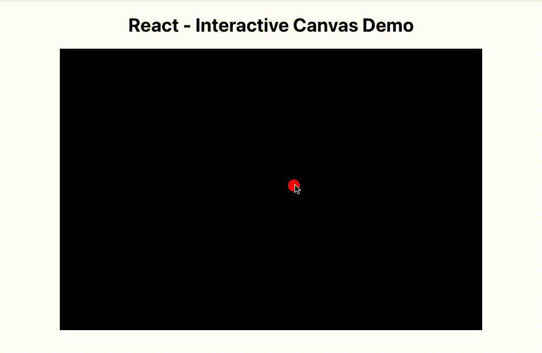
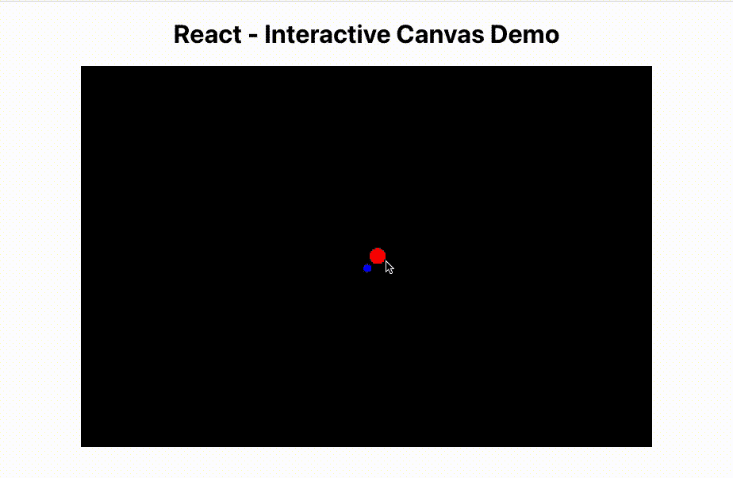
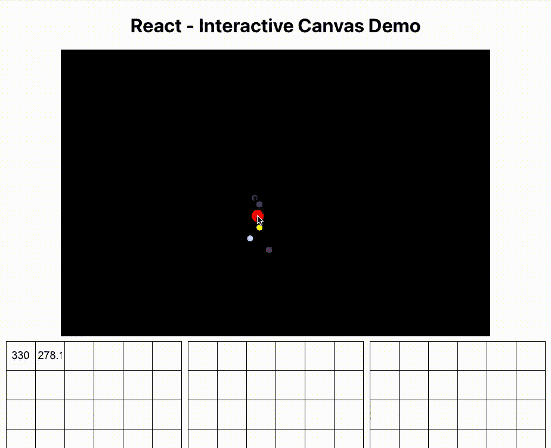

# 使用 React 实现交互式 HTML 画布模拟的平滑动画

> 原文：<https://javascript.plainenglish.io/smooth-animations-for-interactive-html-canvas-simulations-with-react-b6fc1109ecd7?source=collection_archive---------5----------------------->

## 使用 React + TypeScript 设置画布并避免低帧速率

Photo by [John Schnobrich](https://unsplash.com/@johnschno?utm_source=medium&utm_medium=referral) on [Unsplash](https://unsplash.com?utm_source=medium&utm_medium=referral)

HTML 画布是一种在任何网页上创建令人惊叹的 2D 图形和动画的非常有趣和简单的方式。当结合像 React 这样的 UI 框架的好处时，它可以成为一个真正强大的工具来创建酷的效果、交互式模拟、自定义可视化，甚至完整的游戏。然而，为了持续地实现流畅的动画，有一些注意事项需要考虑，尤其是当你的应用变得更加复杂的时候。本指南将介绍设置 React + TypeScript + canvas 的基础知识，然后更深入地研究如何在具有大量 UI 组件和渲染更新的大型应用程序中实现流畅的动画。

# 基本设置—反应+画布

本节将介绍如何让 canvas 组件在 React with TypeScript 中工作。如果你已经知道基础知识和/或只是想学习如何优化平滑动画，请随意跳到下一节。

为了方便起见，我创建了一个简单的演示，所有代码都可以在 GitHub 上查看。

## 1.创建 React 项目

创建一个新的 React 项目，如果您还没有:`npx create-react-app interactive-canvas-demo --template typescript`。从一个全新的项目开始，尝试不同的想法和实现是有益的。

## 2.添加画布组件

This is a fully-functioning React component that will draw a 720 x 480 black rectangle on the screen.

目前，它只在屏幕上画了一个黑色的矩形。但是下面是正在发生的事情的分类:

*   `const canvasRef = useRef<HTMLCanvasElement | null>(null);`允许我们在画布组件呈现在网页上之后引用它。我们需要这个来获取用于渲染每一帧的 2D 上下文。
*   `useEffect`等待直到组件和画布被完全加载，以调用`clearBackground`。
*   最后，`clearBackground`函数只是在画布的整个宽度和高度上画一个黑色的矩形，清除掉之前存在的任何东西。

## 3.画点什么

接下来，让我们在屏幕中间画一个圆。定义一个`drawCircle`函数，在我们调用`clearBackground(context)`之后立即调用`drawCircle(context, 360, 240)`。

The new drawCircle function just draws a red circle at the given (x, y) position on the canvas.

We can call drawCircle from the useEffect right after calling clearBackground.

## 4.添加交互性

现在让红色的圆圈跟随用户的鼠标位置。我们可以用画布的`onMouseMove`回调来捕获鼠标位置，并将其保存到一个状态变量中。然后，我们可以修改`useEffect`以在鼠标位置改变时重新渲染。

This is a fully-functioning React component that will render a red circle on the canvas following the user’s mouse movement.

以下是新增部件的明细:

*   `interface Point2D`只是让打字更简单。
*   `const [cursorPosition, setCursorPosition] = useState<Point2D>({ x: 0, y: 0 })`跟踪光标的位置，初始化为(0，0)。
*   `useEffect`现在有了`cursorPosition`作为依赖项，所以它会在每次`cursorPosition`改变时运行`renderFrame`。对`renderFrame`的调用可以包装在`requestAnimationFrame`中，后面会用到。
*   最后，画布组件的`onMouseMove` prop 运行`handleMouseMoved`函数，该函数计算出光标在画布上的(x，y)位置，并相应地用`setCursorPosition`更新状态。

The red circle follows the user’s mouse position.

## 5.添加动画

为了让演示更有趣，让我们在红圈周围添加一些额外的动画。我们还可以将画布移动到它自己的组件中，将动画逻辑从应用程序的其余部分中分离出来。

The code for the AnimatedCanvas component. It still draws a red circle following the cursor’s position, but now it also animates smaller circles revolving around the main circle.

这里最大的变化是画布现在是一致的动画，而不是只对用户的鼠标移动做出反应。

*   `cursorPositionRef`、`lastRenderTimeRef`和`revolvingCircleRotationRef`捕捉用于绘制每一帧的值(见下文)，以便我们可以在动画循环的范围内访问它们。
*   第一个`useEffect`开始动画循环。每个请求的动画帧的 ID 存储在`animationFrameRequestRef`中。如果`AnimatedCanvas`组件被卸载，它将触发从这个`useEffect`返回的回调来取消动画循环。
*   一旦系统准备好重画并允许可变帧速率，`[requestAnimationFrame](https://developer.mozilla.org/en-US/docs/Web/API/Canvas_API/Tutorial/Basic_animations)`将调用`renderFrame`函数。
*   第二个`useEffect`监听`cursorPosition`中的变化并更新`cursorPositionRef`，这样动画循环可以在下一帧渲染中访问最新的坐标。我们需要设置 ref，以便可以从动画循环的范围内访问该值。
*   我们使用`lastRenderTimeRef`来计算`deltaTime`,这样在不同的帧率下动画速度是一致的。
*   最后，`drawRevolvingCircle`只是用一些简单的三角学来计算一个蓝色小圆绕着红色大圆旋转的位置。在每一帧，存储在`revolvingCircleRotationRef`中的角度增加(由`deltaTime`缩放)并画出小圆。

我们可以相应地简化`App.tsx`:

We can get rid of most of the logic in App.tsx and only keep track of the cursor position here. You could track the cursor position directly in AnimatedCanvas.tsx too, if it is only used for animation purposes.

结果如下:

The red circle and its smaller revolving blue circle follow the user’s mouse position.

## 6.发挥创造力

这只是你能做的事情的一个非常基本的例子。有无限的动画可能性。以下是一些想法:

*   高级图表、图形或其他可视化。
*   文本效果。
*   图片(或者视频！)处理和操作，包括基于网络的图像编辑器。
*   自定义 UI 组件。
*   背景效果。
*   粒子效果。
*   做一个互动游戏！
*   任何你能想到的与 2D 动画相关的东西。

# 平滑动画

到目前为止，这是一个很好的起点，如果你的应用相当轻量级，这可能是一个非常合适的解决方案。尝试添加按钮、样式和其他 UI 组件，并确保您仍然有流畅的动画。

如果您的应用程序变得非常大，并且有许多复杂的 React 组件，这些组件以频繁变化的状态重新呈现(例如，当用户键入或如果您需要跟踪光标的移动时)，您可能会开始看到断断续续的动画问题。

## 低帧速率示例

Low frame rate example: As the mouse move events trigger re-renders of the input matrices below, the whole app becomes extremely slow.

当我使用 React + canvas 开发一个[卡尔曼滤波器模拟](https://teammcode.com/projects/kalman-filter/)(一种线性状态预测算法)时，我需要代码的三个主要部分来顺利运行:

1.  React UI 具有滑块和 96 个用于 6 个 4x4 矩阵的单独文本输入字段，以及一个存储所有这些值的状态。我使用 [MUI](https://mui.com/) 来简化样式和快速构建 UI 组件。
2.  卡尔曼滤波算法的更新逻辑以每秒 60 个间隔运行，访问状态值和用户的实时鼠标位置来计算其预测。
3.  画布动画代码，其中还引用了状态来绘制模拟结果。

结果如何？几乎不起作用的不稳定的模拟。

## 反应重新渲染

在我的卡尔曼滤波器示例中，整个状态(滑块值、矩阵输入和光标位置)作为单个对象存储在根`App`组件中，并传递给`AnimatedCanvas`组件、单个 UI 子组件和卡尔曼滤波器的逻辑代码(使用`setInterval`以恒定的间隔运行)。每当用户开始输入或移动鼠标时，所有的 UI 组件都将被重新呈现，新的状态被传递下来。由于 React 疯狂地不断重新渲染，浏览器根本跟不上，因此动画帧被延迟，导致帧速率骤降。

解决方案是稍微优化一下代码，避免以如此高的频率重新呈现那么多组件。有几种方法可以实现这一点。

## 解决方案 1:记忆组件

使用记忆组件。这样，一个组件只有在其特定的依赖关系被改变时才会被重新渲染，而不是当状态中的任何其他东西改变时。这可以用组件周围的`React.memo`包装器来完成，如下所示:

React.memo takes two parameters: the component to memoize, and a function that compares the previous and next props to determine if the component should skip the re-render.

这类似于将组件包装在父组件的`useMemo`钩子中，这也是一个选项。

## 解决方案 2:去抖

如果你的大部分重新渲染是由文本输入事件触发的，去抖动状态更新回调可能会起作用(例如，使用 [lodash 去抖动函数](https://lodash.com/docs/4.17.15#debounce))。然而，对于实时输入(如鼠标移动)来说，这不是一个好的解决方案，因为它会等待用户完全停止移动后再更新状态。

## 解决方案 3:采样

这个解决方案有点奇怪，但我试过了，觉得提一下会很有趣。您可以将所有用户输入值存储在`useRef`钩子中，然后使用`setInterval`定期对这些值进行采样并调用状态更新函数，而不是对每个事件都调用重新呈现。但是如果你的应用程序是空闲的，这是非常低效的，并且仍然需要以相当高的(但是更可预测和可管理的)频率重新渲染一切。

## 结论—根据需要进行优化

React 应用程序可能会变得非常复杂，充满了数千个需要重新渲染的子组件。即使你没有试图用 canvas 实现 60 FPS 的动画，你也可能会遇到用户输入事件过于频繁的问题，以至于应用程序无法如此频繁地有效地重新渲染一切。输入的记忆或去抖动可以帮助大大减少应用程序的工作量，为用户带来更流畅的整体体验。

*更多内容请看*[***plain English . io***](https://plainenglish.io/)*。报名参加我们的* [***免费周报***](http://newsletter.plainenglish.io/) *。关注我们关于*[***Twitter***](https://twitter.com/inPlainEngHQ)*和*[***LinkedIn***](https://www.linkedin.com/company/inplainenglish/)*。加入我们的* [***社区不和谐***](https://discord.gg/GtDtUAvyhW) *。*