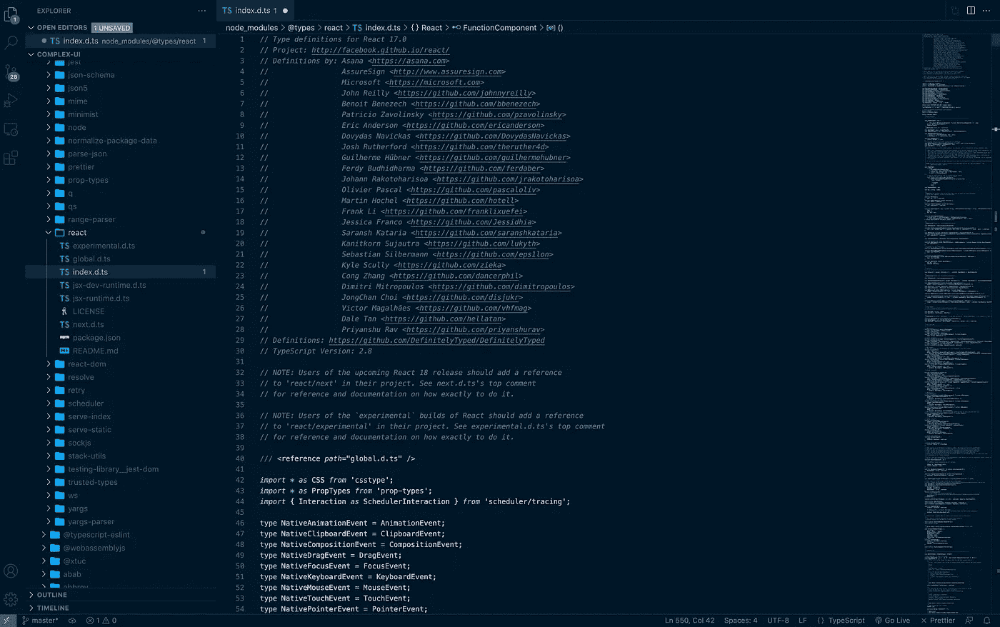
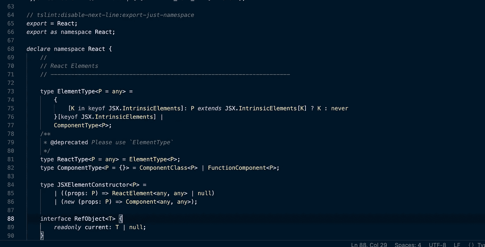
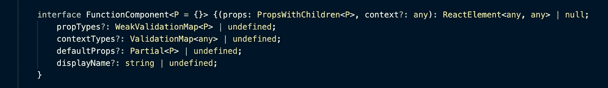

# 先睹为快 React 源代码的类型定义

> 原文：<https://javascript.plainenglish.io/sneak-peek-at-react-source-code-for-their-type-definitions-84dcfcc28f99?source=collection_archive---------15----------------------->

## 你知道这件事吗？


Image by [Evillico](https://unsplash.com/photos/P6Pcq1GJneE) on [Unsplash](https://unsplash.com/)

你有没有想过 React 是如何实现它们的类型的？就像你做`React.FC`的时候`FC`住在哪里？它是做什么的？

在这篇文章中，让我们探索 React 类型的核心基础，我们将进入 React 源代码，或者实际上 React 源代码的类型，所以让我们开始。

# 热身:

当您安装 React with TypeScript 时，工具(如 VS 代码等。)将可以访问类型声明，例如，当你悬停在`useState`上时，你会看到它接受什么参数，这都是因为在你的`/node_modules`中的`d@types/react/index.d.ts`的`index.d.ts`文件中声明的类型。

## 打字稿事实:

当你键入`React.FC`时，你怎么能访问一个名为`FC`的类型呢？

如果你不知道`FC`代表`functional component`并表明我们的 react 组件是一个功能组件。

**那么回到我们如何访问类型。**

你可能知道我们可以创建这样一个类型:

```
type myType = {
name: string;}
```

然后我们可以像这样使用这个`type alias`定义函数:

```
const App: FC<myType>= ({name}) => whatEver
```

但是 React 不是这样定义的，它不是用类型别名定义的，而是用名称空间别名定义的。

具体来说，它是这样定义的:

```
*declare* namespace React {
// types, interfaces etc...}
```

所以因为所有的类型，接口等。是在一个名为 React 的命名空间中定义的，这个命名空间是导出的，我们可以通过 React 来访问类型、接口等等。“react”中的 FC 或{FC}。

现在让我们深入了解一下 index.d.ts 文件。

# 让我们看看 index.d.ts 文件

所以如果我们去`node_modules/@types/react/index.d.ts`

这是我们在编辑器中打开文件时看到的内容:



Image by author

我们看到一堆评论和类型等等。



Image by author

事实上，正如我们在第二张图中看到的，我们将 React 导出为一个名称空间。

为了保持在同一轨道上，让我们坚持`FC`型并更深入地了解它，如果我们进入`FC`型，这就是我们所看到的:


Image by author

所以基本上它是`FC`的类型别名，有一个泛型类型参数。

现在的`FunctionComponent`是什么？



Image by author

它是一个带有泛型类型参数的接口，有几种类型，正如我们看到的，它有一个函数可以返回任何`ReactElement`或`null`。你大概能知道那是干什么用的。😉

## 在我们的组件中

现在，在我们的组件中，我们可以从`namespace` React 导入`FC`，并像这样使用它:

```
import {FC} from 'react'
type props = {
imAString: string;
};const *App*: *FC*<*props*>=(*props*)=><h1>{*props.imAString*}</h1>;
```

## 结论:

研究源代码很有趣，但是。关于这一点还有很多要说的，而且这篇文章对于你阅读:D 来说太长了

## 如果你喜欢这件作品，我希望你也会喜欢:

[](/stop-learning-from-react-tutorials-that-suck-5e2031d9bdc7) [## 停止从糟糕的 React 教程中学习

### 不受欢迎的观点

javascript.plainenglish.io](/stop-learning-from-react-tutorials-that-suck-5e2031d9bdc7) [](https://betterprogramming.pub/callbacks-vs-promises-vs-async-await-a-step-by-step-guide-f93d13447604) [## 回调 vs .承诺 vs .异步 Await:逐步指南

### 引擎盖下也有点。

better 编程. pub](https://betterprogramming.pub/callbacks-vs-promises-vs-async-await-a-step-by-step-guide-f93d13447604) 

*更多内容看* [***说白了。报名参加我们的***](https://plainenglish.io/) **[***免费周报***](http://newsletter.plainenglish.io/) *。关注我们关于* [***推特***](https://twitter.com/inPlainEngHQ) *和****[***LinkedIn***](https://www.linkedin.com/company/inplainenglish/)*。加入我们的* [***社区***](https://discord.gg/GtDtUAvyhW) *。**