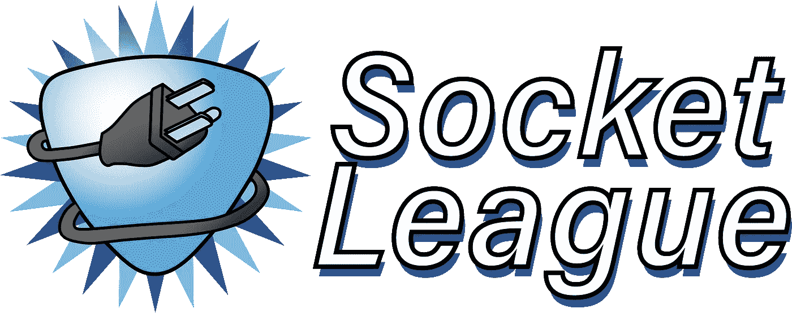

# 满足套接字联盟:一种灵活、轻量级的状态同步方式

> 原文：<https://javascript.plainenglish.io/socket-league-websockets-that-transfer-synced-state-93623d898bf5?source=collection_archive---------8----------------------->

## Socket League 现在提供了 npm 库，这些库通过定制的 React 钩子利用 websockets 进行同步状态管理。



# 有什么问题？

如果说我们在这次疫情和在家工作中学到了什么，那就是地理位置分散的团队成员之间对实时项目协作的需求日益增长。允许这种群组参与的技术需要多个客户端之间的同步状态。

开发人员有几种选择，允许他们实现这种技术来同步状态。然而，由于其专有性质，现有的选择可能是僵化和固执己见的，或者是沉重和深奥的。有时候，一个更简单的解决方案，一个本质上是**的轻量级解决方案，就足够了。**

# **介绍，插座联盟**

**Socket League 提供了一个 ***轻量级*** 和 ***非固执己见的*** [客户端 NPM 库](https://www.npmjs.com/package/socket-league-client)，提供了一个类似于 *useState* 的 React hook，它依赖于 ***websockets*** 到 ***在多个客户端之间同步状态*** 。对于任何前端开发人员来说，这个钩子就像使用熟悉的 useState 钩子一样。**

**此外，Socket League 还提供了一个[服务器端 npm 库](https://www.npmjs.com/package/socket-league-server)，它与运行 ***websocket 服务器******持久化状态*** 并向客户端广播更改的另一个库协同工作。服务器端库的构建与数据库选择无关，并且具有为 NoSQL (MongoDB)、PostgreSQL 和内存中的 JSON 对象构建的当前功能。**

# **它是如何工作的？**

**首先，让我们探索一下[前端库](https://www.npmjs.com/package/socket-league-client)和相关联的 **useSyncState** 钩子和**连接**类是如何操作和使用的:**

```
**const conn = new **Connection** ('ws://localhost:3000');**
```

****连接**类本质上包装了所有的前端逻辑来与服务器通信。一个新的**连接**实例用 websocket 服务器的 URL 初始化，客户端将在该服务器上发送和接收状态更新。在上面的例子中，端口 3000 的本地主机被初始化。在引擎盖下，**连接**类使用[重新连接-websocket](https://www.npmjs.com/package/reconnecting-websocket) 库具有内置的自动重新连接特性。**

```
**const [socketState, setSocketState, undoSocketState] = **useSyncState**(
      session,
      initialState,
      conn,
);**
```

**为了使用 **useSyncState** 钩子，需要三个参数: ***session*** 、 ***initialState*** 和 ***conn*** 。**

****会话**是表示在一组客户端之间同步的状态单元的 ID。第一次使用唯一的会话 ID 时，服务器通过在数据库中初始化一个新状态来做出响应。相反，如果客户端订阅现有状态，服务器将使用最新状态进行响应。**

****initialState** 有一个特定的用例，它只在客户端第一次初始化状态时使用。在这个场景中， **initialState** 将表示要发送并存储在数据库中的状态对象。**

****连接**参数是前述连接类的一个实例。**

**此参数表示三个功能动作之一:' ***【初始】'*** 、' ***更新'*** 、' ***撤消'*** 。 ***初始*** 消息类型是联系服务器时发送的第一条消息，它告诉服务器要么初始化数据库中的新实例(如果会话 ID 不存在)，要么订阅并接收最新状态(如果会话 ID 已经存在)。每当客户端应用更改，然后向具有相关会话 ID 的所有客户端广播更新时，就会发送 ***更新*** 消息类型。虽然在默认情况下，最新的状态更新被自动给予优先权，但是更新冲突的处理可以通过在后端注册合并功能来定制。 ***撤销*** 消息类型通知服务器删除与所包含的会话 ID 相关联的最后一个状态，然后将该状态传输给其余连接的客户端。**

**接下来，让我们探索一下[后端库](https://www.npmjs.com/package/socket-league-server)，其中我们提供了一个管理状态同步服务器逻辑的 **SyncHandler** 类:**

```
**const syncHandler = new SyncHandler(new PostgresDriver('DB_URI'));await syncHandler.connect(); const wsServer = new ws.Server({ noServer: true });
wsServer.on("connection", syncHandler.handleWsConnection);**
```

**处理程序 **SyncHandler** 应该用一个特定于数据库的驱动程序的新实例来实例化，该驱动程序将 URI 作为参数。我们的代码根据用户偏好提供了三种不同的驱动程序。每个驱动程序都有关于如何处理来自 SyncHandler 的请求的特定于语言的代码。到目前为止，已经为 NoSQL (MongoDB)、PostgreSQL 和 JSON 对象构建了功能，但是如果需要，开发人员可以创建他们自己的符合我们的 TypeScript 接口的驱动程序。如果没有提供驱动程序，它将默认为一个 JSON 对象。上面的例子展示了一个使用 PostgresDriver 的新实例。**

**然后，**。应该在 SyncHandler 对象上调用 connect()** 来初始化基于所选数据库驱动程序的数据库连接。**

**最后，应该在 websocket 服务器实现的任何连接事件期间调用 SyncHandler。在上面的例子中，SyncHandler 被赋予使用 [ws 库](https://www.npmjs.com/package/ws)的 websocket 连接。**

# **探索插座联盟**

**想看看 Socket League 是怎么做的吗？查看我们使用自己的 npm 库和钩子构建的[聊天应用](https://github.com/oslabs-beta/SocketLeague/tree/dev/echo-server-electron)！随便逛逛，看看这一切到底是如何组合在一起的。点击查看我们的[前端](https://www.npmjs.com/package/socket-league-client)和[后端](https://www.npmjs.com/package/socket-league-server) npm 文档，点击[此处](https://www.youtube.com/watch?v=iNiKbPLECRY)观看视频教程！要了解更多关于我们的信息，请访问我们的网站！**

***Socket League 是在技术加速器* [*OS Labs*](https://opensourcelabs.io/) *下开发维护的开源 NPM 库。如果您有任何反馈或愿意投稿，请访问我们的* [*GitHub 资源库*](https://github.com/oslabs-beta/SocketLeague) *或*[*socketleague.org*](https://www.socketleague.org/)*。***

## **这篇文章的作者之一是**

*   **亚伦·高特|[GitHub](https://github.com/AaronJGaut)|[LinkedIn](https://www.linkedin.com/in/aarongaut/)**
*   **库尔特·克兰德尔|[GitHub](https://github.com/KCrandall6)|[LinkedIn](https://www.linkedin.com/in/kurtcrandall/)**
*   **Kyle Boudewyn |[GitHub](https://github.com/KyleBoudewyn)|[LinkedIn](https://www.linkedin.com/in/kyleboudewyn/)**
*   **Trevor Mow |[GitHub](https://github.com/tmow12)|[LinkedIn](https://www.linkedin.com/in/trevormow/)**
*   **Zachary Lim |[GitHub](https://github.com/lzzhengyi)|[LinkedIn](https://www.linkedin.com/in/zachary-zhengyi-lim/)**

****

**Socket League**

***更多内容看* [***说白了。报名参加我们的***](http://plainenglish.io/) **[***免费周报***](http://newsletter.plainenglish.io/) *。在我们的* [***社区获得独家写作机会和建议***](https://discord.gg/GtDtUAvyhW) *。*****