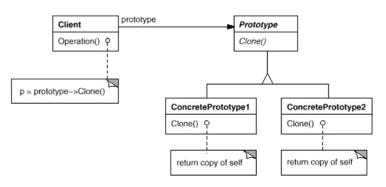
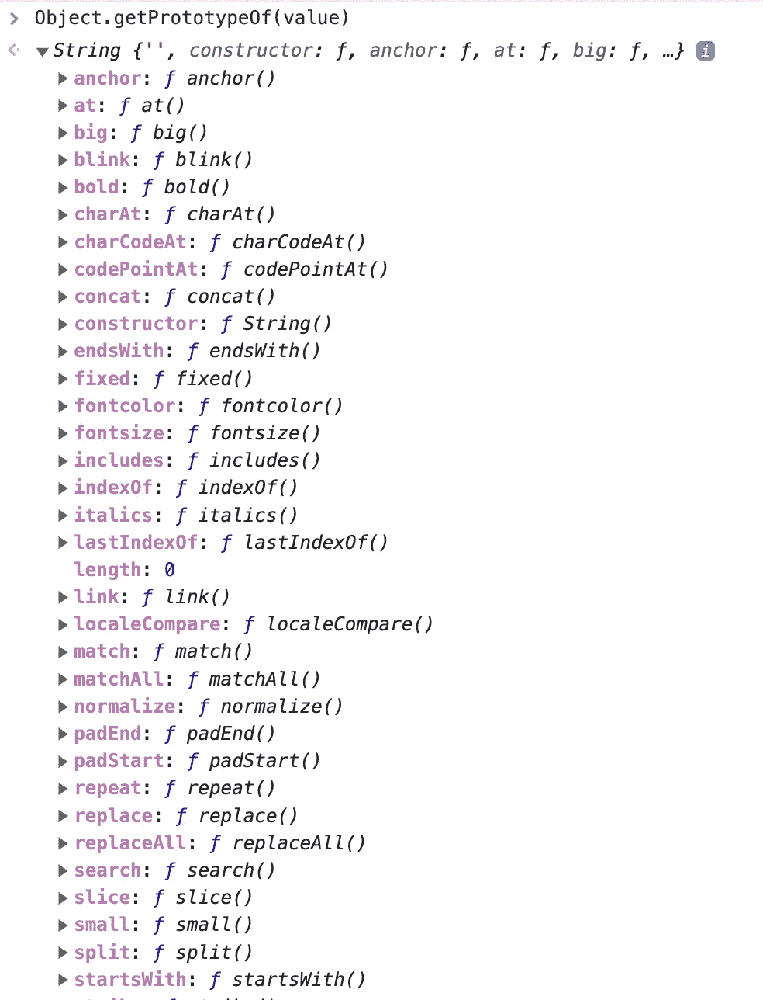
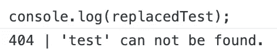

# 带示例的软件设计模式:原型

> 原文：<https://javascript.plainenglish.io/software-design-patterns-with-examples-prototype-b89fcac4239b?source=collection_archive---------10----------------------->

## 原型模式允许您复制现有的对象，而无需让您的代码依赖于它们的类。

Photo by [Mark König](https://unsplash.com/@markkoenig?utm_source=medium&utm_medium=referral) on [Unsplash](https://unsplash.com?utm_source=medium&utm_medium=referral)

**creative****Prototype**模式非常强大，通过使用共享的 **Prototype** 接口帮助我们创建复制的对象。

在本文中，我们将详细阐述该模式的目的和结构，并通过一个实际的例子解释如何使用它。

# 什么是设计模式？

设计模式是针对不同环境中反复出现的问题的通用的、可重用的解决方案。在软件工程中，他们帮助你更快地写出更好的代码。使用这些通用解决方案可以节省我们的时间和工作，因为我们重用了许多其他开发人员积累的知识和经验。

*“[……]我很少遇到没有听说过模式运动的开发人员”——Grady Booch 在* [*设计模式:可重用面向对象软件的元素*](https://amzn.to/3i6iIIk) 中说

也许你做了多年的程序员，却没有应用甚至不知道任何一种模式。我敢打赌，许多开发人员正是这样做的。如果是这样，我强烈推荐你先阅读这篇文章，让你的大脑相信软件设计模式是必不可少的。

 [## 为什么你必须学习软件设计模式

### 设计模式让你更快地写出更好的代码。

javascript.plainenglish.io](/why-you-must-learn-software-design-patterns-befd77f88713) 

## 模式的类别

1994 年,《设计模式:可重用面向对象软件的元素》一书由四位作者出版:Erich Gamma、Richard Helm、Ralph Johnson 和 John Vlissides，也称为“四人组”

尽管这本书是在 25 年前出版的，但它仍然是与软件工程最相关的书籍之一。阅读它可能是丰富您的开发人员工具包的一笔可观的投资。四人帮(GoF) 定义了 23 种设计模式。为了组织他们，他们把他们分成三类:**创造性的**、**结构性的**和**行为性的**。

****创造*** *模式关注对象创造的过程。* ***结构化*** *模式处理类或对象的组成。* ***行为*** *模式表征了类或对象交互和分配责任的方式—* [*设计模式:可复用面向对象软件的要素*](https://amzn.to/3i6iIIk)*

*这里是由 GoF 定义的所有模式的概述。另外，看看我的其他文章，在表格中有链接。*

*如果你更喜欢通过视频课程学习，我推荐你查看 Skillshare 上的这个 [**打字稿设计模式课程**](https://skillshare.eqcm.net/vnLkyj) 。它涵盖了所有 23 种 GoF(四人帮)设计模式，并教你如何使用 TypeScript 实现它们。作为代销商，如果你通过这个链接注册，我会收到一小笔佣金。你的支持帮助我为你创造更多有价值的内容。*

* [## TypeScript 中的设计模式

### 解锁无限制访问此技能共享课程以及由来自世界各地的创作者讲授的数千门课程…

skillshare.eqcm.net](https://skillshare.eqcm.net/vnLkyj)* 

# *原型模式*

*从表中可以看出，原型模式被归类到**创造**模式的类别中。考虑到这一点，它的目的必须在于对象创建的过程。*

## *目的🎯*

*当听到“原型”这个术语时，您可能首先会想到一个为测试而构建的未完成的 MVP 产品。但是，原型模式略有不同，它涉及复制已经存在的东西。*

*原型模式的目的是使相似对象的创建更加容易。它支持您创建对象的克隆，而无需使代码依赖于它们的类。*

*每个克隆都将引用**原型**中的相同函数，这将导致显著的性能提升，这是创建模式的最大好处。*

## *适应性💡*

*原型模式在许多用例中被广泛使用和应用。只要您想，就使用该模式:*

*   *克隆具有许多字段和配置的对象，而不创建大的类层次结构*
*   *只有几种不同的类状态组合。拥有相应数量的原型来克隆它们可能比实例化每个类更方便。*
*   *避免构建许多工厂来并行化类层次结构*

*当创建一个给定类的实例是昂贵或者复杂的时候，使用原型模式— [*首款由埃里克·弗里曼设计的图案*](https://amzn.to/3Q9O6Ch)*

## *结构📐*

*原型的结构很简单:*

**

*Prototype structure*

## *参与者🚻*

*从结构中，您可以派生出以下参与者:*

*   ***Prototype** :声明一个克隆自身的接口。*
*   ***ConcretePrototype** :实现克隆自身的操作。*
*   ***客户端**:使用**原型创建对象。***

## *真实世界的例子🗺*

*通过使用真实世界的类比来解释软件设计模式对许多设计模式都是有帮助的。*

*然而，原型模式很难用现实世界的类比来解释。由于原型模式是基于复制对象的，而现实世界的对象很少复制自己，因此很难找到好的类比。*

*尽管如此，还是经常使用生物细胞分裂的例子，通过分裂产生两个相同的细胞。我从来都不擅长生物，但这似乎是我们能找到的这种模式的最好例子。所以，我们不要太纠结于现实世界——让我们看看 Javascript 示例中的模式。*

## *代码示例💻*

*原型在 Javascript 开发中起着很大的作用。在幕后，Javascript 一直在使用原型。*

*例如，让我们创建一个简单的字符串:*

*`const value = 'Test';`*

*在幕后，Javascript 将我们的`value`对象的原型设置为`String`。通过这种方式，JavaScript 使得所有的字符串对象都具有许多功能，如`match`、`startsWith`等。你可能已经意识到了。*

*我们可以通过调用`Object.getPrototypeOf(value)`进行检查:*

**

****注*** *:在一些浏览器中我们也可以称之为* `*value.__proto__*` *。但这已经不推荐了。**

**警告:虽然今天大多数浏览器都支持* `*Object.prototype.__proto__*` *，但它的存在和确切行为只是作为一个遗留特性被标准化，以确保与 web 浏览器的兼容性。为了更好地支持，请使用* `[*Object.getPrototypeOf()*](https://developer.mozilla.org/en-US/docs/Web/JavaScript/Reference/Global_Objects/Object/getPrototypeOf)` *和*`[*Object.setPrototypeOf()*](https://developer.mozilla.org/en-US/docs/Web/JavaScript/Reference/Global_Objects/Object/setPrototypeOf)`T10。— [*MDN*](https://developer.mozilla.org/en-US/docs/Web/JavaScript/Reference/Global_Objects/Object/proto)*

*让我们将模式放入 Javascript 代码中，并稍微修改一下内置的字符串原型。我不建议改变字符串原型的行为。但是如果你想对你的同事搞恶作剧，隐藏几行操纵字符串原型的代码是一个有趣的想法。*

*您可能知道`replace`函数，它使用正则表达式或搜索字符串替换字符串中的文本。*

*让我们通过这样做来稍微调整一下这个函数:*

*现在，假设有人执行以下代码:*

*你会期望得到一个新的字符串，其值为*“一些被替换的字符串。”**

*这是你真正得到的:*

**

*Screenshot of code result*

*同样，我不建议修改原型字符串，但是我希望这个例子说明了原型模式并阐明了它。*

## *相关设计模式🔗*

*软件设计模式通常显示不同模式之间的关系。这里有一些引用自 GoF 的与原型模式相关的设计模式:*

**原型与* ***摘要*** ***工厂*** *..]在某些方面是相互竞争的模式，这一点我们将在本章末尾讨论。然而，它们也可以一起使用。抽象工厂可能会存储一组原型，从中克隆并返回产品对象。**

**大量使用* ***复合*** *的设计..】和* ***装潢师*** *..]模式通常也能从原型中受益。**

# *最后的想法*

*我希望你喜欢阅读这篇文章。我总是乐于回答问题，并乐于接受批评。随时欢迎联系我！通过**[**LinkedIn**](https://www.linkedin.com/in/marius-bongarts-6b3638171/)**，**关注我**[**Twitter**](https://twitter.com/MariusBongarts)或 [**订阅**](https://medium.com/subscribe/@mariusbongarts) 通过电子邮件获取我的故事。*****

*****[**这里是无限制访问**](https://medium.com/@mariusbongarts/membership) 媒体上每一个内容的链接。如果你注册使用这个链接，我会赚一小笔钱，不需要你额外付费。*****

***** [## 通过我的推荐链接加入 Medium-Marius bong arts

### 作为一个媒体会员，你的会员费的一部分会给你阅读的作家，你可以完全接触到每一个故事…

medium.com](https://medium.com/@mariusbongarts/membership) 

此外，如果你还没有，看看我的在线荧光笔铬扩展。使用 [Web Highlights](https://web-highlights.com/) ，您可以在任何网页或 PDF 上高亮显示，创建标签并做笔记。

 [## Web 亮点— PDF 和 Web 荧光笔

### 最佳网络荧光笔。就像你在书上做的那样，在任何网页或 PDF 上高亮显示，并做笔记。组织…

web-highlights.com](https://web-highlights.com/) 

***披露*** *:本文包含附属链接。如果你通过这些链接之一购买，我可能会收到佣金。我只推荐我认为质量高、对你有益的产品。谢谢你的支持。*

## 进一步阅读

 [## 我的第一个 9.99 美元之旅与我的副业

### Chrome 扩展带来的被动收入

medium.com](https://medium.com/@mariusbongarts/my-journey-to-the-first-9-99-with-my-side-project-3edc13dd1f2d)  [## 用 Web 组件构建自己的博客组合:基础

### 第 1 部分—定制元素、阴影 DOM 和 HTML 模板

medium.com](https://medium.com/@mariusbongarts11/showcase-your-medium-articles-with-web-components-part-1-basics-d2c6618e9482)  [## Web 组件会取代前端框架吗？

### 它们是为解决不同的问题而构建的。

medium.com](https://medium.com/@mariusbongarts11/will-web-components-replace-frontend-frameworks-535891d779ba) 

*更物在* [***素朴***](https://plainenglish.io/) *。报名参加我们的* [***免费周报***](http://newsletter.plainenglish.io/) *。*[***Twitter***](https://twitter.com/inPlainEngHQ)[***LinkedIn***](https://www.linkedin.com/company/inplainenglish/)*[***YouTube***](https://www.youtube.com/channel/UCtipWUghju290NWcn8jhyAw)*和*[**T42【不和**](https://discord.gg/GtDtUAvyhW)*。*******