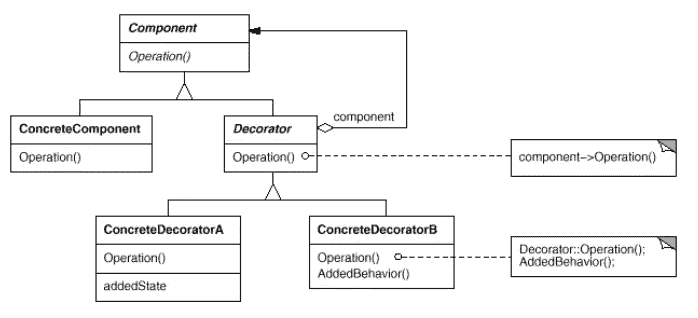
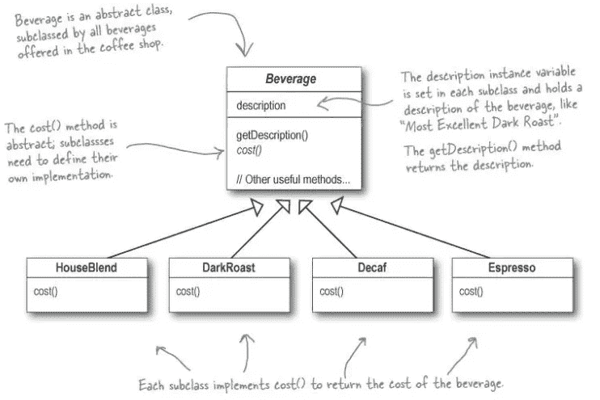
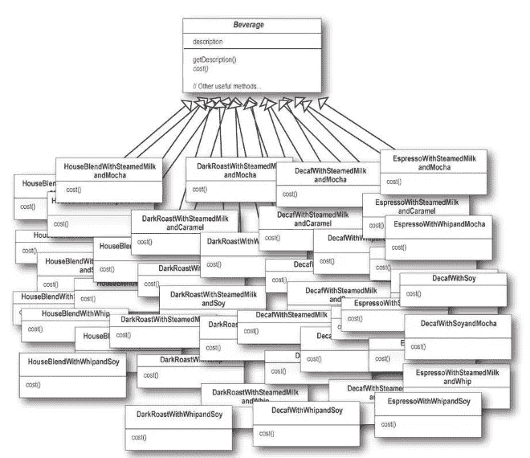
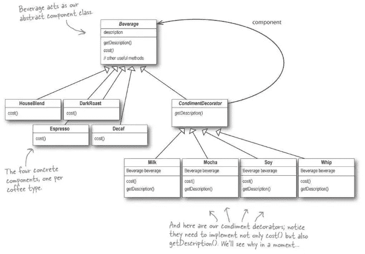
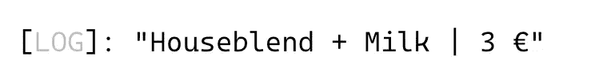
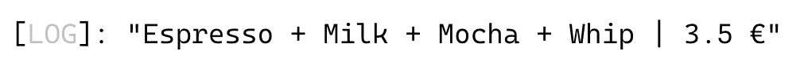

# 带有类型脚本示例的软件设计模式:装饰器

> 原文：<https://javascript.plainenglish.io/software-design-patterns-with-typescript-examples-decorator-cb6160ddbeb9?source=collection_archive---------4----------------------->

## 装饰模式为扩展功能提供了子类化的灵活替代方案

Photo by [Angelica Reyes](https://unsplash.com/@angiereyes22?utm_source=medium&utm_medium=referral) on [Unsplash](https://unsplash.com?utm_source=medium&utm_medium=referral)

**结构** **装饰**模式非常强大，帮助我们防止子类的**爆炸。**

在本文中，我们将详细阐述该模式的目的和结构，并通过一个实际的、真实世界的 **Starbucks** 示例解释如何使用它。

# 什么是设计模式？

设计模式是针对不同环境中反复出现的问题的通用的、可重用的解决方案。在软件工程中，他们帮助你更快地写出更好的代码。使用这些通用解决方案可以节省我们的时间和工作，因为我们重用了许多其他开发人员积累的知识和经验。

*“[……]我很少遇到没有听说过模式运动的开发人员”——Grady Booch 在* [*设计模式:可重用面向对象软件的元素*](https://amzn.to/3i6iIIk) 中说

也许你做了多年的程序员，却没有应用甚至不知道任何一种模式。我敢打赌，许多开发人员正是这样做的。如果是这样，我强烈推荐你先阅读这篇文章，让你的大脑相信软件设计模式是必不可少的。

 [## 为什么你必须学习软件设计模式

### 设计模式让你更快地写出更好的代码。

javascript.plainenglish.io](/why-you-must-learn-software-design-patterns-befd77f88713) 

## 模式的类别

1994 年，四位作者出版了《设计模式:可重用面向对象软件的元素》一书:Erich Gamma、Richard Helm、Ralph Johnson 和 John Vlissides，也就是所谓的“四人组”

尽管这本书是在 25 年前出版的，但它仍然是与软件工程最相关的书籍之一。阅读它可能是丰富您的开发人员工具包的一笔可观的投资。如上所述，**四人帮(GoF)** 定义了 23 种设计模式。为了组织他们，他们把他们分成三类:**创造性的**、**结构性的**和**行为性的**。

****创造*** *模式关注对象的创造过程。* ***结构化*** *模式处理类或对象的组成。* ***行为*** *模式表征了类或对象交互和分配责任的方式—设计模式:可重用面向对象软件的要素**

*这里是由 GoF 定义的所有模式的概述。另外，看看我的其他文章，在表格中有链接。*

*如果你喜欢通过视频课程学习，我推荐你去看看 Skillshare 上的 [**打字稿设计模式课程**](https://skillshare.eqcm.net/vnLkyj) 。它涵盖了所有 23 种 GoF(四人帮)设计模式，并教你如何使用 TypeScript 实现它们。作为代销商，如果你通过这个链接注册，我会收到一小笔佣金。你的支持帮助我为你创造更多有价值的内容。*

* [## TypeScript 中的设计模式

### 解锁无限制访问此技能共享课程以及由来自世界各地的创作者讲授的数千门课程…

skillshare.eqcm.net](https://skillshare.eqcm.net/vnLkyj)* 

# *装饰图案*

*正如您从表中看到的，装饰器模式被归类到**结构**模式的类别中。考虑到这一点，它的目的必须在于描述类或对象如何交互和分配责任。*

## *目的🎯*

*装饰模式的目的是动态地给一个对象附加额外的责任，并为扩展功能提供一个灵活的子类化替代方案。*

## *适应性💡*

*装饰模式在许多用例中被广泛使用和应用。只要您想，就使用该模式:*

*   *创建大量的子类。有时太多的子类是不切实际的，并导致子类的爆炸式增长来支持每一种组合。*
*   *在不影响其他对象的情况下，动态地为单个对象**添加职责**。*
*   *在运行时给对象**分配额外的行为**，而不破坏使用这些对象的代码。*

## *结构📐*

*装饰器的结构很简单。*

**

*Image from [Head First Design Patterns by Eric Freeman](https://amzn.to/3Q9O6Ch)*

## *参与者🚻*

*从结构中，您可以派生出以下参与者:*

*   ***组件**:可以动态添加职责的对象的通用接口*
*   ***具体组件**:可以附加额外责任的对象*
*   ***装饰器**:包含一个对`Component`对象的引用，并定义一个符合组件接口的接口*
*   *ConcreteDecorator :定义可以动态添加到组件中的额外行为。*

## *真实世界的例子🗺*

*装饰模式是比较复杂的模式之一。看结构的时候，可能会有点混乱。但是，一旦您将该模式应用到现实世界的示例中，就更容易理解了。*

*在 [*书中，头先设计*](https://amzn.to/3Q9O6Ch) ，用**星巴克**举例说明了一个实际的例子。假设他们有四种饮料: **HouseBlend** 、**dark bake**、 **Decaf** 和 **Espresso** 。它们都是从主`Beverage`界面延伸出来的:*

**

*Image from: [Head First Design Patterns by Eric Freeman](https://amzn.to/3Q9O6Ch)*

*目前，这看起来很好，也不复杂。但正如你所知，星巴克允许你点几种调味品，如蒸牛奶、大豆和摩卡咖啡，并在上面加鲜奶。*

*此外，他们对这些都收费。这意味着我们每个班级都需要计算咖啡以及订单中其他调味品的价格。下面是使用继承的类图:*

**

*Class explosion — Image from: [Head First Design Patterns by Eric Freeman](https://amzn.to/3Q9O6Ch)*

*很明显，这个类图看起来像一个维护噩梦。它代表了一个**级爆炸**的完美例子。随着每一种新的饮料或调味品的出现，类图将呈指数增长。*

*但是正如我们所知，我们可以通过使用装饰模式来防止这个噩梦:*

**

*Image from: [Head First Design Patterns by Eric Freeman](https://amzn.to/3Q9O6Ch)*

*您可以看到，我们将上面的装饰器结构应用到了示例中。`Beverage`接口充当我们的`Component`，四种不同的饮料是我们的`ConcreteComponent`类。此外，我们有一个`CondimentDecorator`类，它充当我们的`Decorator`，并存储对一个`Beverage`对象的引用。我们不同的调味品，如牛奶、摩卡咖啡等。从`CondimentDecorator`扩展并作为我们的`ConcreteDecorator`类。*

## *代码示例💻*

*让我们把上面的例子放到 Typescript 代码中。我们也可以通过使用 Typescript 的实验性装饰器来构建这个例子，但是让我们保留上面的基于类的结构。*

*看一下代码。你也可以在[打字游戏场](https://www.typescriptlang.org/play?ts=4.4.4&ssl=85&ssc=42&pln=80&pc=1#code/PTAEGEHsFsAdIHYFMEBcBQBDARgZ1QE6YDGqoxANprrqAEJIBuSRA5kqAN7qi+iwFIqJKSQATUGKS5iBAJaxUcxAEIAXKHzyErANw8+AoSOETikfOtAIArtGwt9ffjewU5xUO1RR8uABQAlBq29ixcBs68BEioNgQIoKgAFnK4AHTm+E58AL6RXrEAItKyCkqIQRFRfDFxCUmpGVIy8orKCDm8+fnoIBCIsrFIUHCIKBiU1LQAEpA2uEhuKBJIAB7CCGK0DMxsHNzOLWXtiKAAvKAA5HMLSxQrV13kFmSXAEzpAKz6+f1QCCGwlG8GQaHQUxooCKmAIAGsAEqQahkdabbb0JgsTDsap8Y5tCqJS5XGHwpEop4FLJvUCfADsvz6YABQJGMFBEwhVChAFFcAJpLhIKA0Ssdlj9njeATyh0Ltd+YKaJAqc4aQrPgBGJn-QZ1dljMGTHm0ErETAAM1FG3FmL2OIOBVlp2J13NVrVfA1H3S7yZzOhIkgRFQIaweEIJDIkNoALEcmgE3NIcwYYINvREoduMOhkEwlEEgcOaQGl22PY+mpiC0NlIIf8JcrZftLcC0qiuBssBYQWezhSaXSzall1HjoHfCHzVKhPl48ljvS3hKrTllUCU94M8yrwVE-YK9ivlQAS3BV6zlgrncnm8p-PITsDgzeZqdXiiV3h6Qx58rznqAADUjTDjSzz5Net4eIUqBricRJVO+USfg0AAGAAknA-kuR6rnOG4IEEuQgaA2G7i6RK5OhkHoL0eqAgaKahuGsagAAsnIFBwpmdrxomybBqxb7OoRroaFocg6AqVxcTxXq8DSz5hBmlwAAzfNWDEsvqwwsWmbGmpxkDEMkmB8VscaIAmSZoAZ6adlRHSSYQ0msLJHGmeZikvPgKmvgqmmMvRgassxwmGQQ3LTKAADKkAAJ6WRiAl2fBkWOShzmIK52geSSCWJb5ynWC+4QaekAAsuq6Ux+mZUZsUAOqpLAKXWVsgn2Y1olHOJRJ5e5smtQoJWvAFFWgJp-qheglo2ICRKSGksBUIlTZ4a2Fb7B2KHmAgwoPOkFCQKw-hYZwv7-gh86bqRAA+5FXVt-6PiRoCADUE6EXr0B34KKAoxCqCrIAA7qASrA8K-YQrWqJA0KkDNXIKTybxlzg5x3Fwv40jKsKF7-QjBPI6jyTowAglsXlmRZmNIBDtPmXjiMqijaM40T8OA6THMUzj1NiMzmBC6N7UMxD4us3z5NUzT3mYBe6AJgK60y9DZOczxQsi2LbXK+g6BAA)里摆弄它:*

*你可以看到我们已经实现了一个抽象类`Beverage`作为我们的基础`Component`。对于每种饮料，我们都创建了一个`ConcreteComponent`类:`HouseBlend`、`DarkRoast`、`Espresso`和`Decaf`。*

*此外，我们构建了一个`CondimentDecorator`类作为我们的`Decorator`。每种调味品都有一个`ConcreteDecorator`类别:`Milk`、`Mocha`、`Whip`和`Soy`。*

*有了这种结构，我们可以轻松地创造出各种可能的饮料组合。下面是使用方法。*

*假设我们想要创建一个**混合**和**牛奶**的房子:*

*我们只是创建了一个新的 HouseBlend 类，并将其包装到牛奶装饰器中。然后我们将它传递给可以接受任何类型为`Beverage`的对象的`display`函数。*

*输出如下所示:*

**

*Log output*

*请注意，我们不仅可以将简单的组件包装在 decorators 中。我们也可以放弃其他的装饰者。让我们用**牛奶**、**摩卡**和**搅打**制作一杯**浓缩咖啡**:*

*以下是输出:*

**

*Log output*

*很棒，不是吗？我们可以创造每一种可能的组合，价格也是直接计算出来的。*

## *相关设计模式🔗*

*软件设计模式通常显示不同模式之间的关系。下面是引用 GoF 的一些与装饰模式相关的设计模式:*

*[***适配器***](https://medium.com/@mariusbongarts/design-patterns-with-real-life-typescript-examples-adapter-d183af1f1462) *:装饰器与适配器的区别在于，装饰器只改变对象的职责，不改变其接口；适配器会给对象一个全新的接口。**

****复合*** *:一个装饰器可以看作是一个退化的复合，只有一个组件。然而，装饰器增加了额外的责任——它不是为对象聚合而设计的。**

*[***策略***](https://medium.com/@mariusbongarts/design-patterns-with-typescript-examples-strategy-1af9efda0fd0) *:一个装饰器让你改变一个物体的皮肤；策略让你改变勇气。这是改变对象的两种可选方式。**

# *最后的想法*

*我希望你喜欢阅读这篇文章。我总是乐于回答问题，并乐于接受批评。随时欢迎联系我！通过**[**LinkedIn**](https://www.linkedin.com/in/marius-bongarts-6b3638171/)**，**关注我**[**Twitter**](https://twitter.com/MariusBongarts)或 [**订阅**](https://medium.com/subscribe/@mariusbongarts) 通过电子邮件获取我的故事。*****

*****[**这里是无限制访问介质**](https://medium.com/@mariusbongarts/membership) 上每一个内容的链接。如果你注册使用这个链接，我会赚一小笔钱，不需要你额外付费。*****

***** [## 通过我的推荐链接加入 Medium-Marius bong arts

### 作为一个媒体会员，你的会员费的一部分会给你阅读的作家，你可以完全接触到每一个故事…

medium.com](https://medium.com/@mariusbongarts/membership) 

此外，如果你还没有，看看我的在线荧光笔铬扩展。使用 [Web Highlights](https://web-highlights.com/) ，您可以在任何网页或 PDF 上高亮显示，创建标签并做笔记。

 [## Web 亮点— PDF 和 Web 荧光笔

### 最佳网络荧光笔。就像你在书上做的那样，在任何网页或 PDF 上高亮显示，并做笔记。组织…

web-highlights.com](https://web-highlights.com/) 

***披露*** *:本文包含附属链接。如果你通过这些链接之一购买，我可能会收到佣金。我只推荐我认为质量高、对你有益的产品。我感谢你的支持。*

## 进一步阅读

 [## 我的第一个 9.99 美元之旅与我的副业

### Chrome 扩展带来的被动收入

medium.com](https://medium.com/@mariusbongarts/my-journey-to-the-first-9-99-with-my-side-project-3edc13dd1f2d)  [## 用 Web 组件构建自己的博客组合:基础

### 第 1 部分—定制元素、阴影 DOM 和 HTML 模板

medium.com](https://medium.com/@mariusbongarts11/showcase-your-medium-articles-with-web-components-part-1-basics-d2c6618e9482)  [## Web 组件会取代前端框架吗？

### 它们是为解决不同的问题而构建的。

medium.com](https://medium.com/@mariusbongarts11/will-web-components-replace-frontend-frameworks-535891d779ba) 

*更多内容看* [***说白了。报名参加我们的***](https://plainenglish.io/) **[***免费周报***](http://newsletter.plainenglish.io/) *。关注我们关于*[***Twitter***](https://twitter.com/inPlainEngHQ)[***LinkedIn***](https://www.linkedin.com/company/inplainenglish/)*，以及* [***不和***](https://discord.gg/GtDtUAvyhW) *。********