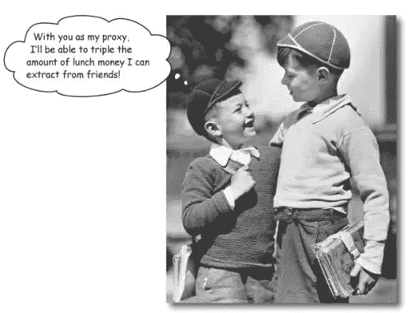
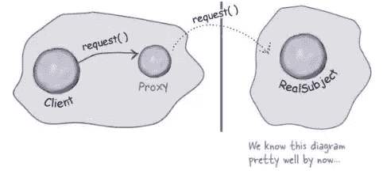
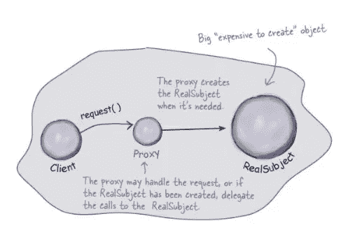
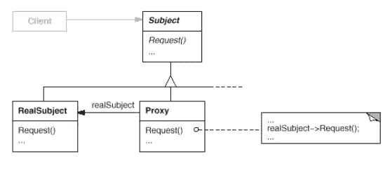

# 带有类型脚本示例的软件设计模式:代理

> 原文：<https://javascript.plainenglish.io/software-design-patterns-with-typescript-examples-proxy-f3a671fe1cb3?source=collection_archive---------3----------------------->

## 代理模式提供了另一个对象的替代品。

Image from: Head First Design Patterns by Eric Freeman

**结构** **代理**模式是最常用的软件设计模式之一。在本文中，我们将详细阐述该模式的目的和结构，并通过一个实际的例子解释如何使用它。

# 什么是设计模式？

设计模式是针对不同环境中反复出现的问题的通用的、可重用的解决方案。在软件工程中，他们帮助你**更快地写出更好的代码**。使用这些通用解决方案可以节省我们的时间和工作，因为我们重用了许多其他开发人员积累的知识和经验。

> “[……]对我来说，遇到没有听说过模式运动的开发人员是不常见的”“ *Grady Booch 在* [设计模式:可重用面向对象软件的元素](https://amzn.to/3i6iIIk)

也许你做了多年的程序员，却没有应用甚至不知道任何一种模式。我敢打赌，许多开发人员正是这样做的。如果是这样，我强烈推荐你先阅读这篇文章，让你的大脑相信软件设计模式是必不可少的。

 [## 为什么你必须学习软件设计模式

### 设计模式让你更快地写出更好的代码。

javascript.plainenglish.io](/why-you-must-learn-software-design-patterns-befd77f88713) 

## 模式的类别

1994 年，四位作者出版了《设计模式:可重用面向对象软件的元素》一书:Erich Gamma、Richard Helm、Ralph Johnson 和 John Vlissides，也就是所谓的“四人组”

尽管这本书是在 25 年前出版的，但它仍然是与软件工程最相关的书籍之一。阅读它可能是丰富您的开发人员工具包的一笔可观的投资。如前所述，**四人帮(GoF)** 定义了 23 种设计模式。为了组织他们，他们把他们分成三类:**创造型**、**结构型**和**行为型**。

> 创造模式关注的是对象创造的过程。结构模式处理类或对象的组成。行为模式描述了类或对象交互和分配责任的方式。— [设计模式:可重用面向对象软件的元素](https://amzn.to/3i6iIIk)

这里是由 GoF 定义的所有模式的概述。另外，看看我的其他文章，在表格中有链接。

如果你喜欢通过视频课程学习，我推荐你在 Skillshare 上看看这个 [**打字稿设计模式课程**](https://skillshare.eqcm.net/vnLkyj) 。它涵盖了所有 23 种 GoF(四人帮)设计模式，并教你如何使用 TypeScript 实现它们。作为代销商，如果你通过这个链接注册，我会收到一小笔佣金。你的支持帮助我为你创造更多有价值的内容。

 [## TypeScript 中的设计模式

### 解锁无限制访问此技能共享课程以及由来自世界各地的创作者讲授的数千门课程…

skillshare.eqcm.net](https://skillshare.eqcm.net/vnLkyj) 

# 代理模式

从表中可以看出，代理模式被归类到**结构**模式的类别中。考虑到这一点，它的目的必须在于描述类或对象如何交互和分配责任。

## 目的🎯

代理模式的目的是为另一个对象提供一个占位符，以控制和管理对它的访问。该模式充当一个包装器，允许您在请求到达原始对象之前或之后执行某些操作。

## 适应性💡

代理模式在许多用例中被广泛使用和应用。

> 使用代理模式创建一个代表性对象，**控制对另一个对象**的访问，该对象可能是远程的、创建成本高或者需要保护—[Eric Freeman 的 Head First 设计模式](https://amzn.to/3Q9O6Ch)

下面是适用于代理模式的四种代理类型:

1.**远程代理:**为位于远程服务器上的对象提供本地代表。

Remote Proxy (Image from [Head First Design Patterns by Eric Freeman](https://amzn.to/3Q9O6Ch))

2.**虚拟代理:**按需创建昂贵的对象，充当代表。虚拟代理经常推迟对象的创建，直到需要它的时候。

Virtual Proxy (Image from [Head First Design Patterns by Eric Freeman](https://amzn.to/3Q9O6Ch))

3.**保护代理:**控制对原始对象的访问。当对象应该具有不同的访问权限时，保护代理非常有用。

4.**智能引用代理:**根据访问权限控制对对象的访问。

## 结构📐

代理的结构很简单。

Image from [Head First Design Patterns by Eric Freeman](https://amzn.to/3Q9O6Ch)

## 参与者🚻

从结构中，您可以派生出以下参与者:

*   **代理**:维护并提供对真实主体的引用。代理的接口与主体的接口是相同的，因此它可以代替真正的主体。
*   **Subject** :为`RealSubject`和`Proxy`定义一个公共接口，这样一个代理就可以用在任何需要`RealSubject`的地方。
*   **RealSubject** :定义代理所代表的任何真实对象。

## 真实世界的例子🗺

当将代理模式应用到现实世界的例子中时，它们的好处是最容易理解的。开发人员和非开发人员在他们的生活中都与某种代理人进行过互动。

你很有可能拥有一张信用卡。在这种情况下，你基本上拥有了银行账户里的代理。

> 这正是代理模式所做的——“控制和管理对它们所保护的对象的访问**”。—[geeksforgeeks.org](https://www.geeksforgeeks.org/proxy-design-pattern/)**

我们的信用卡充当了我们钱的`Proxy`——T1。

Images from Pexels: [Alexander Mils](https://www.pexels.com/de-de/foto/person-mit-100-us-dollar-banknoten-2068975/) (left) and [Pixabay](https://www.pexels.com/de-de/foto/master-card-debitkarte-210742/) (right)

## 代码示例💻

JavaScript 中的代理是相当新的，只在 **JavaScript ES6** 版本中可用。让我们以上面的信用卡为例，使用简单的代理和类型脚本**构建一些代码。**

看一下代码。你也可以在[打字游戏场](https://www.typescriptlang.org/play?#code/PQKhCgAIUgVALAlgZ0iyB7ArgJ0gZSwCMArAUwGMAXKEYcRAOyrJwDMBDCsyABQ4CeAWzLNIAbyiQADoIAUHIdmYAuSIyxCirAJRqAbhkQATANzgAvuHCgI0OElTpseAEpkOAG0KlKNaPQUnhzIqO5eALIYjGQCaELSnmQizKj8wqJUElLSxJ6IFDLyispUahpaugZGxtmQ9ZBerFRyAAaEFNyhbFiennGyJo1KWKqQACTiJaNUFq065vVWVjZgtA7ozrh8OBgAHgK0gdHIWRQ4ZMaIVADCHDjGvLsHkAC86mQA7jv7AnIXkWisQANHVIABzMhlSByDC+aig6S7aRqADWsQwbEg4U8URiAh0bwAfNkpPVEFi5EiMNI3q93gByWQCBmEyQNBoUE5ZaRMN4yXYJFoM3hJEI8TKsSACFx8ACSADkVKzFhy0JTeYxIABCemQBkARgATABmAAsrLBasgXMYp0grF2OAiyHB-JFirQqEYGDOGBwF2oADo+IIUlljJR8jFjEGGarrU0cC1Hf6XeCdGS1VR4LtvjFvgBRAP+uSp52uzPWqzWi5UXBauHkagAbWp0gAugnICsOTm8x8iyWcHIGQAxUbURDRdS++KJZKS2psf02i5XM73WOsqQWYGWBbWcC2+0A3FAuLvAvYjzn-FyQ-nS7XO4PJ6-IPMuQAVgADIegA)里摆弄它:

在这个例子中，我们有充当我们的`Subject`的类`Payment`。此外，我们还有充当我们的`RealSubject`的`RealMoney`类。

最后，我们有一个代理对象，它代表我们的信用卡，并带有一个`realMoney`对象。JavaScript 代理类接受一个处理程序并限制`RealMoney`类的`pay`函数。

为了简单起见，我们只需检查用户是否输入了有效的 PIN 码`1234`，然后要么继续执行`pay`函数，要么抛出一个错误。

## 相关设计模式🔗

软件设计模式通常显示不同模式之间的关系。下面是引用 GoF 的一些与代理模式相关的设计模式:

> [**适配器**](https://medium.com/@mariusbongarts/design-patterns-with-real-life-typescript-examples-adapter-d183af1f1462) :适配器为它所适配的对象提供不同的接口。相比之下，代理提供与其主体相同的接口。然而，用于访问保护的代理可能会拒绝执行主体将要执行的操作，因此它的接口实际上可能是主体接口的子集。
> 
> **装饰者**:虽然装饰者可以有类似的代理实现，但是装饰者有不同的目的。装饰者向对象添加一个或多个职责，而代理控制对对象的访问。

# 最后的想法

我希望你喜欢阅读这篇文章。我总是乐于回答问题，并乐于接受批评。随时欢迎联系我！通过**[**LinkedIn**](https://www.linkedin.com/in/marius-bongarts-6b3638171/)**，**关注我**[**Twitter**](https://twitter.com/MariusBongarts)或 [**订阅**](https://medium.com/subscribe/@mariusbongarts) 通过电子邮件获取我的故事。****

****[**这里是无限制访问介质上每一个内容的链接**](https://medium.com/@mariusbongarts/membership) 。如果你注册使用这个链接，我会赚一小笔钱，不需要你额外付费。****

**** [## 通过我的推荐链接加入 Medium-Marius bong arts

### 作为一个媒体会员，你的会员费的一部分会给你阅读的作家，你可以完全接触到每一个故事…

medium.com](https://medium.com/@mariusbongarts/membership) 

此外，如果你还没有，看看我的在线荧光笔铬扩展。使用 [Web Highlights](https://web-highlights.com/) ，您可以在任何网页或 PDF 上高亮显示，创建标签并做笔记。

 [## Web 亮点— PDF 和 Web 荧光笔

### 最佳网络荧光笔。就像你在书上做的那样，在任何网页或 PDF 上高亮显示，并做笔记。组织…

web-highlights.com](https://web-highlights.com/) 

***披露*** *:本文包含附属链接。如果你通过这些链接之一购买，我可能会收到佣金。我只推荐我认为质量高、对你有益的产品。我感谢你的支持。*

## 进一步阅读

 [## 我的第一个 9.99 美元之旅与我的副业

### Chrome 扩展带来的被动收入

medium.com](https://medium.com/@mariusbongarts/my-journey-to-the-first-9-99-with-my-side-project-3edc13dd1f2d)  [## 用 Web 组件构建自己的博客组合:基础

### 第 1 部分—定制元素、阴影 DOM 和 HTML 模板

medium.com](https://medium.com/@mariusbongarts11/showcase-your-medium-articles-with-web-components-part-1-basics-d2c6618e9482)  [## Web 组件会取代前端框架吗？

### 它们是为解决不同的问题而构建的。

medium.com](https://medium.com/@mariusbongarts11/will-web-components-replace-frontend-frameworks-535891d779ba) 

*更多内容请看*[***plain English . io***](https://plainenglish.io/)*。报名参加我们的* [***免费周报***](http://newsletter.plainenglish.io/) *。关注我们关于* [***推特***](https://twitter.com/inPlainEngHQ)[***领英***](https://www.linkedin.com/company/inplainenglish/)**和* [***不和***](https://discord.gg/GtDtUAvyhW) ***。********