# 软件开发商:你的电脑是如何连接互联网的？

> 原文：<https://javascript.plainenglish.io/software-developers-how-does-your-computer-connect-to-the-internet-e6cb96f46922?source=collection_archive---------8----------------------->

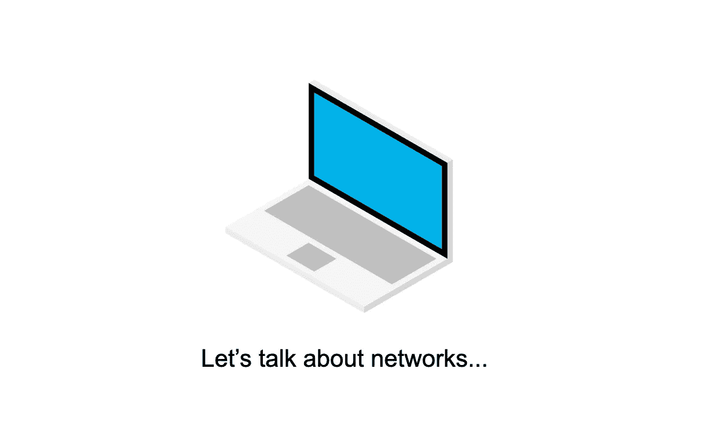

## 细节可能会让你大吃一惊。

建立一个大型计算机网络是一项艰巨的任务。互联网早期的开拓者是怎么解决的？

归根结底，互联网只是一套帮助计算机在一个大型网络中相互交流的规则。

本文是为软件开发人员写的，因为理解计算机之间的关系以及它们如何相互通信是我们作为软件开发人员工作的关键。然而，它也是一个初学者指南，任何人都应该能够理解！

所以事不宜迟，我们来谈谈网络。

## 喜欢看，而不是读？

这里有一个视频，涵盖了本文的大部分内容:

## 连接两台电脑

假设我有一台电脑。我的朋友也有一台电脑。

如果我们想要在我们的计算机之间共享文档、图像、音乐等，我们需要某种类型的连接。

很简单:让我们在我们的计算机之间连接一根线。

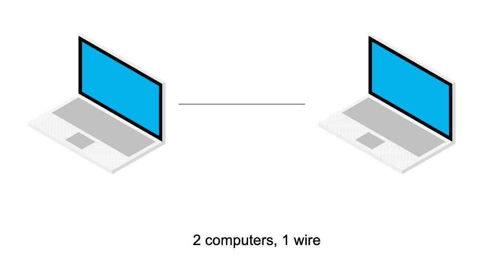

我们已经有了一个简单网络的开端！我们的两台电脑现在可以互相通话了。

## 连接更多计算机

如果另一个朋友加入我们呢？这位新朋友也想成为网络的一部分，与网络上的所有计算机通话。

我们还需要一些电线，但这并不难解决。

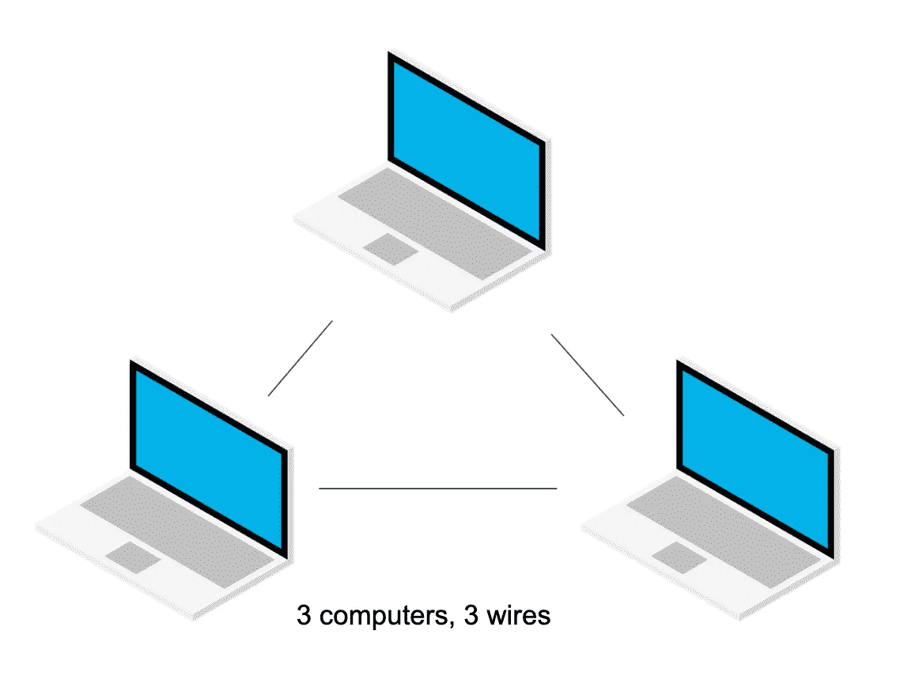

但是如果另一个朋友想加入我们的网络呢？现在，我们有四个人，我们所有的电脑都需要能够互相交流。

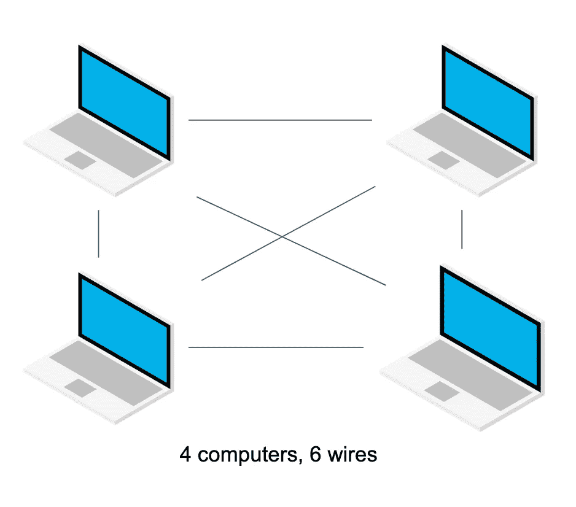

这开始变成一团乱麻。我们需要的电线数量比网络上的计算机数量增长得还要快！

如果第五个朋友加入网络，情况会变得更糟。

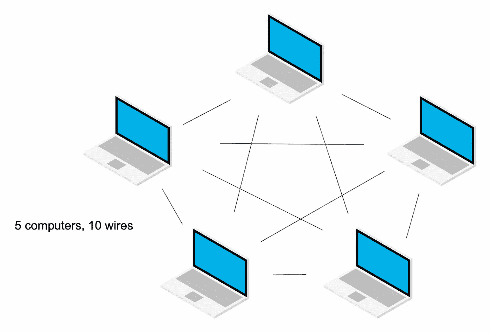

显然，这是不可持续的。我们不能每次给网络增加一台电脑就增加更多的电线！

*数学书呆子注意:这种网络中的连接数用* [*二项式系数*](https://en.wikipedia.org/wiki/Binomial_coefficient)*`*1 + 2 + ... + n-1 = n(n-1) / 2*`*表示，其中* `*n*` *是网络中的计算机数量。**

**例如，一个有 10 台电脑的网络要用* `*(10 * 9) / 2*` *电线连接起来。所以，45 根线！**

## *连接计算机的路由器*

*为了降低我们网络的复杂性，如果我们在网络中间添加一台计算机，其唯一的工作就是路由流量，会怎么样？*

*我们姑且称那台电脑为“路由器”。*

*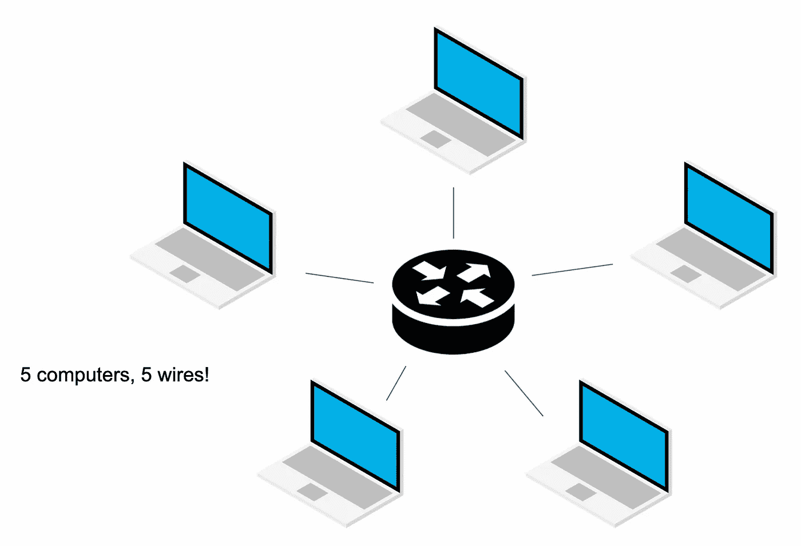*

*哇，路由器帮助我们大大简化了网络！*

*现在，`number_of_wires == number_of_computers`在我们的网络上。我们不得不牺牲一些机器来充当路由器，但是因为它只有一个任务，所以它可以是一台相当简单的计算机。*

*顺便说一句，如果你现在正在网上阅读这篇文章，你的电脑已经连上了路由器。WiFi 路由器就是这样。*

## *连接路由器会创建网络*

*使用路由器连接本地网络对于在几台计算机之间共享信息来说非常有用。*

*但是，如果街上的另一群朋友也有一个网络，而你希望能够与他们交谈，那该怎么办呢？*

*好了，现在我们可以连接我们的路由器在我们的网络之间交谈。*

*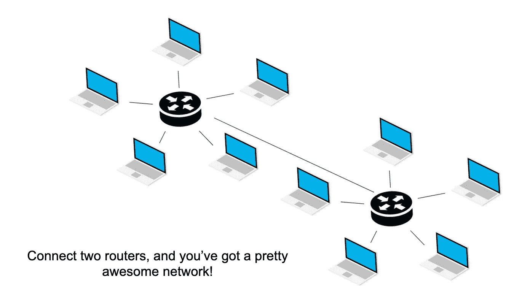*

*让我们想象一下，我们一直在寻找更多我们想联系的网络(朋友、公司、政府等)。*

*我们可以继续在路由器之间布线。但是我们很快就陷入了另一个棘手的网络复杂性问题…*

*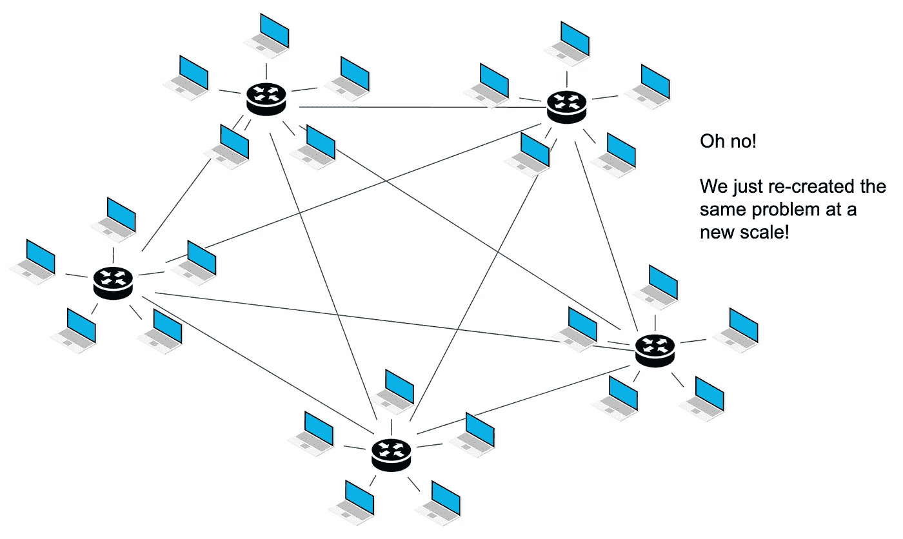*

*我们路由器之间的连接开始遇到同样的规模问题。随着我们添加更多的路由器，连接的数量呈指数增长，而不是线性增长。*

*还要记住，路由器之间的连接意味着我们在家庭、企业和政府办公室之间铺设电缆。那可是一大堆基础设施啊！*

## *ISP 通过物理基础设施链接路由器*

*也许我们可以用同样的方法解决这个问题，在中间放些东西？*

*这一次，我们必须付钱给一家公司来安装、维护和操作我们所有路由器之间的电缆。*

*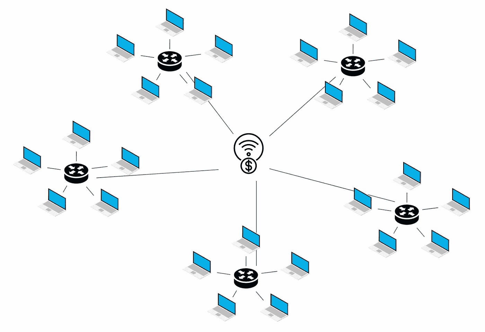*

*我们称这家公司为互联网服务提供商(ISP)。在美国，这些公司包括威瑞森、光谱和 Xfinity。*

*小提示:你可能会注意到，除了路由器之外，你家里还有一个盒子。通常，ISP 通过同轴电缆或光纤电缆安装连接。这些电缆传输数据的格式需要进行转换，计算机才能使用。为此，您需要安装一个调制解调器，将同轴电缆/光纤转换为您的计算机和 WiFi 路由器能够识别的以太网格式。*

*ISP 之间也可以互相交流。当你把 ISP 连接在一起时，你会得到一个巨大的计算机网络，所有的计算机都可以相互交流。*

*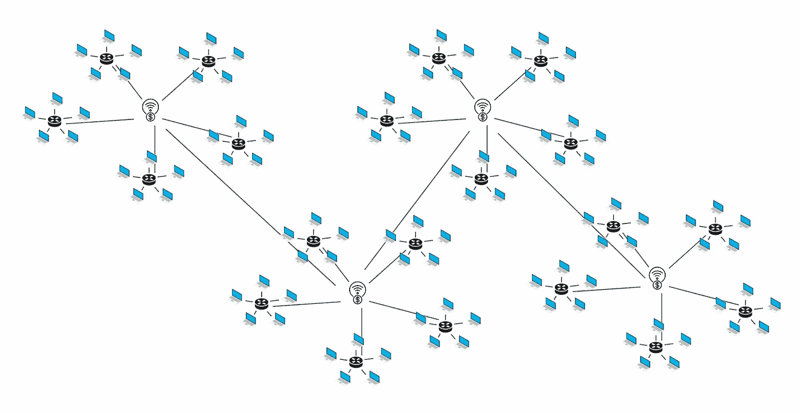*

*显然，这是对互联网背后实际网络的简化。真正的互联网包括大型数据中心、冗余、海底电缆等等。*

*但是从根本上来说，你现在明白我们是如何在一个网络上把数百万台计算机连接在一起的了！*

## *规则和协议*

*好了，您已经了解了线路、路由器和 ISP 的工作原理。知道这些很好，但这并不能完全解释互联网。*

*让我们假设您想要从网络上的某台计算机访问资源。*

*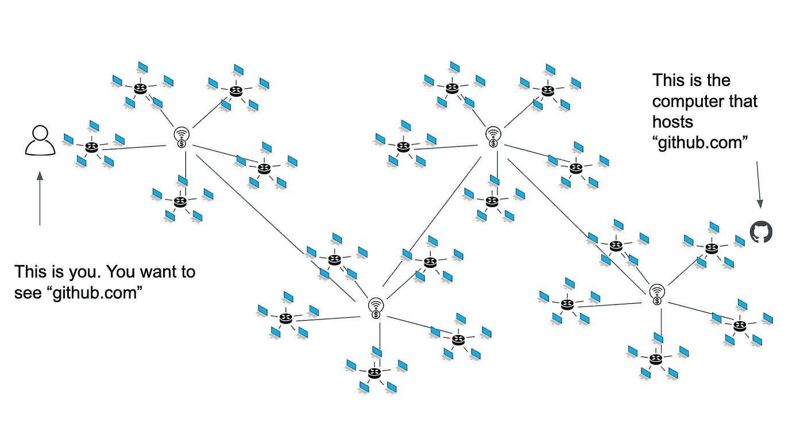*

*两台计算机如何找到对方，建立跨网络的连接，并发送消息？*

*这就是互联网协议、域名系统(DNS)、TCP/IP、HTTP、浏览器等等发挥作用的地方！我将在以后的文章中详细介绍，但是现在，如果你想先睹为快，你可以看看我在哥伦比亚大学演讲的视频:*

## *一个错综复杂的问题；简化了的*

*希望这篇文章有助于揭开互联网的神秘面纱。*

*从本质上来说，互联网只是一个在大网络上交换文件的系统和一套规则。虽然有时会感觉不可思议，但作为软件开发人员和互联网用户，理解计算机如何连接的基础知识确实很重要。*

*想要获得更多关于互联网和软件开发的资源？*

*[*加入我的免费邮箱系列。*](https://bennettgarner.ck.page/0a60026a5d)*