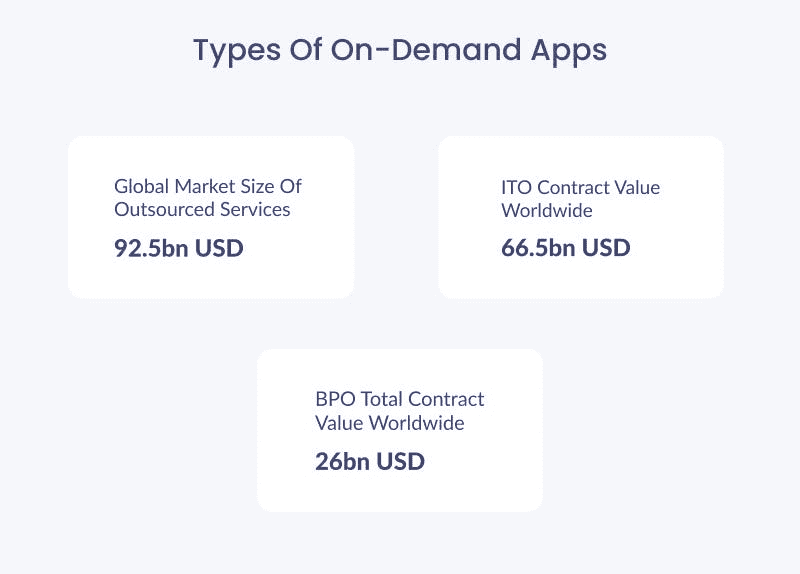
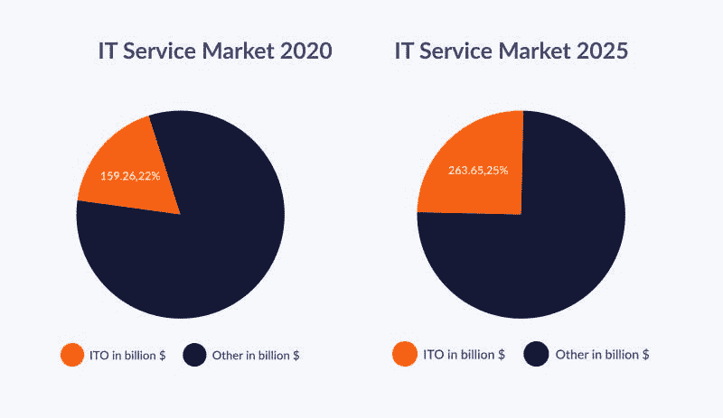
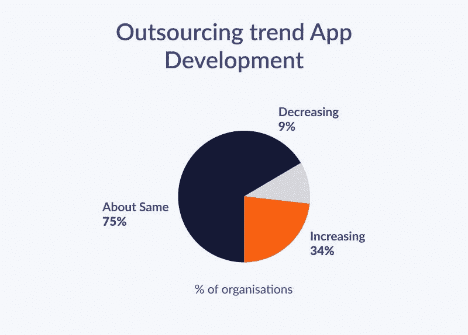

# 软件开发外包:是死是活？

> 原文：<https://javascript.plainenglish.io/software-development-outsourcing-dead-or-alive-54548613512c?source=collection_archive---------9----------------------->

为了在当前的情况下获得竞争优势，基于 IT 的公司需要控制和速度。

控制来维护软件开发过程所需的预算、能力和资源。

尽快将软件解决方案推向市场。然而，如果内部 IT 部门负担过重或预算限制过高，外包软件开发可能会更好。

企业可以将部分或整个项目外包给更有经验、性价比更高的软件外包公司。

从长远来看，外包开发可以节省您的金钱和时间。它让你可以专注于业务的其他重要方面，而其他人则负责你的开发部分。

所以，如果你仍然认为软件外包已经死了，请继续阅读以获得更多清晰的信息！

# **软件外包死了吗？**

不会吧！下面的外包统计数据没有表明这一点。外包为任何公司提供了竞争优势，使其能够应对 it 技能短缺，获得顶级能力，并降低成本。因此，如果它对你的竞争对手有效，它也应该对你有效。

在数字化转型和无限技术潜力的时代，各种规模的企业都在寻找领先的 IT 外包趋势。

# **一看软件开发外包统计**

许多在线资源正在进行调查，以预测软件开发外包服务的增长。让我们看看最可靠的统计数据，以便更好地理解增长指标。

根据[统计](https://www.statista.com/topics/1900/it-outsourcing/#topicOverview)，全球外包市场价值 925 亿美元。仅 IT 外包一项就创造了 665 亿美元的销售额。

软件外包公司创造了超过 50%的全球外包价值。

-根据 Krusche 的数据，2020 年，IT 或软件外包仅占全球市场份额的 22%。到 2025 年，这个数字将上升到 25%。

因此，外包将在 2023 年继续增长，获得[可观的利润和](https://positiwise.com/blog/software-development-outsourcing-will-grow-70-by-next-year-2023-forecast/#:~:text=The%20above%20statistics%20confirmed%20that,increase%20in%20the%20upcoming%20year)市场份额。

-超过 34%的公司正在改变策略，利用软件外包服务。然而，只有 9%的人在考虑软件的内部开发团队。

去年它对全球市场的贡献是 50%。因此，上述统计数据表明，在 2023 年及以后，软件开发外包将继续上升至 70%。

*也可阅读:* [*软件产品开发生命周期完整指南*](https://www.valuecoders.com/blog/outsourcing-and-off-shoring/software-product-development-life-cycle/)

# **常见的软件外包神话**

企业对软件外包过程有很多误解。

因此，在接下来的部分中，我们将探究关于软件外包的六个常见误区以及它们背后的真相。

## **#1 外包很复杂**

在你的商业模式中加入外包合作可能看起来势不可挡，要求很高。然而，这可能比你想象的要容易。

管理外包团队比管理内部团队需要更少的努力和监督。从长远来看，外包团队甚至可以帮助减轻你的工作量。

建立外包安排可能不同于内部雇佣，但不一定更复杂。

这是因为企业对企业(B2B)的关系可以非常类似于企业对消费者(B2C)的关系。雇佣外包公司的公司可以从个性化和简单的入职流程中受益。您可以通过选择合适的外包合作伙伴来确保这一点。

事实上，相比于从零开始建立一个内部团队，外包更容易。一旦建立了合作关系，外包商就有责任处理你的工作量。

## **#2 外包导致交付物质量低下**

关于软件外包最常见的一个误区是，它会导致低质量的可交付产品。

当您利用外部团队来帮助您的项目时，外包可以带来高质量的可交付成果。当你外包给一个熟练的团队时，你应该会看到你的产品质量、周转时间和价格有显著的提高。

一个顶尖的软件外包公司可以提供优秀的服务和优秀的产品。一个企业主无论是雇佣内部员工还是外包员工，都会经历糟糕的绩效。

同时，外包有很多好处和防范风险的方法。

## **#3 离岸供应商不如在岸供应商**

这是外包行业常见的神话之一，事实恰恰相反。在岸供应商可能比离岸供应商更昂贵，但他们通常更有资格，更了解当地文化和商业惯例。

在岸供应商也更容易管理，因为他们不像海外供应商那样需要太多的文化或语言培训，后者通常将英语作为第二语言。

## 你将失去对项目的控制

这是假的！你将拥有和你自己开发的项目一样的控制权。

此外，您可以通过视频会议和 Skype 等聊天应用程序与外包团队进行交流，因此无需飞越半个地球来进行一些更改或培训新员工如何使用您的软件。

## **#5 时区差异影响生产力**

离岸外包经常被指责由于时区差异而导致日程安排问题。

尽管如此，您的企业和外包服务提供商可以在重叠时间内有效沟通，举行会议和讨论新的战略。

当你觉得合适的时候，外包公司可能会协商在工作时间之前或之后开会。

这些时差也会对你有利。

如果时差更大，你们各自的工作时间会更有效率。

通过这种方式，你可以提高企业的效率，创造一个 24 小时的生产力循环。

*必读:* [*软件产品开发生命周期完整指南*](https://www.valuecoders.com/blog/outsourcing-and-off-shoring/software-product-development-life-cycle/)

# **公司为什么要外包？**

外包软件开发可以节省产品开发的资金，同时确保您仍然可以以较少的负担获得高质量的创新软件。

当将软件开发外包给专业人员时，你可以体验到以下一些好处。

## **成本节约**

外包软件开发的一个重要优势是节省成本。雇佣开发人员可能成本很高，但是将你的项目外包给第三方供应商可以以合理的成本获得训练有素的专业人员。

如果你刚刚开始创业，或者启动资金有限，这可能是有益的。

## **提高效率**

外包软件开发允许公司通过专注于他们的核心竞争力来提高效率。通过外包软件开发，公司可以专注于其他重要任务，并将他们缺乏专业知识的工作外包出去。

通过这种方式，企业可以通过不雇佣大型内部开发团队来节省资金。

## **专注于核心业务活动**

许多公司外包软件开发，这样他们就可以专注于他们的核心业务。有了外包，他们不必担心雇佣软件开发人员的日常流程和管理，这为他们腾出了时间。

## **降低风险**

当你外包你的软件开发时，你可以降低你的风险。当你在开发软件时，总有很多事情可能出错。

通过外包软件开发过程，你将不必担心这些错误，因为 IT 专业人员会做你的工作。

## **获得竞争优势**

外包软件开发可以让你的公司在市场上获得竞争优势。

如果你刚刚开始你的生意或者想让你的产品在市场上成长，考虑外包软件开发以获得竞争优势。这一过程将有助于你更快地创造和推出你的产品，如果你试图自己做的话。

## **获取专业知识**

软件产品开发外包需求可以让你获得比你所希望的更多的专业技能和知识。外包各个领域的专家意味着你可以很容易地在内部找到并培训某个人。

因此，这是一种无需雇佣内部开发人员就能获得所需专业知识的好方法。

*你可能会对你的项目感兴趣:* [*困惑于印度&乌克兰软件开发商之间。在这里得到你的答案*](https://www.valuecoders.com/blog/technology-and-apps/confused-between-indian-ukrainian-software-developers-for-your-project-get-your-answers-here/)

# **结论**

有了这样的清晰性和多重好处，很明显，软件外包将在未来几年改变游戏规则。

但是，在选择外包合作伙伴时，你应该非常小心。

领先的软件外包公司使许多企业能够提高运营效率、降低风险、改善客户体验并降低成本。

所以，现在是雇佣一个有经验的专业外包团队来获得竞争优势的最佳时机。

*更多内容请看*[***plain English . io***](https://plainenglish.io/)*。报名参加我们的* [***免费周报***](http://newsletter.plainenglish.io/) *。关注我们关于*[***Twitter***](https://twitter.com/inPlainEngHQ)[***LinkedIn***](https://www.linkedin.com/company/inplainenglish/)*[***YouTube***](https://www.youtube.com/channel/UCtipWUghju290NWcn8jhyAw)*[***不和***](https://discord.gg/GtDtUAvyhW) *。对增长黑客感兴趣？检查* [***电路***](https://circuit.ooo/) *。***