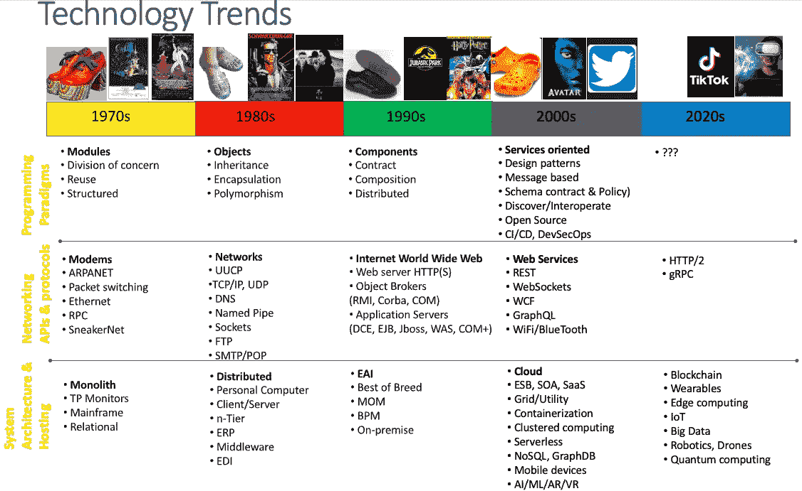

# 自 1970 年以来几十年间的软件技术趋势:下一步去哪里？

> 原文：<https://javascript.plainenglish.io/software-technology-trends-across-the-decades-since-1970-where-to-next-ee7d50041d07?source=collection_archive---------14----------------------->

## 简要评论自 1970 年以来的软件技术趋势和未来几年要注意的事情。

Technology trends by decade

我坐了下来，画了这张图片，展示了过去几十年中一些关键技术的采用情况。这当然不是一个详尽的清单，但只是我职业生涯中所经历的一些重大变化的一个例子。

我现在将对每一个类别做一个简短的评论，这些类别涉及我们所处的状态以及需要注意的事项。

# 编程范例

我相信编程的发展已经或多或少地趋于平稳，并保持稳定。我们似乎很乐意使用过程、函数、脚本、逻辑和面向对象的编程语言。我没意见。至少我们都很高兴，我们中没有多少人需要编写机器代码或者用汇编语言工作了。

一些人正在做的一个重大预测(我以前听说过)是，拥有先进人工智能技术的计算机将在不久的将来编写所有的代码，我们这些开发人员将失业！

无论如何，目前我们确实有工作，可以利用开放源代码，编写面向服务的代码，利用队列和消息总线等。用于同步和异步处理。因此，我们可以对目前的状况感到满意，并享受我们所掌握的工具。

# 网络和协议

随着时间的推移，随着硬件的进步，网络协议也在慢慢完善。也许真正的进步是增加了现有协议可以利用的带宽。我们大多数人不需要做任何事情来利用这些进步，因为我们的网络呼叫会变得更快，因为我们构建的框架将我们从底层抽象出来。

# 系统架构和托管

系统架构和托管是过去几十年发生最大变化的地方，也是变化将继续发生的地方。许多人认为，在未来十年，Blockchain 将无处不在。拥有数据分散化、可追溯性、改进的安全性、隐私性等能力将是非常棒的。

我们也肯定会看到从大型机器人到纳米机器人等各种规模运行代码的设备的爆炸式增长。由于新的电池技术，可穿戴设备、物联网和机器人技术可能最终会取得一些重大突破，不仅因为即时充电，还因为量子计算成为现实，消耗时间会更慢。

# 结论

我认为在每一个十年专栏的顶部张贴一些定义鞋类、标志性电影和音乐以及社交平台的时尚趋势会很有趣。当然，许多风格似乎在几十年后卷土重来。希望未来喇叭裤和厚底鞋的大规模采用不会出现这种情况。

很高兴看到这些技术进步。当然，没有人会想要回到 300 波特调制解调器——你拿起你的有线电话，把它放在一个耦合设备上。然后，在文件传输的中途，会有一个小故障，20 分钟将被浪费！或者把你的代码和数据备份到磁带上，然后发现有人在你的备份上复制了一首齐柏林飞船的歌！

趋势将走向何方？有一些明显的迹象。当这些进步成形时，不要被抛在后面。熟悉趋势，并在它们合适的时候采纳它们。

任何足够先进的技术都和魔法没什么区别—亚瑟·C·克拉克

*更多内容看* [***说白了。报名参加我们的***](https://plainenglish.io/) **[***免费周报***](http://newsletter.plainenglish.io/) *。关注我们关于*[***Twitter***](https://twitter.com/inPlainEngHQ)*和*[***LinkedIn***](https://www.linkedin.com/company/inplainenglish/)*。加入我们的* [***社区***](https://discord.gg/GtDtUAvyhW) *。***