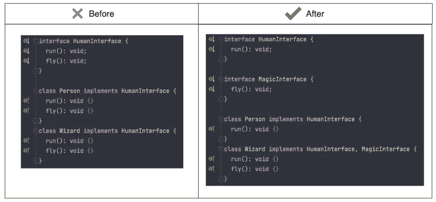

# 如何在 JavaScript 中实现固体原理？

> 原文：<https://javascript.plainenglish.io/solid-principle-in-javascript-part-1-4f67d8f9a31f?source=collection_archive---------4----------------------->

## 这是一个初学者教程，介绍了固体原理的基础知识以及如何在 JavaScript 编程中实现它。

Photo by [Arnold Francisca](https://unsplash.com/@clark_fransa?utm_source=medium&utm_medium=referral) on [Unsplash](https://unsplash.com?utm_source=medium&utm_medium=referral)

本文将为您提供 JavaScript 语言中固体原理的基本概念。对于每种语言，我们都有不同的方式来遵循这一原则。然而，在 JavaScript 中，很难在代码中应用这个原则。

为了让您方便，我向您展示了实现代码的方法。在这个例子中，我混合了两种方法(类和函数)来应用遵循固体原理的代码。

这个原则帮助我们构建软件。以下是固体原理的主要特点:

*   ***代码的可重用性。***
*   ***在功能上很容易进行代码修改。***
*   ***使代码易于维护。***
*   ***编写测试代码很容易。***

## 固体代表什么？

我们将详细讨论单词“固体”中的每个字符。

## 史:单一责任

> 一个类(方法)应该只有一个职责

代码示例:

从这个例子中，我们可以看到(SuperTool)有很多责任来处理剑和弓的动作。当我们向这个类(方法)添加越来越多的动作时，它会变得越来越复杂。当一个新来的人在想要做出改变之前必须理解课堂时(他们担心新改变的影响)，我们必须阅读并保持它。

***该原则的目标是*** :将类(方法)行为分解为单个点动作。将代码(类、函数)分解成尽可能小的组件。

而不是用 1 中的很多(n)个工具来构建超级工具。只需将支持工具分解为多个工具，每个工具都必须对其所有操作负责。它有助于代码库变得清晰，当一个新的特性在剑术类(或弓箭手)上改变时，我们不会影响另一个工具。

## o:打开-关闭

> 开放供扩展，但关闭供修改

该原则与代码维护和新代码更改相关。为了便于理解系统中的原理示例，我们有一个现有的类 Person(它具有所有的属性，人类跳跃、奔跑、进食等的方法)。新的特性想给我们的系统增加一个剑客或者巫师，他们也有所有的属性和行为，就像一个人类。然而，如果我们改变人类目前的行为以满足要求，例如人类可以跳 1 米高，剑客可以在地球上跳 100 米高。我们必须修改 person 类的现有函数。它可能会对您使用该类的系统产生副作用。

代码示例:

***这个原则的目标:*** 新的代码变化要尽可能避免冲击类的存在。它有助于新特性(新代码变更)避免导致错误和影响原始类。相反，要修改 Person 类，我们可以从 SwordMan 和 Wizard 类中扩展 Person 类，自己处理角色的功能，而不用担心在哪里使用 Person 类和新特性的新类，而不会影响旧特性。

## 利斯科夫替代法

> 程序中的对象应该可以用其子类型的实例替换，而不会改变程序的正确性。-维基百科

这个原则坚持面向对象的概念，它告诉我们如何创建一个抽象，并定义父类(超类型)和子类(子类型)之间的关系。如果子类不能执行与其父类相同的动作，将来可能会发生未知的问题。

代码示例:

#Q1:盲剑侠是人吗？->是的

#Q2:人(超类)可以查看云吗？->是的，我能

#Q3:盲剑侠(子类)可以查看云吗？->不，我不能

未知的问题可能发生在系统上，从第一个例子开始，你可以调用“查看”对盲人剑士的操作。所以要解决这个问题，我们应该定义正确的抽象类，盲人不应该像正常人一样实现“视图”方法。

***这个原则的目标是:*** 避免父类和子类之间的不一致，确保父类可以做到，子类也可以做到。

## **界面偏析**

> “许多特定于客户端的接口比一个通用接口要好。-维基百科"

这个原则解决了当我们试图实现一个大的接口时所引起的问题。

***这个原则的目标是:应该*** 把一组动作拆分成更小的集合，让一个类只运行它需要的那组动作。它帮助我们减少依赖，减少系统中类之间的耦合，增加接口之间的可重用性。

## 依赖性倒置

> 一个人应该“依赖抽象，而不是具体。”-维基百科

简单来说，你可以认为一个类本身不应该包含依赖(外部服务)。它使这个类变得依赖于那个服务。否则，外部服务应该以单一的方式工作，减少相互之间的依赖，使代码变得干净，易于被另一个类使用。

当一个类想要使用另一个类或另一个服务时，我们可以通过构造函数注入它，或者使用包装器返回一个注入了服务的新实例。

## 结论

固体不是万能的。对于每一种语言，你都会有一种专门处理问题的方法。一些坚持 OOP(类、接口、抽象)的原则不能应用于 GUI 编程(函数式编程)

它不是一个规则，不要强迫自己坚持它。然而，它有助于你思考如何使你的代码易于阅读和维护。

*更多内容请看*[***plain English . io***](https://plainenglish.io/)*。报名参加我们的* [***免费周报***](http://newsletter.plainenglish.io/) *。关注我们上* [***推特***](https://twitter.com/inPlainEngHQ)[***领英***](https://www.linkedin.com/company/inplainenglish/) *与* [***不和***](https://discord.gg/GtDtUAvyhW) ***。***